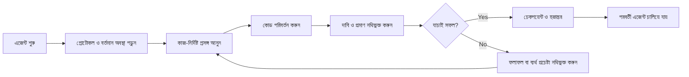

# ArifCE
<p align="center"></p>

[English](README.md) · [简体中文](README.zh-CN.md) · [繁體中文](README.zh-TW.md) · [한국어](README.ko.md) · [Deutsch](README.de.md) · [Español](README.es.md) · [Français](README.fr.md) · [Italiano](README.it.md) · [Dansk](README.da.md) · [日本語](README.ja.md) · [Polski](README.pl.md) · [Русский](README.ru.md) · [Bosanski](README.bs.md) · [العربية](README.ar.md) · [Norsk](README.no.md) · [Português (Brasil)](README.pt-BR.md) · [ไทย](README.th.md) · [Türkçe](README.tr.md) · [Українська](README.uk.md) · [বাংলা](README.bn.md) · [Ελληνικά](README.el.md) · [Tiếng Việt](README.vi.md)

**এজেন্ট বদলায়। আপনার প্রকল্প যেন না ভোলে।**


[](https://github.com/seekua/ArifCE/actions/workflows/ci.yml) [](https://github.com/seekua/ArifCE/releases/latest) [](LICENSE)

ArifCE হলো AI-সহায়িত সফটওয়্যার উন্নয়নের জন্য স্থানীয়-প্রথম প্রকল্প বুদ্ধিমত্তা ও ধারাবাহিকতার স্তর। এটি রিপোজিটরিতে প্রেক্ষাপট, সিদ্ধান্ত, ব্যর্থ প্রচেষ্টা, প্রমাণ, রিফ্যাক্টরিং অবস্থা ও হস্তান্তর তথ্য রাখে, যাতে Codex, Claude Code, OpenCode এবং ভবিষ্যৎ এজেন্ট একই প্রকৌশল কাহিনি চালিয়ে যেতে পারে।

> রিপোজিটরিই প্রেক্ষাপটের মালিক। এজেন্ট কেবল তা ধার নেয়।


## ArifCE কেন বিদ্যমান

গুরুত্বপূর্ণ প্রেক্ষাপট যখন শুধু চ্যাট ইতিহাস, ব্যক্তিগত স্মৃতি বা পরবর্তী অবদানকারী যে সরঞ্জামটি পরীক্ষা করতে পারে না তাতে থাকে, তখন সফটওয়্যার দল সময় ও আস্থা হারায়। ArifCE প্রকল্পের নিজস্ব অংশ হিসেবে প্রকৌশল ধারাবাহিকতা তৈরি করে।

লক্ষ্য এজেন্টদের আরও নিশ্চিত শোনানো নয়; প্রত্যেক অবদানকারী যেন দলের উদ্দেশ্য, সিদ্ধান্তের কারণ, যাচাইকৃত বিষয় এবং অবশিষ্ট অনিশ্চয়তা বোঝে সেটিই লক্ষ্য। এই ইতিহাস রিপোজিটরিতে থাকলে দল স্বচ্ছতা, দায়িত্ব ও আস্থা বজায় রেখে দ্রুত এগোতে পারে।

ArifCE ধারাবাহিকতাকে যৌথ প্রকৌশল অনুশীলনে রূপ দেয়: পরবর্তী কাজের জন্য কেন্দ্রীভূত প্রেক্ষাপট, গুরুত্বপূর্ণ দাবির স্পষ্ট প্রমাণ এবং কাজ অসম্পূর্ণ হলে সৎ হস্তান্তর।

## কার জন্য

ArifCE AI-সহায়িত প্রকৌশল দল, কোডিং এজেন্ট ব্যবহারকারী ডেভেলপার এবং এমন রক্ষণাবেক্ষণকারীদের জন্য, যাদের প্রকল্পের প্রেক্ষাপট একজন ব্যক্তি, চ্যাট বা সেশনের পরেও টিকে থাকা দরকার। একাধিক অবদানকারী একই রিপোজিটরি ভাগ করলে এটি বিশেষভাবে উপযোগী।

## ArifCE কীভাবে কাজ করে



## প্রকল্প অন্বেষণ

প্রকল্পের স্বাস্থ্য, সাম্প্রতিক রেকর্ড ও অনুসন্ধানযোগ্য প্রেক্ষাপট দেখতে স্থানীয় ড্যাশবোর্ড চালান:

```powershell
$env:ARIFCE_PROJECT_ROOT = (Get-Location).Path
dotnet run --project src/ArifCE.Dashboard/ArifCE.Dashboard.csproj
```

এরপর <http://127.0.0.1:5180/> খুলুন। সম্পূর্ণ পণ্য নির্দেশিকার জন্য [ArifCE ডকুমেন্টেশন হাব](docs/README.md) দেখুন।

এই কর্মপ্রবাহ প্রকল্পের জ্ঞান রিপোজিটরিতে রাখে এবং অগ্রগতি পরিদর্শনযোগ্য করে। এর ব্যবহারিক সুবিধাগুলো হলো:

- দ্রুত শুরু: পরবর্তী এজেন্ট দীর্ঘ ট্রান্সক্রিপ্ট পুনর্গঠন না করে কেন্দ্রীভূত বর্তমান অবস্থা পড়ে।
- নিরাপদ পরিবর্তন: দাবিগুলো নির্ধারিত প্রমাণের সঙ্গে যুক্ত এবং Git অবস্থা বদলালে পুরোনো হয়ে যায়।
- ভালো ধারাবাহিকতা: সিদ্ধান্ত, ব্যর্থ প্রচেষ্টা, চেকপয়েন্ট ও হস্তান্তর এজেন্ট বা সেশন পরিবর্তনের পরেও থাকে।
- নিয়ন্ত্রিত রিফ্যাক্টরিং: ইনভেরিয়েন্ট, তালিকা, গার্ড ও নিরাপদ পয়েন্ট অসম্পূর্ণ কাজ দৃশ্যমান করে।
- স্থানীয়-প্রথম পরিচালনা: ক্লাউড পরিষেবা বা নির্দিষ্ট রানটাইম ছাড়াই মূল ফাইল ব্যবহারযোগ্য থাকে।

## শুধু স্মৃতি নয়

ArifCE কাজের বিষয়, কী বদলেছে ও কেন, এজেন্ট কী সম্পন্ন করার দাবি করছে, সেই দাবির প্রমাণ, পর্যালোচকের ফলাফল, অসম্পূর্ণ অংশ এবং পরবর্তী এজেন্টের প্রয়োজনীয় তথ্য অনুসরণ করে। এজেন্টের বক্তব্য দাবি, সত্য নয়; নির্ধারিত build, test, Git ও search প্রমাণ অগ্রাধিকার পায়।

প্রযুক্তিগত যাচাই ও পণ্য গ্রহণ আলাদা: গ্রহণ রেকর্ডে কে দাবিটি অনুমোদন করেছে এবং কোন বর্তমান প্রমাণ সিদ্ধান্তটিকে সমর্থন করেছে তা থাকে।

## V0.1 workflow

```text
arifce init
arifce task create "Fix permission cache race"
arifce checkpoint --summary "Reproduction added"
arifce context "finish the permission cache fix" --budget 16000
arifce claim create "Permission cache race is fixed"
arifce verify CLAIM-0001
arifce handoff
```

ক্যানোনিকাল Markdown, YAML, JSON ও JSONL `.arifce/`-এ থাকে। SQLite একটি অপসারণযোগ্য সূচক; `.arifce/index/` মুছে `arifce rebuild` চালালেও প্রকল্পের বুদ্ধিমত্তা অক্ষুণ্ণ থাকতে হবে।

## আর্কিটেকচার

মূল অংশটি ডোমেইন নিয়ম, ক্যানোনিকাল স্টোরেজ ও ইনডেক্স, Git পর্যবেক্ষণ, পুনরুদ্ধার, যাচাই, রিফ্যাক্টরিং, নিরাপত্তা ও CLI আলাদা রাখে। সরবরাহকারীর নির্দেশনা ফাইল ছোট অ্যাডাপ্টার; এগুলো কখনও ক্যানোনিকাল মেমরি স্টোর হয় না।

## Installation and quick start

V0.2.0 একটি ক্রস-প্ল্যাটফর্ম .NET গ্লোবাল টুল হিসেবে প্রকাশিত। [ইনস্টলেশন](docs/getting-started/installation.md) ও [দ্রুত শুরু](docs/getting-started/quick-start.md) দেখুন। সোর্স থেকে:

ঐচ্ছিক স্থানীয় MCP অ্যাডাপ্টারটি [MCP সেটআপ](docs/getting-started/mcp.md)-এ নথিবদ্ধ।

সম্পূর্ণ ইনস্টলেশন ও বৈশিষ্ট্য পরিচিতির জন্য [ব্যবহারকারী নির্দেশিকা](docs/USER-GUIDE.md) এবং [ডকুমেন্টেশন নীতি](docs/DOCUMENTATION-POLICY.md) দেখুন।

### 60-second quick start

```bash
dotnet tool install --global ArifCE.Cli --version 0.2.0
mkdir my-project && cd my-project
git init
arifce init
arifce task create "Ship the first change"
arifce checkpoint --summary "Project context initialized"
arifce handoff
```

এখন আপনার কাছে রিপোজিটরি-স্থানীয় প্রকল্প অবস্থা, একটি কাজ, একটি চেকপয়েন্ট এবং পরবর্তী অবদানকারীর জন্য প্রস্তুত একটি অর্থবহ হস্তান্তর রয়েছে।

```bash
dotnet restore
dotnet build
dotnet test
dotnet run --project src/ArifCE.Cli -- init
```

নতুন Git রিপোজিটরিতে `init` অথবা বিদ্যমানটিতে `adopt` চালান। উভয়ই ধ্বংসাত্মক নয় এবং একই ফল দেয়। `adopt` দেখা কাঠামো নথিবদ্ধ করে এবং অজানা ঐতিহাসিক কারণকে অজানা হিসেবে চিহ্নিত করে।

## ধারাবাহিকতা, যাচাই ও রিফ্যাক্টরিং

- নতুন এজেন্ট `AGENTS.md`, `.arifce/PROTOCOL.md` ও `.arifce/CURRENT.md` পড়ে এবং ইতিহাস একসঙ্গে না তুলে কাজভিত্তিক প্রেক্ষাপট চায়।
- দাবিগুলো রিপোজিটরি-নির্দিষ্ট প্রমাণের সঙ্গে যুক্ত; সংশ্লিষ্ট অবস্থা বদলালে প্রমাণ পুরোনো হয়।
- রিফ্যাক্টর প্রচারণা ইনভেরিয়েন্ট, তালিকা, গার্ড, অগ্রগতি ও চেকপয়েন্ট অনুসরণ করে; বাধাদানকারী গার্ড সমাপ্তি ঠেকায়।
- হস্তান্তর ট্রান্সক্রিপ্ট ঢেলে না দিয়ে বর্তমান প্রকৌশল অবস্থা সংক্ষেপ করে।

## নিরাপত্তা ও সীমাবদ্ধতা

কাঁচা ট্রান্সক্রিপ্ট অবিশ্বস্ত; এগুলো কখনও একসঙ্গে লোড বা চালানো হয় না। ইমপোর্ট পাথ সাধারণ গোপনীয়তা গোপন করে; শংসাপত্র ও মেশিন প্রমাণীকরণ তথ্য `.arifce/`-এ রাখা যাবে না। V0.1 সঠিকতা, টোকেন সাশ্রয় বা উন্নত রিভিউ মানের নিশ্চয়তা দেয় না এবং এতে ক্লাউড, UI, ভেক্টর ডেটাবেস, স্বয়ংক্রিয় swarm বা উৎপাদন এজেন্ট-কল নেই।

[ROADMAP.md](ROADMAP.md), [SECURITY.md](SECURITY.md) এবং [CONTRIBUTING.md](CONTRIBUTING.md) দেখুন। বাস্তবায়িত কমান্ডের সঠিক সিনট্যাক্স [CLI রেফারেন্স](docs/reference/cli.md)-এ নথিবদ্ধ।

## লাইসেন্স

ArifCE [Apache License 2.0](LICENSE)-এর অধীনে লাইসেন্সপ্রাপ্ত।
### Local LLM workflows

ArifCE can use local or cloud-capable providers without moving project memory out of the repository. Configure a provider through an environment variable or stdin, preview bounded context, and run an evidence-backed task:

```bash
arifce llm provider add ollama Ollama llama3 --endpoint http://127.0.0.1:11434
arifce llm provider test ollama
arifce llm context "review the migration" --budget 2000
arifce llm run review "Check the migration for data-loss risk" --with-context --claim CLAIM-0001
```

Reviewer execution requires explicit approval. Provider fallback, token/cost accounting, canonical evidence, embeddings, benchmark metrics, MCP tools, and the local dashboard are documented in the [LLM provider reference](docs/reference/LLM-PROVIDERS.md).