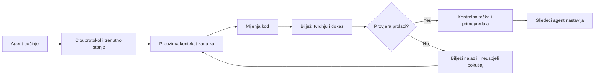

# ArifCE
<p align="center"></p>

[English](README.md) · [简体中文](README.zh-CN.md) · [繁體中文](README.zh-TW.md) · [한국어](README.ko.md) · [Deutsch](README.de.md) · [Español](README.es.md) · [Français](README.fr.md) · [Italiano](README.it.md) · [Dansk](README.da.md) · [日本語](README.ja.md) · [Polski](README.pl.md) · [Русский](README.ru.md) · [Bosanski](README.bs.md) · [العربية](README.ar.md) · [Norsk](README.no.md) · [Português (Brasil)](README.pt-BR.md) · [ไทย](README.th.md) · [Türkçe](README.tr.md) · [Українська](README.uk.md) · [বাংলা](README.bn.md) · [Ελληνικά](README.el.md) · [Tiếng Việt](README.vi.md)

**
Agenti se mijenjaju. Vaš projekat ne smije zaboraviti.
**

> 
Repozitorij posjeduje kontekst. Agent ga samo posuđuje.

[](https://github.com/seekua/ArifCE/actions/workflows/ci.yml) [](https://github.com/seekua/ArifCE/releases/latest) [](LICENSE)

ArifCE je lokalni sloj projektne inteligencije i kontinuiteta za razvoj softvera uz pomoć AI-ja. Čuva kontekst, odluke, neuspjele pokušaje, dokaze, stanje refaktorisanja i informacije o primopredaji u repozitoriju kako bi Codex, Claude Code, OpenCode i budući agenti nastavili istu inženjersku priču.

> Repozitorij posjeduje kontekst. Agent ga samo posuđuje.

## Zašto ArifCE postoji

Softverski timovi gube vrijeme i povjerenje kada važan kontekst postoji samo u historiji chata, ličnom sjećanju ili alatu koji sljedeći saradnik ne može pregledati. ArifCE čini inženjerski kontinuitet dijelom samog projekta.

Cilj nije da agenti zvuče sigurnije, već da svaki saradnik razumije šta tim želi postići, zašto je odluka donesena, šta je zaista provjereno i gdje ostaje neizvjesnost. Kada priča ostane u repozitoriju, tim može brže napredovati bez gubitka sljedivosti, odgovornosti ili povjerenja.

ArifCE pretvara kontinuitet u zajedničku inženjersku praksu: usmjeren kontekst za sljedeći zadatak, jasne dokaze za važne tvrdnje i iskrene primopredaje kada posao nije završen.

## Kome je namijenjen

ArifCE je namijenjen inženjerskim timovima uz AI, programerima koji rade s kodnim agentima i održavaocima kojima kontekst projekta treba preživjeti jednu osobu, chat ili sesiju. Posebno je koristan kada više saradnika dijeli repozitorij.

## Kako ArifCE radi



## Istražite projekat

Pokrenite lokalnu nadzornu ploču za pregled zdravlja projekta, nedavnih zapisa i pretraživog konteksta:

```powershell
$env:ARIFCE_PROJECT_ROOT = (Get-Location).Path
dotnet run --project src/ArifCE.Dashboard/ArifCE.Dashboard.csproj
```

Zatim otvorite <http://127.0.0.1:5180/>. Kompletan priručnik proizvoda nalazi se u [ArifCE centru dokumentacije](docs/README.md).

Ovaj tok rada čuva znanje o projektu u repozitoriju i čini napredak provjerljivim. Praktične prednosti su:

- Brže uključivanje: sljedeći agent čita fokusirano trenutno stanje umjesto da obnavlja dugu transkripciju.
- Sigurnije promjene: tvrdnje su povezane s determinističkim dokazima i zastarijevaju promjenom Git stanja.
- Bolji kontinuitet: odluke, neuspjeli pokušaji, kontrolne tačke i primopredaje preživljavaju promjene agenta ili sesije.
- Kontrolisani refaktoring: invarijante, inventar, zaštite i sigurne tačke čine nedovršen rad vidljivim.
- Lokalni rad: kanonske datoteke ostaju upotrebljive bez cloud usluge ili runtimea dobavljača.

## Više od memorije

ArifCE prati šta je zadatak bio, šta se promijenilo i zašto, šta agent tvrdi da je završio, koji dokazi podržavaju tvrdnju, šta je recenzent pronašao, šta je nedovršeno i šta sljedeći agent treba znati. Izjave agenata su tvrdnje, ne činjenice; prednost imaju deterministički dokazi iz builda, testova, Gita i pretrage.

Tehnička verifikacija i prihvatanje proizvoda su odvojeni: zapisi prihvatanja navode ko je odobrio tvrdnju i koji su aktuelni dokazi podržali odluku.

## V0.1 workflow

```text
arifce init
arifce task create "Fix permission cache race"
arifce checkpoint --summary "Reproduction added"
arifce context "finish the permission cache fix" --budget 16000
arifce claim create "Permission cache race is fixed"
arifce verify CLAIM-0001
arifce handoff
```

Kanonski Markdown, YAML, JSON i JSONL nalaze se u `.arifce/`. SQLite je izvedeni indeks koji se može obrisati; brisanje `.arifce/index/` i pokretanje `arifce rebuild` mora sačuvati inteligenciju projekta.

## Arhitektura

Jezgro odvaja pravila domena, kanonsko skladištenje i indeksiranje, posmatranje Gita, dohvat, verifikaciju, refaktorisanje, sigurnost i CLI. Datoteke uputa dobavljača su mali adapteri i nikada ne postaju kanonsko spremište memorije.

## Installation and quick start

V0.2.0 je objavljen kao višeplatformski .NET globalni alat. Pogledajte [instalaciju](docs/getting-started/installation.md) i [brzi početak](docs/getting-started/quick-start.md). Iz izvornog koda:

Opcionalni lokalni MCP adapter opisan je u [MCP podešavanju](docs/getting-started/mcp.md).

Za potpunu instalaciju i pregled funkcija pogledajte [korisnički vodič](docs/USER-GUIDE.md) i [politiku dokumentacije](docs/DOCUMENTATION-POLICY.md).

### 60-second quick start

```bash
dotnet tool install --global ArifCE.Cli --version 0.2.0
mkdir my-project && cd my-project
git init
arifce init
arifce task create "Ship the first change"
arifce checkpoint --summary "Project context initialized"
arifce handoff
```

Sada imate stanje projekta u repozitoriju, zadatak, kontrolnu tačku i semantičku primopredaju spremnu za sljedećeg saradnika.

```bash
dotnet restore
dotnet build
dotnet test
dotnet run --project src/ArifCE.Cli -- init
```

Pokrenite `init` u novom Git repozitoriju ili `adopt` u postojećem. Obje naredbe su nedestruktivne i idempotentne. `adopt` bilježi uočenu strukturu i nepoznate istorijske razloge označava kao nepoznate.

## Kontinuitet, verifikacija i refaktorisanje

- Novi agent čita `AGENTS.md`, `.arifce/PROTOCOL.md` i `.arifce/CURRENT.md`, zatim traži kontekst zadatka umjesto masovnog učitavanja istorije.
- Tvrdnje upućuju na dokaze iz repozitorija; dokazi zastarijevaju kada se relevantno stanje promijeni.
- Kampanje refaktorisanja prate invarijante, inventar, zaštite, napredak i kontrolne tačke; blokirajuće zaštite sprečavaju završetak.
- Primopredaje sažimaju trenutno tehničko stanje umjesto izlivanja transkripata.

## Sigurnost i ograničenja

Sirovi transkripti nisu pouzdani i nikada se ne učitavaju niti izvršavaju skupno. Uvozni putevi uklanjaju uobičajene tajne; vjerodajnice i podaci za autentifikaciju mašine ne pripadaju u `.arifce/`. V0.1 ne garantuje ispravnost, uštedu tokena ni bolji kvalitet pregleda; nema cloud uslugu, UI, vektorsku bazu, autonomni roj ni produkcijske pozive između agenata.

Pogledajte [ROADMAP.md](ROADMAP.md), [SECURITY.md](SECURITY.md) i [CONTRIBUTING.md](CONTRIBUTING.md). Tačna sintaksa implementiranih komandi dokumentovana je u [CLI referenci](docs/reference/cli.md).

## Licenca

ArifCE je licenciran pod [Apache License 2.0](LICENSE).
<p align="center"></p>


