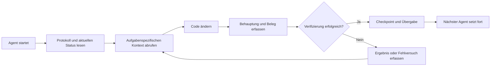

# ArifCE
<p align="center"></p>

[English](README.md) · [简体中文](README.zh-CN.md) · [繁體中文](README.zh-TW.md) · [한국어](README.ko.md) · [Deutsch](README.de.md) · [Español](README.es.md) · [Français](README.fr.md) · [Italiano](README.it.md) · [Dansk](README.da.md) · [日本語](README.ja.md) · [Polski](README.pl.md) · [Русский](README.ru.md) · [Bosanski](README.bs.md) · [العربية](README.ar.md) · [Norsk](README.no.md) · [Português (Brasil)](README.pt-BR.md) · [ไทย](README.th.md) · [Türkçe](README.tr.md) · [Українська](README.uk.md) · [বাংলা](README.bn.md) · [Ελληνικά](README.el.md) · [Tiếng Việt](README.vi.md)

**
Agenten wechseln. Ihr Projekt sollte nicht vergessen.
**

> 
Das Repository besitzt den Kontext. Der Agent leiht ihn nur.

[](https://github.com/seekua/ArifCE/actions/workflows/ci.yml) [](https://github.com/seekua/ArifCE/releases/latest) [](LICENSE)

ArifCE ist eine lokale Projektintelligenz- und Kontinuitätsschicht für KI-gestützte Softwareentwicklung. Sie bewahrt Kontext, Entscheidungen, fehlgeschlagene Versuche, Belege, Refactoring-Zustand und Übergabeinformationen im Repository, damit Codex, Claude Code, OpenCode und zukünftige Agenten dieselbe Engineering-Geschichte fortsetzen können.

> Das Repository besitzt den Kontext. Der Agent leiht ihn nur aus.

## Warum es ArifCE gibt

Softwareteams verlieren Zeit und Vertrauen, wenn wichtiger Kontext nur im Chatverlauf, im Gedächtnis Einzelner oder in einem Werkzeug liegt, das der nächste Beitragende nicht prüfen kann. ArifCE macht die Kontinuität der Entwicklung zu einem Teil des Projekts selbst.

Das Ziel ist nicht, Agenten sicherer klingen zu lassen. Es geht darum, jedem Beitragenden zu zeigen, was das Team erreichen will, warum eine Entscheidung getroffen wurde, was tatsächlich verifiziert ist und wo Unsicherheit bleibt. Bleibt diese Geschichte im Repository, können Teams schneller arbeiten, ohne Nachvollziehbarkeit, Verantwortung oder Vertrauen aufzugeben.

ArifCE macht Kontinuität zu einer gemeinsamen Engineering-Praxis: fokussierter Kontext für die nächste Aufgabe, klare Belege für wichtige Behauptungen und ehrliche Übergaben bei unvollständiger Arbeit.

## Für wen es gedacht ist

ArifCE richtet sich an KI-gestützte Engineering-Teams, Entwickler, die mit Coding-Agenten arbeiten, und Maintainer, deren Projektkontext eine Person, einen Chat oder eine Sitzung überdauern muss. Besonders nützlich ist es, wenn mehrere Beitragende ein Repository teilen und einen klaren Nachweis von Entscheidungen, Verifizierung und offenen Arbeiten benötigen.

## So funktioniert ArifCE



## Projekt erkunden

Starte das lokale Dashboard, um Projektgesundheit, aktuelle Einträge und durchsuchbaren Kontext visuell zu überblicken:

```powershell
$env:ARIFCE_PROJECT_ROOT = (Get-Location).Path
dotnet run --project src/ArifCE.Dashboard/ArifCE.Dashboard.csproj
```

Öffne anschließend <http://127.0.0.1:5180/>. Das vollständige Produkthandbuch findest du im [ArifCE-Dokumentationshub](docs/README.md).

Dieser Ablauf hält Projektwissen im Repository und macht Fortschritt überprüfbar. Die praktischen Vorteile sind:

- Schneller Einstieg: Der nächste Agent liest den fokussierten aktuellen Status, statt einen langen Verlauf zu rekonstruieren.
- Sicherere Änderungen: Behauptungen sind mit deterministischen Belegen verknüpft und werden bei Änderungen des Git-Status veraltet.
- Bessere Kontinuität: Entscheidungen, Fehlversuche, Checkpoints und Übergaben überleben Agenten- oder Sitzungswechsel.
- Kontrollierte Refactorings: Invarianten, Inventar, Prüfungen und sichere Punkte machen unvollständige Arbeit sichtbar.
- Lokaler Betrieb: Maßgebliche Dateien bleiben ohne Cloud-Dienst oder anbieterspezifische Laufzeit nutzbar.

## Mehr als nur Gedächtnis

ArifCE verfolgt, worin die Aufgabe bestand, was und warum geändert wurde, was ein Agent als erledigt behauptet, welche Belege dies stützen, was ein Reviewer festgestellt hat, was offen bleibt und was der nächste Agent wissen muss. Agentenaussagen sind Behauptungen, keine Fakten; deterministische Build-, Test-, Git- und Suchbelege werden bevorzugt.

Technische Verifizierung und Produktabnahme sind getrennt: Abnahmeaufzeichnungen nennen, wer eine Behauptung genehmigt hat und welche aktuellen Belege die Entscheidung stützten.

## V0.1-Arbeitsablauf

```text
arifce init
arifce task create "Fix permission cache race"
arifce checkpoint --summary "Reproduction added"
arifce context "finish the permission cache fix" --budget 16000
arifce claim create "Permission cache race is fixed"
arifce verify CLAIM-0001
arifce handoff
```

Maßgebliche Markdown-, YAML-, JSON- und JSONL-Dateien liegen unter `.arifce/`. SQLite ist ein löschbarer abgeleiteter Index: Das Löschen von `.arifce/index/` und Ausführen von `arifce rebuild` muss die Projektintelligenz erhalten.

## Architektur

Der Kern trennt Domänenregeln, maßgebliche Speicherung und Indexierung, Git-Beobachtung, Abruf, Verifizierung, Refactoring, Sicherheit und CLI. Anbieter-Anweisungsdateien sind kleine Adapter und werden nie zum maßgeblichen Speichersystem. Siehe [Architekturüberblick](docs/architecture/overview.md), [Domänenmodell](docs/architecture/domain-model.md) und [V0.1-Spezifikation](docs/SPECIFICATION-v0.1.md).

## Installation und Schnellstart

V0.2.0 ist als plattformübergreifendes .NET-Globaltool veröffentlicht. Siehe [Installation](docs/getting-started/installation.md) und [Schnellstart](docs/getting-started/quick-start.md). Aus dem Quellcode:

Der optionale lokale MCP-Adapter ist unter [MCP-Einrichtung](docs/getting-started/mcp.md) dokumentiert.

Eine vollständige Anleitung zu Installation und Funktionen findest du im [Benutzerhandbuch](docs/USER-GUIDE.md) und in der [Dokumentationsrichtlinie](docs/DOCUMENTATION-POLICY.md).

### Schnellstart in 60 Sekunden

```bash
dotnet tool install --global ArifCE.Cli --version 0.2.0
mkdir my-project && cd my-project
git init
arifce init
arifce task create "Ship the first change"
arifce checkpoint --summary "Project context initialized"
arifce handoff
```

Du hast jetzt einen repository-lokalen Projektstatus, eine Aufgabe, einen Checkpoint und eine semantische Übergabe für den nächsten Beitragenden.

```bash
dotnet restore
dotnet build
dotnet test
dotnet run --project src/ArifCE.Cli -- init
```

Führen Sie `init` in einem neuen Git-Repository oder `adopt` in einem bestehenden aus. Beide Befehle sind nicht destruktiv und idempotent. `adopt` erfasst die beobachtete Struktur und kennzeichnet unbekannte historische Gründe als unbekannt.

## Kontinuität, Verifizierung und Refactorings

- Ein neuer Agent liest `AGENTS.md`, `.arifce/PROTOCOL.md` und `.arifce/CURRENT.md` und fordert dann aufgabenspezifischen Kontext an, statt den gesamten Verlauf zu laden.
- Behauptungen verweisen auf repositorybezogene Belege. Belege werden veraltet, wenn sich der relevante Repository-Status ändert.
- Refactoring-Kampagnen verfolgen Invarianten, Inventar, Prüfungen, Fortschritt und Checkpoints. Sperrende Prüfungen verhindern den Abschluss.
- Übergaben fassen den aktuellen Engineering-Status zusammen, statt Gesprächsverläufe auszuschütten.

## Sicherheit und Einschränkungen

Rohprotokolle sind nicht vertrauenswürdig und werden niemals vollständig geladen oder ausgeführt. Importpfade schwärzen gängige Geheimnisse; Zugangsdaten und Maschinenauthentifizierung gehören nicht nach `.arifce/`. V0.1 garantiert weder Korrektheit noch Token-Einsparungen oder bessere Reviewqualität. Es gibt keinen Cloud-Dienst, keine UI, keine Vektordatenbank, keinen autonomen Schwarm und keine produktive Agent-zu-Agent-Ausführung.

Siehe [ROADMAP.md](ROADMAP.md), [SECURITY.md](SECURITY.md) und [CONTRIBUTING.md](CONTRIBUTING.md). Die exakt implementierte Befehlssyntax ist in der [CLI-Referenz](docs/reference/cli.md) dokumentiert.

## Lizenz

ArifCE steht unter der [Apache-Lizenz 2.0](LICENSE).
<p align="center"></p>
