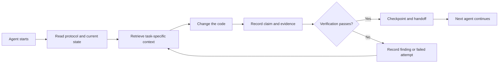

# ArifCE
<p align="center"></p>

[English](README.md) · [简体中文](README.zh-CN.md) · [繁體中文](README.zh-TW.md) · [한국어](README.ko.md) · [Deutsch](README.de.md) · [Español](README.es.md) · [Français](README.fr.md) · [Italiano](README.it.md) · [Dansk](README.da.md) · [日本語](README.ja.md) · [Polski](README.pl.md) · [Русский](README.ru.md) · [Bosanski](README.bs.md) · [العربية](README.ar.md) · [Norsk](README.no.md) · [Português (Brasil)](README.pt-BR.md) · [ไทย](README.th.md) · [Türkçe](README.tr.md) · [Українська](README.uk.md) · [বাংলা](README.bn.md) · [Ελληνικά](README.el.md) · [Tiếng Việt](README.vi.md)

[](https://github.com/seekua/ArifCE/actions/workflows/ci.yml) [](https://github.com/seekua/ArifCE/releases/latest) [](LICENSE)

ArifCE est une couche locale d’intelligence et de continuité du projet pour le développement logiciel assisté par IA. Elle conserve le contexte, les décisions, les tentatives échouées, les preuves, l’état du refactoring et les informations de passation dans le dépôt, afin que Codex, Claude Code, OpenCode et les futurs agents poursuivent la même histoire d’ingénierie.

> Le dépôt possède le contexte. L’agent ne fait que l’emprunter.

## Pourquoi ArifCE existe

Les équipes logicielles perdent du temps et de la confiance lorsque le contexte important ne vit que dans l’historique des discussions, la mémoire d’une personne ou un outil que le prochain contributeur ne peut pas examiner. ArifCE fait de la continuité d’ingénierie une partie intégrante du projet.

L’objectif n’est pas de faire paraître les agents plus sûrs d’eux. Il est d’aider chaque contributeur à comprendre ce que l’équipe cherche à accomplir, pourquoi une décision a été prise, ce qui a réellement été vérifié et où subsiste l’incertitude. Lorsque cette histoire reste dans le dépôt, les équipes avancent plus vite sans renoncer à la traçabilité, à la responsabilité ni à la confiance.

ArifCE transforme la continuité en pratique d’ingénierie partagée : un contexte ciblé pour la prochaine tâche, des preuves explicites pour les affirmations importantes et des passations honnêtes lorsque le travail est incomplet.

## À qui s’adresse ArifCE

ArifCE s’adresse aux équipes d’ingénierie assistées par IA, aux développeurs qui travaillent avec des agents de codage et aux mainteneurs qui ont besoin que le contexte du projet survive à une personne, une discussion ou une session. Il est particulièrement utile lorsque plusieurs contributeurs partagent un dépôt et doivent conserver une trace claire des décisions, de la vérification et du travail inachevé.

## Comment fonctionne ArifCE



## Explorer le projet

Lancez le tableau de bord local pour obtenir une vue visuelle de la santé du projet, des enregistrements récents et du contexte consultable :

```powershell
$env:ARIFCE_PROJECT_ROOT = (Get-Location).Path
dotnet run --project src/ArifCE.Dashboard/ArifCE.Dashboard.csproj
```

Ouvrez ensuite <http://127.0.0.1:5180/>. Pour le guide produit complet, consultez le [centre de documentation ArifCE](docs/README.md).

Ce flux de travail conserve les connaissances du projet dans le dépôt et rend les progrès vérifiables. Ses avantages pratiques sont les suivants :

- Faster onboarding: the next agent reads a focused current state instead of reconstructing a long transcript.
- Safer changes: claims are linked to deterministic evidence and become stale when Git state changes.
- Better continuity: decisions, failed attempts, checkpoints, and handoffs survive agent or session changes.
- Controlled refactors: invariants, inventory, guards, and safe points make incomplete work visible.
- Local-first operation: canonical files remain usable without a cloud service or vendor-specific runtime.

## Plus qu’une mémoire

ArifCE tracks what the task was, what changed, why it changed, what an agent claims it completed, what evidence supports that claim, what a reviewer found, what remains unfinished, and what the next agent needs to know. Agent statements are claims, not facts; deterministic build, test, Git, and search evidence is preferred.

La vérification technique et l’acceptation du produit sont distinctes : les enregistrements d’acceptation indiquent qui a approuvé une affirmation et quelles preuves actuelles ont justifié cette décision.

## Flux de travail V0.1

```text
arifce init
arifce task create "Fix permission cache race"
arifce checkpoint --summary "Reproduction added"
arifce context "finish the permission cache fix" --budget 16000
arifce claim create "Permission cache race is fixed"
arifce verify CLAIM-0001
arifce handoff
```

Les fichiers Markdown, YAML, JSON et JSONL canoniques se trouvent sous `.arifce/`. SQLite est un index dérivé supprimable : supprimer `.arifce/index/` puis exécuter `arifce rebuild` doit préserver l’intelligence du projet.

## Architecture

Le cœur sépare les règles métier, le stockage et l’indexation canoniques, l’observation de Git, la récupération, la vérification, la refactorisation, la sécurité et le CLI. Les fichiers d’instructions des fournisseurs sont de petits adaptateurs ; ils ne deviennent jamais le stockage mémoire canonique. Consultez la [vue d’ensemble de l’architecture](docs/architecture/overview.md), le [modèle de domaine](docs/architecture/domain-model.md) et la [spécification V0.1](docs/SPECIFICATION-v0.1.md).

## Installation et démarrage rapide

V0.2.0 est publié comme outil global .NET multiplateforme. Consultez l’[installation](docs/getting-started/installation.md) et le [démarrage rapide](docs/getting-started/quick-start.md). Depuis les sources :

L’adaptateur MCP local facultatif est décrit dans la [configuration MCP](docs/getting-started/mcp.md).

Pour une installation complète et une présentation des fonctionnalités, consultez le [guide utilisateur](docs/USER-GUIDE.md) et la [politique de documentation](docs/DOCUMENTATION-POLICY.md).

### 60-second quick start

```bash
dotnet tool install --global ArifCE.Cli --version 0.2.0
mkdir my-project && cd my-project
git init
arifce init
arifce task create "Ship the first change"
arifce checkpoint --summary "Project context initialized"
arifce handoff
```

Vous disposez maintenant d’un état de projet local au dépôt, d’une tâche, d’un point de contrôle et d’une passation sémantique prêts pour le prochain contributeur.

```bash
dotnet restore
dotnet build
dotnet test
dotnet run --project src/ArifCE.Cli -- init
```

Run `init` in a new Git repository or `adopt` in an existing one. Both are non-destructive and idempotent. `adopt` records observed structure and labels unknown historical rationale as unknown.

## Continuité, vérification et refactorings

- A fresh agent reads `AGENTS.md`, `.arifce/PROTOCOL.md`, and `.arifce/CURRENT.md`, then requests task-specific context instead of bulk-loading history.
- Claims link to repository-scoped evidence. Evidence becomes stale when the relevant repository state changes.
- Refactor campaigns track invariants, inventory, guards, progress, and checkpoints. Blocking guards prevent completion.
- Handoffs summarize current engineering state rather than dumping transcripts.

## Sécurité et limitations

Les transcriptions brutes ne sont pas fiables et ne sont jamais chargées en masse ni exécutées. Les chemins d’import masquent les secrets courants ; les identifiants et données d’authentification machine ne doivent pas se trouver dans `.arifce/`. V0.1 ne garantit ni l’exactitude, ni l’économie de jetons, ni une meilleure qualité de revue. Il ne fournit aucun service cloud, aucune interface, aucune base vectorielle, aucun essaim autonome ni appel inter-agent en production.

Consultez [ROADMAP.md](ROADMAP.md), [SECURITY.md](SECURITY.md) et [CONTRIBUTING.md](CONTRIBUTING.md). La syntaxe exacte des commandes implémentées figure dans la [référence CLI](docs/reference/cli.md).

## Licence

ArifCE est distribué sous [licence Apache 2.0](LICENSE).
<p align="center"></p>
