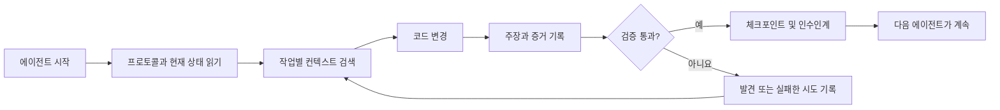

# ArifCE
<p align="center"></p>
[English](README.md) · [简体中文](README.zh-CN.md) · [繁體中文](README.zh-TW.md) · [한국어](README.ko.md) · [Deutsch](README.de.md) · [Español](README.es.md) · [Français](README.fr.md) · [Italiano](README.it.md) · [Dansk](README.da.md) · [日本語](README.ja.md) · [Polski](README.pl.md) · [Русский](README.ru.md) · [Bosanski](README.bs.md) · [العربية](README.ar.md) · [Norsk](README.no.md) · [Português (Brasil)](README.pt-BR.md) · [ไทย](README.th.md) · [Türkçe](README.tr.md) · [Українська](README.uk.md) · [বাংলা](README.bn.md) · [Ελληνικά](README.el.md) · [Tiếng Việt](README.vi.md)

[](https://github.com/seekua/ArifCE/actions/workflows/ci.yml) [](https://github.com/seekua/ArifCE/releases/latest) [](LICENSE)

ArifCE는 AI 지원 소프트웨어 개발을 위한 로컬 우선 프로젝트 지능 및 연속성 계층입니다. 컨텍스트, 결정, 실패한 시도, 증거, 리팩터링 상태와 인수인계 정보를 저장소에 보존하여 Codex, Claude Code, OpenCode 및 미래의 에이전트가 같은 엔지니어링 이야기를 이어가도록 합니다.

> 저장소가 컨텍스트를 소유합니다. 에이전트는 그것을 빌려 쓸 뿐입니다.

## ArifCE가 필요한 이유

중요한 컨텍스트가 채팅 기록, 개인의 기억 또는 다음 기여자가 확인할 수 없는 도구에만 남으면 소프트웨어 팀은 시간과 신뢰를 잃습니다. ArifCE는 엔지니어링 연속성을 프로젝트 자체의 일부로 만듭니다.

목표는 에이전트가 더 확신에 차 보이게 하는 것이 아닙니다. 팀이 무엇을 달성하려는지, 결정이 내려진 이유, 실제로 검증된 내용과 남은 불확실성을 모든 기여자가 이해하도록 돕는 것입니다. 이 이야기가 저장소에 남아 있으면 추적성, 소유권 또는 신뢰를 포기하지 않고 더 빠르게 진행할 수 있습니다.

ArifCE는 연속성을 공동 엔지니어링 실천으로 바꿉니다. 다음 작업을 위한 집중된 컨텍스트, 중요한 주장에 대한 명시적 증거, 작업이 미완료일 때의 정직한 인수인계를 제공합니다.

## 대상 사용자

ArifCE는 AI 지원 엔지니어링 팀, 코딩 에이전트와 함께 일하는 개발자, 한 사람이나 채팅 또는 세션을 넘어 프로젝트 컨텍스트를 유지해야 하는 유지관리자를 위한 것입니다. 여러 기여자가 저장소를 공유하고 결정, 검증 및 미완료 작업을 명확히 기록해야 할 때 특히 유용합니다.

## ArifCE 작동 방식



## 프로젝트 탐색

로컬 대시보드를 실행하면 프로젝트 상태, 최근 기록 및 검색 가능한 컨텍스트를 시각적으로 확인할 수 있습니다.

```powershell
$env:ARIFCE_PROJECT_ROOT = (Get-Location).Path
dotnet run --project src/ArifCE.Dashboard/ArifCE.Dashboard.csproj
```

그런 다음 <http://127.0.0.1:5180/>을 여세요. 전체 제품 안내서는 [ArifCE 문서 허브](docs/README.md)를 참조하세요.

이 워크플로는 프로젝트 지식을 저장소에 보존하고 진행 상황을 확인 가능하게 합니다. 실용적인 장점은 다음과 같습니다.

- 더 빠른 온보딩: 다음 에이전트는 긴 대화를 재구성하지 않고 정리된 현재 상태를 읽습니다.
- 더 안전한 변경: 주장은 결정적 증거에 연결되며 Git 상태가 바뀌면 오래된 것으로 표시됩니다.
- 향상된 연속성: 결정, 실패한 시도, 체크포인트와 인수인계가 에이전트나 세션 변경 후에도 남습니다.
- 통제된 리팩터링: 불변식, 목록, 가드와 안전 지점이 미완료 작업을 보이게 합니다.
- 로컬 우선 운영: 정식 파일은 클라우드 서비스나 공급업체 전용 런타임 없이 사용할 수 있습니다.

## 단순한 메모리 그 이상

ArifCE는 작업 내용, 변경 사항과 이유, 에이전트가 완료했다고 주장하는 내용, 그 주장을 뒷받침하는 증거, 검토자가 발견한 사항, 남은 미완료 작업과 다음 에이전트가 알아야 할 내용을 추적합니다. 에이전트의 진술은 사실이 아닌 주장입니다. 결정적인 빌드, 테스트, Git 및 검색 증거를 우선합니다.

기술 검증과 제품 승인은 별개입니다. 승인 기록에는 누가 주장을 승인했는지와 어떤 현재 증거가 결정을 뒷받침했는지가 담깁니다.

## V0.1 워크플로

```text
arifce init
arifce task create "Fix permission cache race"
arifce checkpoint --summary "Reproduction added"
arifce context "finish the permission cache fix" --budget 16000
arifce claim create "Permission cache race is fixed"
arifce verify CLAIM-0001
arifce handoff
```

정식 Markdown, YAML, JSON 및 JSONL은 `.arifce/` 아래에 있습니다. SQLite는 삭제 가능한 파생 인덱스이므로 `.arifce/index/`를 삭제하고 `arifce rebuild`를 실행해도 프로젝트 지능이 보존되어야 합니다.

## 아키텍처

The core separates domain rules, canonical storage and indexing, Git observation, retrieval, verification, refactoring, security, and the CLI. Vendor instruction files are small adapters; they never become the canonical memory store. See [architecture overview](docs/architecture/overview.md), [domain model](docs/architecture/domain-model.md), and [V0.1 specification](docs/SPECIFICATION-v0.1.md).

## 설치 및 빠른 시작

V0.2.0은 크로스 플랫폼 .NET 전역 도구로 게시되었습니다. [설치](docs/getting-started/installation.md)와 [빠른 시작](docs/getting-started/quick-start.md)을 참조하세요. 소스에서 실행하려면:

선택적 로컬 MCP 어댑터는 [MCP 설정](docs/getting-started/mcp.md)에 문서화되어 있습니다.

설치 및 기능 전체 안내는 [사용자 가이드](docs/USER-GUIDE.md)와 [문서 정책](docs/DOCUMENTATION-POLICY.md)을 참조하세요.

### 60-second quick start

```bash
dotnet tool install --global ArifCE.Cli --version 0.2.0
mkdir my-project && cd my-project
git init
arifce init
arifce task create "Ship the first change"
arifce checkpoint --summary "Project context initialized"
arifce handoff
```

이제 저장소에 로컬로 보관되는 프로젝트 상태, 작업, 체크포인트와 다음 기여자를 위한 의미 있는 인수인계가 준비되었습니다.

```bash
dotnet restore
dotnet build
dotnet test
dotnet run --project src/ArifCE.Cli -- init
```

Run `init` in a new Git repository or `adopt` in an existing one. Both are non-destructive and idempotent. `adopt` records observed structure and labels unknown historical rationale as unknown.

## 연속성, 검증 및 리팩터링

- 새 에이전트는 `AGENTS.md`, `.arifce/PROTOCOL.md`, `.arifce/CURRENT.md`를 읽은 뒤 전체 기록을 불러오지 않고 작업별 컨텍스트를 요청합니다.
- 주장은 저장소 범위의 증거에 연결됩니다. 관련 저장소 상태가 바뀌면 증거는 오래된 것으로 표시됩니다.
- 리팩터링 캠페인은 불변식, 목록, 가드, 진행률과 체크포인트를 추적합니다. 차단 가드는 완료를 방지합니다.
- 인수인계는 대화 기록을 그대로 덤프하지 않고 현재 엔지니어링 상태를 요약합니다.

## 보안 및 제한 사항

원시 대화 기록은 신뢰할 수 없으며 일괄 로드하거나 실행하지 않습니다. 가져오기 경로는 일반적인 비밀을 가립니다. 자격 증명과 시스템 인증 정보는 `.arifce/`에 저장하지 마세요. V0.1은 정확성, 토큰 절약 또는 더 나은 검토 품질을 보장하지 않습니다. 클라우드 서비스, UI, 벡터 데이터베이스, 자율 스웜 또는 프로덕션 에이전트 간 호출도 제공하지 않습니다.

자세한 내용은 [ROADMAP.md](ROADMAP.md), [SECURITY.md](SECURITY.md), [CONTRIBUTING.md](CONTRIBUTING.md)를 참조하세요. 구현된 명령의 정확한 구문은 [CLI 참조](docs/reference/cli.md)에 문서화되어 있습니다.

## 라이선스

ArifCE는 [Apache License 2.0](LICENSE)에 따라 사용이 허가됩니다.
