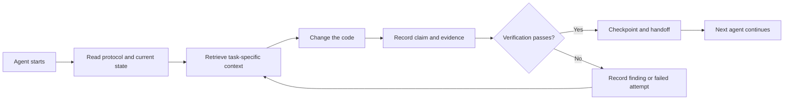

# ArifCE
<p align="center"></p>

**Agents change. Your project should not forget.**

[](https://github.com/seekua/ArifCE/actions/workflows/ci.yml) [](https://github.com/seekua/ArifCE/releases/latest) [](LICENSE)

ArifCE is a local-first project intelligence and continuity layer for AI-assisted software development. It keeps context, decisions, failed attempts, evidence, refactoring state, and handoff information with the repository so Codex, Claude Code, OpenCode, and future agents can continue the same engineering story.

> The repository owns the context. The agent only borrows it.

**Your limit ended? Continue in two commands.**

After completing real work on an existing task, record its handoff before you stop:

```bash
arifce handoff --task TASK-0031

# When you return with Codex, Claude Code, OpenCode, or a local model:
arifce context --task TASK-0031 --budget 2000
```

The handoff carries the objective, completed work, verified evidence, unresolved items, failures, and next action. Copy the printed `context` output into the new agent's opening prompt (or have an MCP-capable agent call the same tool); the CLI does not inject context into a model session automatically.

## Installation and quick start

Download the self-contained archive for your platform from [GitHub Releases](https://github.com/seekua/ArifCE/releases/tag/v0.8.0), extract it, and add `arifce` to your `PATH`. No separate .NET, Node, Python, Docker, or database installation is required.

```bash
mkdir my-project && cd my-project
git init
arifce init
arifce task create "Ship the first change"
arifce handoff

cd path/to/existing-repo
arifce adopt
arifce task create "Ship the first change"
arifce handoff
```

Use `adopt` when the repository already has code: it records the observed structure without overwriting it, then gives the next agent a project-local starting point. See the [installation guide](docs/getting-started/installation.md) for each platform.

**Read in another language.**

[English](README.md) · [简体中文](docs/locales/README.zh-CN.md) · [繁體中文](docs/locales/README.zh-TW.md) · [한국어](docs/locales/README.ko.md) · [Deutsch](docs/locales/README.de.md) · [Español](docs/locales/README.es.md) · [Français](docs/locales/README.fr.md) · [Italiano](docs/locales/README.it.md) · [Dansk](docs/locales/README.da.md) · [日本語](docs/locales/README.ja.md) · [Polski](docs/locales/README.pl.md) · [Русский](docs/locales/README.ru.md) · [Bosanski](docs/locales/README.bs.md) · [العربية](docs/locales/README.ar.md) · [Norsk](docs/locales/README.no.md) · [Português (Brasil)](docs/locales/README.pt-BR.md) · [ไทย](docs/locales/README.th.md) · [Türkçe](docs/locales/README.tr.md) · [Українська](docs/locales/README.uk.md) · [বাংলা](docs/locales/README.bn.md) · [Ελληνικά](docs/locales/README.el.md) · [Tiếng Việt](docs/locales/README.vi.md)

## Why ArifCE exists

Software teams lose time and confidence when important context lives only in chat history, individual memory, or a tool that the next contributor cannot inspect. ArifCE exists to make engineering continuity part of the project itself.

The goal is not to make agents sound more certain. The goal is to help every contributor understand what the team is trying to accomplish, why a decision was made, what has actually been verified, and where uncertainty remains. When that story stays with the repository, teams can move faster without giving up traceability, ownership, or trust.

ArifCE turns continuity into a shared engineering practice: focused context for the next task, explicit evidence for important claims, and honest handoffs when work is incomplete.

**Who it is for.**

ArifCE is for AI-assisted engineering teams, developers who work with coding agents, and maintainers who need project context to survive beyond one person, chat, or session. It is especially useful when several contributors share a repository and need a clear record of decisions, verification, and unfinished work.

## How ArifCE works



## Explore the project

When working from a source checkout, run the local dashboard to get a visual overview of project health, recent records, and searchable context. This developer command uses the .NET SDK; the self-contained release installation described above does not require it:

```powershell
$env:ARIFCE_PROJECT_ROOT = (Get-Location).Path
dotnet run --project src/ArifCE.Dashboard/ArifCE.Dashboard.csproj
```

Then open <http://127.0.0.1:5180/>. For the complete product handbook, see the [ArifCE documentation hub](docs/README.md).

This workflow keeps project knowledge in the repository and makes progress inspectable. The practical advantages are:

- Faster onboarding: the next agent reads a focused current state instead of reconstructing a long transcript.
- Safer changes: claims are linked to deterministic evidence and become stale when Git state changes.
- Better continuity: decisions, failed attempts, checkpoints, and handoffs survive agent or session changes.
- Controlled refactors: invariants, inventory, guards, and safe points make incomplete work visible.
- Local-first operation: canonical files remain usable without a cloud service or vendor-specific runtime.

## Not just memory

ArifCE tracks what the task was, what changed, why it changed, what an agent claims it completed, what evidence supports that claim, what a reviewer found, what remains unfinished, and what the next agent needs to know. Agent statements are claims, not facts; deterministic build, test, Git, and search evidence is preferred.

Technical verification and product acceptance are separate: acceptance records identify who approved a claim and which current evidence supported that decision.

## Core workflow

```text
arifce init
arifce task create "Fix permission cache race"
arifce checkpoint --summary "Reproduction added"
arifce context "finish the permission cache fix" --budget 16000
arifce claim create "Permission cache race is fixed"
arifce verify CLAIM-0001
arifce handoff
```

Canonical Markdown, YAML, JSON, and JSONL live under `.arifce/`. SQLite is a disposable derived index: deleting `.arifce/index/` and running `arifce rebuild` must preserve project intelligence.

## Architecture

The core separates domain rules, canonical storage and indexing, Git observation, retrieval, verification, refactoring, security, and the CLI. Vendor instruction files are small adapters; they never become the canonical memory store. See [architecture overview](docs/architecture/overview.md), [domain model](docs/architecture/domain-model.md), and the [historical V0.1 foundation specification](docs/SPECIFICATION-v0.1.md).

**Source development.** V0.8.0 is the current release. For source development, see [installation](docs/getting-started/installation.md) and the [quick start](docs/getting-started/quick-start.md):

```bash
git clone https://github.com/seekua/ArifCE.git
cd ArifCE
dotnet restore ArifCE.slnx
dotnet build ArifCE.slnx --configuration Release --no-restore
dotnet test ArifCE.slnx --configuration Release --no-build --no-restore
```

The optional local MCP adapter is documented in [MCP setup](docs/getting-started/mcp.md).

For a complete installation and feature walkthrough, see the [User Guide](docs/USER-GUIDE.md) and [Documentation Policy](docs/DOCUMENTATION-POLICY.md).

The install-and-start commands above create a repository-local project state, a task, and a handoff ready for the next contributor.

### Continue a task with Ollama or LM Studio

ArifCE keeps canonical project records in the repository. A provider receives the prompt and selected context; cloud providers receive that selected content remotely. `--with-context` adds ArifCE's selected project records, but does not read source files. This example explicitly reads the migration file into the prompt, so the model receives the code it is asked to review:

```bash
arifce llm provider add ollama Ollama llama3 --endpoint http://127.0.0.1:11434
arifce llm provider test ollama
task_id="$(arifce task create "Review and safely update the migration")"
migration_source="$(cat path/to/migration.sql)"
prompt="Review only this SQL migration for data-loss risks. Do not infer unseen source. Suggest the smallest safe change if needed.
Migration source:
$migration_source"
arifce llm run "Review and safely update the migration" "$prompt" --with-context --budget 2000
```

Apply any proposed change in your coding interface, then run the migration regression tests. Record only what that test command establishes as a claim:

After the tests pass, run `claim_id="$(arifce claim create "Migration regression tests pass" --task "$task_id")"`, then `arifce verify "$claim_id" --command "dotnet test path/to/migration-tests.csproj"` and `arifce handoff`.

The test result supports the test claim; it does not by itself prove the model's review was complete or correct. Replace the example paths and test command with those from your repository. For LM Studio, configure the provider with its loaded model name and OpenAI-compatible endpoint, usually `http://127.0.0.1:1234/v1`, using `arifce llm provider add lmstudio LmStudio your-loaded-model --endpoint http://127.0.0.1:1234/v1`.

Then use the same task, source input, test evidence, and handoff flow.

Reviewer execution requires explicit approval. Provider fallback, token/cost accounting, canonical evidence, embeddings, benchmark metrics, MCP tools, and the local dashboard are documented in the [LLM provider reference](docs/reference/LLM-PROVIDERS.md).

Run `init` in a new Git repository or `adopt` in an existing one. Both are non-destructive and idempotent. `adopt` records observed structure and labels unknown historical rationale as unknown.

## Continuity, verification, and refactors

- A fresh agent reads `AGENTS.md`, `.arifce/PROTOCOL.md`, and `.arifce/CURRENT.md`, then requests task-specific context instead of bulk-loading history.
- Claims link to repository-scoped evidence. Evidence becomes stale when the relevant repository state changes.
- Refactor campaigns track invariants, inventory, guards, progress, and checkpoints. Blocking guards prevent completion.
- Handoffs summarize current engineering state rather than dumping transcripts.

## Security and limitations

Raw transcripts are untrusted and are never bulk-loaded or executed. Import paths redact common secrets; credentials and machine authentication data do not belong in `.arifce/`. ArifCE does not guarantee correctness, token savings, or better review quality. It has no cloud service, hosted UI, vector database, autonomous swarm, or production cross-agent invocation. A local dashboard is included; it is not a hosted web application.

See [ROADMAP.md](ROADMAP.md), [SECURITY.md](SECURITY.md), and [CONTRIBUTING.md](CONTRIBUTING.md). The exact implemented command syntax is documented in the [CLI reference](docs/reference/cli.md).

## License

ArifCE is licensed under the [Apache License 2.0](LICENSE).
