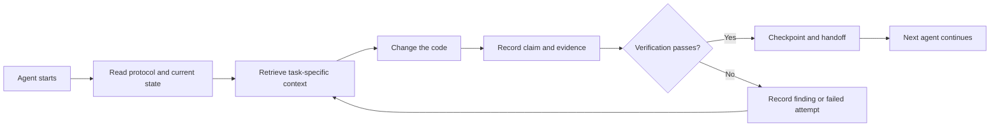

# ArifCE

[English](README.md) · [简体中文](README.zh-CN.md) · [繁體中文](README.zh-TW.md) · [한국어](README.ko.md) · [Deutsch](README.de.md) · [Español](README.es.md) · [Français](README.fr.md) · [Italiano](README.it.md) · [Dansk](README.da.md) · [日本語](README.ja.md) · [Polski](README.pl.md) · [Русский](README.ru.md) · [Bosanski](README.bs.md) · [العربية](README.ar.md) · [Norsk](README.no.md) · [Português (Brasil)](README.pt-BR.md) · [ไทย](README.th.md) · [Türkçe](README.tr.md) · [Українська](README.uk.md) · [বাংলা](README.bn.md) · [Ελληνικά](README.el.md) · [Tiếng Việt](README.vi.md)

**Agenci się zmieniają. Projekt nie zapomina.** ArifCE przechowuje kontekst, decyzje, dowody i przekazania w repozytorium.

```powershell
dotnet tool install --global ArifCE.Cli
cd your-project
arifce init
arifce status
```

## Complete product reference

The translated introduction above is followed by the complete canonical product reference. This keeps every command, link, badge, safety note, and limitation available while the full human translation is completed.

**Agents change. Your project should not forget.**

[](https://github.com/seekua/ArifCE/actions/workflows/ci.yml) [](https://github.com/seekua/ArifCE/releases/latest) [](LICENSE)

ArifCE is a local-first project intelligence and continuity layer for AI-assisted software development. It keeps context, decisions, failed attempts, evidence, refactoring state, and handoff information with the repository so Codex, Claude Code, OpenCode, and future agents can continue the same engineering story.

> The repository owns the context. The agent only borrows it.

## Why ArifCE exists

Software teams lose time and confidence when important context lives only in chat history, individual memory, or a tool that the next contributor cannot inspect. ArifCE exists to make engineering continuity part of the project itself.

The goal is not to make agents sound more certain. The goal is to help every contributor understand what the team is trying to accomplish, why a decision was made, what has actually been verified, and where uncertainty remains. When that story stays with the repository, teams can move faster without giving up traceability, ownership, or trust.

ArifCE turns continuity into a shared engineering practice: focused context for the next task, explicit evidence for important claims, and honest handoffs when work is incomplete.

## Who it is for

ArifCE is for AI-assisted engineering teams, developers who work with coding agents, and maintainers who need project context to survive beyond one person, chat, or session. It is especially useful when several contributors share a repository and need a clear record of decisions, verification, and unfinished work.

## How ArifCE works



## Explore the project

Run the local dashboard to get a visual overview of project health, recent records, and searchable context:

```powershell
$env:ARIFCE_PROJECT_ROOT = (Get-Location).Path
dotnet run --project src/ArifCE.Dashboard/ArifCE.Dashboard.csproj
```

Then open <http://127.0.0.1:5180/>. For the complete product handbook, see the [ArifCE documentation hub](docs/README.md).

This workflow keeps project knowledge in the repository and makes progress inspectable. The practical advantages are:

- Faster onboarding: the next agent reads a focused current state instead of reconstructing a long transcript.
- Safer changes: claims are linked to deterministic evidence and become stale when Git state changes.
- Better continuity: decisions, failed attempts, checkpoints, and handoffs survive agent or session changes.
- Controlled refactors: invariants, inventory, guards, and safe points make incomplete work visible.
- Local-first operation: canonical files remain usable without a cloud service or vendor-specific runtime.

## Not just memory

ArifCE tracks what the task was, what changed, why it changed, what an agent claims it completed, what evidence supports that claim, what a reviewer found, what remains unfinished, and what the next agent needs to know. Agent statements are claims, not facts; deterministic build, test, Git, and search evidence is preferred.

Technical verification and product acceptance are separate: acceptance records identify who approved a claim and which current evidence supported that decision.

## V0.1 workflow

```text
arifce init
arifce task create "Fix permission cache race"
arifce checkpoint --summary "Reproduction added"
arifce context "finish the permission cache fix" --budget 16000
arifce claim create "Permission cache race is fixed"
arifce verify CLAIM-0001
arifce handoff
```

Canonical Markdown, YAML, JSON, and JSONL live under `.arifce/`. SQLite is a disposable derived index: deleting `.arifce/index/` and running `arifce rebuild` must preserve project intelligence.

## Architecture

The core separates domain rules, canonical storage and indexing, Git observation, retrieval, verification, refactoring, security, and the CLI. Vendor instruction files are small adapters; they never become the canonical memory store. See [architecture overview](docs/architecture/overview.md), [domain model](docs/architecture/domain-model.md), and [V0.1 specification](docs/SPECIFICATION-v0.1.md).

## Installation and quick start

V0.2.0 is published as a cross-platform .NET global tool. See [installation](docs/getting-started/installation.md) and the [quick start](docs/getting-started/quick-start.md). From source:

The optional local MCP adapter is documented in [MCP setup](docs/getting-started/mcp.md).

For a complete installation and feature walkthrough, see the [User Guide](docs/USER-GUIDE.md) and [Documentation Policy](docs/DOCUMENTATION-POLICY.md).

### 60-second quick start

```bash
dotnet tool install --global ArifCE.Cli --version 0.2.0
mkdir my-project && cd my-project
git init
arifce init
arifce task create "Ship the first change"
arifce checkpoint --summary "Project context initialized"
arifce handoff
```

You now have a repository-local project state, a task, a checkpoint, and a semantic handoff ready for the next contributor.

```bash
dotnet restore
dotnet build
dotnet test
dotnet run --project src/ArifCE.Cli -- init
```

Run `init` in a new Git repository or `adopt` in an existing one. Both are non-destructive and idempotent. `adopt` records observed structure and labels unknown historical rationale as unknown.

## Continuity, verification, and refactors

- A fresh agent reads `AGENTS.md`, `.arifce/PROTOCOL.md`, and `.arifce/CURRENT.md`, then requests task-specific context instead of bulk-loading history.
- Claims link to repository-scoped evidence. Evidence becomes stale when the relevant repository state changes.
- Refactor campaigns track invariants, inventory, guards, progress, and checkpoints. Blocking guards prevent completion.
- Handoffs summarize current engineering state rather than dumping transcripts.

## Security and limitations

Raw transcripts are untrusted and are never bulk-loaded or executed. Import paths redact common secrets; credentials and machine authentication data do not belong in `.arifce/`. V0.1 does not guarantee correctness, token savings, or better review quality. It has no cloud service, UI, vector database, autonomous swarm, or production cross-agent invocation.

See [ROADMAP.md](ROADMAP.md), [SECURITY.md](SECURITY.md), and [CONTRIBUTING.md](CONTRIBUTING.md). The exact implemented command syntax is documented in the [CLI reference](docs/reference/cli.md).

## License

ArifCE is licensed under the [Apache License 2.0](LICENSE).
<p align="center"></p>
