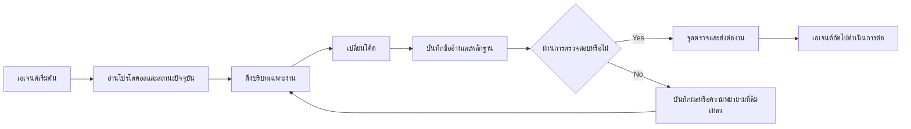

# ArifCE
<p align="center"></p>

[English](README.md) · [简体中文](README.zh-CN.md) · [繁體中文](README.zh-TW.md) · [한국어](README.ko.md) · [Deutsch](README.de.md) · [Español](README.es.md) · [Français](README.fr.md) · [Italiano](README.it.md) · [Dansk](README.da.md) · [日本語](README.ja.md) · [Polski](README.pl.md) · [Русский](README.ru.md) · [Bosanski](README.bs.md) · [العربية](README.ar.md) · [Norsk](README.no.md) · [Português (Brasil)](README.pt-BR.md) · [ไทย](README.th.md) · [Türkçe](README.tr.md) · [Українська](README.uk.md) · [বাংলা](README.bn.md) · [Ελληνικά](README.el.md) · [Tiếng Việt](README.vi.md)

[](https://github.com/seekua/ArifCE/actions/workflows/ci.yml) [](https://github.com/seekua/ArifCE/releases/latest) [](LICENSE)

ArifCE คือเลเยอร์อัจฉริยะและความต่อเนื่องของโครงการแบบ local-first สำหรับการพัฒนาซอฟต์แวร์ด้วย AI โดยเก็บบริบท การตัดสินใจ ความพยายามที่ล้มเหลว หลักฐาน สถานะการรีแฟกเตอร์ และข้อมูลการส่งต่องานไว้กับรีโพซิทอรี เพื่อให้ Codex, Claude Code, OpenCode และเอเจนต์ในอนาคตสานต่อเรื่องราวทางวิศวกรรมเดิมได้

> รีโพซิทอรีเป็นเจ้าของบริบท เอเจนต์เพียงยืมไปใช้

## เหตุผลที่มี ArifCE

ทีมซอฟต์แวร์เสียเวลาและความเชื่อมั่นเมื่อบริบทสำคัญอยู่เฉพาะในประวัติแชต ความทรงจำส่วนบุคคล หรือเครื่องมือที่ผู้ร่วมงานคนถัดไปตรวจสอบไม่ได้ ArifCE ทำให้ความต่อเนื่องทางวิศวกรรมเป็นส่วนหนึ่งของโครงการเอง

เป้าหมายไม่ใช่ทำให้เอเจนต์ฟังดูมั่นใจขึ้น แต่ช่วยให้ผู้ร่วมงานเข้าใจเป้าหมายของทีม เหตุผลของการตัดสินใจ สิ่งที่ยืนยันแล้ว และจุดที่ยังไม่แน่นอน เมื่อเรื่องราวอยู่ในรีโพซิทอรี ทีมจะก้าวเร็วขึ้นโดยไม่เสียความสามารถในการติดตาม ความรับผิดชอบ หรือความไว้วางใจ

ArifCE เปลี่ยนความต่อเนื่องให้เป็นแนวปฏิบัติทางวิศวกรรมร่วมกัน: บริบทที่มุ่งเน้นสำหรับงานถัดไป หลักฐานที่ชัดเจนสำหรับข้ออ้างสำคัญ และการส่งต่องานอย่างตรงไปตรงมาเมื่อยังทำงานไม่เสร็จ

## เหมาะสำหรับใคร

ArifCE เหมาะสำหรับทีมวิศวกรรมที่ใช้ AI นักพัฒนาที่ทำงานกับเอเจนต์เขียนโค้ด และผู้ดูแลที่ต้องการให้บริบทโครงการคงอยู่ได้นานกว่าคน แชต หรือเซสชันเดียว โดยเฉพาะเมื่อมีผู้ร่วมงานหลายคนใช้รีโพซิทอรีร่วมกัน

## ArifCE ทำงานอย่างไร



## สำรวจโครงการ

Run the local dashboard to get a visual overview of project health, recent records, and searchable context:

```powershell
$env:ARIFCE_PROJECT_ROOT = (Get-Location).Path
dotnet run --project src/ArifCE.Dashboard/ArifCE.Dashboard.csproj
```

Then open <http://127.0.0.1:5180/>. For the complete product handbook, see the [ArifCE documentation hub](docs/README.md).

This workflow keeps project knowledge in the repository and makes progress inspectable. The practical advantages are:

- Faster onboarding: the next agent reads a focused current state instead of reconstructing a long transcript.
- Safer changes: claims are linked to deterministic evidence and become stale when Git state changes.
- Better continuity: decisions, failed attempts, checkpoints, and handoffs survive agent or session changes.
- Controlled refactors: invariants, inventory, guards, and safe points make incomplete work visible.
- Local-first operation: canonical files remain usable without a cloud service or vendor-specific runtime.

## ไม่ใช่แค่ความจำ

ArifCE tracks what the task was, what changed, why it changed, what an agent claims it completed, what evidence supports that claim, what a reviewer found, what remains unfinished, and what the next agent needs to know. Agent statements are claims, not facts; deterministic build, test, Git, and search evidence is preferred.

Technical verification and product acceptance are separate: acceptance records identify who approved a claim and which current evidence supported that decision.

## V0.1 workflow

```text
arifce init
arifce task create "Fix permission cache race"
arifce checkpoint --summary "Reproduction added"
arifce context "finish the permission cache fix" --budget 16000
arifce claim create "Permission cache race is fixed"
arifce verify CLAIM-0001
arifce handoff
```

Canonical Markdown, YAML, JSON, and JSONL live under `.arifce/`. SQLite is a disposable derived index: deleting `.arifce/index/` and running `arifce rebuild` must preserve project intelligence.

## สถาปัตยกรรม

The core separates domain rules, canonical storage and indexing, Git observation, retrieval, verification, refactoring, security, and the CLI. Vendor instruction files are small adapters; they never become the canonical memory store. See [architecture overview](docs/architecture/overview.md), [domain model](docs/architecture/domain-model.md), and [V0.1 specification](docs/SPECIFICATION-v0.1.md).

## Installation and quick start

V0.2.0 is published as a cross-platform .NET global tool. See [installation](docs/getting-started/installation.md) and the [quick start](docs/getting-started/quick-start.md). From source:

The optional local MCP adapter is documented in [MCP setup](docs/getting-started/mcp.md).

For a complete installation and feature walkthrough, see the [User Guide](docs/USER-GUIDE.md) and [Documentation Policy](docs/DOCUMENTATION-POLICY.md).

### 60-second quick start

```bash
dotnet tool install --global ArifCE.Cli --version 0.2.0
mkdir my-project && cd my-project
git init
arifce init
arifce task create "Ship the first change"
arifce checkpoint --summary "Project context initialized"
arifce handoff
```

You now have a repository-local project state, a task, a checkpoint, and a semantic handoff ready for the next contributor.

```bash
dotnet restore
dotnet build
dotnet test
dotnet run --project src/ArifCE.Cli -- init
```

Run `init` in a new Git repository or `adopt` in an existing one. Both are non-destructive and idempotent. `adopt` records observed structure and labels unknown historical rationale as unknown.

## Continuity, verification, and refactors

- A fresh agent reads `AGENTS.md`, `.arifce/PROTOCOL.md`, and `.arifce/CURRENT.md`, then requests task-specific context instead of bulk-loading history.
- Claims link to repository-scoped evidence. Evidence becomes stale when the relevant repository state changes.
- Refactor campaigns track invariants, inventory, guards, progress, and checkpoints. Blocking guards prevent completion.
- Handoffs summarize current engineering state rather than dumping transcripts.

## ความปลอดภัยและข้อจำกัด

Raw transcripts are untrusted and are never bulk-loaded or executed. Import paths redact common secrets; credentials and machine authentication data do not belong in `.arifce/`. V0.1 does not guarantee correctness, token savings, or better review quality. It has no cloud service, UI, vector database, autonomous swarm, or production cross-agent invocation.

See [ROADMAP.md](ROADMAP.md), [SECURITY.md](SECURITY.md), and [CONTRIBUTING.md](CONTRIBUTING.md). The exact implemented command syntax is documented in the [CLI reference](docs/reference/cli.md).

## ใบอนุญาต

ArifCE is licensed under the [Apache License 2.0](LICENSE).
<p align="center"></p>


