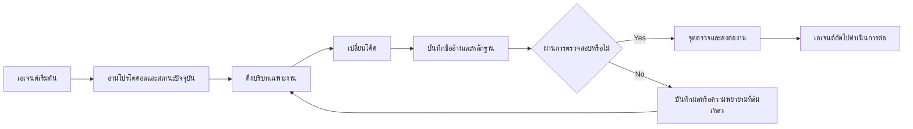

# ArifCE
<p align="center"></p>

[English](README.md) · [简体中文](README.zh-CN.md) · [繁體中文](README.zh-TW.md) · [한국어](README.ko.md) · [Deutsch](README.de.md) · [Español](README.es.md) · [Français](README.fr.md) · [Italiano](README.it.md) · [Dansk](README.da.md) · [日本語](README.ja.md) · [Polski](README.pl.md) · [Русский](README.ru.md) · [Bosanski](README.bs.md) · [العربية](README.ar.md) · [Norsk](README.no.md) · [Português (Brasil)](README.pt-BR.md) · [ไทย](README.th.md) · [Türkçe](README.tr.md) · [Українська](README.uk.md) · [বাংলা](README.bn.md) · [Ελληνικά](README.el.md) · [Tiếng Việt](README.vi.md)

**เอเจนต์เปลี่ยนแปลง โครงการของคุณไม่ควรลืม**


[](https://github.com/seekua/ArifCE/actions/workflows/ci.yml) [](https://github.com/seekua/ArifCE/releases/latest) [](LICENSE)

ArifCE คือเลเยอร์อัจฉริยะและความต่อเนื่องของโครงการแบบ local-first สำหรับการพัฒนาซอฟต์แวร์ด้วย AI โดยเก็บบริบท การตัดสินใจ ความพยายามที่ล้มเหลว หลักฐาน สถานะการรีแฟกเตอร์ และข้อมูลการส่งต่องานไว้กับรีโพซิทอรี เพื่อให้ Codex, Claude Code, OpenCode และเอเจนต์ในอนาคตสานต่อเรื่องราวทางวิศวกรรมเดิมได้
> รีโพซิทอรีเป็นเจ้าของบริบท เอเจนต์เพียงยืมไปใช้


## เหตุผลที่มี ArifCE

ทีมซอฟต์แวร์เสียเวลาและความเชื่อมั่นเมื่อบริบทสำคัญอยู่เฉพาะในประวัติแชต ความทรงจำส่วนบุคคล หรือเครื่องมือที่ผู้ร่วมงานคนถัดไปตรวจสอบไม่ได้ ArifCE ทำให้ความต่อเนื่องทางวิศวกรรมเป็นส่วนหนึ่งของโครงการเอง

เป้าหมายไม่ใช่ทำให้เอเจนต์ฟังดูมั่นใจขึ้น แต่ช่วยให้ผู้ร่วมงานเข้าใจเป้าหมายของทีม เหตุผลของการตัดสินใจ สิ่งที่ยืนยันแล้ว และจุดที่ยังไม่แน่นอน เมื่อเรื่องราวอยู่ในรีโพซิทอรี ทีมจะก้าวเร็วขึ้นโดยไม่เสียความสามารถในการติดตาม ความรับผิดชอบ หรือความไว้วางใจ

ArifCE เปลี่ยนความต่อเนื่องให้เป็นแนวปฏิบัติทางวิศวกรรมร่วมกัน: บริบทที่มุ่งเน้นสำหรับงานถัดไป หลักฐานที่ชัดเจนสำหรับข้ออ้างสำคัญ และการส่งต่องานอย่างตรงไปตรงมาเมื่อยังทำงานไม่เสร็จ

## เหมาะสำหรับใคร

ArifCE เหมาะสำหรับทีมวิศวกรรมที่ใช้ AI นักพัฒนาที่ทำงานกับเอเจนต์เขียนโค้ด และผู้ดูแลที่ต้องการให้บริบทโครงการคงอยู่ได้นานกว่าคน แชต หรือเซสชันเดียว โดยเฉพาะเมื่อมีผู้ร่วมงานหลายคนใช้รีโพซิทอรีร่วมกัน

## ArifCE ทำงานอย่างไร



## สำรวจโครงการ

เรียกใช้แดชบอร์ดในเครื่องเพื่อดูภาพรวมสุขภาพโครงการ บันทึกล่าสุด และบริบทที่ค้นหาได้:

```powershell
$env:ARIFCE_PROJECT_ROOT = (Get-Location).Path
dotnet run --project src/ArifCE.Dashboard/ArifCE.Dashboard.csproj
```

จากนั้นเปิด <http://127.0.0.1:5180/> ดูคู่มือผลิตภัณฑ์ฉบับเต็มที่ [ศูนย์เอกสาร ArifCE](docs/README.md)

เวิร์กโฟลว์นี้เก็บความรู้ของโครงการไว้ในรีโพซิทอรีและทำให้ตรวจสอบความคืบหน้าได้ ประโยชน์เชิงปฏิบัติคือ:

- เริ่มงานได้เร็วขึ้น: เอเจนต์ถัดไปอ่านสถานะปัจจุบันที่สรุปไว้แทนการสร้างบันทึกยาวใหม่
- เปลี่ยนแปลงปลอดภัยขึ้น: ข้ออ้างเชื่อมกับหลักฐานที่แน่นอน และจะล้าสมัยเมื่อสถานะ Git เปลี่ยน
- ความต่อเนื่องที่ดีขึ้น: การตัดสินใจ ความพยายามที่ล้มเหลว จุดตรวจ และการส่งต่องานยังคงอยู่แม้เปลี่ยนเอเจนต์หรือเซสชัน
- รีแฟกเตอร์อย่างควบคุมได้: อินวาเรียนต์ รายการ การป้องกัน และจุดปลอดภัยทำให้งานที่ยังไม่เสร็จมองเห็นได้
- การทำงานแบบ local-first: ไฟล์หลักยังใช้งานได้โดยไม่ต้องมีคลาวด์หรือ runtime ของผู้ให้บริการ

## ไม่ใช่แค่ความจำ

ArifCE ติดตามว่างานคืออะไร มีอะไรเปลี่ยนและเพราะเหตุใด เอเจนต์อ้างว่าทำอะไรเสร็จ หลักฐานใดสนับสนุนข้ออ้างนั้น ผู้ตรวจพบอะไร งานใดยังไม่เสร็จ และเอเจนต์ถัดไปต้องรู้อะไร คำกล่าวของเอเจนต์เป็นข้ออ้างไม่ใช่ข้อเท็จจริง จึงควรใช้หลักฐานจาก build, test, Git และการค้นหาที่ตรวจสอบได้

การตรวจสอบทางเทคนิคและการยอมรับผลิตภัณฑ์แยกจากกัน บันทึกการยอมรับระบุว่าใครอนุมัติข้ออ้างและหลักฐานปัจจุบันใดสนับสนุนการตัดสินใจ

## V0.1 workflow

```text
arifce init
arifce task create "Fix permission cache race"
arifce checkpoint --summary "Reproduction added"
arifce context "finish the permission cache fix" --budget 16000
arifce claim create "Permission cache race is fixed"
arifce verify CLAIM-0001
arifce handoff
```

ไฟล์ Markdown, YAML, JSON และ JSONL หลักอยู่ใน `.arifce/` ส่วน SQLite เป็นดัชนีที่ลบทิ้งได้ การลบ `.arifce/index/` แล้วเรียก `arifce rebuild` ต้องยังคงรักษาข้อมูลโครงการไว้ได้

## สถาปัตยกรรม

แกนหลักแยกกฎโดเมน การจัดเก็บและดัชนีหลัก การสังเกต Git การดึงข้อมูล การตรวจสอบ การรีแฟกเตอร์ ความปลอดภัย และ CLI ออกจากกัน ไฟล์คำสั่งของผู้ให้บริการเป็นอะแดปเตอร์ขนาดเล็กและไม่กลายเป็นที่เก็บหน่วยความจำหลัก

## Installation and quick start

V0.2.0 เผยแพร่เป็นเครื่องมือ .NET แบบข้ามแพลตฟอร์ม ดู[การติดตั้ง](docs/getting-started/installation.md)และ[เริ่มต้นอย่างรวดเร็ว](docs/getting-started/quick-start.md) จากซอร์สโค้ด:

อะแดปเตอร์ MCP ในเครื่องแบบเลือกใช้ได้อธิบายไว้ใน [การตั้งค่า MCP](docs/getting-started/mcp.md)

สำหรับการติดตั้งและคำแนะนำฟีเจอร์ทั้งหมด ดูที่ [คู่มือผู้ใช้](docs/USER-GUIDE.md) และ [นโยบายเอกสาร](docs/DOCUMENTATION-POLICY.md)

### 60-second quick start

```bash
dotnet tool install --global ArifCE.Cli --version 0.2.0
mkdir my-project && cd my-project
git init
arifce init
arifce task create "Ship the first change"
arifce checkpoint --summary "Project context initialized"
arifce handoff
```

ตอนนี้คุณมีสถานะโครงการในรีโพซิทอรี งานหนึ่งรายการ จุดตรวจ และการส่งต่องานเชิงความหมายที่พร้อมสำหรับผู้มีส่วนร่วมคนถัดไปแล้ว

```bash
dotnet restore
dotnet build
dotnet test
dotnet run --project src/ArifCE.Cli -- init
```

เรียกใช้ `init` ในรีโพซิทอรี Git ใหม่ หรือ `adopt` ในรีโพซิทอรีที่มีอยู่ ทั้งสองคำสั่งไม่ทำลายข้อมูลและทำซ้ำได้อย่างปลอดภัย `adopt` จะบันทึกโครงสร้างที่พบและระบุเหตุผลทางประวัติศาสตร์ที่ไม่ทราบว่าไม่ทราบ

## ความต่อเนื่อง การตรวจสอบ และการรีแฟกเตอร์

- เอเจนต์ใหม่อ่าน `AGENTS.md`, `.arifce/PROTOCOL.md` และ `.arifce/CURRENT.md` แล้วขอบริบทเฉพาะงานแทนการโหลดประวัติทั้งหมด
- ข้ออ้างเชื่อมโยงกับหลักฐานในรีโพซิทอรี และหลักฐานจะล้าสมัยเมื่อสถานะที่เกี่ยวข้องเปลี่ยน
- แคมเปญรีแฟกเตอร์ติดตามอินวาเรียนต์ รายการ การป้องกัน ความคืบหน้า และจุดตรวจ การป้องกันแบบบล็อกจะหยุดการเสร็จสิ้น
- การส่งต่องานสรุปสถานะวิศวกรรมปัจจุบันแทนการเททรานสคริปต์ทั้งหมด

## ความปลอดภัยและข้อจำกัด

บันทึกดิบไม่น่าเชื่อถือและจะไม่โหลดหรือเรียกใช้แบบรวม ไฟล์นำเข้าจะปกปิดความลับทั่วไป ข้อมูลรับรองและการยืนยันตัวตนของเครื่องไม่ควรอยู่ใน `.arifce/` V0.1 ไม่รับประกันความถูกต้อง การประหยัดโทเค็น หรือคุณภาพรีวิวที่ดีขึ้น และไม่มีคลาวด์ UI ฐานข้อมูลเวกเตอร์ ฝูงอัตโนมัติ หรือการเรียกเอเจนต์ระหว่างกันใน production

ดู [ROADMAP.md](ROADMAP.md), [SECURITY.md](SECURITY.md) และ [CONTRIBUTING.md](CONTRIBUTING.md) ไวยากรณ์คำสั่งที่ใช้งานจริงมีบันทึกไว้ใน [ข้อมูลอ้างอิง CLI](docs/reference/cli.md)

## ใบอนุญาต

ArifCE เผยแพร่ภายใต้ [Apache License 2.0](LICENSE)


