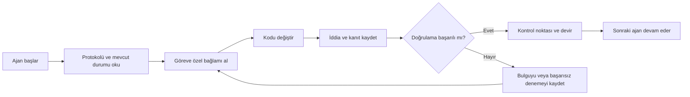

# ArifCE
<p align="center"></p>

[English](README.md) · [简体中文](README.zh-CN.md) · [繁體中文](README.zh-TW.md) · [한국어](README.ko.md) · [Deutsch](README.de.md) · [Español](README.es.md) · [Français](README.fr.md) · [Italiano](README.it.md) · [Dansk](README.da.md) · [日本語](README.ja.md) · [Polski](README.pl.md) · [Русский](README.ru.md) · [Bosanski](README.bs.md) · [العربية](README.ar.md) · [Norsk](README.no.md) · [Português (Brasil)](README.pt-BR.md) · [ไทย](README.th.md) · [Türkçe](README.tr.md) · [Українська](README.uk.md) · [বাংলা](README.bn.md) · [Ελληνικά](README.el.md) · [Tiếng Việt](README.vi.md)

**Ajanlar değişir. Projen unutmamalı.**


[](https://github.com/seekua/ArifCE/actions/workflows/ci.yml) [](https://github.com/seekua/ArifCE/releases/latest) [](LICENSE)

ArifCE, yapay zekâ destekli yazılım geliştirme için yerel öncelikli proje zekâsı ve süreklilik katmanıdır. Bağlamı, kararları, başarısız denemeleri, kanıtları, yeniden düzenleme durumunu ve devir bilgilerini depoda tutarak Codex, Claude Code, OpenCode ve gelecekteki ajanların aynı mühendislik hikâyesine devam etmesini sağlar.

> Bağlamın sahibi repodur. Ajan yalnızca onu ödünç alır.


## ArifCE neden var

Önemli bağlam yalnızca sohbet geçmişinde, kişisel bellekte veya sonraki katkıcının inceleyemediği bir araçta kaldığında yazılım ekipleri zaman ve güven kaybeder. ArifCE, mühendislik sürekliliğini projenin kendisinin bir parçası haline getirmek için vardır.

Amaç ajanların daha emin konuşmasını sağlamak değildir. Amaç her katkıcının ekibin neyi başarmaya çalıştığını, bir kararın neden alındığını, gerçekte neyin doğrulandığını ve hangi belirsizliklerin kaldığını anlamasına yardımcı olmaktır. Bu hikâye depoda kaldığında ekipler izlenebilirlikten, sahiplikten veya güvenden vazgeçmeden daha hızlı ilerleyebilir.

ArifCE sürekliliği ortak bir mühendislik pratiğine dönüştürür: sonraki görev için odaklanmış bağlam, önemli iddialar için açık kanıt ve iş tamamlanmadığında dürüst devir.

## Kimler için

ArifCE; yapay zekâ destekli mühendislik ekipleri, coding agent kullanan geliştiriciler ve proje bağlamının tek bir kişiden, sohbetten veya oturumdan daha uzun yaşamasını isteyen bakımcılar içindir. Birden fazla katkıcının aynı depoyu paylaştığı ve kararlar, doğrulamalar ile tamamlanmamış işler için net bir kayda ihtiyaç duyduğu durumlarda özellikle yararlıdır.

## ArifCE nasıl çalışır



## Projeyi keşfedin

Proje sağlığını, son kayıtları ve aranabilir bağlamı görsel olarak incelemek için yerel dashboard’u çalıştırın:

```powershell
$env:ARIFCE_PROJECT_ROOT = (Get-Location).Path
dotnet run --project src/ArifCE.Dashboard/ArifCE.Dashboard.csproj
```

Ardından <http://127.0.0.1:5180/> adresini açın. Ürün el kitabının tamamı için [ArifCE dokümantasyon merkezine](docs/README.md) bakın.

Bu iş akışı proje bilgisini depoda tutar ve ilerlemeyi incelenebilir kılar. Başlıca avantajları:

- Daha hızlı katılım: sonraki ajan uzun bir dökümü yeniden kurmak yerine odaklanmış mevcut durumu okur.
- Daha güvenli değişiklikler: iddialar belirlenebilir kanıta bağlanır ve Git durumu değiştiğinde eskir.
- Daha iyi süreklilik: kararlar, başarısız denemeler, kontrol noktaları ve devirler ajan veya oturum değişikliklerinden etkilenmez.
- Kontrollü yeniden düzenleme: değişmezler, envanter, korumalar ve güvenli noktalar tamamlanmamış işi görünür kılar.
- Yerel öncelik: canonical dosyalar bulut hizmeti veya sağlayıcıya özel çalışma zamanı olmadan kullanılabilir.

## Yalnızca hafıza değil

ArifCE görevin ne olduğunu, neyin ve neden değiştiğini, ajanın neyi tamamladığını iddia ettiğini, bu iddiayı hangi kanıtın desteklediğini, inceleyenin ne bulduğunu, nelerin tamamlanmadığını ve sonraki ajanın ne bilmesi gerektiğini izler. Ajan ifadeleri gerçeği değil iddiayı temsil eder; belirlenebilir derleme, test, Git ve arama kanıtları tercih edilir.

Teknik doğrulama ile ürün kabulü ayrıdır: kabul kayıtları bir iddiayı kimin onayladığını ve bu kararı hangi güncel kanıtın desteklediğini belirtir.

## V0.1 akışı

```text
arifce init
arifce task create "Fix permission cache race"
arifce checkpoint --summary "Reproduction added"
arifce context "finish the permission cache fix" --budget 16000
arifce claim create "Permission cache race is fixed"
arifce verify CLAIM-0001
arifce handoff
```

Kanonik Markdown, YAML, JSON ve JSONL dosyaları `.arifce/` altında bulunur. SQLite silinebilir türetilmiş bir indekstir; `.arifce/index/` silinip `arifce rebuild` çalıştırıldığında proje zekâsı korunmalıdır.

## Mimari

Çekirdek; alan kurallarını, canonical depolama ve indekslemeyi, Git gözlemini, alımı, doğrulamayı, yeniden düzenlemeyi, güvenliği ve CLI’yi birbirinden ayırır. Sağlayıcı talimat dosyaları küçük adaptörlerdir; canonical hafıza deposuna dönüşemezler. [Mimari özete](docs/architecture/overview.md), [alan modeline](docs/architecture/domain-model.md) ve [V0.1 belirtimine](docs/SPECIFICATION-v0.1.md) bakın.

## Kurulum ve hızlı başlangıç

V0.2.0 platformlar arası bir .NET global aracı olarak yayımlandı. [Kurulum](docs/getting-started/installation.md) ve [hızlı başlangıç](docs/getting-started/quick-start.md) belgelerine bakın. Kaynak koddan:

İsteğe bağlı yerel MCP adaptörü [MCP kurulumu](docs/getting-started/mcp.md) sayfasında açıklanır.

Tam kurulum ve özellik turu için [Kullanıcı Rehberi](docs/USER-GUIDE.md) ile [Dokümantasyon Politikası](docs/DOCUMENTATION-POLICY.md) sayfalarına bakın.

### 60 saniyelik hızlı başlangıç

```bash
dotnet tool install --global ArifCE.Cli --version 0.2.0
mkdir my-project && cd my-project
git init
arifce init
arifce task create "Ship the first change"
arifce checkpoint --summary "Project context initialized"
arifce handoff
```

Artık depo-yerel proje durumunuz, göreviniz, kontrol noktanız ve sonraki katkıcı için anlamsal devriniz hazırdır.

```bash
dotnet restore
dotnet build
dotnet test
dotnet run --project src/ArifCE.Cli -- init
```

`init` komutunu yeni bir Git deposunda, `adopt` komutunu mevcut bir depoda çalıştırın. İkisi de zarar vermez ve tekrar çalıştırılabilir. `adopt` gözlenen yapıyı kaydeder ve bilinmeyen geçmiş gerekçesini unknown olarak etiketler.

## Süreklilik, doğrulama ve yeniden düzenleme

- Yeni bir ajan `AGENTS.md`, `.arifce/PROTOCOL.md` ve `.arifce/CURRENT.md` dosyalarını okur; geçmişi topluca yüklemek yerine göreve özel bağlam ister.
- İddialar depo kapsamındaki kanıta bağlanır. İlgili depo durumu değiştiğinde kanıt eskir.
- Yeniden düzenleme kampanyaları değişmezleri, envanteri, korumaları, ilerlemeyi ve kontrol noktalarını izler. Engelleyici korumalar tamamlanmayı önler.
- Devirler döküm dökmek yerine mevcut mühendislik durumunu özetler.

## Güvenlik ve sınırlamalar

Ham dökümler güvenilmezdir; hiçbir zaman topluca yüklenmez veya çalıştırılmaz. İçe aktarma yolları yaygın sırları maskeler; kimlik bilgileri ve makine kimlik doğrulama verileri `.arifce/` içine konmaz. V0.1 doğruluk, token tasarrufu veya daha iyi inceleme kalitesi garantisi vermez. Bulut hizmeti, UI, vektör veritabanı, otonom sürü veya üretim ortamında ajanlar arası çağrı yoktur.

 [ROADMAP.md](ROADMAP.md), [SECURITY.md](SECURITY.md) ve [CONTRIBUTING.md](CONTRIBUTING.md) dosyalarına bakın. Uygulanan komut sözdizimi [CLI referansında](docs/reference/cli.md) belgelenmiştir.

## Lisans

ArifCE [Apache License 2.0](LICENSE) ile lisanslanmıştır.
### Local LLM workflows

ArifCE can use local or cloud-capable providers without moving project memory out of the repository. Configure a provider through an environment variable or stdin, preview bounded context, and run an evidence-backed task:

```bash
arifce llm provider add ollama Ollama llama3 --endpoint http://127.0.0.1:11434
arifce llm provider test ollama
arifce llm context "review the migration" --budget 2000
arifce llm run review "Check the migration for data-loss risk" --with-context --claim CLAIM-0001
```

Reviewer execution requires explicit approval. Provider fallback, token/cost accounting, canonical evidence, embeddings, benchmark metrics, MCP tools, and the local dashboard are documented in the [LLM provider reference](docs/reference/LLM-PROVIDERS.md).
### From source

```bash
git clone https://github.com/seekua/ArifCE.git
cd ArifCE
dotnet restore ArifCE.slnx
dotnet build ArifCE.slnx --configuration Release --no-restore
dotnet test ArifCE.slnx --configuration Release --no-build --no-restore
```
