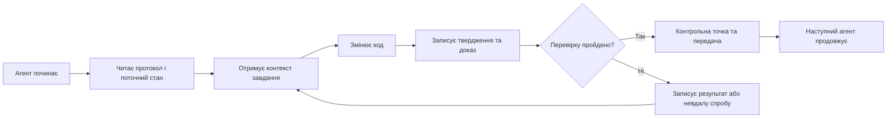

# ArifCE
<p align="center"></p>

[English](README.md) · [简体中文](README.zh-CN.md) · [繁體中文](README.zh-TW.md) · [한국어](README.ko.md) · [Deutsch](README.de.md) · [Español](README.es.md) · [Français](README.fr.md) · [Italiano](README.it.md) · [Dansk](README.da.md) · [日本語](README.ja.md) · [Polski](README.pl.md) · [Русский](README.ru.md) · [Bosanski](README.bs.md) · [العربية](README.ar.md) · [Norsk](README.no.md) · [Português (Brasil)](README.pt-BR.md) · [ไทย](README.th.md) · [Türkçe](README.tr.md) · [Українська](README.uk.md) · [বাংলা](README.bn.md) · [Ελληνικά](README.el.md) · [Tiếng Việt](README.vi.md)

[](https://github.com/seekua/ArifCE/actions/workflows/ci.yml) [](https://github.com/seekua/ArifCE/releases/latest) [](LICENSE)

ArifCE — локальний рівень інтелекту й безперервності проєкту для розробки програмного забезпечення за допомогою ШІ. Він зберігає контекст, рішення, невдалі спроби, докази, стан рефакторингу та дані передачі в репозиторії, щоб Codex, Claude Code, OpenCode і майбутні агенти продовжували ту саму інженерну історію.

> Репозиторій володіє контекстом. Агент лише позичає його.

## Навіщо потрібен ArifCE

Команди розробників втрачають час і довіру, коли важливий контекст існує лише в історії чату, пам’яті окремої людини або інструменті, який наступний учасник не може перевірити. ArifCE робить інженерну безперервність частиною самого проєкту.

Мета не в тому, щоб агенти звучали впевненіше. Вона полягає в тому, щоб кожен учасник розумів, чого прагне команда, чому ухвалено рішення, що справді перевірено і де залишається невизначеність. Коли ця історія зберігається в репозиторії, команди рухаються швидше, не втрачаючи відстежуваності, відповідальності чи довіри.

ArifCE перетворює безперервність на спільну інженерну практику: зосереджений контекст для наступного завдання, явні докази важливих тверджень і чесні передачі, коли робота незавершена.

## Для кого це

ArifCE призначений для інженерних команд із підтримкою ШІ, розробників, які працюють із кодинговими агентами, і супровідників, яким потрібно зберігати контекст проєкту після зміни людини, чату чи сеансу. Особливо корисний він, коли кілька учасників спільно працюють у репозиторії.

## Як працює ArifCE



## Дослідження проєкту

Запустіть локальну панель, щоб отримати візуальний огляд стану проєкту, останніх записів і контексту для пошуку:

```powershell
$env:ARIFCE_PROJECT_ROOT = (Get-Location).Path
dotnet run --project src/ArifCE.Dashboard/ArifCE.Dashboard.csproj
```

Потім відкрийте <http://127.0.0.1:5180/>. Повний посібник продукту дивіться в [центрі документації ArifCE](docs/README.md).

Цей процес зберігає знання проєкту в репозиторії та робить прогрес доступним для перевірки. Практичні переваги:

- Faster onboarding: the next agent reads a focused current state instead of reconstructing a long transcript.
- Safer changes: claims are linked to deterministic evidence and become stale when Git state changes.
- Better continuity: decisions, failed attempts, checkpoints, and handoffs survive agent or session changes.
- Controlled refactors: invariants, inventory, guards, and safe points make incomplete work visible.
- Local-first operation: canonical files remain usable without a cloud service or vendor-specific runtime.

## Не просто пам’ять

ArifCE відстежує суть завдання, зміни та їхні причини, заявлене агентом виконання, докази на підтримку твердження, висновки рецензента, незавершену роботу й відомості для наступного агента. Висловлювання агентів — це твердження, а не факти; перевага надається детермінованим доказам збірки, тестів, Git і пошуку.

Технічна перевірка та приймання продукту розділені: записи приймання вказують, хто схвалив твердження і які поточні докази підтримали рішення.

## Робочий процес V0.1

```text
arifce init
arifce task create "Fix permission cache race"
arifce checkpoint --summary "Reproduction added"
arifce context "finish the permission cache fix" --budget 16000
arifce claim create "Permission cache race is fixed"
arifce verify CLAIM-0001
arifce handoff
```

Канонічні Markdown, YAML, JSON і JSONL зберігаються в `.arifce/`. SQLite — похідний індекс, який можна видалити: видалення `.arifce/index/` і запуск `arifce rebuild` мають зберегти інтелект проєкту.

## Архітектура

The core separates domain rules, canonical storage and indexing, Git observation, retrieval, verification, refactoring, security, and the CLI. Vendor instruction files are small adapters; they never become the canonical memory store. See [architecture overview](docs/architecture/overview.md), [domain model](docs/architecture/domain-model.md), and [V0.1 specification](docs/SPECIFICATION-v0.1.md).

## Встановлення та швидкий старт

V0.2.0 is published as a cross-platform .NET global tool. See [installation](docs/getting-started/installation.md) and the [quick start](docs/getting-started/quick-start.md). From source:

The optional local MCP adapter is documented in [MCP setup](docs/getting-started/mcp.md).

For a complete installation and feature walkthrough, see the [User Guide](docs/USER-GUIDE.md) and [Documentation Policy](docs/DOCUMENTATION-POLICY.md).

### 60-second quick start

```bash
dotnet tool install --global ArifCE.Cli --version 0.2.0
mkdir my-project && cd my-project
git init
arifce init
arifce task create "Ship the first change"
arifce checkpoint --summary "Project context initialized"
arifce handoff
```

You now have a repository-local project state, a task, a checkpoint, and a semantic handoff ready for the next contributor.

```bash
dotnet restore
dotnet build
dotnet test
dotnet run --project src/ArifCE.Cli -- init
```

Run `init` in a new Git repository or `adopt` in an existing one. Both are non-destructive and idempotent. `adopt` records observed structure and labels unknown historical rationale as unknown.

## Безперервність, перевірка та рефакторинг

- A fresh agent reads `AGENTS.md`, `.arifce/PROTOCOL.md`, and `.arifce/CURRENT.md`, then requests task-specific context instead of bulk-loading history.
- Claims link to repository-scoped evidence. Evidence becomes stale when the relevant repository state changes.
- Refactor campaigns track invariants, inventory, guards, progress, and checkpoints. Blocking guards prevent completion.
- Handoffs summarize current engineering state rather than dumping transcripts.

## Безпека та обмеження

Raw transcripts are untrusted and are never bulk-loaded or executed. Import paths redact common secrets; credentials and machine authentication data do not belong in `.arifce/`. V0.1 does not guarantee correctness, token savings, or better review quality. It has no cloud service, UI, vector database, autonomous swarm, or production cross-agent invocation.

See [ROADMAP.md](ROADMAP.md), [SECURITY.md](SECURITY.md), and [CONTRIBUTING.md](CONTRIBUTING.md). The exact implemented command syntax is documented in the [CLI reference](docs/reference/cli.md).

## Ліцензія

ArifCE поширюється за [ліцензією Apache 2.0](LICENSE).
<p align="center"></p>
