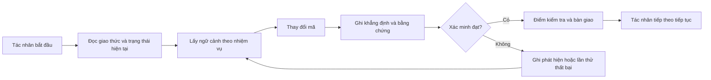

# ArifCE
<p align="center"></p>

[English](README.md) · [简体中文](README.zh-CN.md) · [繁體中文](README.zh-TW.md) · [한국어](README.ko.md) · [Deutsch](README.de.md) · [Español](README.es.md) · [Français](README.fr.md) · [Italiano](README.it.md) · [Dansk](README.da.md) · [日本語](README.ja.md) · [Polski](README.pl.md) · [Русский](README.ru.md) · [Bosanski](README.bs.md) · [العربية](README.ar.md) · [Norsk](README.no.md) · [Português (Brasil)](README.pt-BR.md) · [ไทย](README.th.md) · [Türkçe](README.tr.md) · [Українська](README.uk.md) · [বাংলা](README.bn.md) · [Ελληνικά](README.el.md) · [Tiếng Việt](README.vi.md)

[](https://github.com/seekua/ArifCE/actions/workflows/ci.yml) [](https://github.com/seekua/ArifCE/releases/latest) [](LICENSE)

ArifCE là lớp trí tuệ và liên tục dự án ưu tiên cục bộ cho phát triển phần mềm có AI hỗ trợ. Công cụ lưu giữ ngữ cảnh, quyết định, lần thử thất bại, bằng chứng, trạng thái tái cấu trúc và thông tin bàn giao trong kho mã để Codex, Claude Code, OpenCode và các tác nhân tương lai tiếp tục cùng một câu chuyện kỹ thuật.

> Kho mã sở hữu ngữ cảnh. Tác nhân chỉ mượn nó.

## Vì sao ArifCE tồn tại

Các nhóm phần mềm mất thời gian và niềm tin khi ngữ cảnh quan trọng chỉ nằm trong lịch sử trò chuyện, trí nhớ cá nhân hoặc công cụ mà người đóng góp tiếp theo không thể kiểm tra. ArifCE đưa tính liên tục kỹ thuật vào chính dự án.

Mục tiêu không phải khiến tác nhân nghe chắc chắn hơn, mà giúp mọi người hiểu nhóm đang cố đạt điều gì, vì sao quyết định được đưa ra, điều gì đã thực sự được xác minh và đâu là phần còn bất định. Khi câu chuyện ở lại trong kho mã, nhóm có thể tiến nhanh hơn mà không mất khả năng truy vết, trách nhiệm hay niềm tin.

ArifCE biến tính liên tục thành thực hành kỹ thuật chung: ngữ cảnh tập trung cho nhiệm vụ tiếp theo, bằng chứng rõ ràng cho các khẳng định quan trọng và bàn giao trung thực khi công việc chưa hoàn tất.

## Dành cho ai

ArifCE dành cho nhóm kỹ thuật có AI hỗ trợ, lập trình viên làm việc với tác nhân viết mã và người bảo trì cần ngữ cảnh dự án tồn tại lâu hơn một người, cuộc trò chuyện hoặc phiên làm việc. Công cụ đặc biệt hữu ích khi nhiều người cùng chia sẻ kho mã và cần ghi chép rõ quyết định, xác minh và việc chưa hoàn tất.

## ArifCE hoạt động như thế nào



## Khám phá dự án

Run the local dashboard to get a visual overview of project health, recent records, and searchable context:

```powershell
$env:ARIFCE_PROJECT_ROOT = (Get-Location).Path
dotnet run --project src/ArifCE.Dashboard/ArifCE.Dashboard.csproj
```

Then open <http://127.0.0.1:5180/>. For the complete product handbook, see the [ArifCE documentation hub](docs/README.md).

This workflow keeps project knowledge in the repository and makes progress inspectable. The practical advantages are:

- Faster onboarding: the next agent reads a focused current state instead of reconstructing a long transcript.
- Safer changes: claims are linked to deterministic evidence and become stale when Git state changes.
- Better continuity: decisions, failed attempts, checkpoints, and handoffs survive agent or session changes.
- Controlled refactors: invariants, inventory, guards, and safe points make incomplete work visible.
- Local-first operation: canonical files remain usable without a cloud service or vendor-specific runtime.

## Không chỉ là bộ nhớ

ArifCE tracks what the task was, what changed, why it changed, what an agent claims it completed, what evidence supports that claim, what a reviewer found, what remains unfinished, and what the next agent needs to know. Agent statements are claims, not facts; deterministic build, test, Git, and search evidence is preferred.

Technical verification and product acceptance are separate: acceptance records identify who approved a claim and which current evidence supported that decision.

## Quy trình V0.1

```text
arifce init
arifce task create "Fix permission cache race"
arifce checkpoint --summary "Reproduction added"
arifce context "finish the permission cache fix" --budget 16000
arifce claim create "Permission cache race is fixed"
arifce verify CLAIM-0001
arifce handoff
```

Canonical Markdown, YAML, JSON, and JSONL live under `.arifce/`. SQLite is a disposable derived index: deleting `.arifce/index/` and running `arifce rebuild` must preserve project intelligence.

## Kiến trúc

The core separates domain rules, canonical storage and indexing, Git observation, retrieval, verification, refactoring, security, and the CLI. Vendor instruction files are small adapters; they never become the canonical memory store. See [architecture overview](docs/architecture/overview.md), [domain model](docs/architecture/domain-model.md), and [V0.1 specification](docs/SPECIFICATION-v0.1.md).

## Cài đặt và bắt đầu nhanh

V0.2.0 is published as a cross-platform .NET global tool. See [installation](docs/getting-started/installation.md) and the [quick start](docs/getting-started/quick-start.md). From source:

The optional local MCP adapter is documented in [MCP setup](docs/getting-started/mcp.md).

For a complete installation and feature walkthrough, see the [User Guide](docs/USER-GUIDE.md) and [Documentation Policy](docs/DOCUMENTATION-POLICY.md).

### 60-second quick start

```bash
dotnet tool install --global ArifCE.Cli --version 0.2.0
mkdir my-project && cd my-project
git init
arifce init
arifce task create "Ship the first change"
arifce checkpoint --summary "Project context initialized"
arifce handoff
```

You now have a repository-local project state, a task, a checkpoint, and a semantic handoff ready for the next contributor.

```bash
dotnet restore
dotnet build
dotnet test
dotnet run --project src/ArifCE.Cli -- init
```

Run `init` in a new Git repository or `adopt` in an existing one. Both are non-destructive and idempotent. `adopt` records observed structure and labels unknown historical rationale as unknown.

## Tính liên tục, xác minh và tái cấu trúc

- A fresh agent reads `AGENTS.md`, `.arifce/PROTOCOL.md`, and `.arifce/CURRENT.md`, then requests task-specific context instead of bulk-loading history.
- Claims link to repository-scoped evidence. Evidence becomes stale when the relevant repository state changes.
- Refactor campaigns track invariants, inventory, guards, progress, and checkpoints. Blocking guards prevent completion.
- Handoffs summarize current engineering state rather than dumping transcripts.

## Bảo mật và giới hạn

Raw transcripts are untrusted and are never bulk-loaded or executed. Import paths redact common secrets; credentials and machine authentication data do not belong in `.arifce/`. V0.1 does not guarantee correctness, token savings, or better review quality. It has no cloud service, UI, vector database, autonomous swarm, or production cross-agent invocation.

See [ROADMAP.md](ROADMAP.md), [SECURITY.md](SECURITY.md), and [CONTRIBUTING.md](CONTRIBUTING.md). The exact implemented command syntax is documented in the [CLI reference](docs/reference/cli.md).

## Giấy phép

ArifCE được cấp phép theo [Apache License 2.0](LICENSE).
<p align="center"></p>
