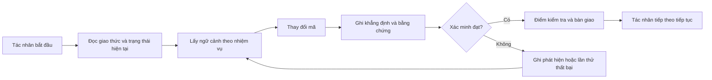

# ArifCE
<p align="center"></p>

[English](README.md) · [简体中文](README.zh-CN.md) · [繁體中文](README.zh-TW.md) · [한국어](README.ko.md) · [Deutsch](README.de.md) · [Español](README.es.md) · [Français](README.fr.md) · [Italiano](README.it.md) · [Dansk](README.da.md) · [日本語](README.ja.md) · [Polski](README.pl.md) · [Русский](README.ru.md) · [Bosanski](README.bs.md) · [العربية](README.ar.md) · [Norsk](README.no.md) · [Português (Brasil)](README.pt-BR.md) · [ไทย](README.th.md) · [Türkçe](README.tr.md) · [Українська](README.uk.md) · [বাংলা](README.bn.md) · [Ελληνικά](README.el.md) · [Tiếng Việt](README.vi.md)

**
Agent thay đổi. Dự án của bạn không nên quên.
**

> 
Repository sở hữu ngữ cảnh. Agent chỉ mượn nó.

[](https://github.com/seekua/ArifCE/actions/workflows/ci.yml) [](https://github.com/seekua/ArifCE/releases/latest) [](LICENSE)

ArifCE là lớp trí tuệ và liên tục dự án ưu tiên cục bộ cho phát triển phần mềm có AI hỗ trợ. Công cụ lưu giữ ngữ cảnh, quyết định, lần thử thất bại, bằng chứng, trạng thái tái cấu trúc và thông tin bàn giao trong kho mã để Codex, Claude Code, OpenCode và các tác nhân tương lai tiếp tục cùng một câu chuyện kỹ thuật.


## Vì sao ArifCE tồn tại

Các nhóm phần mềm mất thời gian và niềm tin khi ngữ cảnh quan trọng chỉ nằm trong lịch sử trò chuyện, trí nhớ cá nhân hoặc công cụ mà người đóng góp tiếp theo không thể kiểm tra. ArifCE đưa tính liên tục kỹ thuật vào chính dự án.

Mục tiêu không phải khiến tác nhân nghe chắc chắn hơn, mà giúp mọi người hiểu nhóm đang cố đạt điều gì, vì sao quyết định được đưa ra, điều gì đã thực sự được xác minh và đâu là phần còn bất định. Khi câu chuyện ở lại trong kho mã, nhóm có thể tiến nhanh hơn mà không mất khả năng truy vết, trách nhiệm hay niềm tin.

ArifCE biến tính liên tục thành thực hành kỹ thuật chung: ngữ cảnh tập trung cho nhiệm vụ tiếp theo, bằng chứng rõ ràng cho các khẳng định quan trọng và bàn giao trung thực khi công việc chưa hoàn tất.

## Dành cho ai

ArifCE dành cho nhóm kỹ thuật có AI hỗ trợ, lập trình viên làm việc với tác nhân viết mã và người bảo trì cần ngữ cảnh dự án tồn tại lâu hơn một người, cuộc trò chuyện hoặc phiên làm việc. Công cụ đặc biệt hữu ích khi nhiều người cùng chia sẻ kho mã và cần ghi chép rõ quyết định, xác minh và việc chưa hoàn tất.

## ArifCE hoạt động như thế nào



## Khám phá dự án

Chạy dashboard cục bộ để xem tổng quan trực quan về tình trạng dự án, các bản ghi gần đây và ngữ cảnh có thể tìm kiếm:

```powershell
$env:ARIFCE_PROJECT_ROOT = (Get-Location).Path
dotnet run --project src/ArifCE.Dashboard/ArifCE.Dashboard.csproj
```

Sau đó mở <http://127.0.0.1:5180/>. Để xem sổ tay sản phẩm đầy đủ, hãy truy cập [trung tâm tài liệu ArifCE](docs/README.md).

Quy trình này lưu giữ kiến thức dự án trong repository và giúp kiểm tra tiến độ. Các lợi ích thực tế gồm:

- Bắt đầu nhanh hơn: agent tiếp theo đọc trạng thái hiện tại đã được tập trung thay vì dựng lại một bản ghi dài.
- Thay đổi an toàn hơn: các tuyên bố liên kết với bằng chứng xác định và trở nên lỗi thời khi trạng thái Git thay đổi.
- Tính liên tục tốt hơn: quyết định, lần thử thất bại, checkpoint và bàn giao vẫn tồn tại khi đổi agent hoặc phiên làm việc.
- Refactor có kiểm soát: bất biến, kiểm kê, guard và điểm an toàn làm lộ rõ phần việc chưa hoàn tất.
- Vận hành local-first: các tệp chuẩn vẫn dùng được mà không cần dịch vụ đám mây hay runtime riêng của nhà cung cấp.

## Không chỉ là bộ nhớ

ArifCE theo dõi nhiệm vụ, những gì đã thay đổi và lý do, điều agent tuyên bố đã hoàn thành, bằng chứng hỗ trợ, phát hiện của người đánh giá, phần còn dang dở và thông tin agent tiếp theo cần biết. Phát biểu của agent là tuyên bố chứ không phải sự thật; nên ưu tiên bằng chứng xác định từ build, test, Git và tìm kiếm.

Xác minh kỹ thuật và nghiệm thu sản phẩm là hai việc riêng: bản ghi nghiệm thu cho biết ai phê duyệt tuyên bố và bằng chứng hiện tại nào hỗ trợ quyết định đó.

## Quy trình V0.1

```text
arifce init
arifce task create "Fix permission cache race"
arifce checkpoint --summary "Reproduction added"
arifce context "finish the permission cache fix" --budget 16000
arifce claim create "Permission cache race is fixed"
arifce verify CLAIM-0001
arifce handoff
```

Markdown, YAML, JSON và JSONL chuẩn nằm trong `.arifce/`. SQLite là chỉ mục dẫn xuất có thể xóa: xóa `.arifce/index/` rồi chạy `arifce rebuild` vẫn phải giữ nguyên tri thức dự án.

## Kiến trúc

Lõi hệ thống tách biệt quy tắc miền, lưu trữ và lập chỉ mục chuẩn, quan sát Git, truy xuất, xác minh, refactor, bảo mật và CLI. Tệp hướng dẫn của nhà cung cấp chỉ là các adapter nhỏ, không bao giờ trở thành kho bộ nhớ chuẩn. Xem [tổng quan kiến trúc](docs/architecture/overview.md), [mô hình miền](docs/architecture/domain-model.md) và [đặc tả V0.1](docs/SPECIFICATION-v0.1.md).

## Cài đặt và bắt đầu nhanh

V0.2.0 được phát hành dưới dạng công cụ .NET toàn cục đa nền tảng. Xem [cài đặt](docs/getting-started/installation.md) và [bắt đầu nhanh](docs/getting-started/quick-start.md). Từ mã nguồn:

Adapter MCP cục bộ tùy chọn được mô tả trong [thiết lập MCP](docs/getting-started/mcp.md).

Để xem hướng dẫn cài đặt và toàn bộ tính năng, hãy đọc [Hướng dẫn người dùng](docs/USER-GUIDE.md) và [Chính sách tài liệu](docs/DOCUMENTATION-POLICY.md).

### 60-second quick start

```bash
dotnet tool install --global ArifCE.Cli --version 0.2.0
mkdir my-project && cd my-project
git init
arifce init
arifce task create "Ship the first change"
arifce checkpoint --summary "Project context initialized"
arifce handoff
```

Giờ đây bạn có trạng thái dự án cục bộ trong repository, một nhiệm vụ, một checkpoint và một bàn giao ngữ nghĩa sẵn sàng cho người đóng góp tiếp theo.

```bash
dotnet restore
dotnet build
dotnet test
dotnet run --project src/ArifCE.Cli -- init
```

Chạy `init` trong repository Git mới hoặc `adopt` trong repository hiện có. Cả hai đều không phá hủy dữ liệu và có tính lặp an toàn. `adopt` ghi lại cấu trúc quan sát được và đánh dấu lý do lịch sử chưa biết là chưa biết.

## Tính liên tục, xác minh và tái cấu trúc

- Agent mới đọc `AGENTS.md`, `.arifce/PROTOCOL.md` và `.arifce/CURRENT.md`, sau đó yêu cầu ngữ cảnh theo nhiệm vụ thay vì tải hàng loạt lịch sử.
- Tuyên bố liên kết với bằng chứng trong repository. Bằng chứng trở nên lỗi thời khi trạng thái repository liên quan thay đổi.
- Chiến dịch refactor theo dõi bất biến, kiểm kê, guard, tiến độ và checkpoint. Guard chặn sẽ ngăn hoàn tất.
- Bàn giao tóm tắt trạng thái kỹ thuật hiện tại thay vì đổ toàn bộ transcript.

## Bảo mật và giới hạn

Transcript thô không đáng tin cậy và không bao giờ được tải hàng loạt hoặc thực thi. Đường dẫn import che giấu các bí mật phổ biến; thông tin xác thực và dữ liệu xác thực máy không thuộc `.arifce/`. V0.1 không đảm bảo tính đúng đắn, tiết kiệm token hay chất lượng review tốt hơn. Phiên bản này không có dịch vụ đám mây, UI, cơ sở dữ liệu vector, swarm tự trị hay lời gọi agent chéo trong production.

Xem [ROADMAP.md](ROADMAP.md), [SECURITY.md](SECURITY.md) và [CONTRIBUTING.md](CONTRIBUTING.md). Cú pháp lệnh được triển khai chính xác được ghi trong [tài liệu tham khảo CLI](docs/reference/cli.md).

## Giấy phép

ArifCE được cấp phép theo [Apache License 2.0](LICENSE).