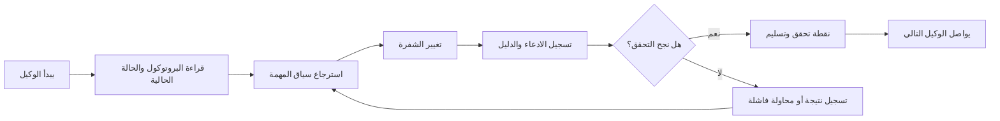

# ArifCE
<p align="center"></p>

[English](../../README.md) · [简体中文](README.zh-CN.md) · [繁體中文](README.zh-TW.md) · [한국어](README.ko.md) · [Deutsch](README.de.md) · [Español](README.es.md) · [Français](README.fr.md) · [Italiano](README.it.md) · [Dansk](README.da.md) · [日本語](README.ja.md) · [Polski](README.pl.md) · [Русский](README.ru.md) · [Bosanski](README.bs.md) · [العربية](README.ar.md) · [Norsk](README.no.md) · [Português (Brasil)](README.pt-BR.md) · [ไทย](README.th.md) · [Türkçe](README.tr.md) · [Українська](README.uk.md) · [বাংলা](README.bn.md) · [Ελληνικά](README.el.md) · [Tiếng Việt](README.vi.md)

**الوكلاء يتغيرون. يجب ألا ينسى مشروعك.**


[](https://github.com/seekua/ArifCE/actions/workflows/ci.yml) [](https://github.com/seekua/ArifCE/releases/latest) [](../../LICENSE)

ArifCE هي طبقة محلية أولاً لذكاء المشروع واستمراريته في تطوير البرمجيات بمساعدة الذكاء الاصطناعي. تحتفظ بالسياق والقرارات والمحاولات الفاشلة والأدلة وحالة إعادة الهيكلة ومعلومات التسليم مع المستودع، كي يتمكن Codex وClaude Code وOpenCode والوكلاء المستقبليون من متابعة القصة الهندسية نفسها.

> المستودع يملك السياق. الوكيل يستعيره فقط.


## لماذا توجد ArifCE

تفقد فرق البرمجيات الوقت والثقة عندما يعيش السياق المهم فقط في سجل المحادثة أو ذاكرة فردية أو أداة لا يستطيع المساهم التالي فحصها. وُجدت ArifCE لجعل الاستمرارية الهندسية جزءاً من المشروع نفسه.

الهدف ليس جعل الوكلاء يبدون أكثر يقيناً، بل مساعدة كل مساهم على فهم ما يحاول الفريق إنجازه، وسبب اتخاذ القرار، وما تم التحقق منه فعلياً، وأين ما زال عدم اليقين قائماً. عندما تبقى هذه القصة مع المستودع، تستطيع الفرق التحرك أسرع من دون التخلي عن قابلية التتبع أو الملكية أو الثقة.

تحول ArifCE الاستمرارية إلى ممارسة هندسية مشتركة: سياق مركز للمهمة التالية، وأدلة صريحة للادعاءات المهمة، وتسليمات صادقة عندما يكون العمل غير مكتمل.

## لمن صُممت

صُممت ArifCE لفرق الهندسة المدعومة بالذكاء الاصطناعي، والمطورين الذين يعملون مع وكلاء البرمجة، والمشرفين الذين يحتاجون إلى بقاء سياق المشروع بعد شخص أو محادثة أو جلسة واحدة. وتفيد خصوصاً عندما يتشارك عدة مساهمين مستودعاً ويحتاجون إلى سجل واضح للقرارات والتحقق والعمل غير المنجز.

## كيف تعمل ArifCE



## استكشاف المشروع

شغّل لوحة المعلومات المحلية للحصول على نظرة مرئية عن صحة المشروع والسجلات الأخيرة والسياق القابل للبحث:

```powershell
$env:ARIFCE_PROJECT_ROOT = (Get-Location).Path
dotnet run --project src/ArifCE.Dashboard/ArifCE.Dashboard.csproj
```

ثم افتح <http://127.0.0.1:5180/>. وللاطلاع على دليل المنتج الكامل، راجع [مركز توثيق ArifCE](../README.md).

يحافظ هذا التدفق على معرفة المشروع داخل المستودع ويجعل التقدم قابلاً للفحص. ومن مزاياه العملية:

- تهيئة أسرع: يقرأ الوكيل التالي الحالة الحالية المركزة بدلاً من إعادة بناء سجل طويل.
- تغييرات أكثر أماناً: ترتبط الادعاءات بأدلة حتمية وتصبح قديمة عند تغير حالة Git.
- استمرارية أفضل: تبقى القرارات والمحاولات الفاشلة ونقاط التحقق والتسليمات بعد تغير الوكيل أو الجلسة.
- إعادة هيكلة مضبوطة: تجعل الثوابت والجرد والحواجز ونقاط الأمان العمل غير المكتمل مرئياً.
- تشغيل محلي أولاً: تبقى الملفات الأساسية قابلة للاستخدام دون خدمة سحابية أو بيئة خاصة بمورّد.

## أكثر من مجرد ذاكرة

تتتبع ArifCE ماهية المهمة وما الذي تغير ولماذا، وما يدعي الوكيل إكماله، وما الدليل الداعم لذلك الادعاء، وما وجده المراجع، وما بقي غير مكتمل، وما يحتاج الوكيل التالي إلى معرفته. تصريحات الوكيل ادعاءات وليست حقائق؛ وتُفضّل أدلة البناء والاختبار وGit والبحث الحتمية.

التحقق التقني وقبول المنتج منفصلان: تحدد سجلات القبول من وافق على الادعاء وأي دليل حالي دعم القرار.

## تدفق العمل في V0.1

```text
arifce init
arifce task create "Fix permission cache race"
arifce checkpoint --summary "Reproduction added"
arifce context "finish the permission cache fix" --budget 16000
arifce claim create "Permission cache race is fixed"
arifce verify CLAIM-0001
arifce handoff
```

توجد ملفات Markdown وYAML وJSON وJSONL الأساسية ضمن `.arifce/`. أما SQLite فهو فهرس مشتق قابل للحذف؛ ويجب أن يحافظ حذف `.arifce/index/` وتشغيل `arifce rebuild` على ذكاء المشروع.

## البنية

يفصل القلب بين قواعد المجال والتخزين والفهرسة الأساسية ومراقبة Git والاسترجاع والتحقق وإعادة الهيكلة والأمان وواجهة CLI. ملفات تعليمات المورّد محولات صغيرة ولا تصبح أبداً مخزن الذاكرة الأساسي. راجع [نظرة عامة على البنية](../architecture/overview.md) و[نموذج المجال](../architecture/domain-model.md) و[مواصفة V0.1](../SPECIFICATION-v0.1.md).

## التثبيت والبدء السريع

تم نشر V0.2.0 كأداة .NET عامة متعددة المنصات. راجع [التثبيت](../getting-started/installation.md) و[البدء السريع](../getting-started/quick-start.md). ومن المصدر:

موثّق المحول المحلي الاختياري لـ MCP في [إعداد MCP](../getting-started/mcp.md).

للحصول على شرح كامل للتثبيت والميزات، راجع [دليل المستخدم](../USER-GUIDE.md) و[سياسة التوثيق](../DOCUMENTATION-POLICY.md).

### بدء سريع خلال 60 ثانية

```bash
dotnet tool install --global ArifCE.Cli --version 0.2.0
mkdir my-project && cd my-project
git init
arifce init
arifce task create "Ship the first change"
arifce checkpoint --summary "Project context initialized"
arifce handoff
```

لديك الآن حالة مشروع محلية للمستودع ومهمة ونقطة تحقق وتسليم دلالي جاهز للمساهم التالي.

إذا كان لديك مستودع Git موجود بالفعل، فانتقل إليه وسجّل بنيته باستخدام `adopt`:

```bash
cd path/to/existing-repo
arifce adopt
arifce task create "Ship the first change"
arifce handoff
```

```bash
dotnet restore
dotnet build
dotnet test
dotnet run --project src/ArifCE.Cli -- init
```

شغّل `init` في مستودع Git جديد أو `adopt` في مستودع موجود. كلاهما غير تدميري وقابل للتكرار بأمان. يسجل `adopt` البنية المرصودة ويضع علامة «غير معروف» على الأسباب التاريخية غير المعروفة.

## الاستمرارية والتحقق وإعادة الهيكلة

- يقرأ الوكيل الجديد `AGENTS.md` و`.arifce/PROTOCOL.md` و`.arifce/CURRENT.md`، ثم يطلب سياقاً خاصاً بالمهمة بدلاً من تحميل السجل كاملاً.
- ترتبط الادعاءات بأدلة محددة للمستودع. تصبح الأدلة قديمة عند تغير حالة المستودع المعنية.
- تتتبع حملات إعادة الهيكلة الثوابت والجرد والحواجز والتقدم ونقاط التحقق. وتمنع الحواجز الحاجبة الإكمال.
- تلخص التسليمات الحالة الهندسية الحالية بدلاً من إغراق المساهم بسجلات المحادثات.

## الأمان والقيود

السجلات الخام غير موثوقة ولا تُحمّل جماعياً ولا تُنفّذ أبداً. تحجب مسارات الاستيراد الأسرار الشائعة؛ ولا مكان لبيانات الاعتماد أو مصادقة الجهاز داخل `.arifce/`. لا تضمن V0.1 الصحة أو توفير الرموز أو تحسين جودة المراجعة. ولا تتضمن خدمة سحابية أو واجهة مستخدم أو قاعدة بيانات متجهات أو سرباً ذاتياً أو استدعاءً إنتاجياً بين الوكلاء.

راجع [ROADMAP.md](../../ROADMAP.md) و[SECURITY.md](../../SECURITY.md) و[CONTRIBUTING.md](../../CONTRIBUTING.md). وتوثق [مرجعية CLI](../reference/cli.md) الصياغة الدقيقة للأوامر المنفذة.

## الترخيص

تخضع ArifCE لـ [ترخيص Apache 2.0](../../LICENSE).
### متابعة مهمة باستخدام Ollama أو LM Studio

تحتفظ ArifCE بسجلات المشروع الأساسية داخل المستودع. يتلقى المزود نص الطلب والسياق المحدد؛ أما مزودو السحابة فيتلقون ذلك المحتوى المحدد عن بُعد. يضيف الخيار `--with-context` سجلات المشروع التي تختارها ArifCE، لكنه لا يقرأ ملفات المصدر. تضع الأمثلة أدناه محتوى ملف الترحيل صراحةً في الطلب كي يتلقى النموذج الشيفرة المطلوب منه مراجعتها. اختر المثال المناسب لصدفتك.

قبل استخدام أي من المثالين، ثبّت Ollama وشغّله. ينزّل الأمر الأول النموذج `llama3`؛ واترك خدمة Ollama تعمل على نقطة النهاية المحلية المحددة أدناه.

```bash
ollama pull llama3
arifce llm provider add ollama Ollama llama3 --endpoint http://127.0.0.1:11434
arifce llm provider test ollama
task_id="$(arifce task create "Review and safely update the migration")"
migration_source="$(cat path/to/migration.sql)"
prompt="Review only this SQL migration for data-loss risks. Do not infer unseen source. Suggest the smallest safe change if needed.
Migration source:
$migration_source"
arifce llm run "Review and safely update the migration" "$prompt" --with-context --budget 2000
```

```powershell
ollama pull llama3
arifce llm provider add ollama Ollama llama3 --endpoint http://127.0.0.1:11434
arifce llm provider test ollama
$taskId = arifce task create "Review and safely update the migration"
$migrationSource = Get-Content -Raw -LiteralPath "path/to/migration.sql"
$prompt = @"
Review only this SQL migration for data-loss risks. Do not infer unseen source. Suggest the smallest safe change if needed.
Migration source:
$migrationSource
"@
arifce llm run "Review and safely update the migration" $prompt --with-context --budget 2000
```

راجع رد النموذج وطبّق أي تعديل في واجهة البرمجة التي تستخدمها، ثم شغّل اختبارات الانحدار الخاصة بالترحيل. بعد نجاحها، سجّل كادعاء فقط ما يثبته أمر الاختبار:

```bash
claim_id="$(arifce claim create "Migration regression tests pass" --task "$task_id")"
arifce verify "$claim_id" --command "dotnet test path/to/migration-tests.csproj"
arifce handoff
```

في PowerShell:

```powershell
$claimId = arifce claim create "Migration regression tests pass" --task $taskId
arifce verify $claimId --command "dotnet test path/to/migration-tests.csproj"
arifce handoff
```

تدعم نتيجة الاختبار ادعاء اجتياز الاختبارات؛ لكنها لا تثبت وحدها أن مراجعة النموذج كانت كاملة أو صحيحة. استبدل المسارات وأمر الاختبار بأوامر مستودعك. لاستخدام LM Studio، حدّد اسم النموذج المحمّل ونقطة النهاية المتوافقة مع OpenAI، وعادةً ما تكون `http://127.0.0.1:1234/v1`، في الأمر `arifce llm provider add lmstudio LmStudio your-loaded-model --endpoint http://127.0.0.1:1234/v1`.

يتبع ذلك المهمة نفسها ومصدر الشيفرة وأدلة الاختبار والتسليم.

يتطلب تشغيل المراجع موافقة صريحة. يشرح [مرجع مزوّدي LLM](../reference/LLM-PROVIDERS.md) الرجوع إلى مزود بديل، وحساب الرموز والتكلفة، والأدلة الأساسية، والتضمينات، ومقاييس المعايير، وأدوات MCP، ولوحة التحكم المحلية.

شغّل `init` في مستودع Git جديد أو `adopt` في مستودع موجود. كلاهما آمن عند التكرار ولا يتلف المحتوى؛ ويسجل `adopt` البنية المرصودة ويصنف أسباب القرارات التاريخية غير المعروفة على أنها غير معروفة.
### From source

```bash
git clone https://github.com/seekua/ArifCE.git
cd ArifCE
dotnet restore ArifCE.slnx
dotnet build ArifCE.slnx --configuration Release --no-restore
dotnet test ArifCE.slnx --configuration Release --no-build --no-restore
```
