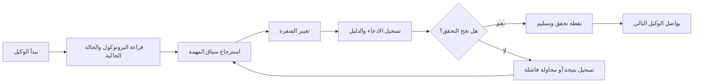

# ArifCE
<p align="center"></p>

**اقرأ بلغة أخرى.**

[English](../../README.md) · [简体中文](README.zh-CN.md) · [繁體中文](README.zh-TW.md) · [한국어](README.ko.md) · [Deutsch](README.de.md) · [Español](README.es.md) · [Français](README.fr.md) · [Italiano](README.it.md) · [Dansk](README.da.md) · [日本語](README.ja.md) · [Polski](README.pl.md) · [Русский](README.ru.md) · [Bosanski](README.bs.md) · [العربية](README.ar.md) · [Norsk](README.no.md) · [Português (Brasil)](README.pt-BR.md) · [ไทย](README.th.md) · [Türkçe](README.tr.md) · [Українська](README.uk.md) · [বাংলা](README.bn.md) · [Ελληνικά](README.el.md) · [Tiếng Việt](README.vi.md)

**الوكلاء يتغيرون. يجب ألا ينسى مشروعك.**


[](https://github.com/seekua/ArifCE/actions/workflows/ci.yml) [](https://github.com/seekua/ArifCE/releases/latest) [](../../LICENSE)

ArifCE هي طبقة محلية أولاً لذكاء المشروع واستمراريته في تطوير البرمجيات بمساعدة الذكاء الاصطناعي. تحتفظ بالسياق والقرارات والمحاولات الفاشلة والأدلة وحالة إعادة الهيكلة ومعلومات التسليم مع المستودع، كي يتمكن Codex وClaude Code وOpenCode والوكلاء المستقبليون من متابعة القصة الهندسية نفسها.

> المستودع يملك السياق. الوكيل يستعيره فقط.

**هل انتهى حد الاستخدام الخاص بك؟ أكمل العمل عبر أمرين.**

بعد إنجاز عمل فعلي ضمن مهمة قائمة، قم بتسجيل عملية "تسليم العمل" (handoff) قبل التوقف.

```bash
arifce handoff --task TASK-0031

# When you return with Codex, Claude Code, OpenCode, or a local model:
arifce context --task TASK-0031 --budget 2000
```

تتضمن عملية التسليم: الهدف، والعمل المنجز، والأدلة المُتحقَّق منها، والعناصر غير المحلولة، والإخفاقات، والإجراء التالي. انسخ مخرجات السياق المطبوعة وضعها في موجه بدء التشغيل للوكيل (agent) الجديد؛ إذ لا تقوم واجهة سطر الأوامر (CLI) بإدراج السياق تلقائياً في جلسة النموذج.

## التثبيت والبدء السريع

[GitHub Releases](https://github.com/seekua/ArifCE/releases/tag/v0.8.1): قم بتنزيل الحزمة المستقلة (self-contained archive) الخاصة بنظام تشغيلك من قسم الإصدارات في GitHub، ثم استخرج محتوياتها وأضف `arifce` إلى مسار النظام (`PATH`). في نظام Linux، تأكد من الحفاظ على صلاحية التنفيذ (executable permission) عند الاستخراج، أو نفّذ الأمر `chmod +x arifce`. لا يتطلب الأمر تثبيت .NET أو Node أو Python أو Docker أو قواعد بيانات بشكل منفصل.

لمشروع جديد:

```bash
mkdir my-project && cd my-project
git init
arifce init
arifce task create "Ship the first change"
arifce handoff
```

لمستودع Git موجود مسبقاً:

```bash
cd path/to/existing-repo
arifce adopt
arifce task create "Ship the first change"
arifce handoff
```

استخدم الأمر `adopt` عندما يحتوي المستودع بالفعل على كود برمجي؛ حيث يقوم بتسجيل البنية المكتشفة دون الكتابة فوقها، ثم يوفر للوكيل التالي نقطة انطلاق خاصة بالمشروع. [التثبيت والبدء السريع](../getting-started/installation.md).

## لماذا توجد ArifCE

تفقد فرق البرمجيات الوقت والثقة عندما يعيش السياق المهم فقط في سجل المحادثة أو ذاكرة فردية أو أداة لا يستطيع المساهم التالي فحصها. وُجدت ArifCE لجعل الاستمرارية الهندسية جزءاً من المشروع نفسه.

الهدف ليس جعل الوكلاء يبدون أكثر يقيناً، بل مساعدة كل مساهم على فهم ما يحاول الفريق إنجازه، وسبب اتخاذ القرار، وما تم التحقق منه فعلياً، وأين ما زال عدم اليقين قائماً. عندما تبقى هذه القصة مع المستودع، تستطيع الفرق التحرك أسرع من دون التخلي عن قابلية التتبع أو الملكية أو الثقة.

تحول ArifCE الاستمرارية إلى ممارسة هندسية مشتركة: سياق مركز للمهمة التالية، وأدلة صريحة للادعاءات المهمة، وتسليمات صادقة عندما يكون العمل غير مكتمل.

**لمن صُممت.**

صُممت ArifCE لفرق الهندسة المدعومة بالذكاء الاصطناعي، والمطورين الذين يعملون مع وكلاء البرمجة، والمشرفين الذين يحتاجون إلى بقاء سياق المشروع بعد شخص أو محادثة أو جلسة واحدة. وتفيد خصوصاً عندما يتشارك عدة مساهمين مستودعاً ويحتاجون إلى سجل واضح للقرارات والتحقق والعمل غير المنجز.

## كيف تعمل ArifCE


```mermaid
flowchart LR
    A[يبدأ الوكيل] --> B[قراءة البروتوكول والحالة الحالية]
    B --> C[استرجاع سياق المهمة]
    C --> D[تغيير الشفرة]
    D --> E[تسجيل الادعاء والدليل]
    E --> F{هل نجح التحقق؟}
    F -- نعم --> G[نقطة تحقق وتسليم]
    F -- لا --> H[تسجيل نتيجة أو محاولة فاشلة]
    H --> C
    G --> I[يواصل الوكيل التالي]
```

## استكشاف المشروع

شغّل لوحة المعلومات المحلية للحصول على نظرة مرئية عن صحة المشروع والسجلات الأخيرة والسياق القابل للبحث: يستخدم أمر المطور هذا حزمة تطوير البرمجيات .NET SDK؛ في حين أن تثبيت الإصدار المستقل المذكور أعلاه لا يتطلبها.

### معاينة لوحة المعلومات

<p align="center">
  
  
  
</p>

```powershell
$env:ARIFCE_PROJECT_ROOT = (Get-Location).Path
dotnet run --project src/ArifCE.Dashboard/ArifCE.Dashboard.csproj
```

ثم افتح <http://127.0.0.1:5180/>. وللاطلاع على دليل المنتج الكامل، راجع [مركز توثيق ArifCE](../README.md).

يحافظ هذا التدفق على معرفة المشروع داخل المستودع ويجعل التقدم قابلاً للفحص. ومن مزاياه العملية:

- تهيئة أسرع: يقرأ الوكيل التالي الحالة الحالية المركزة بدلاً من إعادة بناء سجل طويل.
- تغييرات أكثر أماناً: ترتبط الادعاءات بأدلة حتمية وتصبح قديمة عند تغير حالة Git.
- استمرارية أفضل: تبقى القرارات والمحاولات الفاشلة ونقاط التحقق والتسليمات بعد تغير الوكيل أو الجلسة.
- إعادة هيكلة مضبوطة: تجعل الثوابت والجرد والحواجز ونقاط الأمان العمل غير المكتمل مرئياً.
- تشغيل محلي أولاً: تبقى الملفات الأساسية قابلة للاستخدام دون خدمة سحابية أو بيئة خاصة بمورّد.

## أكثر من مجرد ذاكرة

تتتبع ArifCE ماهية المهمة وما الذي تغير ولماذا، وما يدعي الوكيل إكماله، وما الدليل الداعم لذلك الادعاء، وما وجده المراجع، وما بقي غير مكتمل، وما يحتاج الوكيل التالي إلى معرفته. تصريحات الوكيل ادعاءات وليست حقائق؛ وتُفضّل أدلة البناء والاختبار وGit والبحث الحتمية.

التحقق التقني وقبول المنتج منفصلان: تحدد سجلات القبول من وافق على الادعاء وأي دليل حالي دعم القرار.

## سير العمل الأساسي

```text
arifce init
arifce task create "Fix permission cache race"
arifce checkpoint --summary "Reproduction added"
arifce context "finish the permission cache fix" --budget 16000
arifce claim create "Permission cache race is fixed"
arifce verify CLAIM-0001
arifce handoff
```

توجد ملفات Markdown وYAML وJSON وJSONL الأساسية ضمن `.arifce/`. أما SQLite فهو فهرس مشتق قابل للحذف؛ ويجب أن يحافظ حذف `.arifce/index/` وتشغيل `arifce rebuild` على ذكاء المشروع.

## البنية

يفصل القلب بين قواعد المجال والتخزين والفهرسة الأساسية ومراقبة Git والاسترجاع والتحقق وإعادة الهيكلة والأمان وواجهة CLI. ملفات تعليمات المورّد محولات صغيرة ولا تصبح أبداً مخزن الذاكرة الأساسي. راجع [نظرة عامة على البنية](../architecture/overview.md) و[نموذج المجال](../architecture/domain-model.md) و[مواصفة V0.1](../SPECIFICATION-v0.1.md).

**التطوير من المصدر. الإصدار الحالي هو V0.8.1. للتطوير من المصدر، راجع تعليمات التثبيت ودليل البدء السريع.** [التثبيت والبدء السريع](../getting-started/installation.md) · [البدء السريع](../getting-started/quick-start.md).

```bash
git clone https://github.com/seekua/ArifCE.git
cd ArifCE
dotnet restore ArifCE.slnx
dotnet build ArifCE.slnx --configuration Release --no-restore
dotnet test ArifCE.slnx --configuration Release --no-build --no-restore
```

موثّق المحول المحلي الاختياري لـ MCP في [إعداد MCP](../getting-started/mcp.md).

للحصول على شرح كامل للتثبيت والميزات، راجع [دليل المستخدم](../USER-GUIDE.md) و[سياسة التوثيق](../DOCUMENTATION-POLICY.md).

تُنشئ أوامر التثبيت والبدء المذكورة أعلاه حالة مشروع محلية خاصة بالمستودع، ومهمة، وعملية تسليم جاهزة للمساهم التالي.

### متابعة مهمة باستخدام Ollama أو LM Studio

تحتفظ ArifCE بسجلات المشروع الأساسية داخل المستودع. يتلقى المزود نص الطلب والسياق المحدد؛ أما مزودو السحابة فيتلقون ذلك المحتوى المحدد عن بُعد. يضيف الخيار `--with-context` سجلات المشروع التي تختارها ArifCE، لكنه لا يقرأ ملفات المصدر. تضع الأمثلة أدناه محتوى ملف الترحيل صراحةً في الطلب كي يتلقى النموذج الشيفرة المطلوب منه مراجعتها. اختر المثال المناسب لصدفتك.

قبل استخدام أي من المثالين، ثبّت Ollama وشغّله. ينزّل الأمر الأول النموذج `llama3`؛ واترك خدمة Ollama تعمل على نقطة النهاية المحلية المحددة أدناه.

```bash
ollama pull llama3
arifce llm provider add ollama Ollama llama3 --endpoint http://127.0.0.1:11434
arifce llm provider test ollama
task_id="$(arifce task create "Review and safely update the migration")"
migration_source="$(cat path/to/migration.sql)"
prompt="Review only this SQL migration for data-loss risks. Do not infer unseen source. Suggest the smallest safe change if needed.
Migration source:
$migration_source"
arifce llm run "Review and safely update the migration" "$prompt" --with-context --budget 2000
```

```powershell
ollama pull llama3
arifce llm provider add ollama Ollama llama3 --endpoint http://127.0.0.1:11434
arifce llm provider test ollama
$taskId = arifce task create "Review and safely update the migration"
$migrationSource = Get-Content -Raw -LiteralPath "path/to/migration.sql"
$prompt = @"
Review only this SQL migration for data-loss risks. Do not infer unseen source. Suggest the smallest safe change if needed.
Migration source:
$migrationSource
"@
arifce llm run "Review and safely update the migration" $prompt --with-context --budget 2000
```

راجع رد النموذج وطبّق أي تعديل في واجهة البرمجة التي تستخدمها، ثم شغّل اختبارات الانحدار الخاصة بالترحيل. بعد نجاحها، سجّل كادعاء فقط ما يثبته أمر الاختبار:

```bash
claim_id="$(arifce claim create "Migration regression tests pass" --task "$task_id")"
arifce verify "$claim_id" --command "dotnet test path/to/migration-tests.csproj"
arifce handoff
```

في PowerShell:

```powershell
$claimId = arifce claim create "Migration regression tests pass" --task $taskId
arifce verify $claimId --command "dotnet test path/to/migration-tests.csproj"
arifce handoff
```

تدعم نتيجة الاختبار ادعاء اجتياز الاختبارات؛ لكنها لا تثبت وحدها أن مراجعة النموذج كانت كاملة أو صحيحة. استبدل المسارات وأمر الاختبار بأوامر مستودعك. لاستخدام LM Studio، حدّد اسم النموذج المحمّل ونقطة النهاية المتوافقة مع OpenAI، وعادةً ما تكون `http://127.0.0.1:1234/v1`، في الأمر `arifce llm provider add lmstudio LmStudio your-loaded-model --endpoint http://127.0.0.1:1234/v1`.

يتبع ذلك المهمة نفسها ومصدر الشيفرة وأدلة الاختبار والتسليم.

يتطلب تشغيل المراجع موافقة صريحة. يشرح [مرجع مزوّدي LLM](../reference/LLM-PROVIDERS.md) الرجوع إلى مزود بديل، وحساب الرموز والتكلفة، والأدلة الأساسية، والتضمينات، ومقاييس المعايير، وأدوات MCP، ولوحة التحكم المحلية.

شغّل `init` في مستودع Git جديد أو `adopt` في مستودع موجود. كلاهما آمن عند التكرار ولا يتلف المحتوى؛ ويسجل `adopt` البنية المرصودة ويصنف أسباب القرارات التاريخية غير المعروفة على أنها غير معروفة.

## الاستمرارية والتحقق وإعادة الهيكلة

- يقرأ الوكيل الجديد `AGENTS.md` و`.arifce/PROTOCOL.md` و`.arifce/CURRENT.md`، ثم يطلب سياقاً خاصاً بالمهمة بدلاً من تحميل السجل كاملاً.
- ترتبط الادعاءات بأدلة محددة للمستودع. تصبح الأدلة قديمة عند تغير حالة المستودع المعنية.
- تتتبع حملات إعادة الهيكلة الثوابت والجرد والحواجز والتقدم ونقاط التحقق. وتمنع الحواجز الحاجبة الإكمال.
- تلخص التسليمات الحالة الهندسية الحالية بدلاً من إغراق المساهم بسجلات المحادثات.

## الأمان والقيود

تُعد السجلات الخام (raw transcripts) غير موثوقة ولا يتم تحميلها أو تنفيذها بشكل جماعي أبداً. تقوم مسارات الاستيراد بحجب الأسرار الشائعة؛ ولا ينبغي وضع بيانات الاعتماد وبيانات مصادقة الجهاز داخل ملف `.arifce`. لا تضمن ArifCE الدقة، أو توفير الرموز (tokens)، أو جودة مراجعة أفضل. كما أنها لا تعتمد على خدمة سحابية، أو واجهة مستخدم مستضافة، أو قاعدة بيانات متجهة (vector database)، أو أسراب وكلاء ذاتية التشغيل، أو استدعاء متبادل بين الوكلاء في بيئة الإنتاج. تتضمن الأداة لوحة تحكم محلية، لكنها ليست تطبيق ويب مستضافاً.

راجع [ROADMAP.md](../../ROADMAP.md) و[SECURITY.md](../../SECURITY.md) و[CONTRIBUTING.md](../../CONTRIBUTING.md). وتوثق [مرجعية CLI](../reference/cli.md) الصياغة الدقيقة للأوامر المنفذة.

## الترخيص

تخضع ArifCE لـ [ترخيص Apache 2.0](../../LICENSE).
