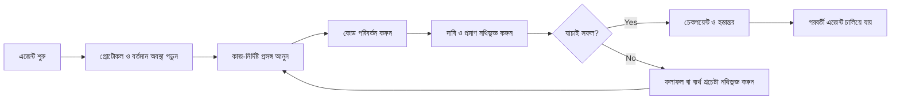

# ArifCE
<p align="center"></p>

**অন্য ভাষায় পড়ুন।**

[English](../../README.md) · [简体中文](README.zh-CN.md) · [繁體中文](README.zh-TW.md) · [한국어](README.ko.md) · [Deutsch](README.de.md) · [Español](README.es.md) · [Français](README.fr.md) · [Italiano](README.it.md) · [Dansk](README.da.md) · [日本語](README.ja.md) · [Polski](README.pl.md) · [Русский](README.ru.md) · [Bosanski](README.bs.md) · [العربية](README.ar.md) · [Norsk](README.no.md) · [Português (Brasil)](README.pt-BR.md) · [ไทย](README.th.md) · [Türkçe](README.tr.md) · [Українська](README.uk.md) · [বাংলা](README.bn.md) · [Ελληνικά](README.el.md) · [Tiếng Việt](README.vi.md)

**এজেন্ট বদলায়। আপনার প্রকল্প যেন না ভোলে।**


[](https://github.com/seekua/ArifCE/actions/workflows/ci.yml) [](https://github.com/seekua/ArifCE/releases/latest) [](../../LICENSE)

ArifCE হলো AI-সহায়িত সফটওয়্যার উন্নয়নের জন্য স্থানীয়-প্রথম প্রকল্প বুদ্ধিমত্তা ও ধারাবাহিকতার স্তর। এটি রিপোজিটরিতে প্রেক্ষাপট, সিদ্ধান্ত, ব্যর্থ প্রচেষ্টা, প্রমাণ, রিফ্যাক্টরিং অবস্থা ও হস্তান্তর তথ্য রাখে, যাতে Codex, Claude Code, OpenCode এবং ভবিষ্যৎ এজেন্ট একই প্রকৌশল কাহিনি চালিয়ে যেতে পারে।

> রিপোজিটরিই প্রেক্ষাপটের মালিক। এজেন্ট কেবল তা ধার নেয়।

**আপনার সীমা কি শেষ হয়ে গেছে? দুটি কমান্ডের মাধ্যমে কাজ চালিয়ে যান।**

বিদ্যমান কোনো কাজের (task) মূল অংশ সম্পন্ন করার পর, কাজ থামানোর আগে এর 'হ্যান্ডঅফ' (handoff) বা কাজের বিবরণ রেকর্ড করুন।

```bash
arifce handoff --task TASK-0031

# When you return with Codex, Claude Code, OpenCode, or a local model:
arifce context --task TASK-0031 --budget 2000
```

হ্যান্ডঅফ-এ কাজের উদ্দেশ্য, সম্পন্ন হওয়া কাজ, যাচাইকৃত প্রমাণ, অমীমাংসিত বিষয়, ব্যর্থতা এবং পরবর্তী পদক্ষেপের তথ্য থাকে। প্রদর্শিত কনটেক্সট আউটপুটটি কপি করে নতুন এজেন্টের শুরুর প্রম্পটে (prompt) দিন; কারণ CLI স্বয়ংক্রিয়ভাবে মডেল সেশনে কনটেক্সট যুক্ত করে না।

## ইনস্টলেশন ও দ্রুত শুরু

[GitHub Releases](https://github.com/seekua/ArifCE/releases/tag/v0.8.1) থেকে আপনার প্ল্যাটফর্মের জন্য সম্পূর্ণ প্যাকেজযুক্ত (self-contained) আর্কাইভটি ডাউনলোড করুন, এটি এক্সট্র্যাক্ট (extract) করুন এবং arifce-কে আপনার PATH-এ যুক্ত করুন। Linux-এ এক্সট্র্যাক্ট করার সময় এক্সিকিউটেবল পারমিশন (executable permission) বজায় রাখুন অথবা `chmod +x arifce` কমান্ডটি চালান। এর জন্য আলাদাভাবে .NET, Node, Python, Docker বা ডেটাবেস ইনস্টল করার প্রয়োজন নেই।

নতুন প্রজেক্টের জন্য:

```bash
mkdir my-project && cd my-project
git init
arifce init
arifce task create "Ship the first change"
arifce handoff
```

বিদ্যমান Git রিপোজিটরির জন্য:

```bash
cd path/to/existing-repo
arifce adopt
arifce task create "Ship the first change"
arifce handoff
```

রিপোজিটরিতে আগে থেকেই কোড থাকলে `adopt` কমান্ডটি ব্যবহার করুন: এটি বিদ্যমান কাঠামোকে মুছে না ফেলেই তা রেকর্ড করে এবং পরবর্তী এজেন্টের জন্য প্রজেক্ট-ভিত্তিক একটি শুরুর বিন্দু (starting point) তৈরি করে দেয়। [ইনস্টলেশন ও দ্রুত শুরু](../getting-started/installation.md).

## ArifCE কেন বিদ্যমান

গুরুত্বপূর্ণ প্রেক্ষাপট যখন শুধু চ্যাট ইতিহাস, ব্যক্তিগত স্মৃতি বা পরবর্তী অবদানকারী যে সরঞ্জামটি পরীক্ষা করতে পারে না তাতে থাকে, তখন সফটওয়্যার দল সময় ও আস্থা হারায়। ArifCE প্রকল্পের নিজস্ব অংশ হিসেবে প্রকৌশল ধারাবাহিকতা তৈরি করে।

লক্ষ্য এজেন্টদের আরও নিশ্চিত শোনানো নয়; প্রত্যেক অবদানকারী যেন দলের উদ্দেশ্য, সিদ্ধান্তের কারণ, যাচাইকৃত বিষয় এবং অবশিষ্ট অনিশ্চয়তা বোঝে সেটিই লক্ষ্য। এই ইতিহাস রিপোজিটরিতে থাকলে দল স্বচ্ছতা, দায়িত্ব ও আস্থা বজায় রেখে দ্রুত এগোতে পারে।

ArifCE ধারাবাহিকতাকে যৌথ প্রকৌশল অনুশীলনে রূপ দেয়: পরবর্তী কাজের জন্য কেন্দ্রীভূত প্রেক্ষাপট, গুরুত্বপূর্ণ দাবির স্পষ্ট প্রমাণ এবং কাজ অসম্পূর্ণ হলে সৎ হস্তান্তর।

**কার জন্য.**

ArifCE AI-সহায়িত প্রকৌশল দল, কোডিং এজেন্ট ব্যবহারকারী ডেভেলপার এবং এমন রক্ষণাবেক্ষণকারীদের জন্য, যাদের প্রকল্পের প্রেক্ষাপট একজন ব্যক্তি, চ্যাট বা সেশনের পরেও টিকে থাকা দরকার। একাধিক অবদানকারী একই রিপোজিটরি ভাগ করলে এটি বিশেষভাবে উপযোগী।

## ArifCE কীভাবে কাজ করে



## প্রকল্প অন্বেষণ

প্রকল্পের স্বাস্থ্য, সাম্প্রতিক রেকর্ড ও অনুসন্ধানযোগ্য প্রেক্ষাপট দেখতে স্থানীয় ড্যাশবোর্ড চালান: এই ডেভেলপার কমান্ডটি .NET SDK ব্যবহার করে; তবে উপরে বর্ণিত সম্পূর্ণ প্যাকেজযুক্ত রিলিজ ইনস্টলেশনের ক্ষেত্রে এর প্রয়োজন হয় না।

### ড্যাশবোর্ডের পূর্বরূপ

<p align="center">
  
  
  
</p>

```powershell
$env:ARIFCE_PROJECT_ROOT = (Get-Location).Path
dotnet run --project src/ArifCE.Dashboard/ArifCE.Dashboard.csproj
```

এরপর <http://127.0.0.1:5180/> খুলুন। সম্পূর্ণ পণ্য নির্দেশিকার জন্য [ArifCE ডকুমেন্টেশন হাব](../README.md) দেখুন।

এই কর্মপ্রবাহ প্রকল্পের জ্ঞান রিপোজিটরিতে রাখে এবং অগ্রগতি পরিদর্শনযোগ্য করে। এর ব্যবহারিক সুবিধাগুলো হলো:

- দ্রুত শুরু: পরবর্তী এজেন্ট দীর্ঘ ট্রান্সক্রিপ্ট পুনর্গঠন না করে কেন্দ্রীভূত বর্তমান অবস্থা পড়ে।
- নিরাপদ পরিবর্তন: দাবিগুলো নির্ধারিত প্রমাণের সঙ্গে যুক্ত এবং Git অবস্থা বদলালে পুরোনো হয়ে যায়।
- ভালো ধারাবাহিকতা: সিদ্ধান্ত, ব্যর্থ প্রচেষ্টা, চেকপয়েন্ট ও হস্তান্তর এজেন্ট বা সেশন পরিবর্তনের পরেও থাকে।
- নিয়ন্ত্রিত রিফ্যাক্টরিং: ইনভেরিয়েন্ট, তালিকা, গার্ড ও নিরাপদ পয়েন্ট অসম্পূর্ণ কাজ দৃশ্যমান করে।
- স্থানীয়-প্রথম পরিচালনা: ক্লাউড পরিষেবা বা নির্দিষ্ট রানটাইম ছাড়াই মূল ফাইল ব্যবহারযোগ্য থাকে।

## শুধু স্মৃতি নয়

ArifCE কাজের বিষয়, কী বদলেছে ও কেন, এজেন্ট কী সম্পন্ন করার দাবি করছে, সেই দাবির প্রমাণ, পর্যালোচকের ফলাফল, অসম্পূর্ণ অংশ এবং পরবর্তী এজেন্টের প্রয়োজনীয় তথ্য অনুসরণ করে। এজেন্টের বক্তব্য দাবি, সত্য নয়; নির্ধারিত build, test, Git ও search প্রমাণ অগ্রাধিকার পায়।

প্রযুক্তিগত যাচাই ও পণ্য গ্রহণ আলাদা: গ্রহণ রেকর্ডে কে দাবিটি অনুমোদন করেছে এবং কোন বর্তমান প্রমাণ সিদ্ধান্তটিকে সমর্থন করেছে তা থাকে।

## মূল কর্মপ্রবাহ

```text
arifce init
arifce task create "Fix permission cache race"
arifce checkpoint --summary "Reproduction added"
arifce context "finish the permission cache fix" --budget 16000
arifce claim create "Permission cache race is fixed"
arifce verify CLAIM-0001
arifce handoff
```

ক্যানোনিকাল Markdown, YAML, JSON ও JSONL `.arifce/`-এ থাকে। SQLite একটি অপসারণযোগ্য সূচক; `.arifce/index/` মুছে `arifce rebuild` চালালেও প্রকল্পের বুদ্ধিমত্তা অক্ষুণ্ণ থাকতে হবে।

## আর্কিটেকচার

মূল অংশটি ডোমেইন নিয়ম, ক্যানোনিকাল স্টোরেজ ও ইনডেক্স, Git পর্যবেক্ষণ, পুনরুদ্ধার, যাচাই, রিফ্যাক্টরিং, নিরাপত্তা ও CLI আলাদা রাখে। সরবরাহকারীর নির্দেশনা ফাইল ছোট অ্যাডাপ্টার; এগুলো কখনও ক্যানোনিকাল মেমরি স্টোর হয় না। আরও দেখুন: [আর্কিটেকচারের সারসংক্ষেপ](../architecture/overview.md), [ডোমেইন মডেল](../architecture/domain-model.md) এবং [ঐতিহাসিক V0.1 ভিত্তি স্পেসিফিকেশন](../SPECIFICATION-v0.1.md)।

**সোর্স ডেভেলপমেন্ট। V0.8.1 হলো বর্তমান রিলিজ। সোর্স ডেভেলপমেন্টের জন্য ইনস্টলেশন এবং দ্রুত শুরুর নির্দেশিকা দেখুন।** [ইনস্টলেশন ও দ্রুত শুরু](../getting-started/installation.md) · [দ্রুত শুরু](../getting-started/quick-start.md).

```bash
git clone https://github.com/seekua/ArifCE.git
cd ArifCE
dotnet restore ArifCE.slnx
dotnet build ArifCE.slnx --configuration Release --no-restore
dotnet test ArifCE.slnx --configuration Release --no-build --no-restore
```

ঐচ্ছিক স্থানীয় MCP অ্যাডাপ্টারটি [MCP সেটআপ](../getting-started/mcp.md)-এ নথিবদ্ধ।

সম্পূর্ণ ইনস্টলেশন ও বৈশিষ্ট্য পরিচিতির জন্য [ব্যবহারকারী নির্দেশিকা](../USER-GUIDE.md) এবং [ডকুমেন্টেশন নীতি](../DOCUMENTATION-POLICY.md) দেখুন।

উপরে উল্লিখিত 'install-and-start' কমান্ডগুলো একটি রিপোজিটরি-ভিত্তিক প্রজেক্ট স্টেট, একটি টাস্ক এবং পরবর্তী অবদানকারীর (contributor) জন্য প্রস্তুত একটি হ্যান্ডঅফ তৈরি করে।

### Ollama বা LM Studio দিয়ে কাজ চালিয়ে যান

ArifCE প্রকল্পের মূল রেকর্ড রিপোজিটরিতেই রাখে। প্রোভাইডার প্রম্পট ও নির্বাচিত কনটেক্সট পায়; ক্লাউড প্রোভাইডার নির্বাচিত কনটেন্ট দূরের সার্ভারে পায়। `--with-context` ArifCE-র নির্বাচিত প্রকল্প রেকর্ড যোগ করে, কিন্তু সোর্স ফাইল পড়ে না। নিচের উদাহরণগুলো মাইগ্রেশন ফাইলের বিষয়বস্তু সরাসরি প্রম্পটে দেয়, যাতে মডেল পর্যালোচনার জন্য নির্দিষ্ট কোডটি পায়। আপনার শেলের জন্য উপযুক্ত উদাহরণটি ব্যবহার করুন।

যেকোনো উদাহরণ চালানোর আগে Ollama ইনস্টল করে চালু করুন। প্রথম কমান্ডটি `llama3` মডেল ডাউনলোড করে; নিচে নির্ধারিত local endpoint-এ Ollama চালু রাখুন।

```bash
ollama pull llama3
arifce llm provider add ollama Ollama llama3 --endpoint http://127.0.0.1:11434
arifce llm provider test ollama
task_id="$(arifce task create "Review and safely update the migration")"
migration_source="$(cat path/to/migration.sql)"
prompt="Review only this SQL migration for data-loss risks. Do not infer unseen source. Suggest the smallest safe change if needed.
Migration source:
$migration_source"
arifce llm run "Review and safely update the migration" "$prompt" --with-context --budget 2000
```

```powershell
ollama pull llama3
arifce llm provider add ollama Ollama llama3 --endpoint http://127.0.0.1:11434
arifce llm provider test ollama
$taskId = arifce task create "Review and safely update the migration"
$migrationSource = Get-Content -Raw -LiteralPath "path/to/migration.sql"
$prompt = @"
Review only this SQL migration for data-loss risks. Do not infer unseen source. Suggest the smallest safe change if needed.
Migration source:
$migrationSource
"@
arifce llm run "Review and safely update the migration" $prompt --with-context --budget 2000
```

মডেলের উত্তর পর্যালোচনা করে, প্রস্তাবিত পরিবর্তন থাকলে কোডিং ইন্টারফেসে প্রয়োগ করুন এবং মাইগ্রেশনের রিগ্রেশন টেস্ট চালান। টেস্ট সফল হওয়ার পর, কেবল টেস্ট কমান্ডে যা প্রমাণিত হয় সেটিই claim হিসেবে নথিভুক্ত করুন:

```bash
claim_id="$(arifce claim create "Migration regression tests pass" --task "$task_id")"
arifce verify "$claim_id" --command "dotnet test path/to/migration-tests.csproj"
arifce handoff
```

PowerShell-এ:

```powershell
$claimId = arifce claim create "Migration regression tests pass" --task $taskId
arifce verify $claimId --command "dotnet test path/to/migration-tests.csproj"
arifce handoff
```

টেস্টের ফল টেস্ট পাস করার claim-কে সমর্থন করে; এটি একা প্রমাণ করে না যে মডেলের পর্যালোচনা সম্পূর্ণ বা সঠিক ছিল। আপনার রিপোজিটরির প্রকৃত ফাইলের পথ ও টেস্ট কমান্ড দিয়ে উদাহরণের পথ ও কমান্ড বদলান। LM Studio ব্যবহার করতে, লোড করা মডেলের নাম এবং OpenAI-সামঞ্জস্যপূর্ণ endpoint—সাধারণত `http://127.0.0.1:1234/v1`—দিয়ে `arifce llm provider add lmstudio LmStudio your-loaded-model --endpoint http://127.0.0.1:1234/v1` চালান।

এরপর একই task, সোর্স ইনপুট, টেস্ট প্রমাণ ও handoff প্রবাহ ব্যবহার করুন।

Reviewer চালাতে স্পষ্ট অনুমোদন লাগে। বিকল্প provider ব্যবহার, token/cost হিসাব, canonical evidence, embedding, benchmark metric, MCP tool এবং local dashboard-এর বিবরণ [LLM provider reference](../reference/LLM-PROVIDERS.md)-এ আছে।

নতুন Git repository-তে `init` অথবা বিদ্যমান repository-তে `adopt` চালান। দুটিই নিরাপদে বারবার চালানো যায় এবং বিদ্যমান বিষয়বস্তু নষ্ট করে না; `adopt` দেখা repository গঠন নথিভুক্ত করে এবং অজানা পুরোনো কারণকে অজানা হিসেবেই চিহ্নিত করে।

## ধারাবাহিকতা, যাচাই ও রিফ্যাক্টরিং

- নতুন এজেন্ট `AGENTS.md`, `.arifce/PROTOCOL.md` ও `.arifce/CURRENT.md` পড়ে এবং ইতিহাস একসঙ্গে না তুলে কাজভিত্তিক প্রেক্ষাপট চায়।
- দাবিগুলো রিপোজিটরি-নির্দিষ্ট প্রমাণের সঙ্গে যুক্ত; সংশ্লিষ্ট অবস্থা বদলালে প্রমাণ পুরোনো হয়।
- রিফ্যাক্টর প্রচারণা ইনভেরিয়েন্ট, তালিকা, গার্ড, অগ্রগতি ও চেকপয়েন্ট অনুসরণ করে; বাধাদানকারী গার্ড সমাপ্তি ঠেকায়।
- হস্তান্তর ট্রান্সক্রিপ্ট ঢেলে না দিয়ে বর্তমান প্রকৌশল অবস্থা সংক্ষেপ করে।

## নিরাপত্তা ও সীমাবদ্ধতা

র (raw) ট্রান্সক্রিপ্টগুলো নির্ভরযোগ্য নয় এবং এগুলো কখনোই একসাথে লোড বা এক্সিকিউট করা হয় না। ইমপোর্ট পাথগুলো সাধারণ গোপন তথ্য (secrets) গোপন বা মুছে ফেলে; ক্রেডেনশিয়াল এবং মেশিন অথেন্টিকেশন ডেটা `.arifce`-তে রাখা উচিত নয়। ArifCE সঠিকতা, টোকেন সাশ্রয় বা উন্নত রিভিউ মানের নিশ্চয়তা দেয় না। এতে কোনো ক্লাউড সার্ভিস, হোস্ট করা UI, ভেক্টর ডেটাবেস, স্বায়ত্তশাসিত সোয়ার্ম (autonomous swarm) বা প্রোডাকশন-লেভেল ক্রস-এজেন্ট ইনভোকেশন নেই। এতে একটি লোকাল ড্যাশবোর্ড অন্তর্ভুক্ত রয়েছে; এটি কোনো হোস্ট করা ওয়েব অ্যাপ্লিকেশন নয়।

[ROADMAP.md](../../ROADMAP.md), [SECURITY.md](../../SECURITY.md) এবং [CONTRIBUTING.md](../../CONTRIBUTING.md) দেখুন। বাস্তবায়িত কমান্ডের সঠিক সিনট্যাক্স [CLI রেফারেন্স](../reference/cli.md)-এ নথিবদ্ধ।

## লাইসেন্স

ArifCE [Apache License 2.0](../../LICENSE)-এর অধীনে লাইসেন্সপ্রাপ্ত।
