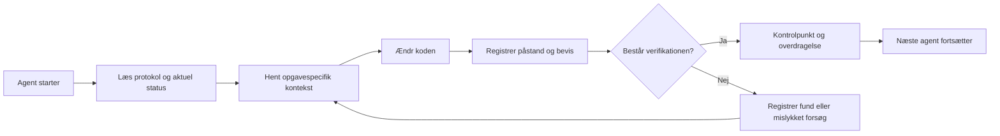

# ArifCE
<p align="center"></p>

[English](../../README.md) · [简体中文](README.zh-CN.md) · [繁體中文](README.zh-TW.md) · [한국어](README.ko.md) · [Deutsch](README.de.md) · [Español](README.es.md) · [Français](README.fr.md) · [Italiano](README.it.md) · [Dansk](README.da.md) · [日本語](README.ja.md) · [Polski](README.pl.md) · [Русский](README.ru.md) · [Bosanski](README.bs.md) · [العربية](README.ar.md) · [Norsk](README.no.md) · [Português (Brasil)](README.pt-BR.md) · [ไทย](README.th.md) · [Türkçe](README.tr.md) · [Українська](README.uk.md) · [বাংলা](README.bn.md) · [Ελληνικά](README.el.md) · [Tiếng Việt](README.vi.md)

**Agenter ændrer sig. Dit projekt bør ikke glemme.**


[](https://github.com/seekua/ArifCE/actions/workflows/ci.yml) [](https://github.com/seekua/ArifCE/releases/latest) [](../../LICENSE)

ArifCE er et lokalt projektintelligens- og kontinuitetslag til AI-assisteret softwareudvikling. Det gemmer kontekst, beslutninger, mislykkede forsøg, beviser, refaktoreringstilstand og overdragelsesoplysninger i repositoriet, så Codex, Claude Code, OpenCode og fremtidige agenter kan fortsætte den samme tekniske historie.

> Repositoriet ejer konteksten. Agenten låner den kun.


## Hvorfor ArifCE findes

Softwareteams mister tid og tillid, når vigtig kontekst kun findes i chathistorik, individuel hukommelse eller et værktøj, som den næste bidragyder ikke kan inspicere. ArifCE gør teknisk kontinuitet til en del af selve projektet.

Målet er ikke at få agenter til at lyde mere sikre. Det er at hjælpe alle bidragydere med at forstå, hvad teamet vil opnå, hvorfor en beslutning blev truffet, hvad der faktisk er verificeret, og hvor usikkerhed består. Når historien bliver i repositoriet, kan teams arbejde hurtigere uden at opgive sporbarhed, ejerskab eller tillid.

ArifCE gør kontinuitet til en fælles ingeniørpraksis: fokuseret kontekst til næste opgave, tydelige beviser for vigtige påstande og ærlige overdragelser, når arbejdet er ufuldstændigt.

## Hvem det er til

ArifCE er til AI-assisterede ingeniørteams, udviklere der arbejder med kodeagenter, og vedligeholdere, som har brug for at projektkontekst overlever én person, chat eller session. Det er især nyttigt, når flere bidragydere deler et repository og behøver en klar registrering af beslutninger, verifikation og ufærdigt arbejde.

## Sådan fungerer ArifCE



## Udforsk projektet

Kør det lokale dashboard for et visuelt overblik over projektets sundhed, seneste poster og søgbar kontekst:

```powershell
$env:ARIFCE_PROJECT_ROOT = (Get-Location).Path
dotnet run --project src/ArifCE.Dashboard/ArifCE.Dashboard.csproj
```

Åbn derefter <http://127.0.0.1:5180/>. Se [ArifCE-dokumentationshubben](../README.md) for den komplette produkthåndbog.

Denne arbejdsgang holder projektviden i repositoriet og gør fremskridt kontrollerbare. De praktiske fordele er:

- Hurtigere onboarding: næste agent læser den fokuserede aktuelle status i stedet for at rekonstruere en lang transskription.
- Sikrere ændringer: påstande kobles til deterministiske beviser og bliver forældede, når Git-status ændres.
- Bedre kontinuitet: beslutninger, mislykkede forsøg, kontrolpunkter og overdragelser overlever agent- eller sessionskift.
- Kontrolleret refaktorering: invariants, inventar, vagter og sikre punkter synliggør ufærdigt arbejde.
- Lokal drift: kanoniske filer kan bruges uden cloudtjeneste eller leverandørspecifik runtime.

## Mere end hukommelse

ArifCE sporer opgaven, ændringer og årsager, hvad en agent hævder at have fuldført, hvilke beviser der understøtter påstanden, hvad en reviewer fandt, hvad der mangler, og hvad næste agent skal vide. Agentudsagn er påstande, ikke fakta; deterministiske build-, test-, Git- og søgebeviser foretrækkes.

Teknisk verifikation og produktgodkendelse er separate: godkendelsesposter angiver, hvem der godkendte en påstand, og hvilke aktuelle beviser der understøttede beslutningen.

## V0.1-arbejdsgang

```text
arifce init
arifce task create "Fix permission cache race"
arifce checkpoint --summary "Reproduction added"
arifce context "finish the permission cache fix" --budget 16000
arifce claim create "Permission cache race is fixed"
arifce verify CLAIM-0001
arifce handoff
```

Kanoniske Markdown-, YAML-, JSON- og JSONL-filer ligger under `.arifce/`. SQLite er et afledt indeks, der kan slettes: sletning af `.arifce/index/` og kørsel af `arifce rebuild` skal bevare projektintelligensen.

## Arkitektur

Kernen adskiller domæneregler, kanonisk lagring og indeksering, Git-observation, hentning, verifikation, refaktorering, sikkerhed og CLI. Leverandørens instruktionsfiler er små adaptere og bliver aldrig det kanoniske hukommelseslager. Se [arkitekturoversigten](../architecture/overview.md), [domænemodellen](../architecture/domain-model.md) og [V0.1-specifikationen](../SPECIFICATION-v0.1.md).

## Installation og hurtig start

V0.2.0 er udgivet som et multiplatforms .NET-globalværktøj. Se [installation](../getting-started/installation.md) og [hurtig start](../getting-started/quick-start.md). Fra kildekode:

Den valgfri lokale MCP-adapter er dokumenteret i [MCP-opsætning](../getting-started/mcp.md).

Se [brugervejledningen](../USER-GUIDE.md) og [dokumentationspolitikken](../DOCUMENTATION-POLICY.md) for en komplet gennemgang.

### 60-second quick start

```bash
dotnet tool install --global ArifCE.Cli --version 0.2.0
mkdir my-project && cd my-project
git init
arifce init
arifce task create "Ship the first change"
arifce checkpoint --summary "Project context initialized"
arifce handoff
```

Du har nu en repository-lokal projektstatus, en opgave, et kontrolpunkt og en semantisk overdragelse klar til næste bidragyder.

Hvis du allerede har et Git-repository, skal du gå til det og registrere dets struktur med `adopt`:

```bash
cd path/to/existing-repo
arifce adopt
arifce task create "Ship the first change"
arifce handoff
```

```bash
dotnet restore
dotnet build
dotnet test
dotnet run --project src/ArifCE.Cli -- init
```

Kør `init` i et nyt Git-lager eller `adopt` i et eksisterende. Begge er ikke-destruktive og idempotente. `adopt` registrerer den observerede struktur og markerer ukendte historiske begrundelser som ukendte.

## Kontinuitet, verifikation og refaktorering

- En ny agent læser `AGENTS.md`, `.arifce/PROTOCOL.md` og `.arifce/CURRENT.md` og anmoder derefter om opgavespecifik kontekst i stedet for at indlæse hele historikken.
- Påstande linker til beviser afgrænset til repositoriet. Beviser bliver forældede, når den relevante status ændres.
- Refaktoreringskampagner sporer invariants, inventar, vagter, fremskridt og kontrolpunkter. Blokerende vagter forhindrer afslutning.
- Overdragelser opsummerer den aktuelle ingeniørstatus i stedet for at dumpe transskriptioner.

## Sikkerhed og begrænsninger

Rå transskriptioner er upålidelige og indlæses eller køres aldrig i bulk. Importstier skjuler almindelige hemmeligheder; legitimationsoplysninger og maskinautentificering hører ikke hjemme i `.arifce/`. V0.1 garanterer ikke korrekthed, tokenbesparelser eller bedre reviewkvalitet. Der er ingen cloudtjeneste, UI, vektordatabase, autonom sværm eller produktionskald mellem agenter.

Se [ROADMAP.md](../../ROADMAP.md), [SECURITY.md](../../SECURITY.md) og [CONTRIBUTING.md](../../CONTRIBUTING.md). Den præcise syntaks for implementerede kommandoer findes i [CLI-referencen](../reference/cli.md).

## Licens

ArifCE er licenseret under [Apache License 2.0](../../LICENSE).
### Fortsæt en opgave med Ollama eller LM Studio

ArifCE gemmer de kanoniske projektposter i repositoriet. Udbyderen modtager prompten og den valgte kontekst; cloududbydere modtager dette udvalgte indhold eksternt. `--with-context` føjer ArifCE's udvalgte projektposter til, men læser ikke kildefiler. Eksemplerne nedenfor indsætter eksplicit indholdet af migrationsfilen i prompten, så modellen får den kode, den bliver bedt om at gennemgå. Vælg eksemplet til din shell.

Installér og start Ollama, før du bruger et af eksemplerne. Den første kommando henter modellen `llama3`; lad Ollama køre på det lokale endpoint, der er angivet nedenfor.

```bash
ollama pull llama3
arifce llm provider add ollama Ollama llama3 --endpoint http://127.0.0.1:11434
arifce llm provider test ollama
task_id="$(arifce task create "Review and safely update the migration")"
migration_source="$(cat path/to/migration.sql)"
prompt="Review only this SQL migration for data-loss risks. Do not infer unseen source. Suggest the smallest safe change if needed.
Migration source:
$migration_source"
arifce llm run "Review and safely update the migration" "$prompt" --with-context --budget 2000
```

```powershell
ollama pull llama3
arifce llm provider add ollama Ollama llama3 --endpoint http://127.0.0.1:11434
arifce llm provider test ollama
$taskId = arifce task create "Review and safely update the migration"
$migrationSource = Get-Content -Raw -LiteralPath "path/to/migration.sql"
$prompt = @"
Review only this SQL migration for data-loss risks. Do not infer unseen source. Suggest the smallest safe change if needed.
Migration source:
$migrationSource
"@
arifce llm run "Review and safely update the migration" $prompt --with-context --budget 2000
```

Gennemgå modellens svar, anvend eventuelle foreslåede ændringer i dit kodningsmiljø, og kør regressionstestene for migreringen. Når de består, skal du kun registrere det, testkommandoen faktisk beviser, som en claim:

```bash
claim_id="$(arifce claim create "Migration regression tests pass" --task "$task_id")"
arifce verify "$claim_id" --command "dotnet test path/to/migration-tests.csproj"
arifce handoff
```

I PowerShell:

```powershell
$claimId = arifce claim create "Migration regression tests pass" --task $taskId
arifce verify $claimId --command "dotnet test path/to/migration-tests.csproj"
arifce handoff
```

Testresultatet understøtter claimen om, at testene består; det beviser ikke i sig selv, at modellens gennemgang var fuldstændig eller korrekt. Erstat eksempelstierne og testkommandoen med dem fra dit repository. Til LM Studio skal du angive det indlæste modelnavn og det OpenAI-kompatible endpoint, typisk `http://127.0.0.1:1234/v1`, i `arifce llm provider add lmstudio LmStudio your-loaded-model --endpoint http://127.0.0.1:1234/v1`.

Følg derefter samme arbejdsgang for opgave, kildeinput, testbevis og overdragelse.

Kørsel af reviewer kræver udtrykkelig godkendelse. Fallbackudbydere, token-/omkostningsregnskab, kanoniske beviser, embeddings, benchmarkmålinger, MCP-værktøjer og det lokale dashboard er beskrevet i [LLM-udbyderreferencen](../reference/LLM-PROVIDERS.md).

Kør `init` i et nyt Git-repository eller `adopt` i et eksisterende. Begge er ikke-destruktive og idempotente; `adopt` registrerer den observerede struktur og markerer ukendte historiske begrundelser som ukendte.
### From source

```bash
git clone https://github.com/seekua/ArifCE.git
cd ArifCE
dotnet restore ArifCE.slnx
dotnet build ArifCE.slnx --configuration Release --no-restore
dotnet test ArifCE.slnx --configuration Release --no-build --no-restore
```
