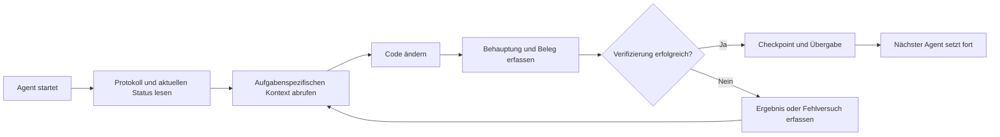

# ArifCE
<p align="center"></p>

**In einer anderen Sprache lesen.**

[English](../../README.md) · [简体中文](README.zh-CN.md) · [繁體中文](README.zh-TW.md) · [한국어](README.ko.md) · [Deutsch](README.de.md) · [Español](README.es.md) · [Français](README.fr.md) · [Italiano](README.it.md) · [Dansk](README.da.md) · [日本語](README.ja.md) · [Polski](README.pl.md) · [Русский](README.ru.md) · [Bosanski](README.bs.md) · [العربية](README.ar.md) · [Norsk](README.no.md) · [Português (Brasil)](README.pt-BR.md) · [ไทย](README.th.md) · [Türkçe](README.tr.md) · [Українська](README.uk.md) · [বাংলা](README.bn.md) · [Ελληνικά](README.el.md) · [Tiếng Việt](README.vi.md)

**Agenten wechseln. Ihr Projekt sollte nicht vergessen.**


[](https://github.com/seekua/ArifCE/actions/workflows/ci.yml) [](https://github.com/seekua/ArifCE/releases/latest) [](../../LICENSE)

ArifCE ist eine lokale Projektintelligenz- und Kontinuitätsschicht für KI-gestützte Softwareentwicklung. Sie bewahrt Kontext, Entscheidungen, fehlgeschlagene Versuche, Belege, Refactoring-Zustand und Übergabeinformationen im Repository, damit Codex, Claude Code, OpenCode und zukünftige Agenten dieselbe Engineering-Geschichte fortsetzen können.

> Das Repository besitzt den Kontext. Der Agent leiht ihn nur.

**Limit erreicht? Fahren Sie mit zwei Befehlen fort.**

Nach Abschluss der eigentlichen Arbeit an einer bestehenden Aufgabe halten Sie die Übergabe (Handoff) fest, bevor Sie die Arbeit beenden.

```bash
arifce handoff --task TASK-0031

# When you return with Codex, Claude Code, OpenCode, or a local model:
arifce context --task TASK-0031 --budget 2000
```

Die Übergabe umfasst das Ziel, die erledigte Arbeit, verifizierte Nachweise, offene Punkte, Fehler und die nächste Maßnahme. Kopieren Sie die ausgegebene Kontext-Information in die Eingabeaufforderung (Prompt) für den neuen Agenten; die CLI fügt den Kontext nicht automatisch in die Modellsitzung ein.

## Installation und Schnellstart

Laden Sie das eigenständige Archiv für Ihre Plattform von [GitHub Releases](https://github.com/seekua/ArifCE/releases/tag/v0.8.1) herunter, entpacken Sie es und fügen Sie `arifce` Ihrem `PATH` hinzu. Achten Sie unter Linux darauf, beim Entpacken die Ausführungsrechte beizubehalten, oder führen Sie `chmod +x arifce` aus. Es ist keine separate Installation von .NET, Node, Python, Docker oder einer Datenbank erforderlich.

Für ein neues Projekt:

```bash
mkdir my-project && cd my-project
git init
arifce init
arifce task create "Ship the first change"
arifce handoff
```

Für ein bestehendes Git-Repository:

```bash
cd path/to/existing-repo
arifce adopt
arifce task create "Ship the first change"
arifce handoff
```

Verwenden Sie `adopt`, wenn das Repository bereits Code enthält: Es erfasst die vorhandene Struktur, ohne sie zu überschreiben, und bietet dem nächsten Agenten einen projektspezifischen Startpunkt. [Installation und Schnellstart](../getting-started/installation.md).

## Warum es ArifCE gibt

Softwareteams verlieren Zeit und Vertrauen, wenn wichtiger Kontext nur im Chatverlauf, im Gedächtnis Einzelner oder in einem Werkzeug liegt, das der nächste Beitragende nicht prüfen kann. ArifCE macht die Kontinuität der Entwicklung zu einem Teil des Projekts selbst.

Das Ziel ist nicht, Agenten sicherer klingen zu lassen. Es geht darum, jedem Beitragenden zu zeigen, was das Team erreichen will, warum eine Entscheidung getroffen wurde, was tatsächlich verifiziert ist und wo Unsicherheit bleibt. Bleibt diese Geschichte im Repository, können Teams schneller arbeiten, ohne Nachvollziehbarkeit, Verantwortung oder Vertrauen aufzugeben.

ArifCE macht Kontinuität zu einer gemeinsamen Engineering-Praxis: fokussierter Kontext für die nächste Aufgabe, klare Belege für wichtige Behauptungen und ehrliche Übergaben bei unvollständiger Arbeit.

**Für wen es gedacht ist.**

ArifCE richtet sich an KI-gestützte Engineering-Teams, Entwickler, die mit Coding-Agenten arbeiten, und Maintainer, deren Projektkontext eine Person, einen Chat oder eine Sitzung überdauern muss. Besonders nützlich ist es, wenn mehrere Beitragende ein Repository teilen und einen klaren Nachweis von Entscheidungen, Verifizierung und offenen Arbeiten benötigen.

## So funktioniert ArifCE



## Projekt erkunden

Starte das lokale Dashboard, um Projektgesundheit, aktuelle Einträge und durchsuchbaren Kontext visuell zu überblicken: Dieser Entwicklerbefehl verwendet das .NET SDK; die oben beschriebene Installation der eigenständigen Release-Version benötigt es nicht.

### Dashboard-Vorschau

<p align="center">
  
  
  
</p>

```powershell
$env:ARIFCE_PROJECT_ROOT = (Get-Location).Path
dotnet run --project src/ArifCE.Dashboard/ArifCE.Dashboard.csproj
```

Öffne anschließend <http://127.0.0.1:5180/>. Das vollständige Produkthandbuch findest du im [ArifCE-Dokumentationshub](../README.md).

Dieser Ablauf hält Projektwissen im Repository und macht Fortschritt überprüfbar. Die praktischen Vorteile sind:

- Schneller Einstieg: Der nächste Agent liest den fokussierten aktuellen Status, statt einen langen Verlauf zu rekonstruieren.
- Sicherere Änderungen: Behauptungen sind mit deterministischen Belegen verknüpft und werden bei Änderungen des Git-Status veraltet.
- Bessere Kontinuität: Entscheidungen, Fehlversuche, Checkpoints und Übergaben überleben Agenten- oder Sitzungswechsel.
- Kontrollierte Refactorings: Invarianten, Inventar, Prüfungen und sichere Punkte machen unvollständige Arbeit sichtbar.
- Lokaler Betrieb: Maßgebliche Dateien bleiben ohne Cloud-Dienst oder anbieterspezifische Laufzeit nutzbar.

## Mehr als nur Gedächtnis

ArifCE verfolgt, worin die Aufgabe bestand, was und warum geändert wurde, was ein Agent als erledigt behauptet, welche Belege dies stützen, was ein Reviewer festgestellt hat, was offen bleibt und was der nächste Agent wissen muss. Agentenaussagen sind Behauptungen, keine Fakten; deterministische Build-, Test-, Git- und Suchbelege werden bevorzugt.

Technische Verifizierung und Produktabnahme sind getrennt: Abnahmeaufzeichnungen nennen, wer eine Behauptung genehmigt hat und welche aktuellen Belege die Entscheidung stützten.

## Kern-Workflow

```text
arifce init
arifce task create "Fix permission cache race"
arifce checkpoint --summary "Reproduction added"
arifce context "finish the permission cache fix" --budget 16000
arifce claim create "Permission cache race is fixed"
arifce verify CLAIM-0001
arifce handoff
```

Maßgebliche Markdown-, YAML-, JSON- und JSONL-Dateien liegen unter `.arifce/`. SQLite ist ein löschbarer abgeleiteter Index: Das Löschen von `.arifce/index/` und Ausführen von `arifce rebuild` muss die Projektintelligenz erhalten.

## Architektur

Der Kern trennt Domänenregeln, maßgebliche Speicherung und Indexierung, Git-Beobachtung, Abruf, Verifizierung, Refactoring, Sicherheit und CLI. Anbieter-Anweisungsdateien sind kleine Adapter und werden nie zum maßgeblichen Speichersystem. Siehe [Architekturüberblick](../architecture/overview.md), [Domänenmodell](../architecture/domain-model.md) und [V0.1-Spezifikation](../SPECIFICATION-v0.1.md).

**Entwicklung aus dem Quellcode. V0.8.1 ist die aktuelle Version. Informationen zur Entwicklung aus dem Quellcode finden Sie unter Installation und Schnellstart.** [Installation und Schnellstart](../getting-started/installation.md) · [Schnellstart](../getting-started/quick-start.md).

```bash
git clone https://github.com/seekua/ArifCE.git
cd ArifCE
dotnet restore ArifCE.slnx
dotnet build ArifCE.slnx --configuration Release --no-restore
dotnet test ArifCE.slnx --configuration Release --no-build --no-restore
```

Der optionale lokale MCP-Adapter ist unter [MCP-Einrichtung](../getting-started/mcp.md) dokumentiert.

Eine vollständige Anleitung zu Installation und Funktionen findest du im [Benutzerhandbuch](../USER-GUIDE.md) und in der [Dokumentationsrichtlinie](../DOCUMENTATION-POLICY.md).

Die oben genannten Befehle für Installation und Start erzeugen einen repository-lokalen Projektzustand, eine Aufgabe sowie eine Übergabe, die für den nächsten Mitwirkenden bereitsteht.

### Aufgabe mit Ollama oder LM Studio fortsetzen

ArifCE speichert die maßgeblichen Projekteinträge im Repository. Ein Provider erhält den Prompt und den ausgewählten Kontext; Cloud-Provider bekommen diese ausgewählten Inhalte über eine Netzwerkverbindung. `--with-context` ergänzt die von ArifCE ausgewählten Projekteinträge, liest aber keine Quelldateien. Die Beispiele unten fügen den Inhalt der Migrationsdatei ausdrücklich in den Prompt ein, damit das Modell den zu prüfenden Code erhält. Verwende das Beispiel für deine Shell.

Installiere und starte Ollama, bevor du eines der Beispiele verwendest. Der erste Befehl lädt das Modell `llama3` herunter; Ollama muss währenddessen und danach unter dem unten angegebenen lokalen Endpoint laufen.

```bash
ollama pull llama3
arifce llm provider add ollama Ollama llama3 --endpoint http://127.0.0.1:11434
arifce llm provider test ollama
task_id="$(arifce task create "Review and safely update the migration")"
migration_source="$(cat path/to/migration.sql)"
prompt="Review only this SQL migration for data-loss risks. Do not infer unseen source. Suggest the smallest safe change if needed.
Migration source:
$migration_source"
arifce llm run "Review and safely update the migration" "$prompt" --with-context --budget 2000
```

```powershell
ollama pull llama3
arifce llm provider add ollama Ollama llama3 --endpoint http://127.0.0.1:11434
arifce llm provider test ollama
$taskId = arifce task create "Review and safely update the migration"
$migrationSource = Get-Content -Raw -LiteralPath "path/to/migration.sql"
$prompt = @"
Review only this SQL migration for data-loss risks. Do not infer unseen source. Suggest the smallest safe change if needed.
Migration source:
$migrationSource
"@
arifce llm run "Review and safely update the migration" $prompt --with-context --budget 2000
```

Prüfe die Antwort des Modells, setze vorgeschlagene Änderungen in deiner Entwicklungsumgebung um und führe anschließend die Regressionstests für die Migration aus. Sind sie erfolgreich, dokumentiere als Claim nur das, was der Testbefehl belegt:

```bash
claim_id="$(arifce claim create "Migration regression tests pass" --task "$task_id")"
arifce verify "$claim_id" --command "dotnet test path/to/migration-tests.csproj"
arifce handoff
```

In PowerShell:

```powershell
$claimId = arifce claim create "Migration regression tests pass" --task $taskId
arifce verify $claimId --command "dotnet test path/to/migration-tests.csproj"
arifce handoff
```

Das Testergebnis stützt den Claim, dass die Tests erfolgreich sind; es beweist allein nicht, dass die Prüfung des Modells vollständig oder korrekt war. Ersetze Beispielpfade und Testbefehl durch die Werte aus deinem Repository. Für LM Studio verwendest du den Namen des geladenen Modells und den OpenAI-kompatiblen Endpoint, üblicherweise `http://127.0.0.1:1234/v1`, in `arifce llm provider add lmstudio LmStudio your-loaded-model --endpoint http://127.0.0.1:1234/v1`.

Verwende danach denselben Ablauf für Aufgabe, Quelltext, Testnachweis und Übergabe.

Reviewer-Ausführungen benötigen eine ausdrückliche Freigabe. Fallback-Provider, Token- und Kostenabrechnung, kanonische Nachweise, Embeddings, Benchmark-Metriken, MCP-Werkzeuge und das lokale Dashboard sind in der [LLM-Providerreferenz](../reference/LLM-PROVIDERS.md) beschrieben.

Führe `init` in einem neuen Git-Repository oder `adopt` in einem bestehenden aus. Beide Befehle sind nicht destruktiv und idempotent; `adopt` erfasst die erkannte Struktur und kennzeichnet unbekannte historische Begründungen als unbekannt.

## Kontinuität, Verifizierung und Refactorings

- Ein neuer Agent liest `AGENTS.md`, `.arifce/PROTOCOL.md` und `.arifce/CURRENT.md` und fordert dann aufgabenspezifischen Kontext an, statt den gesamten Verlauf zu laden.
- Behauptungen verweisen auf repositorybezogene Belege. Belege werden veraltet, wenn sich der relevante Repository-Status ändert.
- Refactoring-Kampagnen verfolgen Invarianten, Inventar, Prüfungen, Fortschritt und Checkpoints. Sperrende Prüfungen verhindern den Abschluss.
- Übergaben fassen den aktuellen Engineering-Status zusammen, statt Gesprächsverläufe auszuschütten.

## Sicherheit und Einschränkungen

Rohprotokolle gelten als nicht vertrauenswürdig und werden niemals massenhaft geladen oder ausgeführt. Importpfade schwärzen gängige Geheimnisse; Zugangsdaten und Authentifizierungsdaten für Maschinen gehören nicht in `.arifce`. ArifCE garantiert weder Korrektheit noch Token-Einsparungen oder eine bessere Qualität der Code-Überprüfung. Es gibt keinen Cloud-Dienst, keine gehostete Benutzeroberfläche, keine Vektordatenbank, keinen autonomen Schwarm und keinen produktiven Aufruf zwischen Agenten. Ein lokales Dashboard ist enthalten; es handelt sich nicht um eine gehostete Webanwendung.

Siehe [ROADMAP.md](../../ROADMAP.md), [SECURITY.md](../../SECURITY.md) und [CONTRIBUTING.md](../../CONTRIBUTING.md). Die exakt implementierte Befehlssyntax ist in der [CLI-Referenz](../reference/cli.md) dokumentiert.

## Lizenz

ArifCE steht unter der [Apache-Lizenz 2.0](../../LICENSE).
