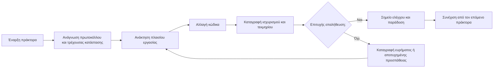

# ArifCE
<p align="center"></p>

[English](../README.md) · [简体中文](README.zh-CN.md) · [繁體中文](README.zh-TW.md) · [한국어](README.ko.md) · [Deutsch](README.de.md) · [Español](README.es.md) · [Français](README.fr.md) · [Italiano](README.it.md) · [Dansk](README.da.md) · [日本語](README.ja.md) · [Polski](README.pl.md) · [Русский](README.ru.md) · [Bosanski](README.bs.md) · [العربية](README.ar.md) · [Norsk](README.no.md) · [Português (Brasil)](README.pt-BR.md) · [ไทย](README.th.md) · [Türkçe](README.tr.md) · [Українська](README.uk.md) · [বাংলা](README.bn.md) · [Ελληνικά](README.el.md) · [Tiếng Việt](README.vi.md)

**Οι πράκτορες αλλάζουν. Το έργο σας δεν πρέπει να ξεχνά.**


[](https://github.com/seekua/ArifCE/actions/workflows/ci.yml) [](https://github.com/seekua/ArifCE/releases/latest) [](../../LICENSE)

Το ArifCE είναι ένα τοπικό επίπεδο ευφυΐας και συνέχειας έργου για ανάπτυξη λογισμικού με υποστήριξη AI. Διατηρεί το πλαίσιο, τις αποφάσεις, τις αποτυχημένες προσπάθειες, τα τεκμήρια, την κατάσταση αναδιαμόρφωσης και τις πληροφορίες παράδοσης στο αποθετήριο, ώστε οι Codex, Claude Code, OpenCode και οι μελλοντικοί πράκτορες να συνεχίζουν την ίδια ιστορία μηχανικής.

> Το αποθετήριο κατέχει το πλαίσιο. Ο πράκτορας απλώς το δανείζεται.


## Γιατί υπάρχει το ArifCE

Οι ομάδες λογισμικού χάνουν χρόνο και εμπιστοσύνη όταν το σημαντικό πλαίσιο υπάρχει μόνο στο ιστορικό συνομιλιών, στην ατομική μνήμη ή σε ένα εργαλείο που ο επόμενος συνεργάτης δεν μπορεί να ελέγξει. Το ArifCE κάνει τη συνέχεια της μηχανικής μέρος του ίδιου του έργου.

Ο στόχος δεν είναι να ακούγονται οι πράκτορες πιο βέβαιοι. Είναι να βοηθηθεί κάθε συνεργάτης να κατανοεί τι προσπαθεί να επιτύχει η ομάδα, γιατί πάρθηκε μια απόφαση, τι έχει πράγματι επαληθευτεί και πού παραμένει αβεβαιότητα. Όταν αυτή η ιστορία μένει στο αποθετήριο, οι ομάδες κινούνται ταχύτερα χωρίς να θυσιάζουν ιχνηλασιμότητα, ευθύνη ή εμπιστοσύνη.

Το ArifCE μετατρέπει τη συνέχεια σε κοινή πρακτική μηχανικής: εστιασμένο πλαίσιο για την επόμενη εργασία, σαφή τεκμήρια για σημαντικούς ισχυρισμούς και ειλικρινείς παραδόσεις όταν η εργασία είναι ημιτελής.

## Για ποιον είναι

Το ArifCE απευθύνεται σε ομάδες μηχανικής με υποστήριξη AI, προγραμματιστές που εργάζονται με πράκτορες κώδικα και συντηρητές που χρειάζονται το πλαίσιο του έργου να επιβιώνει πέρα από ένα άτομο, συνομιλία ή συνεδρία. Είναι ιδιαίτερα χρήσιμο όταν πολλοί συνεργάτες μοιράζονται ένα αποθετήριο και χρειάζονται σαφή καταγραφή αποφάσεων, επαλήθευσης και ημιτελούς εργασίας.

## Πώς λειτουργεί το ArifCE



## Εξερεύνηση του έργου

Εκτελέστε τον τοπικό πίνακα ελέγχου για οπτική εικόνα της υγείας του έργου, των πρόσφατων εγγραφών και του αναζητήσιμου πλαισίου:

```powershell
$env:ARIFCE_PROJECT_ROOT = (Get-Location).Path
dotnet run --project src/ArifCE.Dashboard/ArifCE.Dashboard.csproj
```

Ανοίξτε έπειτα το <http://127.0.0.1:5180/>. Για το πλήρες εγχειρίδιο προϊόντος, δείτε το [κέντρο τεκμηρίωσης ArifCE](../README.md).

Αυτή η ροή διατηρεί τη γνώση του έργου στο αποθετήριο και κάνει την πρόοδο ελέγξιμη. Τα πρακτικά οφέλη είναι:

- Ταχύτερη ένταξη: ο επόμενος πράκτορας διαβάζει εστιασμένη τρέχουσα κατάσταση αντί να ανασυνθέτει μεγάλο πρακτικό.
- Ασφαλέστερες αλλαγές: οι ισχυρισμοί συνδέονται με ντετερμινιστικά τεκμήρια και παλιώνουν όταν αλλάζει η κατάσταση Git.
- Καλύτερη συνέχεια: αποφάσεις, αποτυχημένες προσπάθειες, σημεία ελέγχου και παραδόσεις επιβιώνουν από αλλαγές πράκτορα ή συνεδρίας.
- Ελεγχόμενες αναδιαμορφώσεις: αμετάβλητα, απογραφή, φρουροί και ασφαλή σημεία κάνουν την ημιτελή εργασία ορατή.
- Τοπική λειτουργία: τα κανονικά αρχεία χρησιμοποιούνται χωρίς cloud ή runtime συγκεκριμένου προμηθευτή.

## Όχι μόνο μνήμη

Το ArifCE παρακολουθεί ποια ήταν η εργασία, τι και γιατί άλλαξε, τι ισχυρίζεται ο πράκτορας ότι ολοκλήρωσε, ποια τεκμήρια το στηρίζουν, τι βρήκε ο αξιολογητής, τι παραμένει ημιτελές και τι πρέπει να γνωρίζει ο επόμενος πράκτορας. Οι δηλώσεις των πρακτόρων είναι ισχυρισμοί, όχι γεγονότα· προτιμώνται ντετερμινιστικά τεκμήρια build, test, Git και αναζήτησης.

Η τεχνική επαλήθευση και η αποδοχή προϊόντος είναι ξεχωριστές: οι εγγραφές αποδοχής αναφέρουν ποιος ενέκρινε έναν ισχυρισμό και ποια τρέχοντα τεκμήρια στήριξαν την απόφαση.

## Ροή εργασίας V0.1

```text
arifce init
arifce task create "Fix permission cache race"
arifce checkpoint --summary "Reproduction added"
arifce context "finish the permission cache fix" --budget 16000
arifce claim create "Permission cache race is fixed"
arifce verify CLAIM-0001
arifce handoff
```

Τα κανονικά Markdown, YAML, JSON και JSONL βρίσκονται στο `.arifce/`. Το SQLite είναι παράγωγος δείκτης που μπορεί να διαγραφεί: η διαγραφή του `.arifce/index/` και η εκτέλεση `arifce rebuild` πρέπει να διατηρούν την ευφυΐα του έργου.

## Αρχιτεκτονική

Ο πυρήνας διαχωρίζει τους κανόνες τομέα, την κανονική αποθήκευση και ευρετηρίαση, την παρατήρηση του Git, την ανάκτηση, την επαλήθευση, την αναδόμηση, την ασφάλεια και το CLI. Τα αρχεία οδηγιών προμηθευτών είναι μικροί προσαρμογείς και δεν γίνονται ποτέ η κανονική αποθήκη μνήμης. Δείτε την [επισκόπηση αρχιτεκτονικής](../architecture/overview.md), το [μοντέλο τομέα](../architecture/domain-model.md) και την [προδιαγραφή V0.1](../SPECIFICATION-v0.1.md).

## Εγκατάσταση και γρήγορη εκκίνηση

Η V0.2.0 κυκλοφορεί ως διαπλατφορμικό καθολικό εργαλείο .NET. Δείτε [εγκατάσταση](../getting-started/installation.md) και [γρήγορη εκκίνηση](../getting-started/quick-start.md). Από τον πηγαίο κώδικα:

Ο προαιρετικός τοπικός προσαρμογέας MCP τεκμηριώνεται στη [ρύθμιση MCP](../getting-started/mcp.md).

Για πλήρη περιήγηση εγκατάστασης και δυνατοτήτων, δείτε τον [Οδηγό χρήστη](../USER-GUIDE.md) και την [Πολιτική τεκμηρίωσης](../DOCUMENTATION-POLICY.md).

### 60-second quick start

```bash
dotnet tool install --global ArifCE.Cli --version 0.2.0
mkdir my-project && cd my-project
git init
arifce init
arifce task create "Ship the first change"
arifce checkpoint --summary "Project context initialized"
arifce handoff
```

Τώρα έχετε κατάσταση έργου τοπική στο αποθετήριο, εργασία, σημείο ελέγχου και σημασιολογική παράδοση έτοιμη για τον επόμενο συνεργάτη.

```bash
dotnet restore
dotnet build
dotnet test
dotnet run --project src/ArifCE.Cli -- init
```

Εκτελέστε `init` σε νέο αποθετήριο Git ή `adopt` σε υπάρχον. Και οι δύο εντολές είναι μη καταστροφικές και ειδωλοδύναμες. Η `adopt` καταγράφει τη δομή που παρατηρήθηκε και επισημαίνει τις άγνωστες ιστορικές αιτιολογήσεις ως άγνωστες.

## Συνέχεια, επαλήθευση και αναδιαμόρφωση

- Ένας νέος πράκτορας διαβάζει τα `AGENTS.md`, `.arifce/PROTOCOL.md` και `.arifce/CURRENT.md` και ζητά πλαίσιο συγκεκριμένο για την εργασία αντί να φορτώνει όλο το ιστορικό.
- Οι ισχυρισμοί συνδέονται με τεκμήρια του αποθετηρίου. Τα τεκμήρια παλιώνουν όταν αλλάζει η σχετική κατάσταση.
- Οι εκστρατείες αναδιαμόρφωσης παρακολουθούν αμετάβλητα, απογραφή, φρουρούς, πρόοδο και σημεία ελέγχου. Οι φρουροί αποκλεισμού εμποδίζουν την ολοκλήρωση.
- Οι παραδόσεις συνοψίζουν την τρέχουσα μηχανική κατάσταση αντί να παραθέτουν πρακτικά.

## Ασφάλεια και περιορισμοί

Τα ακατέργαστα πρακτικά είναι μη αξιόπιστα και δεν φορτώνονται ούτε εκτελούνται μαζικά. Οι διαδρομές εισαγωγής αποκρύπτουν κοινά μυστικά· διαπιστευτήρια και δεδομένα ταυτοποίησης μηχανής δεν ανήκουν στο `.arifce/`. Η V0.1 δεν εγγυάται ορθότητα, εξοικονόμηση token ή καλύτερη ποιότητα ελέγχου και δεν παρέχει cloud, UI, διανυσματική βάση, αυτόνομο σμήνος ή παραγωγικές κλήσεις μεταξύ πρακτόρων.

Δείτε τα [ROADMAP.md](../../ROADMAP.md), [SECURITY.md](../../SECURITY.md) και [CONTRIBUTING.md](../../CONTRIBUTING.md). Η ακριβής σύνταξη των υλοποιημένων εντολών τεκμηριώνεται στην [αναφορά CLI](../reference/cli.md).

## Άδεια

Το ArifCE διατίθεται με την [άδεια Apache 2.0](../../LICENSE).
### Local LLM workflows

ArifCE can use local or cloud-capable providers without moving project memory out of the repository. Configure a provider through an environment variable or stdin, preview bounded context, and run an evidence-backed task:

```bash
arifce llm provider add ollama Ollama llama3 --endpoint http://127.0.0.1:11434
arifce llm provider test ollama
arifce llm context "review the migration" --budget 2000
arifce llm run review "Check the migration for data-loss risk" --with-context --claim CLAIM-0001
```

Reviewer execution requires explicit approval. Provider fallback, token/cost accounting, canonical evidence, embeddings, benchmark metrics, MCP tools, and the local dashboard are documented in the [LLM provider reference](../reference/LLM-PROVIDERS.md).
### From source

```bash
git clone https://github.com/seekua/ArifCE.git
cd ArifCE
dotnet restore ArifCE.slnx
dotnet build ArifCE.slnx --configuration Release --no-restore
dotnet test ArifCE.slnx --configuration Release --no-build --no-restore
```
