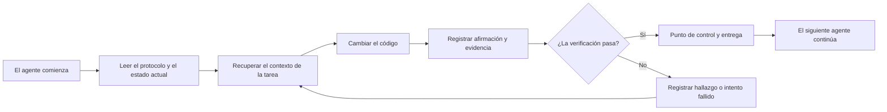

# ArifCE
<p align="center"></p>

[English](../../README.md) · [简体中文](README.zh-CN.md) · [繁體中文](README.zh-TW.md) · [한국어](README.ko.md) · [Deutsch](README.de.md) · [Español](README.es.md) · [Français](README.fr.md) · [Italiano](README.it.md) · [Dansk](README.da.md) · [日本語](README.ja.md) · [Polski](README.pl.md) · [Русский](README.ru.md) · [Bosanski](README.bs.md) · [العربية](README.ar.md) · [Norsk](README.no.md) · [Português (Brasil)](README.pt-BR.md) · [ไทย](README.th.md) · [Türkçe](README.tr.md) · [Українська](README.uk.md) · [বাংলা](README.bn.md) · [Ελληνικά](README.el.md) · [Tiếng Việt](README.vi.md)

**Los agentes cambian. Tu proyecto no debería olvidar.**


[](https://github.com/seekua/ArifCE/actions/workflows/ci.yml) [](https://github.com/seekua/ArifCE/releases/latest) [](../../LICENSE)

ArifCE es una capa local de inteligencia y continuidad del proyecto para el desarrollo de software asistido por IA. Conserva el contexto, las decisiones, los intentos fallidos, las evidencias, el estado de refactorización y la información de entrega en el repositorio para que Codex, Claude Code, OpenCode y los futuros agentes continúen la misma historia de ingeniería.

> El repositorio es dueño del contexto. El agente solo lo toma prestado.


## Por qué existe ArifCE

Los equipos de software pierden tiempo y confianza cuando el contexto importante solo vive en el historial del chat, en la memoria individual o en una herramienta que el siguiente colaborador no puede inspeccionar. ArifCE hace que la continuidad de ingeniería forme parte del propio proyecto.

El objetivo no es que los agentes suenen más seguros. Es ayudar a cada colaborador a entender qué intenta lograr el equipo, por qué se tomó una decisión, qué se ha verificado realmente y dónde queda incertidumbre. Cuando esa historia permanece en el repositorio, los equipos avanzan más rápido sin renunciar a la trazabilidad, la responsabilidad ni la confianza.

ArifCE convierte la continuidad en una práctica de ingeniería compartida: contexto centrado para la siguiente tarea, evidencias explícitas para las afirmaciones importantes y entregas honestas cuando el trabajo está incompleto.

## Para quién es

ArifCE está dirigido a equipos de ingeniería asistidos por IA, desarrolladores que trabajan con agentes de código y mantenedores que necesitan que el contexto del proyecto sobreviva a una persona, chat o sesión. Es especialmente útil cuando varios colaboradores comparten un repositorio y necesitan un registro claro de decisiones, verificaciones y trabajo pendiente.

## Cómo funciona ArifCE



## Explora el proyecto

Ejecuta el panel local para obtener una vista visual de la salud del proyecto, los registros recientes y el contexto buscable:

```powershell
$env:ARIFCE_PROJECT_ROOT = (Get-Location).Path
dotnet run --project src/ArifCE.Dashboard/ArifCE.Dashboard.csproj
```

Después abre <http://127.0.0.1:5180/>. Para consultar el manual completo del producto, visita el [centro de documentación de ArifCE](../README.md).

Este flujo mantiene el conocimiento del proyecto en el repositorio y permite inspeccionar el progreso. Sus ventajas prácticas son:

- Incorporación más rápida: el siguiente agente lee el estado actual centrado en lugar de reconstruir una transcripción extensa.
- Cambios más seguros: las afirmaciones se vinculan a evidencias deterministas y quedan obsoletas cuando cambia el estado de Git.
- Mejor continuidad: las decisiones, los intentos fallidos, los puntos de control y las entregas sobreviven a cambios de agente o sesión.
- Refactorizaciones controladas: las invariantes, el inventario, las protecciones y los puntos seguros hacen visible el trabajo incompleto.
- Funcionamiento local: los archivos canónicos siguen siendo utilizables sin un servicio en la nube ni un entorno específico del proveedor.

## No es solo memoria

ArifCE registra cuál era la tarea, qué cambió y por qué, qué afirma haber completado un agente, qué evidencias respaldan esa afirmación, qué encontró un revisor, qué queda pendiente y qué debe saber el siguiente agente. Las declaraciones de los agentes son afirmaciones, no hechos; se prefieren evidencias deterministas de compilación, pruebas, Git y búsqueda.

La verificación técnica y la aceptación del producto son independientes: los registros de aceptación indican quién aprobó una afirmación y qué evidencia actual respaldó esa decisión.

## Flujo de trabajo V0.1

```text
arifce init
arifce task create "Fix permission cache race"
arifce checkpoint --summary "Reproduction added"
arifce context "finish the permission cache fix" --budget 16000
arifce claim create "Permission cache race is fixed"
arifce verify CLAIM-0001
arifce handoff
```

Los archivos canónicos Markdown, YAML, JSON y JSONL se encuentran en `.arifce/`. SQLite es un índice derivado desechable: eliminar `.arifce/index/` y ejecutar `arifce rebuild` debe conservar la inteligencia del proyecto.

## Arquitectura

El núcleo separa las reglas del dominio, el almacenamiento e indexación canónicos, la observación de Git, la recuperación, la verificación, la refactorización, la seguridad y la CLI. Los archivos de instrucciones del proveedor son adaptadores pequeños y nunca se convierten en el almacén de memoria canónico. Consulta la [visión general de la arquitectura](../architecture/overview.md), el [modelo de dominio](../architecture/domain-model.md) y la [especificación V0.1](../SPECIFICATION-v0.1.md).

## Instalación e inicio rápido

V0.2.0 se publica como una herramienta global .NET multiplataforma. Consulta la [instalación](../getting-started/installation.md) y el [inicio rápido](../getting-started/quick-start.md). Desde el código fuente:

El adaptador MCP local opcional está documentado en [configuración de MCP](../getting-started/mcp.md).

Para una guía completa de instalación y funciones, consulta la [Guía del usuario](../USER-GUIDE.md) y la [Política de documentación](../DOCUMENTATION-POLICY.md).

### 60-second quick start

```bash
dotnet tool install --global ArifCE.Cli --version 0.2.0
mkdir my-project && cd my-project
git init
arifce init
arifce task create "Ship the first change"
arifce checkpoint --summary "Project context initialized"
arifce handoff
```

Ahora tienes un estado del proyecto local al repositorio, una tarea, un punto de control y una entrega semántica lista para el siguiente colaborador.

Si ya tienes un repositorio Git, entra en él y registra su estructura con `adopt`:

```bash
cd path/to/existing-repo
arifce adopt
arifce task create "Ship the first change"
arifce handoff
```

```bash
dotnet restore
dotnet build
dotnet test
dotnet run --project src/ArifCE.Cli -- init
```

Ejecuta `init` en un repositorio Git nuevo o `adopt` en uno existente. Ambos son no destructivos e idempotentes. `adopt` registra la estructura observada y marca como desconocida cualquier justificación histórica desconocida.

## Continuidad, verificación y refactorizaciones

- Un agente nuevo lee `AGENTS.md`, `.arifce/PROTOCOL.md` y `.arifce/CURRENT.md`, y después solicita contexto específico de la tarea en lugar de cargar todo el historial.
- Las afirmaciones enlazan con evidencias del repositorio. Las evidencias quedan obsoletas cuando cambia el estado relevante del repositorio.
- Las campañas de refactorización siguen invariantes, inventario, protecciones, progreso y puntos de control. Las protecciones bloqueantes impiden completar el trabajo.
- Las entregas resumen el estado actual de ingeniería en lugar de volcar transcripciones.

## Seguridad y limitaciones

Las transcripciones sin procesar no son confiables y nunca se cargan ni ejecutan masivamente. Las rutas de importación ocultan secretos comunes; las credenciales y los datos de autenticación de la máquina no pertenecen a `.arifce/`. V0.1 no garantiza corrección, ahorro de tokens ni una mejor calidad de revisión. No incluye servicio en la nube, UI, base de datos vectorial, enjambre autónomo ni invocación productiva entre agentes.

Consulta [ROADMAP.md](../../ROADMAP.md), [SECURITY.md](../../SECURITY.md) y [CONTRIBUTING.md](../../CONTRIBUTING.md). La sintaxis exacta de los comandos implementados está documentada en la [referencia de la CLI](../reference/cli.md).

## Licencia

ArifCE está disponible bajo la [licencia Apache 2.0](../../LICENSE).
### Continúa una tarea con Ollama o LM Studio

ArifCE conserva los registros canónicos del proyecto en el repositorio. El proveedor recibe el prompt y el contexto seleccionado; los proveedores en la nube reciben ese contenido seleccionado de forma remota. `--with-context` añade los registros del proyecto seleccionados por ArifCE, pero no lee archivos de código fuente. Los ejemplos siguientes incluyen explícitamente el contenido del archivo de migración en el prompt para que el modelo reciba el código que debe revisar. Usa el ejemplo correspondiente a tu shell.

Antes de usar cualquiera de los ejemplos, instala e inicia Ollama. El primer comando descarga el modelo `llama3`; deja Ollama en ejecución en el endpoint local indicado abajo.

```bash
ollama pull llama3
arifce llm provider add ollama Ollama llama3 --endpoint http://127.0.0.1:11434
arifce llm provider test ollama
task_id="$(arifce task create "Review and safely update the migration")"
migration_source="$(cat path/to/migration.sql)"
prompt="Review only this SQL migration for data-loss risks. Do not infer unseen source. Suggest the smallest safe change if needed.
Migration source:
$migration_source"
arifce llm run "Review and safely update the migration" "$prompt" --with-context --budget 2000
```

```powershell
ollama pull llama3
arifce llm provider add ollama Ollama llama3 --endpoint http://127.0.0.1:11434
arifce llm provider test ollama
$taskId = arifce task create "Review and safely update the migration"
$migrationSource = Get-Content -Raw -LiteralPath "path/to/migration.sql"
$prompt = @"
Review only this SQL migration for data-loss risks. Do not infer unseen source. Suggest the smallest safe change if needed.
Migration source:
$migrationSource
"@
arifce llm run "Review and safely update the migration" $prompt --with-context --budget 2000
```

Revisa la respuesta del modelo, aplica los cambios propuestos en tu entorno de desarrollo y ejecuta las pruebas de regresión de la migración. Cuando pasen, registra como claim únicamente lo que demuestre el comando de pruebas:

```bash
claim_id="$(arifce claim create "Migration regression tests pass" --task "$task_id")"
arifce verify "$claim_id" --command "dotnet test path/to/migration-tests.csproj"
arifce handoff
```

En PowerShell:

```powershell
$claimId = arifce claim create "Migration regression tests pass" --task $taskId
arifce verify $claimId --command "dotnet test path/to/migration-tests.csproj"
arifce handoff
```

El resultado de las pruebas respalda el claim de que las pruebas de regresión pasan; por sí solo no demuestra que la revisión del modelo fuera completa o correcta. Sustituye las rutas de ejemplo y el comando de prueba por los de tu repositorio. Para LM Studio, indica el nombre del modelo cargado y el endpoint compatible con OpenAI, normalmente `http://127.0.0.1:1234/v1`, en `arifce llm provider add lmstudio LmStudio your-loaded-model --endpoint http://127.0.0.1:1234/v1`.

Después, sigue el mismo flujo de tarea, código fuente, evidencia de pruebas y handoff.

La ejecución de reviewers requiere aprobación explícita. La referencia de [proveedores LLM](../reference/LLM-PROVIDERS.md) documenta el proveedor alternativo, el seguimiento de tokens y costes, las evidencias canónicas, los embeddings, las métricas de benchmark, las herramientas MCP y el dashboard local.

Ejecuta `init` en un repositorio Git nuevo o `adopt` en uno existente. Ambos son idempotentes y no destructivos; `adopt` registra la estructura observada y marca como desconocidas las justificaciones históricas que no se conocen.
### From source

```bash
git clone https://github.com/seekua/ArifCE.git
cd ArifCE
dotnet restore ArifCE.slnx
dotnet build ArifCE.slnx --configuration Release --no-restore
dotnet test ArifCE.slnx --configuration Release --no-build --no-restore
```
