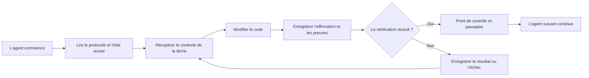

# ArifCE
<p align="center"></p>

**Lire dans une autre langue.**

[English](../../README.md) · [简体中文](README.zh-CN.md) · [繁體中文](README.zh-TW.md) · [한국어](README.ko.md) · [Deutsch](README.de.md) · [Español](README.es.md) · [Français](README.fr.md) · [Italiano](README.it.md) · [Dansk](README.da.md) · [日本語](README.ja.md) · [Polski](README.pl.md) · [Русский](README.ru.md) · [Bosanski](README.bs.md) · [العربية](README.ar.md) · [Norsk](README.no.md) · [Português (Brasil)](README.pt-BR.md) · [ไทย](README.th.md) · [Türkçe](README.tr.md) · [Українська](README.uk.md) · [বাংলা](README.bn.md) · [Ελληνικά](README.el.md) · [Tiếng Việt](README.vi.md)

**Les agents changent. Votre projet ne doit pas oublier.**


[](https://github.com/seekua/ArifCE/actions/workflows/ci.yml) [](https://github.com/seekua/ArifCE/releases/latest) [](../../LICENSE)

ArifCE est une couche locale d’intelligence et de continuité du projet pour le développement logiciel assisté par IA. Elle conserve le contexte, les décisions, les tentatives échouées, les preuves, l’état du refactoring et les informations de passation dans le dépôt, afin que Codex, Claude Code, OpenCode et les futurs agents poursuivent la même histoire d’ingénierie.

> Le dépôt possède le contexte. L’agent ne fait que l’emprunter.

**Votre limite est atteinte ? Poursuivez en deux commandes.**

Une fois le travail effectif sur une tâche existante terminé, enregistrez le transfert de contexte (« handoff ») avant d'arrêter.

```bash
arifce handoff --task TASK-0031

# When you return with Codex, Claude Code, OpenCode, or a local model:
arifce context --task TASK-0031 --budget 2000
```

Ce transfert inclut l'objectif, le travail accompli, les preuves vérifiées, les points en suspens, les échecs et l'action suivante. Copiez le contexte affiché dans l'invite de démarrage du nouvel agent ; l'interface en ligne de commande (CLI) n'injecte pas automatiquement le contexte dans la session du modèle.

## Installation et démarrage rapide

[GitHub Releases](https://github.com/seekua/ArifCE/releases/tag/v0.8.1): Téléchargez l'archive autonome correspondant à votre plateforme depuis la section « Releases » de GitHub, extrayez-la et ajoutez `arifce` à votre variable d'environnement PATH. Sous Linux, veillez à conserver les droits d'exécution lors de l'extraction ou exécutez la commande `chmod +x arifce`. Aucune installation distincte de .NET, Node, Python, Docker ou de base de données n'est requise.

Pour un nouveau projet :

```bash
mkdir my-project && cd my-project
git init
arifce init
arifce task create "Ship the first change"
arifce handoff
```

Pour un dépôt Git existant :

```bash
cd path/to/existing-repo
arifce adopt
arifce task create "Ship the first change"
arifce handoff
```

Utilisez `adopt` lorsque le dépôt contient déjà du code : cela enregistre la structure observée sans l'écraser, puis fournit au prochain agent un point de départ local au projet. [Installation et démarrage rapide](../getting-started/installation.md).

## Pourquoi ArifCE existe

Les équipes logicielles perdent du temps et de la confiance lorsque le contexte important ne vit que dans l’historique des discussions, la mémoire d’une personne ou un outil que le prochain contributeur ne peut pas examiner. ArifCE fait de la continuité d’ingénierie une partie intégrante du projet.

L’objectif n’est pas de faire paraître les agents plus sûrs d’eux. Il est d’aider chaque contributeur à comprendre ce que l’équipe cherche à accomplir, pourquoi une décision a été prise, ce qui a réellement été vérifié et où subsiste l’incertitude. Lorsque cette histoire reste dans le dépôt, les équipes avancent plus vite sans renoncer à la traçabilité, à la responsabilité ni à la confiance.

ArifCE transforme la continuité en pratique d’ingénierie partagée : un contexte ciblé pour la prochaine tâche, des preuves explicites pour les affirmations importantes et des passations honnêtes lorsque le travail est incomplet.

**À qui s’adresse ArifCE.**

ArifCE s’adresse aux équipes d’ingénierie assistées par IA, aux développeurs qui travaillent avec des agents de codage et aux mainteneurs qui ont besoin que le contexte du projet survive à une personne, une discussion ou une session. Il est particulièrement utile lorsque plusieurs contributeurs partagent un dépôt et doivent conserver une trace claire des décisions, de la vérification et du travail inachevé.

## Comment fonctionne ArifCE



## Explorer le projet

Lancez le tableau de bord local pour obtenir une vue visuelle de la santé du projet, des enregistrements récents et du contexte consultable : Cette commande destinée aux développeurs utilise le SDK .NET ; l'installation de la version autonome décrite précédemment ne le nécessite pas.

### Aperçu du tableau de bord

<p align="center">
  
  
  
</p>

```powershell
$env:ARIFCE_PROJECT_ROOT = (Get-Location).Path
dotnet run --project src/ArifCE.Dashboard/ArifCE.Dashboard.csproj
```

Ouvrez ensuite <http://127.0.0.1:5180/>. Pour le guide produit complet, consultez le [centre de documentation ArifCE](../README.md).

Ce flux de travail conserve les connaissances du projet dans le dépôt et rend les progrès vérifiables. Ses avantages pratiques sont les suivants :

- Intégration plus rapide : l’agent suivant lit un état actuel ciblé au lieu de reconstituer une longue transcription.
- Changements plus sûrs : les affirmations sont liées à des preuves déterministes et deviennent obsolètes lorsque l’état Git change.
- Meilleure continuité : décisions, tentatives échouées, points de contrôle et passations survivent aux changements d’agent ou de session.
- Refactorisations contrôlées : invariants, inventaire, garde-fous et points sûrs rendent visible le travail incomplet.
- Local-first operation: canonical files remain usable without a cloud service or vendor-specific runtime.

## Plus qu’une mémoire

ArifCE suit la tâche, les changements et leurs raisons, ce qu’un agent affirme avoir terminé, les preuves qui étayent cette affirmation, les constats du réviseur, ce qui reste inachevé et ce que le prochain agent doit savoir. Les déclarations des agents sont des affirmations, pas des faits ; les preuves déterministes du build, des tests, de Git et de la recherche sont privilégiées.

La vérification technique et l’acceptation du produit sont distinctes : les enregistrements d’acceptation indiquent qui a approuvé une affirmation et quelles preuves actuelles ont justifié cette décision.

## Flux de travail principal

```text
arifce init
arifce task create "Fix permission cache race"
arifce checkpoint --summary "Reproduction added"
arifce context "finish the permission cache fix" --budget 16000
arifce claim create "Permission cache race is fixed"
arifce verify CLAIM-0001
arifce handoff
```

Les fichiers Markdown, YAML, JSON et JSONL canoniques se trouvent sous `.arifce/`. SQLite est un index dérivé supprimable : supprimer `.arifce/index/` puis exécuter `arifce rebuild` doit préserver l’intelligence du projet.

## Architecture

Le cœur sépare les règles métier, le stockage et l’indexation canoniques, l’observation de Git, la récupération, la vérification, la refactorisation, la sécurité et le CLI. Les fichiers d’instructions des fournisseurs sont de petits adaptateurs ; ils ne deviennent jamais le stockage mémoire canonique. Consultez la [vue d’ensemble de l’architecture](../architecture/overview.md), le [modèle de domaine](../architecture/domain-model.md) et la [spécification V0.1](../SPECIFICATION-v0.1.md).

**Développement à partir du code source. La version actuelle est la v0.8.1. Pour le développement à partir du code source, consultez les sections relatives à l'installation et au démarrage rapide.** [Installation et démarrage rapide](../getting-started/installation.md) · [Démarrage rapide](../getting-started/quick-start.md).

```bash
git clone https://github.com/seekua/ArifCE.git
cd ArifCE
dotnet restore ArifCE.slnx
dotnet build ArifCE.slnx --configuration Release --no-restore
dotnet test ArifCE.slnx --configuration Release --no-build --no-restore
```

L’adaptateur MCP local facultatif est décrit dans la [configuration MCP](../getting-started/mcp.md).

Pour une installation complète et une présentation des fonctionnalités, consultez le [guide utilisateur](../USER-GUIDE.md) et la [politique de documentation](../DOCUMENTATION-POLICY.md).

Les commandes d'installation et de démarrage ci-dessus créent un état de projet local au dépôt, une tâche et un transfert de contexte prêts pour le prochain contributeur.

### Poursuivre une tâche avec Ollama ou LM Studio

ArifCE conserve les enregistrements canoniques du projet dans le dépôt. Le fournisseur reçoit le prompt et le contexte sélectionné ; les fournisseurs cloud reçoivent ce contenu sélectionné à distance. `--with-context` ajoute les enregistrements du projet sélectionnés par ArifCE, mais ne lit pas les fichiers source. Les exemples ci-dessous insèrent explicitement le contenu du fichier de migration dans le prompt afin que le modèle reçoive le code qu’il doit examiner. Choisissez l’exemple adapté à votre shell.

Avant d’utiliser l’un ou l’autre exemple, installez et démarrez Ollama. La première commande télécharge le modèle `llama3` ; laissez Ollama actif sur le point de terminaison local indiqué ci-dessous.

```bash
ollama pull llama3
arifce llm provider add ollama Ollama llama3 --endpoint http://127.0.0.1:11434
arifce llm provider test ollama
task_id="$(arifce task create "Review and safely update the migration")"
migration_source="$(cat path/to/migration.sql)"
prompt="Review only this SQL migration for data-loss risks. Do not infer unseen source. Suggest the smallest safe change if needed.
Migration source:
$migration_source"
arifce llm run "Review and safely update the migration" "$prompt" --with-context --budget 2000
```

```powershell
ollama pull llama3
arifce llm provider add ollama Ollama llama3 --endpoint http://127.0.0.1:11434
arifce llm provider test ollama
$taskId = arifce task create "Review and safely update the migration"
$migrationSource = Get-Content -Raw -LiteralPath "path/to/migration.sql"
$prompt = @"
Review only this SQL migration for data-loss risks. Do not infer unseen source. Suggest the smallest safe change if needed.
Migration source:
$migrationSource
"@
arifce llm run "Review and safely update the migration" $prompt --with-context --budget 2000
```

Examinez la réponse du modèle, appliquez les modifications proposées dans votre environnement de développement, puis lancez les tests de régression de la migration. Une fois les tests réussis, ne consignez comme claim que ce que la commande de test établit :

```bash
claim_id="$(arifce claim create "Migration regression tests pass" --task "$task_id")"
arifce verify "$claim_id" --command "dotnet test path/to/migration-tests.csproj"
arifce handoff
```

Dans PowerShell :

```powershell
$claimId = arifce claim create "Migration regression tests pass" --task $taskId
arifce verify $claimId --command "dotnet test path/to/migration-tests.csproj"
arifce handoff
```

Le résultat confirme le claim selon lequel les tests de régression réussissent ; à lui seul, il ne prouve pas que l’examen du modèle était complet ou correct. Remplacez les chemins d’exemple et la commande de test par ceux de votre dépôt. Pour LM Studio, indiquez le nom du modèle chargé et le point de terminaison compatible avec OpenAI, généralement `http://127.0.0.1:1234/v1`, dans `arifce llm provider add lmstudio LmStudio your-loaded-model --endpoint http://127.0.0.1:1234/v1`.

Suivez ensuite le même processus pour la tâche, le code source, les preuves de test et le handoff.

L’exécution d’un reviewer nécessite une approbation explicite. Le [référentiel des fournisseurs LLM](../reference/LLM-PROVIDERS.md) décrit le fournisseur de secours, le suivi des tokens et des coûts, les preuves canoniques, les embeddings, les métriques de benchmark, les outils MCP et le tableau de bord local.

Exécutez `init` dans un nouveau dépôt Git ou `adopt` dans un dépôt existant. Ces deux commandes sont non destructives et idempotentes ; `adopt` consigne la structure observée et marque comme inconnues les raisons historiques qui ne sont pas connues.

## Continuité, vérification et refactorings

- Un nouvel agent lit `AGENTS.md`, `.arifce/PROTOCOL.md` et `.arifce/CURRENT.md`, puis demande le contexte de la tâche au lieu de charger tout l’historique.
- Les affirmations renvoient à des preuves limitées au dépôt. Ces preuves deviennent obsolètes lorsque l’état concerné du dépôt change.
- Les campagnes de refactorisation suivent invariants, inventaire, garde-fous, progression et points de contrôle. Les garde-fous bloquants empêchent la clôture.
- Les passations résument l’état technique actuel au lieu de déverser les transcriptions.

## Sécurité et limitations

Les transcriptions brutes ne sont pas considérées comme fiables et ne font jamais l'objet d'un chargement en masse ou d'une exécution. Les chemins d'importation masquent les secrets courants ; les identifiants et les données d'authentification machine n'ont pas leur place dans `.arifce`. ArifCE ne garantit ni l'exactitude, ni une économie de jetons, ni une meilleure qualité de revue. L'outil ne comporte ni service cloud, ni interface web hébergée, ni base de données vectorielle, ni essaim autonome, ni mécanisme d'appel entre agents en production. Un tableau de bord local est inclus ; il ne s'agit pas d'une application web hébergée.

Consultez [ROADMAP.md](../../ROADMAP.md), [SECURITY.md](../../SECURITY.md) et [CONTRIBUTING.md](../../CONTRIBUTING.md). La syntaxe exacte des commandes implémentées figure dans la [référence CLI](../reference/cli.md).

## Licence

ArifCE est distribué sous [licence Apache 2.0](../../LICENSE).
