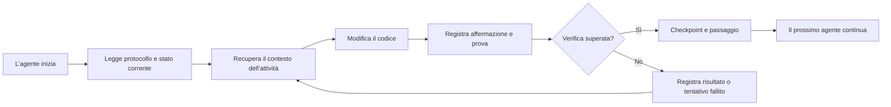

# ArifCE
<p align="center"></p>

[English](../../README.md) · [简体中文](README.zh-CN.md) · [繁體中文](README.zh-TW.md) · [한국어](README.ko.md) · [Deutsch](README.de.md) · [Español](README.es.md) · [Français](README.fr.md) · [Italiano](README.it.md) · [Dansk](README.da.md) · [日本語](README.ja.md) · [Polski](README.pl.md) · [Русский](README.ru.md) · [Bosanski](README.bs.md) · [العربية](README.ar.md) · [Norsk](README.no.md) · [Português (Brasil)](README.pt-BR.md) · [ไทย](README.th.md) · [Türkçe](README.tr.md) · [Українська](README.uk.md) · [বাংলা](README.bn.md) · [Ελληνικά](README.el.md) · [Tiếng Việt](README.vi.md)

**Gli agenti cambiano. Il tuo progetto non deve dimenticare.**


[](https://github.com/seekua/ArifCE/actions/workflows/ci.yml) [](https://github.com/seekua/ArifCE/releases/latest) [](../../LICENSE)

ArifCE è un livello locale di intelligenza e continuità del progetto per lo sviluppo software assistito dall’IA. Conserva contesto, decisioni, tentativi falliti, prove, stato del refactoring e informazioni di passaggio nel repository, così Codex, Claude Code, OpenCode e gli agenti futuri possono continuare la stessa storia ingegneristica.

> Il repository possiede il contesto. L’agente lo prende solo in prestito.


## Perché esiste ArifCE

I team software perdono tempo e fiducia quando il contesto importante vive solo nella cronologia delle chat, nella memoria individuale o in uno strumento che il collaboratore successivo non può ispezionare. ArifCE rende la continuità ingegneristica parte del progetto stesso.

L’obiettivo non è far sembrare gli agenti più sicuri. È aiutare ogni collaboratore a capire cosa il team sta cercando di realizzare, perché è stata presa una decisione, cosa è stato realmente verificato e dove resta l’incertezza. Quando questa storia rimane nel repository, i team possono muoversi più velocemente senza rinunciare a tracciabilità, responsabilità o fiducia.

ArifCE trasforma la continuità in una pratica ingegneristica condivisa: contesto mirato per la prossima attività, prove esplicite per le affermazioni importanti e passaggi onesti quando il lavoro è incompleto.

## A chi è destinato

ArifCE è pensato per team di ingegneria assistiti dall’IA, sviluppatori che lavorano con agenti di coding e maintainer che hanno bisogno che il contesto del progetto sopravviva a una persona, chat o sessione. È particolarmente utile quando più collaboratori condividono un repository e necessitano di un registro chiaro delle decisioni, delle verifiche e del lavoro incompleto.

## Come funziona ArifCE



## Esplora il progetto

Esegui la dashboard locale per ottenere una panoramica visiva della salute del progetto, dei record recenti e del contesto ricercabile:

```powershell
$env:ARIFCE_PROJECT_ROOT = (Get-Location).Path
dotnet run --project src/ArifCE.Dashboard/ArifCE.Dashboard.csproj
```

Apri quindi <http://127.0.0.1:5180/>. Per il manuale completo del prodotto, consulta l’[hub della documentazione ArifCE](../README.md).

Questo flusso mantiene la conoscenza del progetto nel repository e rende il progresso ispezionabile. I vantaggi pratici sono:

- Avvio più rapido: l’agente successivo legge uno stato attuale mirato invece di ricostruire una lunga trascrizione.
- Modifiche più sicure: le affermazioni sono collegate a prove deterministiche e diventano obsolete quando cambia lo stato Git.
- Continuità migliore: decisioni, tentativi falliti, checkpoint e passaggi di consegne sopravvivono ai cambiamenti di agente o sessione.
- Refactoring controllati: invarianti, inventario, protezioni e punti sicuri rendono visibile il lavoro incompleto.
- Local-first operation: canonical files remain usable without a cloud service or vendor-specific runtime.

## Non solo memoria

ArifCE tiene traccia dell’attività, di ciò che è cambiato e del motivo, di ciò che un agente dichiara completato, delle prove che sostengono tale dichiarazione, di ciò che ha rilevato un revisore, di ciò che resta incompiuto e di ciò che deve sapere l’agente successivo. Le affermazioni degli agenti sono dichiarazioni, non fatti; si preferiscono prove deterministiche di build, test, Git e ricerca.

La verifica tecnica e l’accettazione del prodotto sono separate: i record di accettazione indicano chi ha approvato un’affermazione e quali prove attuali hanno sostenuto la decisione.

## Flusso di lavoro V0.1

```text
arifce init
arifce task create "Fix permission cache race"
arifce checkpoint --summary "Reproduction added"
arifce context "finish the permission cache fix" --budget 16000
arifce claim create "Permission cache race is fixed"
arifce verify CLAIM-0001
arifce handoff
```

Markdown, YAML, JSON e JSONL canonici risiedono in `.arifce/`. SQLite è un indice derivato eliminabile: cancellare `.arifce/index/` ed eseguire `arifce rebuild` deve preservare l’intelligenza del progetto.

## Architettura

Il nucleo separa le dominio, l’archiviazione e l’indicizzazione canoniche, l’osservazione di Git, il recupero, la verifica, il refactoring, la sicurezza e la CLI. I file di istruzioni dei fornitori sono piccoli adattatori e non diventano mai l’archivio di memoria canonico. Consulta la [panoramica dell’architettura](../architecture/overview.md), il [modello di dominio](../architecture/domain-model.md) e la [specifica V0.1](../SPECIFICATION-v0.1.md).

## Installazione e avvio rapido

V0.2.0 è pubblicato come strumento globale .NET multipiattaforma. Consulta [installazione](../getting-started/installation.md) e [avvio rapido](../getting-started/quick-start.md). Dal codice sorgente:

L’adattatore MCP locale opzionale è documentato in [configurazione MCP](../getting-started/mcp.md).

Per una guida completa all’installazione e alle funzionalità, consulta la [Guida utente](../USER-GUIDE.md) e la [Politica della documentazione](../DOCUMENTATION-POLICY.md).

### 60-second quick start

```bash
dotnet tool install --global ArifCE.Cli --version 0.2.0
mkdir my-project && cd my-project
git init
arifce init
arifce task create "Ship the first change"
arifce checkpoint --summary "Project context initialized"
arifce handoff
```

Ora disponi di uno stato del progetto locale al repository, un’attività, un checkpoint e un passaggio semantico pronto per il prossimo collaboratore.

Se hai già un repository Git, aprilo e registra la struttura con `adopt`:

```bash
cd path/to/existing-repo
arifce adopt
arifce task create "Ship the first change"
arifce handoff
```

```bash
dotnet restore
dotnet build
dotnet test
dotnet run --project src/ArifCE.Cli -- init
```

Esegui `init` in un nuovo repository Git oppure `adopt` in uno esistente. Entrambi sono non distruttivi e idempotenti. `adopt` registra la struttura osservata e indica come sconosciute le motivazioni storiche non note.

## Continuità, verifica e refactoring

- Un agente appena avviato legge `AGENTS.md`, `.arifce/PROTOCOL.md` e `.arifce/CURRENT.md`, poi richiede il contesto specifico dell’attività invece di caricare tutta la cronologia.
- Le affermazioni collegano prove circoscritte al repository. Le prove diventano obsolete quando cambia lo stato rilevante del repository.
- Le campagne di refactoring tracciano invarianti, inventario, guardrail, progresso e checkpoint. I guardrail bloccanti impediscono il completamento.
- I passaggi riassumono lo stato ingegneristico corrente invece di riversare trascrizioni.

## Sicurezza e limitazioni

Le trascrizioni grezze non sono attendibili e non vengono mai caricate o eseguite in massa. I percorsi di importazione oscurano i segreti comuni; credenziali e dati di autenticazione della macchina non appartengono a `.arifce/`. V0.1 non garantisce correttezza, risparmio di token o una qualità di revisione migliore. Non include servizio cloud, UI, database vettoriale, swarm autonomo né invocazioni produttive tra agenti.

Consulta [ROADMAP.md](../../ROADMAP.md), [SECURITY.md](../../SECURITY.md) e [CONTRIBUTING.md](../../CONTRIBUTING.md). La sintassi esatta dei comandi implementati è documentata nel [riferimento CLI](../reference/cli.md).

## Licenza

ArifCE è distribuito con la [licenza Apache 2.0](../../LICENSE).
### Continua un'attività con Ollama o LM Studio

ArifCE conserva i record canonici del progetto nel repository. Il provider riceve il prompt e il contesto selezionato; i provider cloud ricevono da remoto i contenuti selezionati. `--with-context` aggiunge i record del progetto selezionati da ArifCE, ma non legge i file sorgente. Gli esempi qui sotto inseriscono esplicitamente nel prompt il contenuto del file di migrazione, così il modello riceve il codice da esaminare. Usa l'esempio adatto alla tua shell.

```bash
arifce llm provider add ollama Ollama llama3 --endpoint http://127.0.0.1:11434
arifce llm provider test ollama
task_id="$(arifce task create "Review and safely update the migration")"
migration_source="$(cat path/to/migration.sql)"
prompt="Review only this SQL migration for data-loss risks. Do not infer unseen source. Suggest the smallest safe change if needed.
Migration source:
$migration_source"
arifce llm run "Review and safely update the migration" "$prompt" --with-context --budget 2000
```

```powershell
arifce llm provider add ollama Ollama llama3 --endpoint http://127.0.0.1:11434
arifce llm provider test ollama
$taskId = arifce task create "Review and safely update the migration"
$migrationSource = Get-Content -Raw -LiteralPath "path/to/migration.sql"
$prompt = @"
Review only this SQL migration for data-loss risks. Do not infer unseen source. Suggest the smallest safe change if needed.
Migration source:
$migrationSource
"@
arifce llm run "Review and safely update the migration" $prompt --with-context --budget 2000
```

Esamina la risposta del modello, applica le eventuali modifiche proposte nel tuo ambiente di sviluppo ed esegui i test di regressione della migrazione. Dopo il superamento dei test, registra come claim solo ciò che il comando di test dimostra:

```bash
claim_id="$(arifce claim create "Migration regression tests pass" --task "$task_id")"
arifce verify "$claim_id" --command "dotnet test path/to/migration-tests.csproj"
arifce handoff
```

In PowerShell:

```powershell
$claimId = arifce claim create "Migration regression tests pass" --task $taskId
arifce verify $claimId --command "dotnet test path/to/migration-tests.csproj"
arifce handoff
```

Il risultato dei test supporta il claim che i test di regressione sono superati; da solo non dimostra che la revisione del modello fosse completa o corretta. Sostituisci i percorsi di esempio e il comando di test con quelli del tuo repository. Per LM Studio, specifica il nome del modello caricato e l'endpoint compatibile con OpenAI, in genere `http://127.0.0.1:1234/v1`, nel comando `arifce llm provider add lmstudio LmStudio your-loaded-model --endpoint http://127.0.0.1:1234/v1`.

Poi segui lo stesso flusso per attività, codice sorgente, prove dei test e handoff.

L'esecuzione di un reviewer richiede un'approvazione esplicita. La [guida ai provider LLM](../reference/LLM-PROVIDERS.md) descrive il fallback dei provider, il monitoraggio di token e costi, le prove canoniche, gli embedding, le metriche di benchmark, gli strumenti MCP e la dashboard locale.

Esegui `init` in un nuovo repository Git o `adopt` in uno esistente. Entrambi sono non distruttivi e idempotenti; `adopt` registra la struttura osservata e contrassegna come sconosciute le motivazioni storiche non note.
### From source

```bash
git clone https://github.com/seekua/ArifCE.git
cd ArifCE
dotnet restore ArifCE.slnx
dotnet build ArifCE.slnx --configuration Release --no-restore
dotnet test ArifCE.slnx --configuration Release --no-build --no-restore
```
