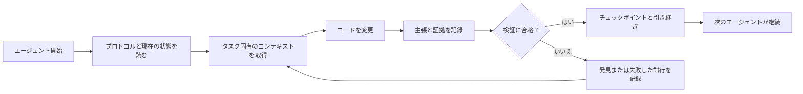

# ArifCE
<p align="center"></p>

[English](../../README.md) · [简体中文](README.zh-CN.md) · [繁體中文](README.zh-TW.md) · [한국어](README.ko.md) · [Deutsch](README.de.md) · [Español](README.es.md) · [Français](README.fr.md) · [Italiano](README.it.md) · [Dansk](README.da.md) · [日本語](README.ja.md) · [Polski](README.pl.md) · [Русский](README.ru.md) · [Bosanski](README.bs.md) · [العربية](README.ar.md) · [Norsk](README.no.md) · [Português (Brasil)](README.pt-BR.md) · [ไทย](README.th.md) · [Türkçe](README.tr.md) · [Українська](README.uk.md) · [বাংলা](README.bn.md) · [Ελληνικά](README.el.md) · [Tiếng Việt](README.vi.md)

**エージェントは変わる。プロジェクトは忘れてはいけない。**


[](https://github.com/seekua/ArifCE/actions/workflows/ci.yml) [](https://github.com/seekua/ArifCE/releases/latest) [](../../LICENSE)

ArifCE は AI 支援ソフトウェア開発のためのローカル優先のプロジェクト知能・継続性レイヤーです。コンテキスト、決定、失敗した試行、証拠、リファクタリング状態、引き継ぎ情報をリポジトリに保持し、Codex、Claude Code、OpenCode、将来のエージェントが同じ開発の物語を続けられるようにします。

> リポジトリがコンテキストを所有し、エージェントはそれを借りるだけです。


## ArifCE が存在する理由

重要なコンテキストがチャット履歴や個人の記憶、次の貢献者が確認できないツールにしか存在しないと、ソフトウェアチームは時間と信頼を失います。ArifCE は開発の継続性をプロジェクトそのものの一部にします。

目的はエージェントをより確信ありげに聞こえさせることではありません。チームの目標、決定の理由、実際に検証されたこと、残る不確実性をすべての貢献者が理解できるようにすることです。その物語がリポジトリに残れば、追跡可能性、責任、信頼を失わずにチームはより速く進めます。

ArifCE は継続性を共有された開発の実践に変えます。次のタスクに集中したコンテキスト、重要な主張を裏付ける明示的な証拠、作業が未完了のときの正直な引き継ぎを提供します。

## 対象ユーザー

ArifCE は AI 支援の開発チーム、コーディングエージェントを使う開発者、そして一人の担当者・チャット・セッションを越えてプロジェクトのコンテキストを残したいメンテナー向けです。複数の貢献者がリポジトリを共有し、決定、検証、未完了作業の明確な記録を必要とする場合に特に役立ちます。

## ArifCE の仕組み



## プロジェクトを探索する

ローカルダッシュボードを起動すると、プロジェクトの健全性、最近の記録、検索可能なコンテキストを視覚的に確認できます。

```powershell
$env:ARIFCE_PROJECT_ROOT = (Get-Location).Path
dotnet run --project src/ArifCE.Dashboard/ArifCE.Dashboard.csproj
```

次に <http://127.0.0.1:5180/> を開きます。完全な製品ハンドブックは [ArifCE ドキュメントハブ](../README.md) を参照してください。

このワークフローはプロジェクトの知識をリポジトリに保持し、進捗を確認可能にします。実用上の利点は次のとおりです。

- 導入が速い: 次のエージェントは長い記録を再構成せず、整理された現在の状態を読み取れます。
- より安全な変更: 主張は決定的な証拠にリンクされ、Git の状態が変わると古くなります。
- 継続性の向上: 決定、失敗した試行、チェックポイント、引き継ぎは変更後も残ります。
- 制御されたリファクタリング: 不変条件、インベントリ、ガード、安全なポイントにより未完了の作業を可視化します。
- ローカル優先の運用: 正規ファイルはクラウドサービスなしで利用できます。

## 単なる記憶ではない

ArifCE はタスクの内容、変更点と理由、エージェントが完了したと主張する内容、その主張を支える証拠、レビュアーの発見、未完了の事項、次のエージェントが知るべきことを追跡します。エージェントの発言は事実ではなく主張です。決定的なビルド、テスト、Git、検索の証拠を優先します。

技術的な検証と製品の受け入れは別です。受け入れ記録には、誰が主張を承認したか、どの現在の証拠がその判断を支えたかが記録されます。

## V0.1 ワークフロー

```text
arifce init
arifce task create "Fix permission cache race"
arifce checkpoint --summary "Reproduction added"
arifce context "finish the permission cache fix" --budget 16000
arifce claim create "Permission cache race is fixed"
arifce verify CLAIM-0001
arifce handoff
```

正規の Markdown、YAML、JSON、JSONL は `.arifce/` にあります。SQLite は破棄可能な派生インデックスです。.arifce/index/` を削除して `arifce rebuild` を実行しても、プロジェクト知能は保持されなければなりません。

## アーキテクチャ

コアはドメインルール、正規ストレージとインデックス、Git の監視、取得、検証、リファクタリング、セキュリティ、CLI を分離します。ベンダーの指示ファイルは小さなアダプターであり、正規のメモリーストアにはなりません。[アーキテクチャ概要](../architecture/overview.md)、[ドメインモデル](../architecture/domain-model.md)、[V0.1 仕様](../SPECIFICATION-v0.1.md)を参照してください。

## インストールとクイックスタート

V0.2.0 はクロスプラットフォームの .NET グローバルツールとして公開されています。[インストール](../getting-started/installation.md)と[クイックスタート](../getting-started/quick-start.md)を参照してください。ソースから実行する場合:

オプションのローカル MCP アダプターについては [MCP セットアップ](../getting-started/mcp.md) に記載しています。

インストールと機能の完全な手順は、[ユーザーガイド](../USER-GUIDE.md)と[ドキュメントポリシー](../DOCUMENTATION-POLICY.md)を参照してください。

### 60-second quick start

```bash
dotnet tool install --global ArifCE.Cli --version 0.2.0
mkdir my-project && cd my-project
git init
arifce init
arifce task create "Ship the first change"
arifce checkpoint --summary "Project context initialized"
arifce handoff
```

これで、リポジトリに紐づくプロジェクト状態、タスク、チェックポイント、次の貢献者に渡せる意味のある引き継ぎが揃いました。

既存の Git リポジトリで作業する場合は、そのリポジトリへ移動して `adopt` で構成を記録します。

```bash
cd path/to/existing-repo
arifce adopt
arifce task create "Ship the first change"
arifce handoff
```

```bash
dotnet restore
dotnet build
dotnet test
dotnet run --project src/ArifCE.Cli -- init
```

新しい Git リポジトリでは `init`、既存のリポジトリでは `adopt` を実行します。どちらも非破壊で冪等です。`adopt` は確認した構造を記録し、不明な過去の理由を不明として扱います。

## 継続性、検証、リファクタリング

- 新しいエージェントは `AGENTS.md`、`.arifce/PROTOCOL.md`、`.arifce/CURRENT.md` を読み、履歴を一括読み込みせずタスク固有のコンテキストを要求します。
- 主張はリポジトリ範囲の証拠にリンクされます。関連する状態が変わると証拠は古くなります。
- リファクタリング作業では不変条件、インベントリ、ガード、進捗、チェックポイントを追跡します。ブロッキングガードは完了を防ぎます。
- 引き継ぎはトランスクリプトをそのまま渡さず、現在の開発状態を要約します。

## セキュリティと制限

生のトランスクリプトは信頼できないため、一括読み込みや実行は行いません。インポート経路では一般的な秘密情報を伏せ字にします。認証情報やマシン認証データを `.arifce/` に置かないでください。V0.1 は正確性、トークン削減、レビュー品質の向上を保証しません。クラウドサービス、UI、ベクトルデータベース、自律スウォーム、本番環境のエージェント間呼び出しもありません。

詳しくは [ROADMAP.md](../../ROADMAP.md)、[SECURITY.md](../../SECURITY.md)、[CONTRIBUTING.md](../../CONTRIBUTING.md) を参照してください。実装済みコマンドの正確な構文は [CLI リファレンス](../reference/cli.md) に記載しています。

## ライセンス

ArifCE は [Apache License 2.0](../../LICENSE) の下でライセンスされています。
### Ollama または LM Studio でタスクを続ける

ArifCE はプロジェクトの正規記録をリポジトリ内に保持します。プロバイダーにはプロンプトと選択されたコンテキストが渡され、クラウドプロバイダーにはその選択内容がリモート送信されます。`--with-context` は ArifCE が選んだプロジェクト記録を追加しますが、ソースファイルは読み込みません。以下の例では、レビュー対象のコードをモデルが受け取るよう、マイグレーションファイルの内容を明示的にプロンプトへ入れます。使用するシェルに合った例を選んでください。

どちらの例を使う場合も、先に Ollama をインストールして起動してください。最初のコマンドで `llama3` モデルをダウンロードします。Ollama は以下に示すローカルエンドポイントで起動したままにしてください。

```bash
ollama pull llama3
arifce llm provider add ollama Ollama llama3 --endpoint http://127.0.0.1:11434
arifce llm provider test ollama
task_id="$(arifce task create "Review and safely update the migration")"
migration_source="$(cat path/to/migration.sql)"
prompt="Review only this SQL migration for data-loss risks. Do not infer unseen source. Suggest the smallest safe change if needed.
Migration source:
$migration_source"
arifce llm run "Review and safely update the migration" "$prompt" --with-context --budget 2000
```

```powershell
ollama pull llama3
arifce llm provider add ollama Ollama llama3 --endpoint http://127.0.0.1:11434
arifce llm provider test ollama
$taskId = arifce task create "Review and safely update the migration"
$migrationSource = Get-Content -Raw -LiteralPath "path/to/migration.sql"
$prompt = @"
Review only this SQL migration for data-loss risks. Do not infer unseen source. Suggest the smallest safe change if needed.
Migration source:
$migrationSource
"@
arifce llm run "Review and safely update the migration" $prompt --with-context --budget 2000
```

モデルの回答を確認し、提案された変更があれば開発環境で適用してから、マイグレーションの回帰テストを実行してください。テストに通った後、テストコマンドが実際に証明する内容だけを claim として記録します。

```bash
claim_id="$(arifce claim create "Migration regression tests pass" --task "$task_id")"
arifce verify "$claim_id" --command "dotnet test path/to/migration-tests.csproj"
arifce handoff
```

PowerShell の場合：

```powershell
$claimId = arifce claim create "Migration regression tests pass" --task $taskId
arifce verify $claimId --command "dotnet test path/to/migration-tests.csproj"
arifce handoff
```

テスト結果は「回帰テストが通る」という claim を裏付けますが、それだけでモデルのレビューが完全または正確だったとは証明できません。例のパスとテストコマンドは、実際のリポジトリに合わせて置き換えてください。LM Studio の場合は、読み込み済みモデル名と OpenAI 互換エンドポイント（通常は `http://127.0.0.1:1234/v1`）を指定して、`arifce llm provider add lmstudio LmStudio your-loaded-model --endpoint http://127.0.0.1:1234/v1` を実行します。

以降も同じタスク、ソース入力、テスト証拠、handoff の流れを使います。

Reviewer の実行には明示的な承認が必要です。代替プロバイダー、トークンとコストの記録、正規証拠、埋め込み、ベンチマーク指標、MCP ツール、ローカルダッシュボードについては [LLM プロバイダーリファレンス](../reference/LLM-PROVIDERS.md)を参照してください。

新しい Git リポジトリでは `init`、既存のリポジトリでは `adopt` を実行します。どちらも非破壊的で何度でも実行でき、`adopt` は検出した構成を記録し、分からない過去の理由は不明として扱います。
### From source

```bash
git clone https://github.com/seekua/ArifCE.git
cd ArifCE
dotnet restore ArifCE.slnx
dotnet build ArifCE.slnx --configuration Release --no-restore
dotnet test ArifCE.slnx --configuration Release --no-build --no-restore
```
