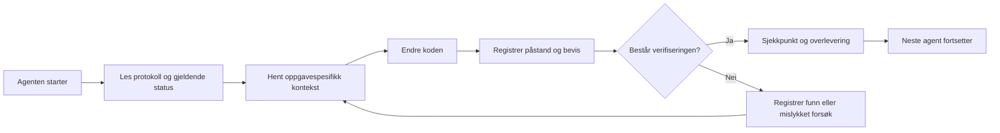

# ArifCE
<p align="center"></p>

[English](../../README.md) · [简体中文](README.zh-CN.md) · [繁體中文](README.zh-TW.md) · [한국어](README.ko.md) · [Deutsch](README.de.md) · [Español](README.es.md) · [Français](README.fr.md) · [Italiano](README.it.md) · [Dansk](README.da.md) · [日本語](README.ja.md) · [Polski](README.pl.md) · [Русский](README.ru.md) · [Bosanski](README.bs.md) · [العربية](README.ar.md) · [Norsk](README.no.md) · [Português (Brasil)](README.pt-BR.md) · [ไทย](README.th.md) · [Türkçe](README.tr.md) · [Українська](README.uk.md) · [বাংলা](README.bn.md) · [Ελληνικά](README.el.md) · [Tiếng Việt](README.vi.md)

**Agenter endrer seg. Prosjektet ditt bør ikke glemme.**


[](https://github.com/seekua/ArifCE/actions/workflows/ci.yml) [](https://github.com/seekua/ArifCE/releases/latest) [](../../LICENSE)

ArifCE er et lokalt først-lag for prosjektintelligens og kontinuitet i AI-assistert programvareutvikling. Det oppbevarer kontekst, beslutninger, mislykkede forsøk, bevis, refaktoreringstilstand og overleveringsinformasjon i repositoriet, slik at Codex, Claude Code, OpenCode og fremtidige agenter kan fortsette den samme utviklingshistorien.

> Repositoriet eier konteksten. Agenten låner den bare.


## Hvorfor ArifCE finnes

Programvareteam mister tid og tillit når viktig kontekst bare finnes i chathistorikk, individuell hukommelse eller et verktøy neste bidragsyter ikke kan inspisere. ArifCE gjør kontinuitet i utviklingen til en del av selve prosjektet.

Målet er ikke å få agenter til å høres sikrere ut. Målet er å hjelpe alle bidragsytere med å forstå hva teamet prøver å oppnå, hvorfor en beslutning ble tatt, hva som faktisk er verifisert og hvor usikkerhet gjenstår. Når historien blir i repositoriet, kan team bevege seg raskere uten å gi avkall på sporbarhet, eierskap eller tillit.

ArifCE gjør kontinuitet til en felles ingeniørpraksis: fokusert kontekst for neste oppgave, tydelige bevis for viktige påstander og ærlige overleveringer når arbeidet er ufullstendig.

## Hvem det er for

ArifCE er for AI-assisterte ingeniørteam, utviklere som arbeider med kodeagenter og vedlikeholdere som trenger at prosjektkontekst overlever én person, chat eller økt. Det er spesielt nyttig når flere bidragsytere deler et repository og trenger en tydelig oversikt over beslutninger, verifisering og uferdig arbeid.

## Slik fungerer ArifCE



## Utforsk prosjektet

Kjør det lokale dashbordet for en visuell oversikt over prosjektets helse, nylige poster og søkbar kontekst:

```powershell
$env:ARIFCE_PROJECT_ROOT = (Get-Location).Path
dotnet run --project src/ArifCE.Dashboard/ArifCE.Dashboard.csproj
```

Åpne deretter <http://127.0.0.1:5180/>. Se [ArifCE-dokumentasjonshuben](../README.md) for den komplette produkthåndboken.

Denne arbeidsflyten holder prosjektkunnskap i repositoriet og gjør fremdriften etterprøvbar. De praktiske fordelene er:

- Raskere innføring: neste agent leser en konsentrert gjeldende status i stedet for å rekonstruere en lang utskrift.
- Sikrere endringer: påstander kobles til deterministiske bevis og blir utdaterte når Git-statusen endres.
- Bedre kontinuitet: beslutninger, mislykkede forsøk, sjekkpunkter og overleveringer overlever agent- og øktbytter.
- Kontrollerte refaktoreringer: invarians, inventar, vakter og sikre punkter synliggjør uferdig arbeid.
- Lokal først-drift: kanoniske filer kan brukes uten skytjeneste eller leverandørspesifikk kjøretid.

## Mer enn bare minne

ArifCE sporer hva oppgaven var, hva som ble endret og hvorfor, hva en agent hevder å ha fullført, hvilke bevis som støtter påstanden, hva en gjennomgåer fant, hva som gjenstår og hva neste agent må vite. Agentutsagn er påstander, ikke fakta; deterministiske bygge-, test-, Git- og søkebevis foretrekkes.

Teknisk verifisering og produktgodkjenning er separate: godkjenningsposter viser hvem som godkjente en påstand og hvilke aktuelle bevis som støttet avgjørelsen.

## V0.1-arbeidsflyt

```text
arifce init
arifce task create "Fix permission cache race"
arifce checkpoint --summary "Reproduction added"
arifce context "finish the permission cache fix" --budget 16000
arifce claim create "Permission cache race is fixed"
arifce verify CLAIM-0001
arifce handoff
```

Kanoniske Markdown-, YAML-, JSON- og JSONL-filer ligger under `.arifce/`. SQLite er en avledet indeks som kan slettes: sletting av `.arifce/index/` og kjøring av `arifce rebuild` skal bevare prosjektintelligensen.

## Arkitektur

Kjernen skiller domeneregler, kanonisk lagring og indeksering, Git-observasjon, henting, verifisering, refaktorering, sikkerhet og CLI. Leverandørens instruksjonsfiler er små adaptere og blir aldri det kanoniske minnelageret. Se [arkitekturoversikten](../architecture/overview.md), [domenemodellen](../architecture/domain-model.md) og [V0.1-spesifikasjonen](../SPECIFICATION-v0.1.md).

## Installasjon og hurtigstart

V0.2.0 er publisert som et plattformuavhengig .NET-globalverktøy. Se [installasjon](../getting-started/installation.md) og [hurtigstart](../getting-started/quick-start.md). Fra kildekode:

Den valgfrie lokale MCP-adapteren er dokumentert i [MCP-oppsett](../getting-started/mcp.md).

For en komplett gjennomgang av installasjon og funksjoner, se [brukerveiledningen](../USER-GUIDE.md) og [dokumentasjonspolicyen](../DOCUMENTATION-POLICY.md).

### 60-second quick start

```bash
dotnet tool install --global ArifCE.Cli --version 0.2.0
mkdir my-project && cd my-project
git init
arifce init
arifce task create "Ship the first change"
arifce checkpoint --summary "Project context initialized"
arifce handoff
```

Du har nå en repository-lokal prosjektstatus, en oppgave, et sjekkpunkt og en semantisk overlevering klar for neste bidragsyter.

Hvis du allerede har et Git-repositorium, går du dit og registrerer strukturen med `adopt`:

```bash
cd path/to/existing-repo
arifce adopt
arifce task create "Ship the first change"
arifce handoff
```

```bash
dotnet restore
dotnet build
dotnet test
dotnet run --project src/ArifCE.Cli -- init
```

Kjør `init` i et nytt Git-repositorium eller `adopt` i et eksisterende. Begge er ikke-destruktive og idempotente. `adopt` registrerer observert struktur og merker ukjente historiske begrunnelser som ukjente.

## Kontinuitet, verifisering og refaktorering

- En ny agent leser `AGENTS.md`, `.arifce/PROTOCOL.md` og `.arifce/CURRENT.md`, og ber deretter om oppgavespesifikk kontekst i stedet for å laste inn hele historikken.
- Påstander lenker til bevis avgrenset til repositoriet. Bevis blir utdatert når relevant repository-status endres.
- Refaktoreringer sporer invarians, inventar, vakter, fremdrift og sjekkpunkter. Blokkerende vakter hindrer fullføring.
- Overleveringer oppsummerer gjeldende ingeniørstatus i stedet for å dumpe transkripsjoner.

## Sikkerhet og begrensninger

Rå transkripsjoner er upålitelige og lastes eller kjøres aldri i bulk. Importbaner redigerer vanlige hemmeligheter; legitimasjon og maskinautentisering hører ikke hjemme i `.arifce/`. V0.1 garanterer ikke korrekthet, tokenbesparelser eller bedre gjennomgangskvalitet. Det finnes ingen skytjeneste, UI, vektordatabase, autonom sverm eller produksjonskall mellom agenter.

Se [ROADMAP.md](../../ROADMAP.md), [SECURITY.md](../../SECURITY.md) og [CONTRIBUTING.md](../../CONTRIBUTING.md). Den nøyaktige syntaksen for implementerte kommandoer er dokumentert i [CLI-referansen](../reference/cli.md).

## Lisens

ArifCE er lisensiert under [Apache License 2.0](../../LICENSE).
### Fortsett en oppgave med Ollama eller LM Studio

ArifCE lagrer kanoniske prosjektoppføringer i repositoriet. Leverandøren mottar prompten og valgt kontekst; skyleverandører mottar det valgte innholdet eksternt. `--with-context` legger til prosjektoppføringene ArifCE har valgt, men leser ikke kildefiler. Eksemplene nedenfor legger uttrykkelig innholdet fra migreringsfilen inn i prompten, slik at modellen får koden den blir bedt om å undersøke. Velg eksempelet for skallet ditt.

```bash
arifce llm provider add ollama Ollama llama3 --endpoint http://127.0.0.1:11434
arifce llm provider test ollama
task_id="$(arifce task create "Review and safely update the migration")"
migration_source="$(cat path/to/migration.sql)"
prompt="Review only this SQL migration for data-loss risks. Do not infer unseen source. Suggest the smallest safe change if needed.
Migration source:
$migration_source"
arifce llm run "Review and safely update the migration" "$prompt" --with-context --budget 2000
```

```powershell
arifce llm provider add ollama Ollama llama3 --endpoint http://127.0.0.1:11434
arifce llm provider test ollama
$taskId = arifce task create "Review and safely update the migration"
$migrationSource = Get-Content -Raw -LiteralPath "path/to/migration.sql"
$prompt = @"
Review only this SQL migration for data-loss risks. Do not infer unseen source. Suggest the smallest safe change if needed.
Migration source:
$migrationSource
"@
arifce llm run "Review and safely update the migration" $prompt --with-context --budget 2000
```

Gå gjennom modellens svar, bruk eventuelle foreslåtte endringer i utviklingsverktøyet ditt, og kjør regresjonstestene for migreringen. Når de består, registrerer du bare det testkommandoen beviser som en claim:

```bash
claim_id="$(arifce claim create "Migration regression tests pass" --task "$task_id")"
arifce verify "$claim_id" --command "dotnet test path/to/migration-tests.csproj"
arifce handoff
```

I PowerShell:

```powershell
$claimId = arifce claim create "Migration regression tests pass" --task $taskId
arifce verify $claimId --command "dotnet test path/to/migration-tests.csproj"
arifce handoff
```

Testresultatet støtter claimen om at regresjonstestene består; det beviser ikke i seg selv at modellens gjennomgang var fullstendig eller korrekt. Bytt ut eksempelstiene og testkommandoen med dem fra repositoriet ditt. For LM Studio bruker du navnet på den innlastede modellen og det OpenAI-kompatible endepunktet, vanligvis `http://127.0.0.1:1234/v1`, i `arifce llm provider add lmstudio LmStudio your-loaded-model --endpoint http://127.0.0.1:1234/v1`.

Følg deretter samme flyt for oppgaven, kildekoden, testbeviset og overleveringen.

Kjøring av reviewer krever uttrykkelig godkjenning. Leverandørreserve, token-/kostnadssporing, kanonisk evidens, embeddings, benchmarkmålinger, MCP-verktøy og lokalt dashbord er beskrevet i [LLM-leverandørreferansen](../reference/LLM-PROVIDERS.md).

Kjør `init` i et nytt Git-repositorium eller `adopt` i et eksisterende. Begge er ikke-destruktive og idempotente; `adopt` registrerer observert struktur og markerer ukjente historiske begrunnelser som ukjente.
### From source

```bash
git clone https://github.com/seekua/ArifCE.git
cd ArifCE
dotnet restore ArifCE.slnx
dotnet build ArifCE.slnx --configuration Release --no-restore
dotnet test ArifCE.slnx --configuration Release --no-build --no-restore
```
