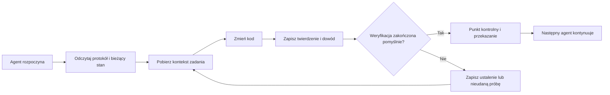

# ArifCE
<p align="center"></p>

[English](../../README.md) · [简体中文](README.zh-CN.md) · [繁體中文](README.zh-TW.md) · [한국어](README.ko.md) · [Deutsch](README.de.md) · [Español](README.es.md) · [Français](README.fr.md) · [Italiano](README.it.md) · [Dansk](README.da.md) · [日本語](README.ja.md) · [Polski](README.pl.md) · [Русский](README.ru.md) · [Bosanski](README.bs.md) · [العربية](README.ar.md) · [Norsk](README.no.md) · [Português (Brasil)](README.pt-BR.md) · [ไทย](README.th.md) · [Türkçe](README.tr.md) · [Українська](README.uk.md) · [বাংলা](README.bn.md) · [Ελληνικά](README.el.md) · [Tiếng Việt](README.vi.md)

**Agenci się zmieniają. Twój projekt nie powinien zapominać.**


[](https://github.com/seekua/ArifCE/actions/workflows/ci.yml) [](https://github.com/seekua/ArifCE/releases/latest) [](../../LICENSE)

ArifCE to lokalna warstwa inteligencji i ciągłości projektu dla programowania wspomaganego przez AI. Przechowuje kontekst, decyzje, nieudane próby, dowody, stan refaktoryzacji i informacje o przekazaniu w repozytorium, aby Codex, Claude Code, OpenCode i przyszli agenci mogli kontynuować tę samą historię inżynierską.

> Repozytorium posiada kontekst. Agent tylko go wypożycza.


## Dlaczego istnieje ArifCE

Zespoły programistyczne tracą czas i zaufanie, gdy ważny kontekst znajduje się wyłącznie w historii czatu, pamięci pojedynczej osoby lub narzędziu, którego kolejny współtwórca nie może sprawdzić. ArifCE sprawia, że ciągłość prac inżynierskich staje się częścią samego projektu.

Celem nie jest sprawienie, by agenci brzmieli pewniej. Chodzi o to, aby każdy współtwórca rozumiał, co zespół chce osiągnąć, dlaczego podjęto decyzję, co faktycznie zweryfikowano i gdzie pozostaje niepewność. Gdy ta historia pozostaje w repozytorium, zespoły mogą działać szybciej bez rezygnacji z identyfikowalności, odpowiedzialności ani zaufania.

ArifCE zmienia ciągłość w wspólną praktykę inżynierską: skupiony kontekst dla następnego zadania, jawne dowody ważnych twierdzeń i uczciwe przekazania, gdy praca jest nieukończona.

## Dla kogo jest ArifCE

ArifCE jest przeznaczony dla zespołów inżynierskich wspomaganych przez AI, programistów pracujących z agentami kodującymi oraz opiekunów, którzy potrzebują, aby kontekst projektu przetrwał jedną osobę, czat lub sesję. Jest szczególnie przydatny, gdy wielu współtwórców dzieli repozytorium i potrzebuje jasnego zapisu decyzji, weryfikacji oraz niedokończonych prac.

## Jak działa ArifCE



## Poznaj projekt

Uruchom lokalny pulpit, aby uzyskać wizualny podgląd kondycji projektu, ostatnich wpisów i przeszukiwalnego kontekstu:

```powershell
$env:ARIFCE_PROJECT_ROOT = (Get-Location).Path
dotnet run --project src/ArifCE.Dashboard/ArifCE.Dashboard.csproj
```

Następnie otwórz <http://127.0.0.1:5180/>. Pełny podręcznik produktu znajdziesz w [centrum dokumentacji ArifCE](../README.md).

Ten przepływ przechowuje wiedzę o projekcie w repozytorium i umożliwia kontrolę postępów. Praktyczne korzyści to:

- Szybsze wdrożenie: następny agent czyta zwięzły bieżący stan zamiast odtwarzać długą transkrypcję.
- Bezpieczniejsze zmiany: twierdzenia są powiązane z deterministycznymi dowodami i tracą aktualność po zmianie stanu Git.
- Lepsza ciągłość: decyzje, nieudane próby, punkty kontrolne i przekazania przetrwają zmianę agenta lub sesji.
- Kontrolowane refaktoryzacje: niezmienniki, inwentarz, zabezpieczenia i bezpieczne punkty uwidaczniają nieukończoną pracę.
- Działanie lokalne: kanoniczne pliki pozostają użyteczne bez usługi chmurowej ani środowiska dostawcy.

## To nie tylko pamięć

ArifCE śledzi, czym było zadanie, co i dlaczego się zmieniło, co agent twierdzi, że ukończył, jakie dowody to potwierdzają, co znalazł recenzent, co pozostało niedokończone i co musi wiedzieć następny agent. Wypowiedzi agentów są twierdzeniami, nie faktami; preferowane są deterministyczne dowody kompilacji, testów, Git i wyszukiwania.

Weryfikacja techniczna i akceptacja produktu są oddzielne: zapisy akceptacji wskazują, kto zatwierdził twierdzenie i jakie aktualne dowody wsparły tę decyzję.

## Przepływ pracy V0.1

```text
arifce init
arifce task create "Fix permission cache race"
arifce checkpoint --summary "Reproduction added"
arifce context "finish the permission cache fix" --budget 16000
arifce claim create "Permission cache race is fixed"
arifce verify CLAIM-0001
arifce handoff
```

Kanoniczne pliki Markdown, YAML, JSON i JSONL znajdują się w `.arifce/`. SQLite to usuwalny indeks pochodny: usunięcie `.arifce/index/` i uruchomienie `arifce rebuild` musi zachować inteligencję projektu.

## Architektura

Rdzeń oddziela reguły domenowe, kanoniczne przechowywanie i indeksowanie, obserwację Git, pobieranie, weryfikację, refaktoryzację, bezpieczeństwo oraz CLI. Pliki instrukcji dostawcy są małymi adapterami i nigdy nie stają się kanonicznym magazynem pamięci. Zobacz [przegląd architektury](../architecture/overview.md), [model domeny](../architecture/domain-model.md) i [specyfikację V0.1](../SPECIFICATION-v0.1.md).

## Instalacja i szybki start

V0.2.0 jest opublikowany jako wieloplatformowe narzędzie globalne .NET. Zobacz [instalację](../getting-started/installation.md) i [szybki start](../getting-started/quick-start.md). Ze źródeł:

Opcjonalny lokalny adapter MCP opisano w [konfiguracji MCP](../getting-started/mcp.md).

Pełny przewodnik instalacji i funkcji znajdziesz w [Podręczniku użytkownika](../USER-GUIDE.md) oraz [Polityce dokumentacji](../DOCUMENTATION-POLICY.md).

### 60-second quick start

```bash
dotnet tool install --global ArifCE.Cli --version 0.2.0
mkdir my-project && cd my-project
git init
arifce init
arifce task create "Ship the first change"
arifce checkpoint --summary "Project context initialized"
arifce handoff
```

Masz teraz stan projektu lokalny dla repozytorium, zadanie, punkt kontrolny i semantyczne przekazanie gotowe dla następnego współtwórcy.

```bash
dotnet restore
dotnet build
dotnet test
dotnet run --project src/ArifCE.Cli -- init
```

Uruchom `init` w nowym repozytorium Git lub `adopt` w istniejącym. Obie komendy są bezpieczne i idempotentne. `adopt` zapisuje wykrytą strukturę, a nieznane uzasadnienia historyczne oznacza jako nieznane.

## Ciągłość, weryfikacja i refaktoryzacje

- Nowy agent czyta `AGENTS.md`, `.arifce/PROTOCOL.md` i `.arifce/CURRENT.md`, a następnie żąda kontekstu zadania zamiast ładować całą historię.
- Twierdzenia odwołują się do dowodów w zakresie repozytorium. Dowody stają się nieaktualne po zmianie odpowiedniego stanu repozytorium.
- Kampanie refaktoryzacji śledzą niezmienniki, inwentarz, zabezpieczenia, postęp i punkty kontrolne. Blokujące zabezpieczenia uniemożliwiają zakończenie.
- Przekazania podsumowują bieżący stan inżynierski zamiast zrzucać transkrypcje.

## Bezpieczeństwo i ograniczenia

Surowe transkrypcje są niezaufane i nigdy nie są masowo ładowane ani wykonywane. Ścieżki importu usuwają typowe sekrety; dane uwierzytelniające nie należą do `.arifce/`. V0.1 nie gwarantuje poprawności, oszczędności tokenów ani lepszej jakości przeglądów. Nie obejmuje usługi chmurowej, UI, bazy wektorowej, autonomicznego roju ani produkcyjnych wywołań między agentami.

Zobacz [ROADMAP.md](../../ROADMAP.md), [SECURITY.md](../../SECURITY.md) i [CONTRIBUTING.md](../../CONTRIBUTING.md). Dokładna składnia zaimplementowanych poleceń znajduje się w [referencji CLI](../reference/cli.md).

## Licencja

ArifCE jest licencjonowany na podstawie [Apache License 2.0](../../LICENSE).
### Local LLM workflows

ArifCE can use local or cloud-capable providers without moving project memory out of the repository. Configure a provider through an environment variable or stdin, preview bounded context, and run an evidence-backed task:

```bash
arifce llm provider add ollama Ollama llama3 --endpoint http://127.0.0.1:11434
arifce llm provider test ollama
arifce llm context "review the migration" --budget 2000
arifce llm run review "Check the migration for data-loss risk" --with-context --claim CLAIM-0001
```

Reviewer execution requires explicit approval. Provider fallback, token/cost accounting, canonical evidence, embeddings, benchmark metrics, MCP tools, and the local dashboard are documented in the [LLM provider reference](../reference/LLM-PROVIDERS.md).
### From source

```bash
git clone https://github.com/seekua/ArifCE.git
cd ArifCE
dotnet restore ArifCE.slnx
dotnet build ArifCE.slnx --configuration Release --no-restore
dotnet test ArifCE.slnx --configuration Release --no-build --no-restore
```
