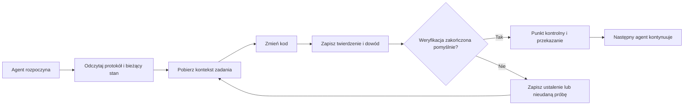

# ArifCE
<p align="center"></p>

**Czytaj w innym języku.**

[English](../../README.md) · [简体中文](README.zh-CN.md) · [繁體中文](README.zh-TW.md) · [한국어](README.ko.md) · [Deutsch](README.de.md) · [Español](README.es.md) · [Français](README.fr.md) · [Italiano](README.it.md) · [Dansk](README.da.md) · [日本語](README.ja.md) · [Polski](README.pl.md) · [Русский](README.ru.md) · [Bosanski](README.bs.md) · [العربية](README.ar.md) · [Norsk](README.no.md) · [Português (Brasil)](README.pt-BR.md) · [ไทย](README.th.md) · [Türkçe](README.tr.md) · [Українська](README.uk.md) · [বাংলা](README.bn.md) · [Ελληνικά](README.el.md) · [Tiếng Việt](README.vi.md)

**Agenci się zmieniają. Twój projekt nie powinien zapominać.**


[](https://github.com/seekua/ArifCE/actions/workflows/ci.yml) [](https://github.com/seekua/ArifCE/releases/latest) [](../../LICENSE)

ArifCE to lokalna warstwa inteligencji i ciągłości projektu dla programowania wspomaganego przez AI. Przechowuje kontekst, decyzje, nieudane próby, dowody, stan refaktoryzacji i informacje o przekazaniu w repozytorium, aby Codex, Claude Code, OpenCode i przyszli agenci mogli kontynuować tę samą historię inżynierską.

> Repozytorium posiada kontekst. Agent tylko go wypożycza.

**Limit wyczerpany? Kontynuuj w dwóch krokach.**

Po zakończeniu właściwej pracy nad zadaniem zarejestruj jego przekazanie (handoff) przed przerwaniem działania.

```bash
arifce handoff --task TASK-0031

# When you return with Codex, Claude Code, OpenCode, or a local model:
arifce context --task TASK-0031 --budget 2000
```

Przekazanie zawiera cel, wykonaną pracę, zweryfikowane dowody, nierozwiązane kwestie, błędy oraz kolejne kroki. Skopiuj wygenerowany kontekst do komunikatu inicjującego pracę nowego agenta; interfejs CLI nie wprowadza kontekstu do sesji modelu automatycznie.

## Instalacja i szybki start

Pobierz samodzielne archiwum dla swojej platformy z sekcji [GitHub Releases](https://github.com/seekua/ArifCE/releases/tag/v0.8.1), rozpakuj je i dodaj `arifce` do zmiennej środowiskowej PATH. W systemie Linux zachowaj uprawnienia do wykonywania pliku podczas rozpakowywania lub wykonaj polecenie `chmod +x arifce`. Nie jest wymagana oddzielna instalacja .NET, Node, Pythona, Dockera ani bazy danych.

Dla nowego projektu:

```bash
mkdir my-project && cd my-project
git init
arifce init
arifce task create "Ship the first change"
arifce handoff
```

Dla istniejącego repozytorium Git:

```bash
cd path/to/existing-repo
arifce adopt
arifce task create "Ship the first change"
arifce handoff
```

Użyj polecenia `adopt`, gdy repozytorium zawiera już kod: rejestruje ono zaobserwowaną strukturę bez jej nadpisywania, a następnie zapewnia kolejnemu agentowi punkt wyjścia lokalny dla danego projektu. [Instalacja i szybki start](../getting-started/installation.md).

## Dlaczego istnieje ArifCE

Zespoły programistyczne tracą czas i zaufanie, gdy ważny kontekst znajduje się wyłącznie w historii czatu, pamięci pojedynczej osoby lub narzędziu, którego kolejny współtwórca nie może sprawdzić. ArifCE sprawia, że ciągłość prac inżynierskich staje się częścią samego projektu.

Celem nie jest sprawienie, by agenci brzmieli pewniej. Chodzi o to, aby każdy współtwórca rozumiał, co zespół chce osiągnąć, dlaczego podjęto decyzję, co faktycznie zweryfikowano i gdzie pozostaje niepewność. Gdy ta historia pozostaje w repozytorium, zespoły mogą działać szybciej bez rezygnacji z identyfikowalności, odpowiedzialności ani zaufania.

ArifCE zmienia ciągłość w wspólną praktykę inżynierską: skupiony kontekst dla następnego zadania, jawne dowody ważnych twierdzeń i uczciwe przekazania, gdy praca jest nieukończona.

**Dla kogo jest ArifCE.**

ArifCE jest przeznaczony dla zespołów inżynierskich wspomaganych przez AI, programistów pracujących z agentami kodującymi oraz opiekunów, którzy potrzebują, aby kontekst projektu przetrwał jedną osobę, czat lub sesję. Jest szczególnie przydatny, gdy wielu współtwórców dzieli repozytorium i potrzebuje jasnego zapisu decyzji, weryfikacji oraz niedokończonych prac.

## Jak działa ArifCE


```mermaid
flowchart LR
    A[Agent rozpoczyna] --> B[Odczytaj protokół i bieżący stan]
    B --> C[Pobierz kontekst zadania]
    C --> D[Zmień kod]
    D --> E[Zapisz twierdzenie i dowód]
    E --> F{Weryfikacja zakończona pomyślnie?}
    F -- Tak --> G[Punkt kontrolny i przekazanie]
    F -- Nie --> H[Zapisz ustalenie lub nieudaną próbę]
    H --> C
    G --> I[Następny agent kontynuuje]
```

## Poznaj projekt

Uruchom lokalny pulpit, aby uzyskać wizualny podgląd kondycji projektu, ostatnich wpisów i przeszukiwalnego kontekstu: To polecenie dla programistów wykorzystuje zestaw .NET SDK; opisana powyżej instalacja samodzielnego wydania go nie wymaga.

### Podgląd panelu

<p align="center">
  
  
  
</p>

```powershell
$env:ARIFCE_PROJECT_ROOT = (Get-Location).Path
dotnet run --project src/ArifCE.Dashboard/ArifCE.Dashboard.csproj
```

Następnie otwórz <http://127.0.0.1:5180/>. Pełny podręcznik produktu znajdziesz w [centrum dokumentacji ArifCE](../README.md).

Ten przepływ przechowuje wiedzę o projekcie w repozytorium i umożliwia kontrolę postępów. Praktyczne korzyści to:

- Szybsze wdrożenie: następny agent czyta zwięzły bieżący stan zamiast odtwarzać długą transkrypcję.
- Bezpieczniejsze zmiany: twierdzenia są powiązane z deterministycznymi dowodami i tracą aktualność po zmianie stanu Git.
- Lepsza ciągłość: decyzje, nieudane próby, punkty kontrolne i przekazania przetrwają zmianę agenta lub sesji.
- Kontrolowane refaktoryzacje: niezmienniki, inwentarz, zabezpieczenia i bezpieczne punkty uwidaczniają nieukończoną pracę.
- Działanie lokalne: kanoniczne pliki pozostają użyteczne bez usługi chmurowej ani środowiska dostawcy.

## To nie tylko pamięć

ArifCE śledzi, czym było zadanie, co i dlaczego się zmieniło, co agent twierdzi, że ukończył, jakie dowody to potwierdzają, co znalazł recenzent, co pozostało niedokończone i co musi wiedzieć następny agent. Wypowiedzi agentów są twierdzeniami, nie faktami; preferowane są deterministyczne dowody kompilacji, testów, Git i wyszukiwania.

Weryfikacja techniczna i akceptacja produktu są oddzielne: zapisy akceptacji wskazują, kto zatwierdził twierdzenie i jakie aktualne dowody wsparły tę decyzję.

## Podstawowy przepływ pracy

```text
arifce init
arifce task create "Fix permission cache race"
arifce checkpoint --summary "Reproduction added"
arifce context "finish the permission cache fix" --budget 16000
arifce claim create "Permission cache race is fixed"
arifce verify CLAIM-0001
arifce handoff
```

Kanoniczne pliki Markdown, YAML, JSON i JSONL znajdują się w `.arifce/`. SQLite to usuwalny indeks pochodny: usunięcie `.arifce/index/` i uruchomienie `arifce rebuild` musi zachować inteligencję projektu.

## Architektura

Rdzeń oddziela reguły domenowe, kanoniczne przechowywanie i indeksowanie, obserwację Git, pobieranie, weryfikację, refaktoryzację, bezpieczeństwo oraz CLI. Pliki instrukcji dostawcy są małymi adapterami i nigdy nie stają się kanonicznym magazynem pamięci. Zobacz [przegląd architektury](../architecture/overview.md), [model domeny](../architecture/domain-model.md) i [specyfikację V0.1](../SPECIFICATION-v0.1.md).

**Rozwój z kodu źródłowego. Aktualnym wydaniem jest wersja v0.8.1. Informacje na temat rozwoju z kodu źródłowego znajdują się w sekcjach dotyczących instalacji i szybkiego startu.** [Instalacja i szybki start](../getting-started/installation.md) · [Szybki start](../getting-started/quick-start.md).

```bash
git clone https://github.com/seekua/ArifCE.git
cd ArifCE
dotnet restore ArifCE.slnx
dotnet build ArifCE.slnx --configuration Release --no-restore
dotnet test ArifCE.slnx --configuration Release --no-build --no-restore
```

Opcjonalny lokalny adapter MCP opisano w [konfiguracji MCP](../getting-started/mcp.md).

Pełny przewodnik instalacji i funkcji znajdziesz w [Podręczniku użytkownika](../USER-GUIDE.md) oraz [Polityce dokumentacji](../DOCUMENTATION-POLICY.md).

Powyższe polecenia instalacji i uruchomienia tworzą lokalny stan projektu w repozytorium, zadanie oraz pakiet przekazania gotowy dla kolejnego współtwórcy.

### Kontynuowanie zadania z Ollama lub LM Studio

ArifCE przechowuje kanoniczne wpisy projektu w repozytorium. Dostawca otrzymuje prompt i wybrany kontekst; dostawcy chmurowi otrzymują wybrane treści zdalnie. `--with-context` dodaje wpisy projektu wybrane przez ArifCE, ale nie odczytuje plików źródłowych. Poniższe przykłady jawnie umieszczają treść pliku migracji w prompcie, aby model otrzymał kod, który ma sprawdzić. Wybierz przykład odpowiedni dla swojej powłoki.

Przed użyciem któregokolwiek przykładu zainstaluj i uruchom Ollama. Pierwsze polecenie pobiera model `llama3`; pozostaw Ollama uruchomione pod wskazanym niżej lokalnym endpointem.

```bash
ollama pull llama3
arifce llm provider add ollama Ollama llama3 --endpoint http://127.0.0.1:11434
arifce llm provider test ollama
task_id="$(arifce task create "Review and safely update the migration")"
migration_source="$(cat path/to/migration.sql)"
prompt="Review only this SQL migration for data-loss risks. Do not infer unseen source. Suggest the smallest safe change if needed.
Migration source:
$migration_source"
arifce llm run "Review and safely update the migration" "$prompt" --with-context --budget 2000
```

```powershell
ollama pull llama3
arifce llm provider add ollama Ollama llama3 --endpoint http://127.0.0.1:11434
arifce llm provider test ollama
$taskId = arifce task create "Review and safely update the migration"
$migrationSource = Get-Content -Raw -LiteralPath "path/to/migration.sql"
$prompt = @"
Review only this SQL migration for data-loss risks. Do not infer unseen source. Suggest the smallest safe change if needed.
Migration source:
$migrationSource
"@
arifce llm run "Review and safely update the migration" $prompt --with-context --budget 2000
```

Przejrzyj odpowiedź modelu, zastosuj ewentualne zmiany w swoim środowisku programistycznym i uruchom testy regresyjne migracji. Po ich przejściu zapisz jako claim wyłącznie to, co potwierdza polecenie testowe:

```bash
claim_id="$(arifce claim create "Migration regression tests pass" --task "$task_id")"
arifce verify "$claim_id" --command "dotnet test path/to/migration-tests.csproj"
arifce handoff
```

W PowerShellu:

```powershell
$claimId = arifce claim create "Migration regression tests pass" --task $taskId
arifce verify $claimId --command "dotnet test path/to/migration-tests.csproj"
arifce handoff
```

Wynik testów potwierdza claim o przejściu testów regresyjnych; sam w sobie nie dowodzi, że przegląd modelu był kompletny lub poprawny. Zastąp przykładowe ścieżki i polecenie testowe wartościami z własnego repozytorium. W LM Studio podaj nazwę załadowanego modelu i endpoint zgodny z OpenAI, zwykle `http://127.0.0.1:1234/v1`, w poleceniu `arifce llm provider add lmstudio LmStudio your-loaded-model --endpoint http://127.0.0.1:1234/v1`.

Następnie zastosuj ten sam przepływ dla zadania, kodu źródłowego, dowodów z testów i przekazania pracy.

Uruchomienie reviewera wymaga wyraźnej zgody. Zapasowy dostawca, ewidencja tokenów i kosztów, dowody kanoniczne, embeddingi, metryki benchmarków, narzędzia MCP i lokalny dashboard opisano w [dokumentacji dostawców LLM](../reference/LLM-PROVIDERS.md).

Uruchom `init` w nowym repozytorium Git albo `adopt` w istniejącym. Obie komendy są niedestrukcyjne i idempotentne; `adopt` zapisuje wykrytą strukturę i oznacza nieznane historyczne uzasadnienia jako nieznane.

## Ciągłość, weryfikacja i refaktoryzacje

- Nowy agent czyta `AGENTS.md`, `.arifce/PROTOCOL.md` i `.arifce/CURRENT.md`, a następnie żąda kontekstu zadania zamiast ładować całą historię.
- Twierdzenia odwołują się do dowodów w zakresie repozytorium. Dowody stają się nieaktualne po zmianie odpowiedniego stanu repozytorium.
- Kampanie refaktoryzacji śledzą niezmienniki, inwentarz, zabezpieczenia, postęp i punkty kontrolne. Blokujące zabezpieczenia uniemożliwiają zakończenie.
- Przekazania podsumowują bieżący stan inżynierski zamiast zrzucać transkrypcje.

## Bezpieczeństwo i ograniczenia

Surowe zapisy sesji (transkrypcje) są traktowane jako niezaufane i nigdy nie są masowo wczytywane ani wykonywane. Ścieżki importu maskują typowe dane poufne; poświadczenia i dane uwierzytelniające maszynę nie powinny znajdować się w pliku `.arifce`. ArifCE nie gwarantuje poprawności, oszczędności tokenów ani wyższej jakości przeglądu kodu. Narzędzie nie korzysta z usług chmurowych, hostowanego interfejsu użytkownika, wektorowej bazy danych, autonomicznych rojów agentów ani produkcyjnego wywoływania działań między agentami. Dołączono lokalny pulpit nawigacyjny; nie jest to hostowana aplikacja internetowa.

Zobacz [ROADMAP.md](../../ROADMAP.md), [SECURITY.md](../../SECURITY.md) i [CONTRIBUTING.md](../../CONTRIBUTING.md). Dokładna składnia zaimplementowanych poleceń znajduje się w [referencji CLI](../reference/cli.md).

## Licencja

ArifCE jest licencjonowany na podstawie [Apache License 2.0](../../LICENSE).
