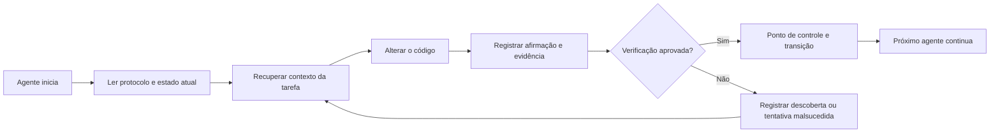

# ArifCE
<p align="center"></p>

[English](../../README.md) · [简体中文](README.zh-CN.md) · [繁體中文](README.zh-TW.md) · [한국어](README.ko.md) · [Deutsch](README.de.md) · [Español](README.es.md) · [Français](README.fr.md) · [Italiano](README.it.md) · [Dansk](README.da.md) · [日本語](README.ja.md) · [Polski](README.pl.md) · [Русский](README.ru.md) · [Bosanski](README.bs.md) · [العربية](README.ar.md) · [Norsk](README.no.md) · [Português (Brasil)](README.pt-BR.md) · [ไทย](README.th.md) · [Türkçe](README.tr.md) · [Українська](README.uk.md) · [বাংলা](README.bn.md) · [Ελληνικά](README.el.md) · [Tiếng Việt](README.vi.md)

**Agentes mudam. Seu projeto não deve esquecer.**


[](https://github.com/seekua/ArifCE/actions/workflows/ci.yml) [](https://github.com/seekua/ArifCE/releases/latest) [](../../LICENSE)

ArifCE é uma camada local de inteligência e continuidade do projeto para desenvolvimento de software assistido por IA. Mantém contexto, decisões, tentativas malsucedidas, evidências, estado de refatoração e informações de transição no repositório para que Codex, Claude Code, OpenCode e futuros agentes continuem a mesma história de engenharia.

> O repositório é dono do contexto. O agente apenas o toma emprestado.


## Por que o ArifCE existe

Equipes de software perdem tempo e confiança quando o contexto importante vive apenas no histórico de chat, na memória individual ou em uma ferramenta que o próximo colaborador não pode inspecionar. O ArifCE torna a continuidade da engenharia parte do próprio projeto.

O objetivo não é fazer os agentes parecerem mais certos. É ajudar cada colaborador a entender o que a equipe tenta realizar, por que uma decisão foi tomada, o que foi realmente verificado e onde permanece a incerteza. Quando essa história fica no repositório, as equipes avançam mais rápido sem abrir mão de rastreabilidade, responsabilidade ou confiança.

O ArifCE transforma a continuidade em uma prática de engenharia compartilhada: contexto focado para a próxima tarefa, evidências explícitas para afirmações importantes e transições honestas quando o trabalho está incompleto.

## Para quem é

O ArifCE é para equipes de engenharia assistidas por IA, desenvolvedores que trabalham com agentes de código e mantenedores que precisam que o contexto do projeto sobreviva a uma pessoa, conversa ou sessão. É especialmente útil quando vários colaboradores compartilham um repositório e precisam de um registro claro de decisões, verificações e trabalho inacabado.

## Como o ArifCE funciona



## Explore o projeto

Execute o painel local para obter uma visão visual da saúde do projeto, dos registros recentes e do contexto pesquisável:

```powershell
$env:ARIFCE_PROJECT_ROOT = (Get-Location).Path
dotnet run --project src/ArifCE.Dashboard/ArifCE.Dashboard.csproj
```

Depois abra <http://127.0.0.1:5180/>. Para o manual completo do produto, consulte o [hub de documentação do ArifCE](../README.md).

Esse fluxo mantém o conhecimento do projeto no repositório e torna o progresso inspecionável. As vantagens práticas são:

- Onboarding mais rápido: o próximo agente lê um estado atual focado em vez de reconstruir uma longa transcrição.
- Mudanças mais seguras: afirmações são vinculadas a evidências determinísticas e ficam obsoletas quando o estado do Git muda.
- Melhor continuidade: decisões, tentativas malsucedidas, pontos de controle e transições sobrevivem a mudanças de agente ou sessão.
- Refatorações controladas: invariantes, inventário, proteções e pontos seguros tornam o trabalho incompleto visível.
- Operação local: arquivos canônicos continuam utilizáveis sem serviço em nuvem ou runtime específico do fornecedor.

## Não é apenas memória

O ArifCE acompanha qual era a tarefa, o que mudou e por quê, o que um agente afirma ter concluído, quais evidências sustentam a afirmação, o que um revisor encontrou, o que permanece inacabado e o que o próximo agente precisa saber. Declarações de agentes são afirmações, não fatos; evidências determinísticas de build, teste, Git e busca são preferidas.

A verificação técnica e a aceitação do produto são separadas: registros de aceitação identificam quem aprovou uma afirmação e quais evidências atuais sustentaram a decisão.

## Fluxo de trabalho V0.1

```text
arifce init
arifce task create "Fix permission cache race"
arifce checkpoint --summary "Reproduction added"
arifce context "finish the permission cache fix" --budget 16000
arifce claim create "Permission cache race is fixed"
arifce verify CLAIM-0001
arifce handoff
```

Markdown, YAML, JSON e JSONL canônicos ficam em `.arifce/`. SQLite é um índice derivado descartável: excluir `.arifce/index/` e executar `arifce rebuild` deve preservar a inteligência do projeto.

## Arquitetura

O núcleo separa as regras de domínio, o armazenamento e a indexação canônicos, a observação do Git, a recuperação, a verificação, a refatoração, a segurança e a CLI. Os arquivos de instruções dos fornecedores são pequenos adaptadores; nunca se tornam o armazenamento de memória canônico. Consulte a [visão geral da arquitetura](../architecture/overview.md), o [modelo de domínio](../architecture/domain-model.md) e a [especificação V0.1](../SPECIFICATION-v0.1.md).

## Instalação e início rápido

V0.2.0 foi publicado como uma ferramenta global .NET multiplataforma. Consulte [instalação](../getting-started/installation.md) e [início rápido](../getting-started/quick-start.md). A partir do código-fonte:

O adaptador MCP local opcional está documentado em [configuração do MCP](../getting-started/mcp.md).

Para um guia completo de instalação e recursos, consulte o [Guia do usuário](../USER-GUIDE.md) e a [Política de documentação](../DOCUMENTATION-POLICY.md).

### 60-second quick start

```bash
dotnet tool install --global ArifCE.Cli --version 0.2.0
mkdir my-project && cd my-project
git init
arifce init
arifce task create "Ship the first change"
arifce checkpoint --summary "Project context initialized"
arifce handoff
```

Agora você tem um estado de projeto local ao repositório, uma tarefa, um ponto de controle e uma transição semântica pronta para o próximo colaborador.

Se você já tem um repositório Git, acesse-o e registre sua estrutura com `adopt`:

```bash
cd path/to/existing-repo
arifce adopt
arifce task create "Ship the first change"
arifce handoff
```

```bash
dotnet restore
dotnet build
dotnet test
dotnet run --project src/ArifCE.Cli -- init
```

Execute `init` em um novo repositório Git ou `adopt` em um existente. Ambos são não destrutivos e idempotentes. `adopt` registra a estrutura observada e marca como desconhecida qualquer justificativa histórica desconhecida.

## Continuidade, verificação e refatorações

- Um agente novo lê `AGENTS.md`, `.arifce/PROTOCOL.md` e `.arifce/CURRENT.md`, depois solicita contexto específico da tarefa em vez de carregar todo o histórico.
- Afirmações apontam para evidências do repositório. As evidências ficam obsoletas quando o estado relevante muda.
- Campanhas de refatoração acompanham invariantes, inventário, proteções, progresso e pontos de controle. Proteções bloqueadoras impedem a conclusão.
- Transições resumem o estado atual da engenharia em vez de despejar transcrições.

## Segurança e limitações

Transcrições brutas não são confiáveis e nunca são carregadas ou executadas em massa. Caminhos de importação ocultam segredos comuns; credenciais e dados de autenticação da máquina não pertencem a `.arifce/`. A V0.1 não garante correção, economia de tokens ou melhor qualidade de revisão. Não há serviço em nuvem, UI, banco vetorial, enxame autônomo ou chamada produtiva entre agentes.

Consulte [ROADMAP.md](../../ROADMAP.md), [SECURITY.md](../../SECURITY.md) e [CONTRIBUTING.md](../../CONTRIBUTING.md). A sintaxe exata dos comandos implementados está documentada na [referência da CLI](../reference/cli.md).

## Licença

O ArifCE é distribuído sob a [licença Apache 2.0](../../LICENSE).
### Continue uma tarefa com Ollama ou LM Studio

O ArifCE mantém os registros canônicos do projeto no repositório. O provedor recebe o prompt e o contexto selecionado; provedores na nuvem recebem esse conteúdo selecionado remotamente. `--with-context` adiciona os registros do projeto selecionados pelo ArifCE, mas não lê arquivos-fonte. Os exemplos abaixo incluem explicitamente o conteúdo do arquivo de migração no prompt, para que o modelo receba o código que deve analisar. Use o exemplo correspondente ao seu shell.

Antes de usar qualquer exemplo, instale e inicie o Ollama. O primeiro comando baixa o modelo `llama3`; mantenha o Ollama em execução no endpoint local indicado abaixo.

```bash
ollama pull llama3
arifce llm provider add ollama Ollama llama3 --endpoint http://127.0.0.1:11434
arifce llm provider test ollama
task_id="$(arifce task create "Review and safely update the migration")"
migration_source="$(cat path/to/migration.sql)"
prompt="Review only this SQL migration for data-loss risks. Do not infer unseen source. Suggest the smallest safe change if needed.
Migration source:
$migration_source"
arifce llm run "Review and safely update the migration" "$prompt" --with-context --budget 2000
```

```powershell
ollama pull llama3
arifce llm provider add ollama Ollama llama3 --endpoint http://127.0.0.1:11434
arifce llm provider test ollama
$taskId = arifce task create "Review and safely update the migration"
$migrationSource = Get-Content -Raw -LiteralPath "path/to/migration.sql"
$prompt = @"
Review only this SQL migration for data-loss risks. Do not infer unseen source. Suggest the smallest safe change if needed.
Migration source:
$migrationSource
"@
arifce llm run "Review and safely update the migration" $prompt --with-context --budget 2000
```

Revise a resposta do modelo, aplique as alterações sugeridas no seu ambiente de desenvolvimento e execute os testes de regressão da migração. Depois que passarem, registre como claim somente o que o comando de teste comprova:

```bash
claim_id="$(arifce claim create "Migration regression tests pass" --task "$task_id")"
arifce verify "$claim_id" --command "dotnet test path/to/migration-tests.csproj"
arifce handoff
```

No PowerShell:

```powershell
$claimId = arifce claim create "Migration regression tests pass" --task $taskId
arifce verify $claimId --command "dotnet test path/to/migration-tests.csproj"
arifce handoff
```

O resultado do teste dá suporte ao claim de que os testes de regressão passaram; sozinho, ele não prova que a análise do modelo foi completa ou correta. Substitua os caminhos e o comando de teste de exemplo pelos do seu repositório. Para usar o LM Studio, informe o nome do modelo carregado e o endpoint compatível com OpenAI, geralmente `http://127.0.0.1:1234/v1`, em `arifce llm provider add lmstudio LmStudio your-loaded-model --endpoint http://127.0.0.1:1234/v1`.

Depois, siga o mesmo fluxo de tarefa, entrada do código-fonte, evidência dos testes e handoff.

Executar um reviewer exige aprovação explícita. A referência de [provedores LLM](../reference/LLM-PROVIDERS.md) documenta o fallback de provedores, o registro de tokens e custos, as evidências canônicas, os embeddings, as métricas de benchmark, as ferramentas MCP e o dashboard local.

Execute `init` em um repositório Git novo ou `adopt` em um existente. Ambos são não destrutivos e idempotentes; `adopt` registra a estrutura observada e marca como desconhecidas as justificativas históricas que não são conhecidas.
### From source

```bash
git clone https://github.com/seekua/ArifCE.git
cd ArifCE
dotnet restore ArifCE.slnx
dotnet build ArifCE.slnx --configuration Release --no-restore
dotnet test ArifCE.slnx --configuration Release --no-build --no-restore
```
