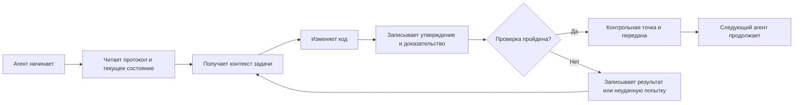

# ArifCE
<p align="center"></p>

[English](../../README.md) · [简体中文](README.zh-CN.md) · [繁體中文](README.zh-TW.md) · [한국어](README.ko.md) · [Deutsch](README.de.md) · [Español](README.es.md) · [Français](README.fr.md) · [Italiano](README.it.md) · [Dansk](README.da.md) · [日本語](README.ja.md) · [Polski](README.pl.md) · [Русский](README.ru.md) · [Bosanski](README.bs.md) · [العربية](README.ar.md) · [Norsk](README.no.md) · [Português (Brasil)](README.pt-BR.md) · [ไทย](README.th.md) · [Türkçe](README.tr.md) · [Українська](README.uk.md) · [বাংলা](README.bn.md) · [Ελληνικά](README.el.md) · [Tiếng Việt](README.vi.md)

**Агенты меняются. Проект не должен забывать.**


[](https://github.com/seekua/ArifCE/actions/workflows/ci.yml) [](https://github.com/seekua/ArifCE/releases/latest) [](../../LICENSE)

ArifCE — локальный слой интеллекта и непрерывности проекта для разработки ПО с помощью ИИ. Он хранит контекст, решения, неудачные попытки, доказательства, состояние рефакторинга и сведения о передаче в репозитории, чтобы Codex, Claude Code, OpenCode и будущие агенты продолжали одну инженерную историю.

> Репозиторий владеет контекстом. Агент лишь берёт его взаймы.


## Зачем нужен ArifCE

Команды разработки теряют время и доверие, когда важный контекст существует только в истории чата, памяти отдельного человека или инструменте, который следующий участник не может проверить. ArifCE делает инженерную непрерывность частью самого проекта.

Цель не в том, чтобы агенты звучали увереннее. Нужно помочь каждому участнику понять, чего команда стремится достичь, почему принято решение, что действительно проверено и где остаётся неопределённость. Когда эта история хранится в репозитории, команды работают быстрее, не отказываясь от отслеживаемости, ответственности и доверия.

ArifCE превращает непрерывность в общую инженерную практику: сфокусированный контекст для следующей задачи, явные доказательства важных утверждений и честные передачи при незавершённой работе.

## Для кого это

ArifCE предназначен для инженерных команд с поддержкой ИИ, разработчиков, работающих с агентами кода, и сопровождающих, которым нужно сохранить контекст проекта дольше одного человека, чата или сеанса. Особенно полезен он при совместной работе нескольких участников в одном репозитории.

## Как работает ArifCE



## Исследуйте проект

Запустите локальную панель, чтобы увидеть состояние проекта, последние записи и доступный для поиска контекст:

```powershell
$env:ARIFCE_PROJECT_ROOT = (Get-Location).Path
dotnet run --project src/ArifCE.Dashboard/ArifCE.Dashboard.csproj
```

Затем откройте <http://127.0.0.1:5180/>. Полное руководство находится в [центре документации ArifCE](../README.md).

Этот процесс хранит знания о проекте в репозитории и делает прогресс проверяемым. Практические преимущества:

- Быстрое подключение: следующий агент читает сфокусированное текущее состояние, а не восстанавливает длинную стенограмму.
- Более безопасные изменения: утверждения связаны с детерминированными доказательствами и устаревают при изменении Git.
- Лучшая непрерывность: решения, неудачные попытки, контрольные точки и передачи переживают смену агента или сеанса.
- Контролируемый рефакторинг: инварианты, инвентаризация, защиты и безопасные точки делают незавершённую работу видимой.
- Локальная работа: канонические файлы доступны без облачного сервиса или среды конкретного поставщика.

## Не просто память

ArifCE отслеживает суть задачи, изменения и их причины, заявленное агентом выполнение, подтверждающие доказательства, выводы проверяющего, незавершённую работу и сведения для следующего агента. Слова агента — утверждения, а не факты; предпочтительны детерминированные доказательства сборки, тестов, Git и поиска.

Техническая проверка и приёмка продукта разделены: записи приёмки указывают, кто одобрил утверждение и какие актуальные доказательства поддержали решение.

## Рабочий процесс V0.1

```text
arifce init
arifce task create "Fix permission cache race"
arifce checkpoint --summary "Reproduction added"
arifce context "finish the permission cache fix" --budget 16000
arifce claim create "Permission cache race is fixed"
arifce verify CLAIM-0001
arifce handoff
```

Канонические Markdown, YAML, JSON и JSONL находятся в `.arifce/`. SQLite — удаляемый производный индекс: удаление `.arifce/index/` и запуск `arifce rebuild` должны сохранять интеллект проекта.

## Архитектура

Ядро разделяет правила домена, каноническое хранение и индексацию, наблюдение Git, извлечение, проверку, рефакторинг, безопасность и CLI. Файлы инструкций поставщиков — небольшие адаптеры, а не каноническое хранилище памяти. См. [обзор архитектуры](../architecture/overview.md), [модель домена](../architecture/domain-model.md) и [спецификацию V0.1](../SPECIFICATION-v0.1.md).

## Установка и быстрый старт

V0.2.0 опубликован как кроссплатформенный глобальный инструмент .NET. См. [установку](../getting-started/installation.md) и [быстрый старт](../getting-started/quick-start.md). Из исходного кода:

Необязательный локальный адаптер MCP описан в [настройке MCP](../getting-started/mcp.md).

Полное руководство по установке и функциям см. в [руководстве пользователя](../USER-GUIDE.md) и [политике документации](../DOCUMENTATION-POLICY.md).

### 60-second quick start

```bash
dotnet tool install --global ArifCE.Cli --version 0.2.0
mkdir my-project && cd my-project
git init
arifce init
arifce task create "Ship the first change"
arifce checkpoint --summary "Project context initialized"
arifce handoff
```

Теперь у вас есть состояние проекта в репозитории, задача, контрольная точка и семантическая передача для следующего участника.

Если у вас уже есть Git-репозиторий, перейдите в него и сохраните его структуру командой `adopt`:

```bash
cd path/to/existing-repo
arifce adopt
arifce task create "Ship the first change"
arifce handoff
```

```bash
dotnet restore
dotnet build
dotnet test
dotnet run --project src/ArifCE.Cli -- init
```

Запустите `init` в новом Git-репозитории или `adopt` в существующем. Обе команды безопасны и идемпотентны. `adopt` записывает наблюдаемую структуру и помечает неизвестные исторические причины как неизвестные.

## Непрерывность, проверка и рефакторинг

- Новый агент читает `AGENTS.md`, `.arifce/PROTOCOL.md` и `.arifce/CURRENT.md`, затем запрашивает контекст задачи вместо загрузки всей истории.
- Утверждения ссылаются на доказательства репозитория. Доказательства устаревают при изменении соответствующего состояния.
- Кампании рефакторинга отслеживают инварианты, инвентаризацию, защиты, прогресс и контрольные точки. Блокирующие защиты не дают завершить работу.
- Передачи суммируют текущее инженерное состояние, а не выгружают стенограммы.

## Безопасность и ограничения

Необработанные стенограммы ненадёжны и никогда не загружаются и не выполняются целиком. Пути импорта скрывают распространённые секреты; учётные данные и машинная аутентификация не должны находиться в `.arifce/`. V0.1 не гарантирует корректность, экономию токенов или лучшее качество ревью. Здесь нет облачного сервиса, UI, векторной базы, автономного роя или производственных вызовов между агентами.

См. [ROADMAP.md](../../ROADMAP.md), [SECURITY.md](../../SECURITY.md) и [CONTRIBUTING.md](../../CONTRIBUTING.md). Точный синтаксис реализованных команд описан в [справочнике CLI](../reference/cli.md).

## Лицензия

ArifCE распространяется по [лицензии Apache 2.0](../../LICENSE).
### Продолжение задачи с Ollama или LM Studio

ArifCE хранит канонические записи проекта в репозитории. Провайдер получает промпт и выбранный контекст; облачные провайдеры получают выбранное содержимое удалённо. Параметр `--with-context` добавляет выбранные ArifCE записи проекта, но не читает исходные файлы. Примеры ниже явно добавляют содержимое файла миграции в промпт, чтобы модель получила код для проверки. Выберите пример для своей оболочки.

```bash
arifce llm provider add ollama Ollama llama3 --endpoint http://127.0.0.1:11434
arifce llm provider test ollama
task_id="$(arifce task create "Review and safely update the migration")"
migration_source="$(cat path/to/migration.sql)"
prompt="Review only this SQL migration for data-loss risks. Do not infer unseen source. Suggest the smallest safe change if needed.
Migration source:
$migration_source"
arifce llm run "Review and safely update the migration" "$prompt" --with-context --budget 2000
```

```powershell
arifce llm provider add ollama Ollama llama3 --endpoint http://127.0.0.1:11434
arifce llm provider test ollama
$taskId = arifce task create "Review and safely update the migration"
$migrationSource = Get-Content -Raw -LiteralPath "path/to/migration.sql"
$prompt = @"
Review only this SQL migration for data-loss risks. Do not infer unseen source. Suggest the smallest safe change if needed.
Migration source:
$migrationSource
"@
arifce llm run "Review and safely update the migration" $prompt --with-context --budget 2000
```

Проверьте ответ модели, примените предложенные изменения в своей среде разработки и запустите регрессионные тесты миграции. После их успешного прохождения фиксируйте как claim только то, что подтверждает команда тестирования:

```bash
claim_id="$(arifce claim create "Migration regression tests pass" --task "$task_id")"
arifce verify "$claim_id" --command "dotnet test path/to/migration-tests.csproj"
arifce handoff
```

В PowerShell:

```powershell
$claimId = arifce claim create "Migration regression tests pass" --task $taskId
arifce verify $claimId --command "dotnet test path/to/migration-tests.csproj"
arifce handoff
```

Результат подтверждает claim об успешном прохождении регрессионных тестов, но сам по себе не доказывает полноту или правильность проверки модели. Замените примеры путей и команду тестирования значениями из своего репозитория. Для LM Studio укажите имя загруженной модели и совместимый с OpenAI endpoint, обычно `http://127.0.0.1:1234/v1`, в команде `arifce llm provider add lmstudio LmStudio your-loaded-model --endpoint http://127.0.0.1:1234/v1`.

Далее используйте тот же порядок действий: задача, исходный код, доказательства тестов и handoff.

Запуск reviewer требует явного разрешения. Резервные провайдеры, учёт токенов и затрат, канонические доказательства, embeddings, метрики benchmark, инструменты MCP и локальная панель описаны в [справочнике провайдеров LLM](../reference/LLM-PROVIDERS.md).

Запустите `init` в новом Git-репозитории или `adopt` в существующем. Обе команды неразрушающие и идемпотентные; `adopt` записывает обнаруженную структуру и отмечает неизвестные исторические причины как неизвестные.
### From source

```bash
git clone https://github.com/seekua/ArifCE.git
cd ArifCE
dotnet restore ArifCE.slnx
dotnet build ArifCE.slnx --configuration Release --no-restore
dotnet test ArifCE.slnx --configuration Release --no-build --no-restore
```
