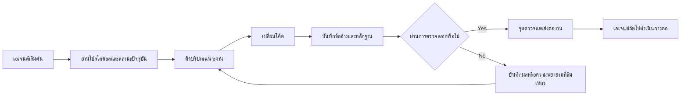

# ArifCE
<p align="center"></p>

**อ่านในภาษาอื่น**

[English](../../README.md) · [简体中文](README.zh-CN.md) · [繁體中文](README.zh-TW.md) · [한국어](README.ko.md) · [Deutsch](README.de.md) · [Español](README.es.md) · [Français](README.fr.md) · [Italiano](README.it.md) · [Dansk](README.da.md) · [日本語](README.ja.md) · [Polski](README.pl.md) · [Русский](README.ru.md) · [Bosanski](README.bs.md) · [العربية](README.ar.md) · [Norsk](README.no.md) · [Português (Brasil)](README.pt-BR.md) · [ไทย](README.th.md) · [Türkçe](README.tr.md) · [Українська](README.uk.md) · [বাংলা](README.bn.md) · [Ελληνικά](README.el.md) · [Tiếng Việt](README.vi.md)

**เอเจนต์เปลี่ยนแปลง โครงการของคุณไม่ควรลืม**


[](https://github.com/seekua/ArifCE/actions/workflows/ci.yml) [](https://github.com/seekua/ArifCE/releases/latest) [](../../LICENSE)

ArifCE คือเลเยอร์อัจฉริยะและความต่อเนื่องของโครงการแบบ local-first สำหรับการพัฒนาซอฟต์แวร์ด้วย AI โดยเก็บบริบท การตัดสินใจ ความพยายามที่ล้มเหลว หลักฐาน สถานะการรีแฟกเตอร์ และข้อมูลการส่งต่องานไว้กับรีโพซิทอรี เพื่อให้ Codex, Claude Code, OpenCode และเอเจนต์ในอนาคตสานต่อเรื่องราวทางวิศวกรรมเดิมได้

> รีโพซิทอรีเป็นเจ้าของบริบท เอเจนต์เพียงยืมไปใช้

**ขีดจำกัดของคุณหมดลงแล้วหรือ? ดำเนินการต่อด้วยคำสั่งสองคำสั่งนี้**

หลังจากทำงานจริงในงาน (task) ที่มีอยู่เสร็จสิ้น ให้บันทึกข้อมูลการส่งต่องาน (handoff) ก่อนที่จะหยุดทำงาน

```bash
arifce handoff --task TASK-0031

# When you return with Codex, Claude Code, OpenCode, or a local model:
arifce context --task TASK-0031 --budget 2000
```

ข้อมูลการส่งต่องานจะประกอบด้วยวัตถุประสงค์ งานที่ทำเสร็จแล้ว หลักฐานที่ผ่านการตรวจสอบ ประเด็นที่ยังค้างคา ข้อผิดพลาด และขั้นตอนถัดไป ให้คัดลอกข้อความบริบท (context output) ที่แสดงผลออกมาไปใส่ในพรอมต์เริ่มต้นสำหรับเอเจนต์ตัวใหม่ เนื่องจาก CLI จะไม่นำบริบทเข้าสู่เซสชันของโมเดลโดยอัตโนมัติ

## การติดตั้งและเริ่มต้นใช้งานด่วน

ดาวน์โหลดไฟล์แพ็กเกจแบบเบ็ดเสร็จ (self-contained archive) สำหรับแพลตฟอร์มของคุณจาก [GitHub Releases](https://github.com/seekua/ArifCE/releases/tag/v0.8.1) แตกไฟล์ และเพิ่ม `arifce` ลงใน `PATH` ของคุณ สำหรับ Linux ให้คงสิทธิ์การทำงาน (executable permission) ไว้ขณะแตกไฟล์ หรือรันคำสั่ง `chmod +x arifce` โดยไม่จำเป็นต้องติดตั้ง .NET, Node, Python, Docker หรือฐานข้อมูลแยกต่างหาก

สำหรับโปรเจกต์ใหม่:

```bash
mkdir my-project && cd my-project
git init
arifce init
arifce task create "Ship the first change"
arifce handoff
```

สำหรับ Git repository ที่มีอยู่แล้ว:

```bash
cd path/to/existing-repo
arifce adopt
arifce task create "Ship the first change"
arifce handoff
```

ใช้คำสั่ง `adopt` เมื่อ repository มีโค้ดอยู่แล้ว: คำสั่งนี้จะบันทึกโครงสร้างที่มีอยู่โดยไม่เขียนทับข้อมูลเดิม จากนั้นจะกำหนดจุดเริ่มต้นภายในโปรเจกต์ให้กับเอเจนต์ตัวถัดไป [การติดตั้งและเริ่มต้นใช้งานด่วน](../getting-started/installation.md).

## เหตุผลที่มี ArifCE

ทีมซอฟต์แวร์เสียเวลาและความเชื่อมั่นเมื่อบริบทสำคัญอยู่เฉพาะในประวัติแชต ความทรงจำส่วนบุคคล หรือเครื่องมือที่ผู้ร่วมงานคนถัดไปตรวจสอบไม่ได้ ArifCE ทำให้ความต่อเนื่องทางวิศวกรรมเป็นส่วนหนึ่งของโครงการเอง

เป้าหมายไม่ใช่ทำให้เอเจนต์ฟังดูมั่นใจขึ้น แต่ช่วยให้ผู้ร่วมงานเข้าใจเป้าหมายของทีม เหตุผลของการตัดสินใจ สิ่งที่ยืนยันแล้ว และจุดที่ยังไม่แน่นอน เมื่อเรื่องราวอยู่ในรีโพซิทอรี ทีมจะก้าวเร็วขึ้นโดยไม่เสียความสามารถในการติดตาม ความรับผิดชอบ หรือความไว้วางใจ

ArifCE เปลี่ยนความต่อเนื่องให้เป็นแนวปฏิบัติทางวิศวกรรมร่วมกัน: บริบทที่มุ่งเน้นสำหรับงานถัดไป หลักฐานที่ชัดเจนสำหรับข้ออ้างสำคัญ และการส่งต่องานอย่างตรงไปตรงมาเมื่อยังทำงานไม่เสร็จ

**เหมาะสำหรับใคร.**

ArifCE เหมาะสำหรับทีมวิศวกรรมที่ใช้ AI นักพัฒนาที่ทำงานกับเอเจนต์เขียนโค้ด และผู้ดูแลที่ต้องการให้บริบทโครงการคงอยู่ได้นานกว่าคน แชต หรือเซสชันเดียว โดยเฉพาะเมื่อมีผู้ร่วมงานหลายคนใช้รีโพซิทอรีร่วมกัน

## ArifCE ทำงานอย่างไร



## สำรวจโครงการ

เรียกใช้แดชบอร์ดในเครื่องเพื่อดูภาพรวมสุขภาพโครงการ บันทึกล่าสุด และบริบทที่ค้นหาได้: คำสั่งสำหรับนักพัฒนานี้จำเป็นต้องใช้ .NET SDK ในขณะที่การติดตั้งแบบเบ็ดเสร็จ (self-contained release) ที่กล่าวถึงข้างต้นไม่จำเป็นต้องใช้ SDK ดังกล่าว

```powershell
$env:ARIFCE_PROJECT_ROOT = (Get-Location).Path
dotnet run --project src/ArifCE.Dashboard/ArifCE.Dashboard.csproj
```

จากนั้นเปิด <http://127.0.0.1:5180/> ดูคู่มือผลิตภัณฑ์ฉบับเต็มที่ [ศูนย์เอกสาร ArifCE](../README.md)

เวิร์กโฟลว์นี้เก็บความรู้ของโครงการไว้ในรีโพซิทอรีและทำให้ตรวจสอบความคืบหน้าได้ ประโยชน์เชิงปฏิบัติคือ:

- เริ่มงานได้เร็วขึ้น: เอเจนต์ถัดไปอ่านสถานะปัจจุบันที่สรุปไว้แทนการสร้างบันทึกยาวใหม่
- เปลี่ยนแปลงปลอดภัยขึ้น: ข้ออ้างเชื่อมกับหลักฐานที่แน่นอน และจะล้าสมัยเมื่อสถานะ Git เปลี่ยน
- ความต่อเนื่องที่ดีขึ้น: การตัดสินใจ ความพยายามที่ล้มเหลว จุดตรวจ และการส่งต่องานยังคงอยู่แม้เปลี่ยนเอเจนต์หรือเซสชัน
- รีแฟกเตอร์อย่างควบคุมได้: อินวาเรียนต์ รายการ การป้องกัน และจุดปลอดภัยทำให้งานที่ยังไม่เสร็จมองเห็นได้
- การทำงานแบบ local-first: ไฟล์หลักยังใช้งานได้โดยไม่ต้องมีคลาวด์หรือ runtime ของผู้ให้บริการ

## ไม่ใช่แค่ความจำ

ArifCE ติดตามว่างานคืออะไร มีอะไรเปลี่ยนและเพราะเหตุใด เอเจนต์อ้างว่าทำอะไรเสร็จ หลักฐานใดสนับสนุนข้ออ้างนั้น ผู้ตรวจพบอะไร งานใดยังไม่เสร็จ และเอเจนต์ถัดไปต้องรู้อะไร คำกล่าวของเอเจนต์เป็นข้ออ้างไม่ใช่ข้อเท็จจริง จึงควรใช้หลักฐานจาก build, test, Git และการค้นหาที่ตรวจสอบได้

การตรวจสอบทางเทคนิคและการยอมรับผลิตภัณฑ์แยกจากกัน บันทึกการยอมรับระบุว่าใครอนุมัติข้ออ้างและหลักฐานปัจจุบันใดสนับสนุนการตัดสินใจ

## กระบวนการทำงานหลัก

```text
arifce init
arifce task create "Fix permission cache race"
arifce checkpoint --summary "Reproduction added"
arifce context "finish the permission cache fix" --budget 16000
arifce claim create "Permission cache race is fixed"
arifce verify CLAIM-0001
arifce handoff
```

ไฟล์ Markdown, YAML, JSON และ JSONL หลักอยู่ใน `.arifce/` ส่วน SQLite เป็นดัชนีที่ลบทิ้งได้ การลบ `.arifce/index/` แล้วเรียก `arifce rebuild` ต้องยังคงรักษาข้อมูลโครงการไว้ได้

## สถาปัตยกรรม

แกนหลักแยกกฎโดเมน การจัดเก็บและดัชนีหลัก การสังเกต Git การดึงข้อมูล การตรวจสอบ การรีแฟกเตอร์ ความปลอดภัย และ CLI ออกจากกัน ไฟล์คำสั่งของผู้ให้บริการเป็นอะแดปเตอร์ขนาดเล็กและไม่กลายเป็นที่เก็บหน่วยความจำหลัก ดู[ภาพรวมสถาปัตยกรรม](../architecture/overview.md), [โมเดลโดเมน](../architecture/domain-model.md) และ[ข้อกำหนดพื้นฐาน V0.1 ในอดีต](../SPECIFICATION-v0.1.md)

**การพัฒนาจากซอร์สโค้ด เวอร์ชันปัจจุบันคือ V0.8.1 สำหรับการพัฒนาจากซอร์สโค้ด โปรดดูรายละเอียดที่หัวข้อการติดตั้งและคู่มือเริ่มต้นใช้งานด่วน** [การติดตั้งและเริ่มต้นใช้งานด่วน](../getting-started/installation.md) · [เริ่มต้นใช้งานด่วน](../getting-started/quick-start.md).

```bash
git clone https://github.com/seekua/ArifCE.git
cd ArifCE
dotnet restore ArifCE.slnx
dotnet build ArifCE.slnx --configuration Release --no-restore
dotnet test ArifCE.slnx --configuration Release --no-build --no-restore
```

อะแดปเตอร์ MCP ในเครื่องแบบเลือกใช้ได้อธิบายไว้ใน [การตั้งค่า MCP](../getting-started/mcp.md)

สำหรับการติดตั้งและคำแนะนำฟีเจอร์ทั้งหมด ดูที่ [คู่มือผู้ใช้](../USER-GUIDE.md) และ [นโยบายเอกสาร](../DOCUMENTATION-POLICY.md)

คำสั่งติดตั้งและเริ่มต้นใช้งาน (install-and-start) ข้างต้นจะสร้างสถานะโปรเจกต์เฉพาะภายใน repository สร้างงาน (task) และข้อมูลการส่งต่องาน (handoff) ที่พร้อมสำหรับผู้ร่วมพัฒนาคนถัดไป

### ทำงานต่อด้วย Ollama หรือ LM Studio

ArifCE เก็บบันทึกโครงการฉบับหลักไว้ใน repository ผู้ให้บริการจะได้รับพรอมป์ต์และบริบทที่เลือก ส่วนผู้ให้บริการบนคลาวด์จะได้รับเนื้อหาที่เลือกนั้นจากระยะไกล `--with-context` จะเพิ่มบันทึกโครงการที่ ArifCE เลือก แต่ไม่ได้อ่านไฟล์ซอร์ส ตัวอย่างด้านล่างใส่เนื้อหาของไฟล์ migration ลงในพรอมป์ต์โดยตรง เพื่อให้โมเดลได้รับโค้ดที่ต้องตรวจสอบ เลือกตัวอย่างให้ตรงกับ shell ที่ใช้

ก่อนใช้ตัวอย่างใดตัวอย่างหนึ่ง ให้ติดตั้งและเริ่ม Ollama ก่อน คำสั่งแรกจะดาวน์โหลดโมเดล `llama3`; เปิด Ollama ค้างไว้ที่ local endpoint ที่ระบุด้านล่าง

```bash
ollama pull llama3
arifce llm provider add ollama Ollama llama3 --endpoint http://127.0.0.1:11434
arifce llm provider test ollama
task_id="$(arifce task create "Review and safely update the migration")"
migration_source="$(cat path/to/migration.sql)"
prompt="Review only this SQL migration for data-loss risks. Do not infer unseen source. Suggest the smallest safe change if needed.
Migration source:
$migration_source"
arifce llm run "Review and safely update the migration" "$prompt" --with-context --budget 2000
```

```powershell
ollama pull llama3
arifce llm provider add ollama Ollama llama3 --endpoint http://127.0.0.1:11434
arifce llm provider test ollama
$taskId = arifce task create "Review and safely update the migration"
$migrationSource = Get-Content -Raw -LiteralPath "path/to/migration.sql"
$prompt = @"
Review only this SQL migration for data-loss risks. Do not infer unseen source. Suggest the smallest safe change if needed.
Migration source:
$migrationSource
"@
arifce llm run "Review and safely update the migration" $prompt --with-context --budget 2000
```

ตรวจคำตอบของโมเดลและนำการแก้ไขที่เสนอไปใช้ในสภาพแวดล้อมเขียนโค้ด จากนั้นเรียกใช้ regression test ของ migration เมื่อทดสอบผ่านแล้ว ให้บันทึกเป็น claim เฉพาะสิ่งที่คำสั่งทดสอบยืนยันได้เท่านั้น:

```bash
claim_id="$(arifce claim create "Migration regression tests pass" --task "$task_id")"
arifce verify "$claim_id" --command "dotnet test path/to/migration-tests.csproj"
arifce handoff
```

ใน PowerShell:

```powershell
$claimId = arifce claim create "Migration regression tests pass" --task $taskId
arifce verify $claimId --command "dotnet test path/to/migration-tests.csproj"
arifce handoff
```

ผลทดสอบรองรับ claim ว่า regression test ผ่าน แต่เพียงอย่างเดียวไม่ได้พิสูจน์ว่าการตรวจของโมเดลครบถ้วนหรือถูกต้อง เปลี่ยน path ตัวอย่างและคำสั่งทดสอบให้ตรงกับ repository ของคุณ หากใช้ LM Studio ให้ระบุชื่อโมเดลที่โหลดและ endpoint ที่เข้ากันได้กับ OpenAI ซึ่งโดยทั่วไปคือ `http://127.0.0.1:1234/v1` ในคำสั่ง `arifce llm provider add lmstudio LmStudio your-loaded-model --endpoint http://127.0.0.1:1234/v1`

จากนั้นใช้ลำดับงานเดียวกันสำหรับ task, source input, หลักฐานจาก test และ handoff

การเรียกใช้ reviewer ต้องได้รับอนุมัติอย่างชัดเจน รายละเอียดเรื่อง provider สำรอง การติดตาม token/ค่าใช้จ่าย หลักฐาน canonical, embedding, benchmark metric, เครื่องมือ MCP และ dashboard ในเครื่อง อยู่ใน [LLM provider reference](../reference/LLM-PROVIDERS.md)

เรียกใช้ `init` ใน Git repository ใหม่ หรือ `adopt` ใน repository ที่มีอยู่ ทั้งสองคำสั่งไม่ทำลายข้อมูลและเรียกซ้ำได้อย่างปลอดภัย ส่วน `adopt` จะบันทึกโครงสร้างที่ตรวจพบ และทำเครื่องหมายเหตุผลทางประวัติศาสตร์ที่ไม่ทราบว่าไม่ทราบ

## ความต่อเนื่อง การตรวจสอบ และการรีแฟกเตอร์

- เอเจนต์ใหม่อ่าน `AGENTS.md`, `.arifce/PROTOCOL.md` และ `.arifce/CURRENT.md` แล้วขอบริบทเฉพาะงานแทนการโหลดประวัติทั้งหมด
- ข้ออ้างเชื่อมโยงกับหลักฐานในรีโพซิทอรี และหลักฐานจะล้าสมัยเมื่อสถานะที่เกี่ยวข้องเปลี่ยน
- แคมเปญรีแฟกเตอร์ติดตามอินวาเรียนต์ รายการ การป้องกัน ความคืบหน้า และจุดตรวจ การป้องกันแบบบล็อกจะหยุดการเสร็จสิ้น
- การส่งต่องานสรุปสถานะวิศวกรรมปัจจุบันแทนการเททรานสคริปต์ทั้งหมด

## ความปลอดภัยและข้อจำกัด

บันทึกข้อมูลดิบ (raw transcripts) ถือเป็นข้อมูลที่ไม่น่าเชื่อถือและจะไม่ถูกนำมาโหลดหรือสั่งประมวลผลแบบเหมาจ่าย (bulk-loaded) หรือสั่งรันโดยเด็ดขาด เส้นทางไฟล์ที่นำเข้า (import paths) จะมีการปิดบังข้อมูลความลับทั่วไป (redact common secrets) ทั้งนี้ ข้อมูลรับรอง (credentials) และข้อมูลการยืนยันตัวตนของเครื่อง (machine authentication data) ไม่ควรถูกเก็บไว้ในไฟล์ `.arifce` เครื่องมือ ArifCE ไม่รับประกันความถูกต้อง การประหยัดโทเค็น หรือคุณภาพการตรวจสอบโค้ดที่ดีขึ้น และไม่มีบริการบนคลาวด์, UI ที่โฮสต์ไว้, ฐานข้อมูลเวกเตอร์, ระบบเอเจนต์อัตโนมัติแบบกลุ่ม (autonomous swarm) หรือการเรียกใช้งานข้ามเอเจนต์ในสภาพแวดล้อมจริง (production) อย่างไรก็ตาม มีแดชบอร์ดแบบทำงานในเครื่อง (local dashboard) รวมอยู่ด้วย ซึ่งไม่ใช่เว็บแอปพลิเคชันที่โฮสต์บนเซิร์ฟเวอร์ภายนอก

ดู [ROADMAP.md](../../ROADMAP.md), [SECURITY.md](../../SECURITY.md) และ [CONTRIBUTING.md](../../CONTRIBUTING.md) ไวยากรณ์คำสั่งที่ใช้งานจริงมีบันทึกไว้ใน [ข้อมูลอ้างอิง CLI](../reference/cli.md)

## ใบอนุญาต

ArifCE เผยแพร่ภายใต้ [Apache License 2.0](../../LICENSE)
