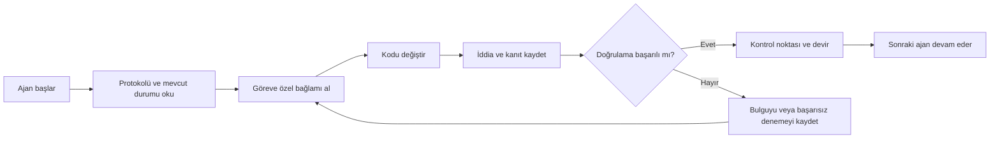

# ArifCE
<p align="center"></p>

**Başka bir dilde oku.**

[English](../../README.md) · [简体中文](README.zh-CN.md) · [繁體中文](README.zh-TW.md) · [한국어](README.ko.md) · [Deutsch](README.de.md) · [Español](README.es.md) · [Français](README.fr.md) · [Italiano](README.it.md) · [Dansk](README.da.md) · [日本語](README.ja.md) · [Polski](README.pl.md) · [Русский](README.ru.md) · [Bosanski](README.bs.md) · [العربية](README.ar.md) · [Norsk](README.no.md) · [Português (Brasil)](README.pt-BR.md) · [ไทย](README.th.md) · [Türkçe](README.tr.md) · [Українська](README.uk.md) · [বাংলা](README.bn.md) · [Ελληνικά](README.el.md) · [Tiếng Việt](README.vi.md)

**Ajanlar değişir. Projen unutmaz.**


[](https://github.com/seekua/ArifCE/actions/workflows/ci.yml) [](https://github.com/seekua/ArifCE/releases/latest) [](../../LICENSE)

ArifCE, yapay zekâ destekli yazılım geliştirme için yerel öncelikli proje zekâsı ve süreklilik katmanıdır. Bağlamı, kararları, başarısız denemeleri, kanıtları, yeniden düzenleme durumunu ve devir bilgilerini depoda tutarak Codex, Claude Code, OpenCode ve gelecekteki ajanların aynı mühendislik hikâyesine devam etmesini sağlar.

> Bağlamın sahibi repodur. Ajan yalnızca onu ödünç alır.

**Limitiniz mi doldu? İşleme iki komutla devam edin.**

Mevcut bir görev üzerindeki asıl çalışmayı tamamladıktan sonra, durmadan önce görevi bir sonraki aşamaya aktarma (handoff) kaydını oluşturun.

```bash
arifce handoff --task TASK-0031

# When you return with Codex, Claude Code, OpenCode, or a local model:
arifce context --task TASK-0031 --budget 2000
```

Bu aktarım kaydı; hedefi, tamamlanan işi, doğrulanmış kanıtları, çözülmemiş maddeleri, hataları ve bir sonraki eylemi içerir. Yazdırılan bağlam çıktısını yeni bir aracı (agent) başlatma istemine kopyalayın; CLI, bağlamı model oturumuna otomatik olarak aktarmaz.

## Kurulum ve hızlı başlangıç

Platformunuza uygun, bağımsız (self-contained) arşivi [GitHub Releases](https://github.com/seekua/ArifCE/releases/tag/v0.8.1) sayfasından indirin, arşivden çıkarın ve arifceyi `PATH`'inize ekleyin. Linux'ta, arşivden çıkarırken çalıştırılabilir dosya iznini koruyun veya `chmod +x arifce` komutunu çalıştırın. Ayrı bir .NET, Node, Python, Docker veya veritabanı kurulumu gerekmez.

Yeni bir proje için:

```bash
mkdir my-project && cd my-project
git init
arifce init
arifce task create "Ship the first change"
arifce handoff
```

Mevcut bir Git deposu için:

```bash
cd path/to/existing-repo
arifce adopt
arifce task create "Ship the first change"
arifce handoff
```

Depoda halihazırda kod varsa `adopt` komutunu kullanın; bu komut, mevcut yapının üzerine yazmadan onu kaydeder ve bir sonraki aracıya projeye özgü bir başlangıç ​​noktası sunar. [Kurulum ve hızlı başlangıç](../getting-started/installation.md).

## ArifCE neden var

Önemli bağlam yalnızca sohbet geçmişinde, kişisel bellekte veya sonraki katkıcının inceleyemediği bir araçta kaldığında yazılım ekipleri zaman ve güven kaybeder. ArifCE, mühendislik sürekliliğini projenin kendisinin bir parçası haline getirmek için vardır.

Amaç ajanların daha emin konuşmasını sağlamak değildir. Amaç her katkıcının ekibin neyi başarmaya çalıştığını, bir kararın neden alındığını, gerçekte neyin doğrulandığını ve hangi belirsizliklerin kaldığını anlamasına yardımcı olmaktır. Bu hikâye depoda kaldığında ekipler izlenebilirlikten, sahiplikten veya güvenden vazgeçmeden daha hızlı ilerleyebilir.

ArifCE sürekliliği ortak bir mühendislik pratiğine dönüştürür: sonraki görev için odaklanmış bağlam, önemli iddialar için açık kanıt ve iş tamamlanmadığında dürüst devir.

**Kimler için.**

ArifCE; yapay zekâ destekli mühendislik ekipleri, coding agent kullanan geliştiriciler ve proje bağlamının tek bir kişiden, sohbetten veya oturumdan daha uzun yaşamasını isteyen bakımcılar içindir. Birden fazla katkıcının aynı depoyu paylaştığı ve kararlar, doğrulamalar ile tamamlanmamış işler için net bir kayda ihtiyaç duyduğu durumlarda özellikle yararlıdır.

## ArifCE nasıl çalışır



## Projeyi keşfedin

Proje sağlığını, son kayıtları ve aranabilir bağlamı görsel olarak incelemek için yerel dashboard’u çalıştırın: Bu geliştirici komutu .NET SDK'sını kullanır; yukarıda açıklanan bağımsız sürüm kurulumu için buna gerek yoktur.

```powershell
$env:ARIFCE_PROJECT_ROOT = (Get-Location).Path
dotnet run --project src/ArifCE.Dashboard/ArifCE.Dashboard.csproj
```

Ardından <http://127.0.0.1:5180/> adresini açın. Ürün el kitabının tamamı için [ArifCE dokümantasyon merkezine](../README.md) bakın.

Bu iş akışı proje bilgisini depoda tutar ve ilerlemeyi incelenebilir kılar. Başlıca avantajları:

- Daha hızlı katılım: sonraki ajan uzun bir dökümü yeniden kurmak yerine odaklanmış mevcut durumu okur.
- Daha güvenli değişiklikler: iddialar belirlenebilir kanıta bağlanır ve Git durumu değiştiğinde eskir.
- Daha iyi süreklilik: kararlar, başarısız denemeler, kontrol noktaları ve devirler ajan veya oturum değişikliklerinden etkilenmez.
- Kontrollü yeniden düzenleme: değişmezler, envanter, korumalar ve güvenli noktalar tamamlanmamış işi görünür kılar.
- Yerel öncelik: canonical dosyalar bulut hizmeti veya sağlayıcıya özel çalışma zamanı olmadan kullanılabilir.

## Yalnızca hafıza değil

ArifCE görevin ne olduğunu, neyin ve neden değiştiğini, ajanın neyi tamamladığını iddia ettiğini, bu iddiayı hangi kanıtın desteklediğini, inceleyenin ne bulduğunu, nelerin tamamlanmadığını ve sonraki ajanın ne bilmesi gerektiğini izler. Ajan ifadeleri gerçeği değil iddiayı temsil eder; belirlenebilir derleme, test, Git ve arama kanıtları tercih edilir.

Teknik doğrulama ile ürün kabulü ayrıdır: kabul kayıtları bir iddiayı kimin onayladığını ve bu kararı hangi güncel kanıtın desteklediğini belirtir.

## Temel iş akışı

```text
arifce init
arifce task create "Fix permission cache race"
arifce checkpoint --summary "Reproduction added"
arifce context "finish the permission cache fix" --budget 16000
arifce claim create "Permission cache race is fixed"
arifce verify CLAIM-0001
arifce handoff
```

Kanonik Markdown, YAML, JSON ve JSONL dosyaları `.arifce/` altında bulunur. SQLite silinebilir türetilmiş bir indekstir; `.arifce/index/` silinip `arifce rebuild` çalıştırıldığında proje zekâsı korunmalıdır.

## Mimari

Çekirdek; alan kurallarını, canonical depolama ve indekslemeyi, Git gözlemini, alımı, doğrulamayı, yeniden düzenlemeyi, güvenliği ve CLI’yi birbirinden ayırır. Sağlayıcı talimat dosyaları küçük adaptörlerdir; canonical hafıza deposuna dönüşemezler. [Mimari özete](../architecture/overview.md), [alan modeline](../architecture/domain-model.md) ve [V0.1 belirtimine](../SPECIFICATION-v0.1.md) bakın.

**Kaynak kod üzerinden geliştirme. Güncel sürüm V0.8.1'dir. Kaynak kod üzerinden geliştirme yapmak için kurulum ve hızlı başlangıç ​​bölümlerine bakın.** [Kurulum ve hızlı başlangıç](../getting-started/installation.md) · [Hızlı başlangıç](../getting-started/quick-start.md).

```bash
git clone https://github.com/seekua/ArifCE.git
cd ArifCE
dotnet restore ArifCE.slnx
dotnet build ArifCE.slnx --configuration Release --no-restore
dotnet test ArifCE.slnx --configuration Release --no-build --no-restore
```

İsteğe bağlı yerel MCP adaptörü [MCP kurulumu](../getting-started/mcp.md) sayfasında açıklanır.

Tam kurulum ve özellik turu için [Kullanıcı Rehberi](../USER-GUIDE.md) ile [Dokümantasyon Politikası](../DOCUMENTATION-POLICY.md) sayfalarına bakın.

Yukarıdaki kurulum ve başlatma komutları; depoya özgü bir proje durumu, bir görev ve bir sonraki katkı sağlayıcı için hazır bir aktarım kaydı oluşturur.

### Ollama veya LM Studio ile göreve devam

ArifCE, projenin kanonik kayıtlarını depoda tutar. Sağlayıcı prompt’u ve seçilen bağlamı alır; bulut sağlayıcıları seçilen bu içeriği uzaktaki hizmete iletir. `--with-context`, ArifCE’nin seçtiği proje kayıtlarını ekler, ancak kaynak dosyaları okumaz. Aşağıdaki örnekler, modelin incelemesi istenen kodu alması için migration dosyasının içeriğini doğrudan prompt’a koyar. Kullandığın kabuğa uygun örneği seç.

Örneklerden birini kullanmadan önce Ollama’yı kurup çalıştır. İlk komut `llama3` modelini indirir; Ollama’yı aşağıda belirtilen yerel endpoint’te çalışır durumda bırak.

```bash
ollama pull llama3
arifce llm provider add ollama Ollama llama3 --endpoint http://127.0.0.1:11434
arifce llm provider test ollama
task_id="$(arifce task create "Review and safely update the migration")"
migration_source="$(cat path/to/migration.sql)"
prompt="Review only this SQL migration for data-loss risks. Do not infer unseen source. Suggest the smallest safe change if needed.
Migration source:
$migration_source"
arifce llm run "Review and safely update the migration" "$prompt" --with-context --budget 2000
```

```powershell
ollama pull llama3
arifce llm provider add ollama Ollama llama3 --endpoint http://127.0.0.1:11434
arifce llm provider test ollama
$taskId = arifce task create "Review and safely update the migration"
$migrationSource = Get-Content -Raw -LiteralPath "path/to/migration.sql"
$prompt = @"
Review only this SQL migration for data-loss risks. Do not infer unseen source. Suggest the smallest safe change if needed.
Migration source:
$migrationSource
"@
arifce llm run "Review and safely update the migration" $prompt --with-context --budget 2000
```

Modelin yanıtını incele, önerilen değişiklikleri kodlama ortamında uygula ve migration regresyon testlerini çalıştır. Testler geçtikten sonra claim olarak yalnızca test komutunun doğruladığı şeyi kaydet:

```bash
claim_id="$(arifce claim create "Migration regression tests pass" --task "$task_id")"
arifce verify "$claim_id" --command "dotnet test path/to/migration-tests.csproj"
arifce handoff
```

PowerShell’de:

```powershell
$claimId = arifce claim create "Migration regression tests pass" --task $taskId
arifce verify $claimId --command "dotnet test path/to/migration-tests.csproj"
arifce handoff
```

Test sonucu, regresyon testlerinin geçtiği claim’ini destekler; tek başına model incelemesinin eksiksiz veya doğru olduğunu kanıtlamaz. Örnek yolları ve test komutunu kendi depondakilerle değiştir. LM Studio için yüklediğin model adını ve genellikle `http://127.0.0.1:1234/v1` olan OpenAI uyumlu endpoint’i `arifce llm provider add lmstudio LmStudio your-loaded-model --endpoint http://127.0.0.1:1234/v1` komutunda kullan.

Ardından aynı görev, kaynak girdi, test kanıtı ve handoff akışını izle.

Reviewer çalıştırmak açık onay gerektirir. Sağlayıcı yedeklemesi, token/maliyet kaydı, kanonik kanıtlar, embedding’ler, benchmark ölçümleri, MCP araçları ve yerel dashboard [LLM sağlayıcı başvurusunda](../reference/LLM-PROVIDERS.md) açıklanır.

Yeni Git deposunda `init`, mevcut depoda `adopt` çalıştır. İkisi de tahribatsızdır ve tekrar çalıştırılabilir; `adopt` gözlenen yapıyı kaydeder ve bilinmeyen geçmiş gerekçeleri bilinmiyor olarak işaretler.

## Süreklilik, doğrulama ve yeniden düzenleme

- Yeni bir ajan `AGENTS.md`, `.arifce/PROTOCOL.md` ve `.arifce/CURRENT.md` dosyalarını okur; geçmişi topluca yüklemek yerine göreve özel bağlam ister.
- İddialar depo kapsamındaki kanıta bağlanır. İlgili depo durumu değiştiğinde kanıt eskir.
- Yeniden düzenleme kampanyaları değişmezleri, envanteri, korumaları, ilerlemeyi ve kontrol noktalarını izler. Engelleyici korumalar tamamlanmayı önler.
- Devirler döküm dökmek yerine mevcut mühendislik durumunu özetler.

## Güvenlik ve sınırlamalar

Ham dökümler (raw transcripts) güvenilir kabul edilmez; asla toplu olarak yüklenmez veya çalıştırılmaz. İçe aktarma yolları yaygın gizli bilgileri (secrets) maskeler; kimlik bilgileri ve makine kimlik doğrulama verileri `.arifce` dosyasına dahil edilmemelidir. ArifCE; doğruluk, token tasarrufu veya daha iyi inceleme kalitesi garantisi vermez. Bulut hizmeti, barındırılan arayüzü, vektör veritabanı, otonom aracı sürüsü veya üretim ortamında aracılar arası çağrı özelliği yoktur. Yerel bir kontrol paneli içerir; ancak bu, barındırılan bir web uygulaması değildir.

[ROADMAP.md](../../ROADMAP.md), [SECURITY.md](../../SECURITY.md) ve [CONTRIBUTING.md](../../CONTRIBUTING.md) dosyalarına bakın. Uygulanan komut sözdizimi [CLI referansında](../reference/cli.md) belgelenmiştir.

## Lisans

ArifCE [Apache License 2.0](../../LICENSE) ile lisanslanmıştır.
