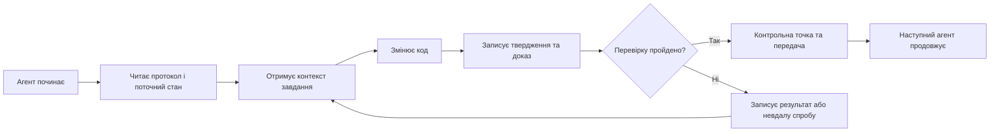

# ArifCE
<p align="center"></p>

**Читати іншою мовою.**

[English](../../README.md) · [简体中文](README.zh-CN.md) · [繁體中文](README.zh-TW.md) · [한국어](README.ko.md) · [Deutsch](README.de.md) · [Español](README.es.md) · [Français](README.fr.md) · [Italiano](README.it.md) · [Dansk](README.da.md) · [日本語](README.ja.md) · [Polski](README.pl.md) · [Русский](README.ru.md) · [Bosanski](README.bs.md) · [العربية](README.ar.md) · [Norsk](README.no.md) · [Português (Brasil)](README.pt-BR.md) · [ไทย](README.th.md) · [Türkçe](README.tr.md) · [Українська](README.uk.md) · [বাংলা](README.bn.md) · [Ελληνικά](README.el.md) · [Tiếng Việt](README.vi.md)

**Агенти змінюються. Проєкт не повинен забувати.**


[](https://github.com/seekua/ArifCE/actions/workflows/ci.yml) [](https://github.com/seekua/ArifCE/releases/latest) [](../../LICENSE)

ArifCE — локальний рівень інтелекту й безперервності проєкту для розробки програмного забезпечення за допомогою ШІ. Він зберігає контекст, рішення, невдалі спроби, докази, стан рефакторингу та дані передачі в репозиторії, щоб Codex, Claude Code, OpenCode і майбутні агенти продовжували ту саму інженерну історію.

> Репозиторій володіє контекстом. Агент лише позичає його.

**Ліміт вичерпано? Продовжуйте, виконавши дві команди.**

Завершивши безпосередню роботу над поточним завданням, зафіксуйте дані для передачі (handoff) перед зупинкою.

```bash
arifce handoff --task TASK-0031

# When you return with Codex, Claude Code, OpenCode, or a local model:
arifce context --task TASK-0031 --budget 2000
```

Ці дані містять мету, виконану роботу, підтверджені результати, невирішені питання, помилки та наступний крок. Скопіюйте виведений контекст у запит для нового агента; інтерфейс командного рядка (CLI) не передає контекст у сеанс моделі автоматично.

## Встановлення та швидкий старт

Завантажте автономний архів для вашої платформи з розділу [GitHub Releases](https://github.com/seekua/ArifCE/releases/tag/v0.8.1), розпакуйте його та додайте `arifce` до змінної середовища PATH. У Linux збережіть права на виконання під час розпакування або виконайте команду `chmod +x arifce`. Встановлення .NET, Node, Python, Docker або бази даних не потрібне.

Для нового проєкту:

```bash
mkdir my-project && cd my-project
git init
arifce init
arifce task create "Ship the first change"
arifce handoff
```

Для наявного репозиторію Git:

```bash
cd path/to/existing-repo
arifce adopt
arifce task create "Ship the first change"
arifce handoff
```

Використовуйте команду `adopt`, якщо в репозиторії вже є код: вона фіксує наявну структуру без її перезапису, а потім надає наступному агенту відправну точку в межах проєкту. [Встановлення та швидкий старт](../getting-started/installation.md).

## Навіщо потрібен ArifCE

Команди розробників втрачають час і довіру, коли важливий контекст існує лише в історії чату, пам’яті окремої людини або інструменті, який наступний учасник не може перевірити. ArifCE робить інженерну безперервність частиною самого проєкту.

Мета не в тому, щоб агенти звучали впевненіше. Вона полягає в тому, щоб кожен учасник розумів, чого прагне команда, чому ухвалено рішення, що справді перевірено і де залишається невизначеність. Коли ця історія зберігається в репозиторії, команди рухаються швидше, не втрачаючи відстежуваності, відповідальності чи довіри.

ArifCE перетворює безперервність на спільну інженерну практику: зосереджений контекст для наступного завдання, явні докази важливих тверджень і чесні передачі, коли робота незавершена.

**Для кого це.**

ArifCE призначений для інженерних команд із підтримкою ШІ, розробників, які працюють із кодинговими агентами, і супровідників, яким потрібно зберігати контекст проєкту після зміни людини, чату чи сеансу. Особливо корисний він, коли кілька учасників спільно працюють у репозиторії.

## Як працює ArifCE



## Дослідження проєкту

Запустіть локальну панель, щоб отримати візуальний огляд стану проєкту, останніх записів і контексту для пошуку: Ця команда для розробників використовує .NET SDK; для автономного випуску, описаного вище, він не потрібен.

### Попередній перегляд панелі

<p align="center">
  
  
  
</p>

```powershell
$env:ARIFCE_PROJECT_ROOT = (Get-Location).Path
dotnet run --project src/ArifCE.Dashboard/ArifCE.Dashboard.csproj
```

Потім відкрийте <http://127.0.0.1:5180/>. Повний посібник продукту дивіться в [центрі документації ArifCE](../README.md).

Цей процес зберігає знання проєкту в репозиторії та робить прогрес доступним для перевірки. Практичні переваги:

- Швидший старт: наступний агент читає зосереджений поточний стан, а не відновлює довгий транскрипт.
- Безпечніші зміни: твердження пов’язані з детермінованими доказами й застарівають після зміни стану Git.
- Краща безперервність: рішення, невдалі спроби, контрольні точки та передачі переживають зміну агента чи сесії.
- Керований рефакторинг: інваріанти, інвентар, захисти й безпечні точки роблять незавершену роботу видимою.
- Local-first operation: canonical files remain usable without a cloud service or vendor-specific runtime.

## Не просто пам’ять

ArifCE відстежує суть завдання, зміни та їхні причини, заявлене агентом виконання, докази на підтримку твердження, висновки рецензента, незавершену роботу й відомості для наступного агента. Висловлювання агентів — це твердження, а не факти; перевага надається детермінованим доказам збірки, тестів, Git і пошуку.

Технічна перевірка та приймання продукту розділені: записи приймання вказують, хто схвалив твердження і які поточні докази підтримали рішення.

## Основний робочий процес

```text
arifce init
arifce task create "Fix permission cache race"
arifce checkpoint --summary "Reproduction added"
arifce context "finish the permission cache fix" --budget 16000
arifce claim create "Permission cache race is fixed"
arifce verify CLAIM-0001
arifce handoff
```

Канонічні Markdown, YAML, JSON і JSONL зберігаються в `.arifce/`. SQLite — похідний індекс, який можна видалити: видалення `.arifce/index/` і запуск `arifce rebuild` мають зберегти інтелект проєкту.

## Архітектура

Ядро розділяє правила предметної області, канонічне зберігання й індексацію, спостереження за Git, отримання, перевірку, рефакторинг, безпеку та CLI. Файли інструкцій постачальників є малими адаптерами й ніколи не стають канонічним сховищем пам’яті. Дивіться [огляд архітектури](../architecture/overview.md), [модель предметної області](../architecture/domain-model.md) і [специфікацію V0.1](../SPECIFICATION-v0.1.md).

**Розробка з вихідного коду. Поточна версія — V0.8.1. Інформацію про розробку з вихідного коду див. у розділах «Встановлення» та «Швидкий старт».** [Встановлення та швидкий старт](../getting-started/installation.md) · [Швидкий старт](../getting-started/quick-start.md).

```bash
git clone https://github.com/seekua/ArifCE.git
cd ArifCE
dotnet restore ArifCE.slnx
dotnet build ArifCE.slnx --configuration Release --no-restore
dotnet test ArifCE.slnx --configuration Release --no-build --no-restore
```

Необов’язковий локальний адаптер MCP описано в [налаштуванні MCP](../getting-started/mcp.md).

Повний опис встановлення та функцій дивіться в [посібнику користувача](../USER-GUIDE.md) і [політиці документації](../DOCUMENTATION-POLICY.md).

Наведені вище команди встановлення та запуску створюють стан проєкту в межах репозиторію, завдання та дані для передачі, готові для наступного учасника.

### Продовження завдання з Ollama або LM Studio

ArifCE зберігає канонічні записи проєкту в репозиторії. Провайдер отримує prompt і вибраний контекст; хмарні провайдери отримують цей вибраний вміст віддалено. `--with-context` додає вибрані ArifCE записи проєкту, але не читає файли вихідного коду. Наведені нижче приклади явно додають вміст файлу міграції до prompt, щоб модель отримала код для перевірки. Виберіть приклад для своєї оболонки.

Перш ніж використовувати будь-який приклад, установіть і запустіть Ollama. Перша команда завантажить модель `llama3`; залиште Ollama запущеним на вказаній нижче локальній кінцевій точці.

```bash
ollama pull llama3
arifce llm provider add ollama Ollama llama3 --endpoint http://127.0.0.1:11434
arifce llm provider test ollama
task_id="$(arifce task create "Review and safely update the migration")"
migration_source="$(cat path/to/migration.sql)"
prompt="Review only this SQL migration for data-loss risks. Do not infer unseen source. Suggest the smallest safe change if needed.
Migration source:
$migration_source"
arifce llm run "Review and safely update the migration" "$prompt" --with-context --budget 2000
```

```powershell
ollama pull llama3
arifce llm provider add ollama Ollama llama3 --endpoint http://127.0.0.1:11434
arifce llm provider test ollama
$taskId = arifce task create "Review and safely update the migration"
$migrationSource = Get-Content -Raw -LiteralPath "path/to/migration.sql"
$prompt = @"
Review only this SQL migration for data-loss risks. Do not infer unseen source. Suggest the smallest safe change if needed.
Migration source:
$migrationSource
"@
arifce llm run "Review and safely update the migration" $prompt --with-context --budget 2000
```

Перегляньте відповідь моделі, застосуйте запропоновані зміни у своєму середовищі розробки та запустіть регресійні тести міграції. Після успішного проходження зафіксуйте як claim лише те, що підтверджує команда тестування:

```bash
claim_id="$(arifce claim create "Migration regression tests pass" --task "$task_id")"
arifce verify "$claim_id" --command "dotnet test path/to/migration-tests.csproj"
arifce handoff
```

У PowerShell:

```powershell
$claimId = arifce claim create "Migration regression tests pass" --task $taskId
arifce verify $claimId --command "dotnet test path/to/migration-tests.csproj"
arifce handoff
```

Результат тесту підтверджує claim про успішне проходження регресійних тестів; сам по собі він не доводить, що перевірка моделі була повною або правильною. Замініть приклади шляхів і команду тестування на ті, що використовуються у вашому репозиторії. Для LM Studio вкажіть назву завантаженої моделі й сумісну з OpenAI кінцеву точку, зазвичай `http://127.0.0.1:1234/v1`, у команді `arifce llm provider add lmstudio LmStudio your-loaded-model --endpoint http://127.0.0.1:1234/v1`.

Далі використовуйте той самий процес для завдання, вихідного коду, доказів тестування та handoff.

Запуск reviewer потребує явного схвалення. Резервні провайдери, облік токенів і витрат, канонічні докази, embeddings, метрики benchmark, інструменти MCP і локальну панель описано в [довіднику провайдерів LLM](../reference/LLM-PROVIDERS.md).

Запустіть `init` у новому Git-репозиторії або `adopt` в наявному. Обидві команди безпечні для повторного запуску й не знищують дані; `adopt` записує виявлену структуру та позначає невідомі історичні причини як невідомі.

## Безперервність, перевірка та рефакторинг

- Новий агент читає `AGENTS.md`, `.arifce/PROTOCOL.md` і `.arifce/CURRENT.md`, а потім запитує контекст завдання замість масового завантаження історії.
- Твердження посилаються на докази в репозиторії; докази застарівають після зміни відповідного стану.
- Кампанії рефакторингу відстежують інваріанти, інвентар, захисти, прогрес і контрольні точки; блокувальні захисти не дають завершити роботу.
- Передачі підсумовують поточний інженерний стан, а не дублюють транскрипти.

## Безпека та обмеження

Необроблені записи (транскрипти) вважаються ненадійними; вони ніколи не завантажуються масово й не виконуються. Шляхи імпорту приховують типові секретні дані; облікові дані та інформація для автентифікації машин не повинні зберігатися у файлі `.arifce`. ArifCE не гарантує коректності, економії токенів чи вищої якості перевірки коду. Проєкт не має хмарного сервісу, розміщеного веб-інтерфейсу, векторної бази даних, автономного рою агентів чи механізму виклику між агентами в промисловому середовищі. До складу входить локальна панель керування; це не веб-застосунок, що працює на віддаленому сервері.

Дивіться [ROADMAP.md](../../ROADMAP.md), [SECURITY.md](../../SECURITY.md) і [CONTRIBUTING.md](../../CONTRIBUTING.md). Точний синтаксис реалізованих команд наведено в [довіднику CLI](../reference/cli.md).

## Ліцензія

ArifCE поширюється за [ліцензією Apache 2.0](../../LICENSE).
