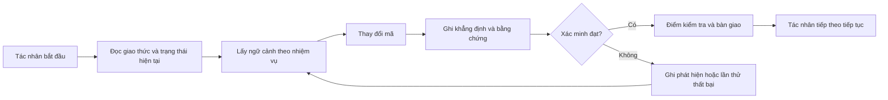

# ArifCE
<p align="center"></p>

**Đọc bằng ngôn ngữ khác.**

[English](../../README.md) · [简体中文](README.zh-CN.md) · [繁體中文](README.zh-TW.md) · [한국어](README.ko.md) · [Deutsch](README.de.md) · [Español](README.es.md) · [Français](README.fr.md) · [Italiano](README.it.md) · [Dansk](README.da.md) · [日本語](README.ja.md) · [Polski](README.pl.md) · [Русский](README.ru.md) · [Bosanski](README.bs.md) · [العربية](README.ar.md) · [Norsk](README.no.md) · [Português (Brasil)](README.pt-BR.md) · [ไทย](README.th.md) · [Türkçe](README.tr.md) · [Українська](README.uk.md) · [বাংলা](README.bn.md) · [Ελληνικά](README.el.md) · [Tiếng Việt](README.vi.md)

**Agent thay đổi. Dự án của bạn không nên quên.**


[](https://github.com/seekua/ArifCE/actions/workflows/ci.yml) [](https://github.com/seekua/ArifCE/releases/latest) [](../../LICENSE)

ArifCE là lớp trí tuệ và liên tục dự án ưu tiên cục bộ cho phát triển phần mềm có AI hỗ trợ. Công cụ lưu giữ ngữ cảnh, quyết định, lần thử thất bại, bằng chứng, trạng thái tái cấu trúc và thông tin bàn giao trong kho mã để Codex, Claude Code, OpenCode và các tác nhân tương lai tiếp tục cùng một câu chuyện kỹ thuật.

> Repository sở hữu ngữ cảnh. Agent chỉ mượn nó.

**Bạn đã hết hạn mức? Hãy tiếp tục bằng hai lệnh sau.**

Sau khi hoàn thành công việc thực tế cho một tác vụ hiện có, hãy ghi lại thông tin bàn giao (handoff) trước khi dừng lại.

```bash
arifce handoff --task TASK-0031

# When you return with Codex, Claude Code, OpenCode, or a local model:
arifce context --task TASK-0031 --budget 2000
```

Thông tin bàn giao bao gồm mục tiêu, công việc đã hoàn thành, bằng chứng đã xác minh, các vấn đề chưa giải quyết, các lỗi gặp phải và hành động tiếp theo. Hãy sao chép nội dung ngữ cảnh (context output) đã được in ra vào lời nhắc (prompt) khởi tạo cho tác nhân (agent) mới; giao diện dòng lệnh (CLI) không tự động đưa ngữ cảnh vào phiên làm việc của mô hình.

## Cài đặt và bắt đầu nhanh

Tải xuống gói cài đặt độc lập (self-contained archive) phù hợp với nền tảng của bạn từ mục [GitHub Releases](https://github.com/seekua/ArifCE/releases/tag/v0.8.1), giải nén và thêm `arifce` vào biến môi trường PATH. Trên Linux, hãy giữ nguyên quyền thực thi khi giải nén hoặc chạy lệnh `chmod +x arifce`. Không cần cài đặt riêng .NET, Node, Python, Docker hay cơ sở dữ liệu.

Đối với dự án mới:

```bash
mkdir my-project && cd my-project
git init
arifce init
arifce task create "Ship the first change"
arifce handoff
```

Đối với kho lưu trữ Git hiện có:

```bash
cd path/to/existing-repo
arifce adopt
arifce task create "Ship the first change"
arifce handoff
```

Sử dụng lệnh `adopt` khi kho lưu trữ đã có mã nguồn: lệnh này ghi lại cấu trúc hiện tại mà không ghi đè lên nó, sau đó cung cấp điểm khởi đầu cục bộ trong dự án cho tác nhân tiếp theo. [Cài đặt và bắt đầu nhanh](../getting-started/installation.md).

## Vì sao ArifCE tồn tại

Các nhóm phần mềm mất thời gian và niềm tin khi ngữ cảnh quan trọng chỉ nằm trong lịch sử trò chuyện, trí nhớ cá nhân hoặc công cụ mà người đóng góp tiếp theo không thể kiểm tra. ArifCE đưa tính liên tục kỹ thuật vào chính dự án.

Mục tiêu không phải khiến tác nhân nghe chắc chắn hơn, mà giúp mọi người hiểu nhóm đang cố đạt điều gì, vì sao quyết định được đưa ra, điều gì đã thực sự được xác minh và đâu là phần còn bất định. Khi câu chuyện ở lại trong kho mã, nhóm có thể tiến nhanh hơn mà không mất khả năng truy vết, trách nhiệm hay niềm tin.

ArifCE biến tính liên tục thành thực hành kỹ thuật chung: ngữ cảnh tập trung cho nhiệm vụ tiếp theo, bằng chứng rõ ràng cho các khẳng định quan trọng và bàn giao trung thực khi công việc chưa hoàn tất.

**Dành cho ai.**

ArifCE dành cho nhóm kỹ thuật có AI hỗ trợ, lập trình viên làm việc với tác nhân viết mã và người bảo trì cần ngữ cảnh dự án tồn tại lâu hơn một người, cuộc trò chuyện hoặc phiên làm việc. Công cụ đặc biệt hữu ích khi nhiều người cùng chia sẻ kho mã và cần ghi chép rõ quyết định, xác minh và việc chưa hoàn tất.

## ArifCE hoạt động như thế nào



## Khám phá dự án

Chạy dashboard cục bộ để xem tổng quan trực quan về tình trạng dự án, các bản ghi gần đây và ngữ cảnh có thể tìm kiếm: Lệnh dành cho nhà phát triển này sử dụng .NET SDK; bản phát hành độc lập được mô tả ở trên không yêu cầu thành phần này.

```powershell
$env:ARIFCE_PROJECT_ROOT = (Get-Location).Path
dotnet run --project src/ArifCE.Dashboard/ArifCE.Dashboard.csproj
```

Sau đó mở <http://127.0.0.1:5180/>. Để xem sổ tay sản phẩm đầy đủ, hãy truy cập [trung tâm tài liệu ArifCE](../README.md).

Quy trình này lưu giữ kiến thức dự án trong repository và giúp kiểm tra tiến độ. Các lợi ích thực tế gồm:

- Bắt đầu nhanh hơn: agent tiếp theo đọc trạng thái hiện tại đã được tập trung thay vì dựng lại một bản ghi dài.
- Thay đổi an toàn hơn: các tuyên bố liên kết với bằng chứng xác định và trở nên lỗi thời khi trạng thái Git thay đổi.
- Tính liên tục tốt hơn: quyết định, lần thử thất bại, checkpoint và bàn giao vẫn tồn tại khi đổi agent hoặc phiên làm việc.
- Refactor có kiểm soát: bất biến, kiểm kê, guard và điểm an toàn làm lộ rõ phần việc chưa hoàn tất.
- Vận hành local-first: các tệp chuẩn vẫn dùng được mà không cần dịch vụ đám mây hay runtime riêng của nhà cung cấp.

## Không chỉ là bộ nhớ

ArifCE theo dõi nhiệm vụ, những gì đã thay đổi và lý do, điều agent tuyên bố đã hoàn thành, bằng chứng hỗ trợ, phát hiện của người đánh giá, phần còn dang dở và thông tin agent tiếp theo cần biết. Phát biểu của agent là tuyên bố chứ không phải sự thật; nên ưu tiên bằng chứng xác định từ build, test, Git và tìm kiếm.

Xác minh kỹ thuật và nghiệm thu sản phẩm là hai việc riêng: bản ghi nghiệm thu cho biết ai phê duyệt tuyên bố và bằng chứng hiện tại nào hỗ trợ quyết định đó.

## Quy trình làm việc cốt lõi

```text
arifce init
arifce task create "Fix permission cache race"
arifce checkpoint --summary "Reproduction added"
arifce context "finish the permission cache fix" --budget 16000
arifce claim create "Permission cache race is fixed"
arifce verify CLAIM-0001
arifce handoff
```

Markdown, YAML, JSON và JSONL chuẩn nằm trong `.arifce/`. SQLite là chỉ mục dẫn xuất có thể xóa: xóa `.arifce/index/` rồi chạy `arifce rebuild` vẫn phải giữ nguyên tri thức dự án.

## Kiến trúc

Lõi hệ thống tách biệt quy tắc miền, lưu trữ và lập chỉ mục chuẩn, quan sát Git, truy xuất, xác minh, refactor, bảo mật và CLI. Tệp hướng dẫn của nhà cung cấp chỉ là các adapter nhỏ, không bao giờ trở thành kho bộ nhớ chuẩn. Xem [tổng quan kiến trúc](../architecture/overview.md), [mô hình miền](../architecture/domain-model.md) và [đặc tả V0.1](../SPECIFICATION-v0.1.md).

**Phát triển từ mã nguồn. V0.8.1 là phiên bản phát hành hiện tại. Để phát triển từ mã nguồn, hãy xem phần cài đặt và hướng dẫn nhanh.** [Cài đặt và bắt đầu nhanh](../getting-started/installation.md) · [Bắt đầu nhanh](../getting-started/quick-start.md).

```bash
git clone https://github.com/seekua/ArifCE.git
cd ArifCE
dotnet restore ArifCE.slnx
dotnet build ArifCE.slnx --configuration Release --no-restore
dotnet test ArifCE.slnx --configuration Release --no-build --no-restore
```

Adapter MCP cục bộ tùy chọn được mô tả trong [thiết lập MCP](../getting-started/mcp.md).

Để xem hướng dẫn cài đặt và toàn bộ tính năng, hãy đọc [Hướng dẫn người dùng](../USER-GUIDE.md) và [Chính sách tài liệu](../DOCUMENTATION-POLICY.md).

Các lệnh cài đặt và khởi động nêu trên sẽ tạo ra trạng thái dự án cục bộ trong kho lưu trữ, một tác vụ và thông tin bàn giao sẵn sàng cho người đóng góp tiếp theo.

### Tiếp tục công việc với Ollama hoặc LM Studio

ArifCE lưu các bản ghi dự án chuẩn tắc trong repository. Provider nhận prompt và phần ngữ cảnh được chọn; provider đám mây nhận nội dung đã chọn đó từ xa. `--with-context` thêm các bản ghi dự án do ArifCE chọn nhưng không đọc tệp mã nguồn. Các ví dụ dưới đây chủ động đưa nội dung tệp migration vào prompt để mô hình nhận được đoạn mã cần xem xét. Hãy chọn ví dụ phù hợp với shell của bạn.

Trước khi dùng một trong hai ví dụ, hãy cài đặt và khởi động Ollama. Lệnh đầu tiên tải model `llama3`; hãy để Ollama tiếp tục chạy tại endpoint cục bộ được nêu bên dưới.

```bash
ollama pull llama3
arifce llm provider add ollama Ollama llama3 --endpoint http://127.0.0.1:11434
arifce llm provider test ollama
task_id="$(arifce task create "Review and safely update the migration")"
migration_source="$(cat path/to/migration.sql)"
prompt="Review only this SQL migration for data-loss risks. Do not infer unseen source. Suggest the smallest safe change if needed.
Migration source:
$migration_source"
arifce llm run "Review and safely update the migration" "$prompt" --with-context --budget 2000
```

```powershell
ollama pull llama3
arifce llm provider add ollama Ollama llama3 --endpoint http://127.0.0.1:11434
arifce llm provider test ollama
$taskId = arifce task create "Review and safely update the migration"
$migrationSource = Get-Content -Raw -LiteralPath "path/to/migration.sql"
$prompt = @"
Review only this SQL migration for data-loss risks. Do not infer unseen source. Suggest the smallest safe change if needed.
Migration source:
$migrationSource
"@
arifce llm run "Review and safely update the migration" $prompt --with-context --budget 2000
```

Hãy xem phản hồi của mô hình, áp dụng các thay đổi được đề xuất trong môi trường lập trình của bạn rồi chạy các kiểm thử hồi quy cho migration. Sau khi kiểm thử đạt, chỉ ghi thành claim điều mà lệnh kiểm thử thực sự xác nhận:

```bash
claim_id="$(arifce claim create "Migration regression tests pass" --task "$task_id")"
arifce verify "$claim_id" --command "dotnet test path/to/migration-tests.csproj"
arifce handoff
```

Trong PowerShell:

```powershell
$claimId = arifce claim create "Migration regression tests pass" --task $taskId
arifce verify $claimId --command "dotnet test path/to/migration-tests.csproj"
arifce handoff
```

Kết quả kiểm thử hỗ trợ claim rằng các kiểm thử hồi quy đã đạt; riêng kết quả đó không chứng minh việc xem xét của mô hình đầy đủ hay chính xác. Hãy thay đường dẫn mẫu và lệnh kiểm thử bằng giá trị của repository bạn. Với LM Studio, dùng tên model đã tải và endpoint tương thích OpenAI, thường là `http://127.0.0.1:1234/v1`, trong lệnh `arifce llm provider add lmstudio LmStudio your-loaded-model --endpoint http://127.0.0.1:1234/v1`.

Sau đó tiếp tục theo cùng luồng task, đầu vào mã nguồn, bằng chứng kiểm thử và handoff.

Việc chạy reviewer cần được phê duyệt rõ ràng. Phần [tham chiếu LLM provider](../reference/LLM-PROVIDERS.md) mô tả provider dự phòng, theo dõi token/chi phí, bằng chứng chuẩn tắc, embedding, chỉ số benchmark, công cụ MCP và dashboard cục bộ.

Chạy `init` trong Git repository mới hoặc `adopt` trong repository hiện có. Cả hai đều không phá hủy dữ liệu và có thể chạy lặp lại; `adopt` ghi nhận cấu trúc quan sát được và đánh dấu các lý do lịch sử chưa biết là chưa biết.

## Tính liên tục, xác minh và tái cấu trúc

- Agent mới đọc `AGENTS.md`, `.arifce/PROTOCOL.md` và `.arifce/CURRENT.md`, sau đó yêu cầu ngữ cảnh theo nhiệm vụ thay vì tải hàng loạt lịch sử.
- Tuyên bố liên kết với bằng chứng trong repository. Bằng chứng trở nên lỗi thời khi trạng thái repository liên quan thay đổi.
- Chiến dịch refactor theo dõi bất biến, kiểm kê, guard, tiến độ và checkpoint. Guard chặn sẽ ngăn hoàn tất.
- Bàn giao tóm tắt trạng thái kỹ thuật hiện tại thay vì đổ toàn bộ transcript.

## Bảo mật và giới hạn

Các bản ghi thô (raw transcripts) không được coi là dữ liệu tin cậy và không bao giờ được nạp hàng loạt hay thực thi. Các đường dẫn nhập (import paths) sẽ che giấu các thông tin nhạy cảm phổ biến; thông tin xác thực và dữ liệu xác thực máy không được đưa vào tệp `.arifce`. ArifCE không đảm bảo tính chính xác, khả năng tiết kiệm token hay chất lượng đánh giá tốt hơn. Công cụ này không có dịch vụ đám mây, giao diện web được lưu trữ (hosted UI), cơ sở dữ liệu vector, hệ thống tác nhân tự hành (autonomous swarm) hay cơ chế gọi chéo giữa các tác nhân trong môi trường sản xuất. Một bảng điều khiển cục bộ được tích hợp sẵn; đây không phải là ứng dụng web được lưu trữ trên máy chủ.

Xem [ROADMAP.md](../../ROADMAP.md), [SECURITY.md](../../SECURITY.md) và [CONTRIBUTING.md](../../CONTRIBUTING.md). Cú pháp lệnh được triển khai chính xác được ghi trong [tài liệu tham khảo CLI](../reference/cli.md).

## Giấy phép

ArifCE được cấp phép theo [Apache License 2.0](../../LICENSE).
