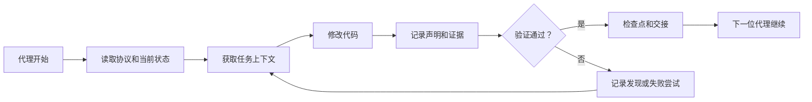

# ArifCE
<p align="center"></p>

[English](../README.md) · [简体中文](README.zh-CN.md) · [繁體中文](README.zh-TW.md) · [한국어](README.ko.md) · [Deutsch](README.de.md) · [Español](README.es.md) · [Français](README.fr.md) · [Italiano](README.it.md) · [Dansk](README.da.md) · [日本語](README.ja.md) · [Polski](README.pl.md) · [Русский](README.ru.md) · [Bosanski](README.bs.md) · [العربية](README.ar.md) · [Norsk](README.no.md) · [Português (Brasil)](README.pt-BR.md) · [ไทย](README.th.md) · [Türkçe](README.tr.md) · [Українська](README.uk.md) · [বাংলা](README.bn.md) · [Ελληνικά](README.el.md) · [Tiếng Việt](README.vi.md)

**代理会更替，项目不应遗忘。**


[](https://github.com/seekua/ArifCE/actions/workflows/ci.yml) [](https://github.com/seekua/ArifCE/releases/latest) [](../../LICENSE)

ArifCE 是面向 AI 辅助软件开发的本地优先项目智能与连续性层。它将上下文、决策、失败尝试、证据、重构状态和交接信息保存在仓库中，让 Codex、Claude Code、OpenCode 及未来的代理继续同一段工程历程。

> 仓库拥有上下文，代理只是借用它。


## ArifCE 为什么存在

当重要上下文只存在于聊天记录、个人记忆或下一位贡献者无法检查的工具中时，软件团队会损失时间和信心。ArifCE 让工程连续性成为项目本身的一部分。

目标不是让代理听起来更确定，而是帮助每位贡献者理解团队要实现什么、为何做出决定、哪些内容已经验证以及哪里仍存在不确定性。当这段历程留在仓库中，团队无需放弃可追溯性、责任或信任即可更快前进。

ArifCE 将连续性变成共同的工程实践：为下一项任务提供聚焦上下文，为重要声明提供明确证据，并在工作未完成时进行诚实交接。

## 适用对象

ArifCE 面向 AI 辅助工程团队、使用编码代理的开发者，以及希望项目上下文超越个人、聊天或会话而持续存在的维护者。当多人共享仓库并需要清晰记录决策、验证和未完成工作时尤其有用。

## ArifCE 如何工作



## 探索项目

运行本地仪表板，以可视化查看项目健康状况、最近记录和可搜索上下文：

```powershell
$env:ARIFCE_PROJECT_ROOT = (Get-Location).Path
dotnet run --project src/ArifCE.Dashboard/ArifCE.Dashboard.csproj
```

然后打开 <http://127.0.0.1:5180/>。完整产品手册请参阅 [ArifCE 文档中心](../README.md)。

此工作流将项目知识保留在仓库中，使进度可检查。实际优势包括：

- 更快上手：下一位代理读取聚焦的当前状态，而无需重建长篇记录。
- 更安全的变更：声明链接到确定性证据，Git 状态变化后会标记为过期。
- 更好的连续性：决策、失败尝试、检查点和交接可跨代理或会话变更保留。
- 受控重构：不变量、清单、防护和安全点让未完成工作清晰可见。
- 本地优先运行：规范文件无需云服务或供应商专用运行时即可使用。

## 不只是记忆

ArifCE 跟踪任务内容、变更及原因、代理声称完成的事项、支持该声明的证据、审阅者的发现、未完成事项以及下一位代理需要了解的内容。代理陈述是声明而非事实；优先使用确定性的构建、测试、Git 和搜索证据。

技术验证与产品验收相互独立：验收记录会标明谁批准了声明，以及哪些当前证据支持该决定。

## V0.1 工作流

```text
arifce init
arifce task create "Fix permission cache race"
arifce checkpoint --summary "Reproduction added"
arifce context "finish the permission cache fix" --budget 16000
arifce claim create "Permission cache race is fixed"
arifce verify CLAIM-0001
arifce handoff
```

规范的 Markdown、YAML、JSON 和 JSONL 位于 `.arifce/` 下。SQLite 是可丢弃的派生索引：删除 `.arifce/index/` 并运行 `arifce rebuild` 必须保留项目智能。

## 架构

核心将领域规则、规范存储与索引、Git 观察、检索、验证、重构、安全和 CLI 分离。供应商指令文件只是小型适配器，绝不会成为规范记忆存储。请参阅[架构概览](../architecture/overview.md)、[领域模型](../architecture/domain-model.md)和 [V0.1 规范](../SPECIFICATION-v0.1.md)。

## 安装和快速开始

V0.2.0 已作为跨平台 .NET 全局工具发布。请参阅[安装](../getting-started/installation.md)和[快速开始](../getting-started/quick-start.md)。从源代码运行：

可选的本地 MCP 适配器请参阅 [MCP 设置](../getting-started/mcp.md)。

完整的安装和功能说明请参阅[用户指南](../USER-GUIDE.md)和[文档政策](../DOCUMENTATION-POLICY.md)。

### 60-second quick start

```bash
dotnet tool install --global ArifCE.Cli --version 0.2.0
mkdir my-project && cd my-project
git init
arifce init
arifce task create "Ship the first change"
arifce checkpoint --summary "Project context initialized"
arifce handoff
```

现在你拥有仓库本地项目状态、任务、检查点以及可交给下一位贡献者的语义交接。

```bash
dotnet restore
dotnet build
dotnet test
dotnet run --project src/ArifCE.Cli -- init
```

在新的 Git 仓库中运行 `init`，或在现有仓库中运行 `adopt`。两者都是非破坏性且幂等的。`adopt` 会记录观察到的结构，并将未知的历史原因标记为未知。

## 连续性、验证和重构

- 新代理读取 `AGENTS.md`、`.arifce/PROTOCOL.md` 和 `.arifce/CURRENT.md`，然后请求任务上下文，而不是批量加载历史。
- 声明链接到仓库范围内的证据；相关状态变化后证据会过期。
- 重构活动跟踪不变量、清单、防护、进度和检查点；阻断性防护会阻止完成。
- 交接总结当前工程状态，而不是倾倒记录。

## 安全与限制

原始记录不受信任，绝不会批量加载或执行。导入路径会隐藏常见机密；凭据和机器认证数据不得放入 `.arifce/`。V0.1 不保证正确性、节省令牌或提高审阅质量，也不提供云服务、UI、向量数据库、自主群体或生产环境代理间调用。

请参阅 [ROADMAP.md](../../ROADMAP.md)、[SECURITY.md](../../SECURITY.md) 和 [CONTRIBUTING.md](../../CONTRIBUTING.md)。已实现命令的准确语法记录在 [CLI 参考](../reference/cli.md) 中。

## 许可证

ArifCE 依据 [Apache License 2.0](../../LICENSE) 授权。
### Local LLM workflows

ArifCE can use local or cloud-capable providers without moving project memory out of the repository. Configure a provider through an environment variable or stdin, preview bounded context, and run an evidence-backed task:

```bash
arifce llm provider add ollama Ollama llama3 --endpoint http://127.0.0.1:11434
arifce llm provider test ollama
arifce llm context "review the migration" --budget 2000
arifce llm run review "Check the migration for data-loss risk" --with-context --claim CLAIM-0001
```

Reviewer execution requires explicit approval. Provider fallback, token/cost accounting, canonical evidence, embeddings, benchmark metrics, MCP tools, and the local dashboard are documented in the [LLM provider reference](../reference/LLM-PROVIDERS.md).
### From source

```bash
git clone https://github.com/seekua/ArifCE.git
cd ArifCE
dotnet restore ArifCE.slnx
dotnet build ArifCE.slnx --configuration Release --no-restore
dotnet test ArifCE.slnx --configuration Release --no-build --no-restore
```
