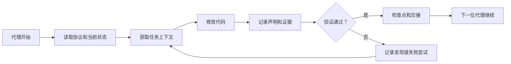

# ArifCE
<p align="center"></p>

**以其他语言阅读。**

[English](../../README.md) · [简体中文](README.zh-CN.md) · [繁體中文](README.zh-TW.md) · [한국어](README.ko.md) · [Deutsch](README.de.md) · [Español](README.es.md) · [Français](README.fr.md) · [Italiano](README.it.md) · [Dansk](README.da.md) · [日本語](README.ja.md) · [Polski](README.pl.md) · [Русский](README.ru.md) · [Bosanski](README.bs.md) · [العربية](README.ar.md) · [Norsk](README.no.md) · [Português (Brasil)](README.pt-BR.md) · [ไทย](README.th.md) · [Türkçe](README.tr.md) · [Українська](README.uk.md) · [বাংলা](README.bn.md) · [Ελληνικά](README.el.md) · [Tiếng Việt](README.vi.md)

**代理会更替，项目不应遗忘。**


[](https://github.com/seekua/ArifCE/actions/workflows/ci.yml) [](https://github.com/seekua/ArifCE/releases/latest) [](../../LICENSE)

ArifCE 是面向 AI 辅助软件开发的本地优先项目智能与连续性层。它将上下文、决策、失败尝试、证据、重构状态和交接信息保存在仓库中，让 Codex、Claude Code、OpenCode 及未来的代理继续同一段工程历程。

> 仓库拥有上下文，代理只是借用它。

**限额用尽？请分两步继续操作。**

在完成现有任务的实际工作后，请在停止前记录交接信息。

```bash
arifce handoff --task TASK-0031

# When you return with Codex, Claude Code, OpenCode, or a local model:
arifce context --task TASK-0031 --budget 2000
```

交接信息包含目标、已完成工作、已验证证据、未决事项、失败情况及后续行动。请将打印出的上下文输出复制到新 Agent 的启动提示词中；CLI 不会自动将上下文注入模型会话。

## 安装和快速开始

请从 [GitHub Releases](https://github.com/seekua/ArifCE/releases/tag/v0.8.1) 下载适用于您平台的独立归档包，解压并将 `arifce` 添加到 `PATH` 环境变量中。在 Linux 上，解压时请保留可执行权限，或运行 `chmod +x arifce`。无需单独安装 .NET、Node、Python、Docker 或数据库。

针对新项目：

```bash
mkdir my-project && cd my-project
git init
arifce init
arifce task create "Ship the first change"
arifce handoff
```

针对现有的 Git 仓库：

```bash
cd path/to/existing-repo
arifce adopt
arifce task create "Ship the first change"
arifce handoff
```

当仓库已有代码时，请使用 `adopt`：它会记录现有的代码结构而不进行覆盖，并为下一个 Agent 提供一个基于该项目的起点。 [安装和快速开始](../getting-started/installation.md).

## ArifCE 为什么存在

当重要上下文只存在于聊天记录、个人记忆或下一位贡献者无法检查的工具中时，软件团队会损失时间和信心。ArifCE 让工程连续性成为项目本身的一部分。

目标不是让代理听起来更确定，而是帮助每位贡献者理解团队要实现什么、为何做出决定、哪些内容已经验证以及哪里仍存在不确定性。当这段历程留在仓库中，团队无需放弃可追溯性、责任或信任即可更快前进。

ArifCE 将连续性变成共同的工程实践：为下一项任务提供聚焦上下文，为重要声明提供明确证据，并在工作未完成时进行诚实交接。

**适用对象.**

ArifCE 面向 AI 辅助工程团队、使用编码代理的开发者，以及希望项目上下文超越个人、聊天或会话而持续存在的维护者。当多人共享仓库并需要清晰记录决策、验证和未完成工作时尤其有用。

## ArifCE 如何工作


```mermaid
flowchart LR
    A[代理开始] --> B[读取协议和当前状态]
    B --> C[获取任务上下文]
    C --> D[修改代码]
    D --> E[记录声明和证据]
    E --> F{验证通过？}
    F -- 是 --> G[检查点和交接]
    F -- 否 --> H[记录发现或失败尝试]
    H --> C
    G --> I[下一位代理继续]
```

## 探索项目

运行本地仪表板，以可视化查看项目健康状况、最近记录和可搜索上下文： 此开发者命令依赖 .NET SDK；上述独立发布版本的安装方式则无需安装 SDK。

### 仪表板预览

<p align="center">
  
  
  
</p>

```powershell
$env:ARIFCE_PROJECT_ROOT = (Get-Location).Path
dotnet run --project src/ArifCE.Dashboard/ArifCE.Dashboard.csproj
```

然后打开 <http://127.0.0.1:5180/>。完整产品手册请参阅 [ArifCE 文档中心](../README.md)。

此工作流将项目知识保留在仓库中，使进度可检查。实际优势包括：

- 更快上手：下一位代理读取聚焦的当前状态，而无需重建长篇记录。
- 更安全的变更：声明链接到确定性证据，Git 状态变化后会标记为过期。
- 更好的连续性：决策、失败尝试、检查点和交接可跨代理或会话变更保留。
- 受控重构：不变量、清单、防护和安全点让未完成工作清晰可见。
- 本地优先运行：规范文件无需云服务或供应商专用运行时即可使用。

## 不只是记忆

ArifCE 跟踪任务内容、变更及原因、代理声称完成的事项、支持该声明的证据、审阅者的发现、未完成事项以及下一位代理需要了解的内容。代理陈述是声明而非事实；优先使用确定性的构建、测试、Git 和搜索证据。

技术验证与产品验收相互独立：验收记录会标明谁批准了声明，以及哪些当前证据支持该决定。

## 核心工作流

```text
arifce init
arifce task create "Fix permission cache race"
arifce checkpoint --summary "Reproduction added"
arifce context "finish the permission cache fix" --budget 16000
arifce claim create "Permission cache race is fixed"
arifce verify CLAIM-0001
arifce handoff
```

规范的 Markdown、YAML、JSON 和 JSONL 位于 `.arifce/` 下。SQLite 是可丢弃的派生索引：删除 `.arifce/index/` 并运行 `arifce rebuild` 必须保留项目智能。

## 架构

核心将领域规则、规范存储与索引、Git 观察、检索、验证、重构、安全和 CLI 分离。供应商指令文件只是小型适配器，绝不会成为规范记忆存储。请参阅[架构概览](../architecture/overview.md)、[领域模型](../architecture/domain-model.md)和 [V0.1 规范](../SPECIFICATION-v0.1.md)。

**源码开发。当前版本为 V0.8.1。关于源码开发，请参阅安装说明和快速入门。** [安装和快速开始](../getting-started/installation.md) · [快速入门](../getting-started/quick-start.md).

```bash
git clone https://github.com/seekua/ArifCE.git
cd ArifCE
dotnet restore ArifCE.slnx
dotnet build ArifCE.slnx --configuration Release --no-restore
dotnet test ArifCE.slnx --configuration Release --no-build --no-restore
```

可选的本地 MCP 适配器请参阅 [MCP 设置](../getting-started/mcp.md)。

完整的安装和功能说明请参阅[用户指南](../USER-GUIDE.md)和[文档政策](../DOCUMENTATION-POLICY.md)。

上述安装并启动的命令会创建仓库本地的项目状态、任务以及供下一位贡献者使用的交接信息。

### 使用 Ollama 或 LM Studio 继续任务

ArifCE 将项目的规范记录保存在代码库中。提供方会收到提示词和选定的上下文；云端提供方会远程接收这些选定内容。`--with-context` 会加入 ArifCE 选取的项目记录，但不会读取源代码文件。下面的示例会将迁移文件内容明确放入提示词，因此模型确实能看到待审查的代码。请选择与你的 shell 对应的示例。

使用任一示例前，请先安装并启动 Ollama。第一条命令会下载 `llama3` 模型；请让 Ollama 持续运行在下方配置的本地 endpoint 上。

```bash
ollama pull llama3
arifce llm provider add ollama Ollama llama3 --endpoint http://127.0.0.1:11434
arifce llm provider test ollama
task_id="$(arifce task create "Review and safely update the migration")"
migration_source="$(cat path/to/migration.sql)"
prompt="Review only this SQL migration for data-loss risks. Do not infer unseen source. Suggest the smallest safe change if needed.
Migration source:
$migration_source"
arifce llm run "Review and safely update the migration" "$prompt" --with-context --budget 2000
```

```powershell
ollama pull llama3
arifce llm provider add ollama Ollama llama3 --endpoint http://127.0.0.1:11434
arifce llm provider test ollama
$taskId = arifce task create "Review and safely update the migration"
$migrationSource = Get-Content -Raw -LiteralPath "path/to/migration.sql"
$prompt = @"
Review only this SQL migration for data-loss risks. Do not infer unseen source. Suggest the smallest safe change if needed.
Migration source:
$migrationSource
"@
arifce llm run "Review and safely update the migration" $prompt --with-context --budget 2000
```

请检查模型的回答，在你的编码环境中应用建议的修改，然后运行迁移回归测试。测试通过后，只将测试命令实际证明的内容记录为 claim：

```bash
claim_id="$(arifce claim create "Migration regression tests pass" --task "$task_id")"
arifce verify "$claim_id" --command "dotnet test path/to/migration-tests.csproj"
arifce handoff
```

PowerShell 命令：

```powershell
$claimId = arifce claim create "Migration regression tests pass" --task $taskId
arifce verify $claimId --command "dotnet test path/to/migration-tests.csproj"
arifce handoff
```

测试结果支持“迁移回归测试通过”这一 claim；它本身不能证明模型审查完整或正确。请将示例路径和测试命令替换为你代码库中的实际值。使用 LM Studio 时，请将已加载模型的名称和 OpenAI 兼容端点（通常为 `http://127.0.0.1:1234/v1`）传给 `arifce llm provider add lmstudio LmStudio your-loaded-model --endpoint http://127.0.0.1:1234/v1`。

之后沿用相同的任务、源码输入、测试证据和 handoff 流程。

运行 reviewer 需要明确批准。备用提供方、token/成本统计、规范证据、embedding、benchmark 指标、MCP 工具和本地 dashboard 详见 [LLM 提供方参考](../reference/LLM-PROVIDERS.md)。

在新的 Git 代码库中运行 `init`，在已有代码库中运行 `adopt`。二者都不会破坏现有内容且可重复运行；`adopt` 会记录检测到的结构，并将未知的历史原因标记为未知。

## 连续性、验证和重构

- 新代理读取 `AGENTS.md`、`.arifce/PROTOCOL.md` 和 `.arifce/CURRENT.md`，然后请求任务上下文，而不是批量加载历史。
- 声明链接到仓库范围内的证据；相关状态变化后证据会过期。
- 重构活动跟踪不变量、清单、防护、进度和检查点；阻断性防护会阻止完成。
- 交接总结当前工程状态，而不是倾倒记录。

## 安全与限制

原始记录（raw transcripts）不可信，绝不会被批量加载或执行。导入路径会自动屏蔽常见的敏感信息；凭证和机器认证数据不应包含在 `.arifce` 文件中。ArifCE 不保证结果的正确性、Token 节省或更高的审查质量。它不包含云服务、托管 UI、向量数据库、自主智能体集群或生产环境下的跨 Agent 调用功能。该工具包含一个本地仪表盘，但它并非托管式 Web 应用程序。

请参阅 [ROADMAP.md](../../ROADMAP.md)、[SECURITY.md](../../SECURITY.md) 和 [CONTRIBUTING.md](../../CONTRIBUTING.md)。已实现命令的准确语法记录在 [CLI 参考](../reference/cli.md) 中。

## 许可证

ArifCE 依据 [Apache License 2.0](../../LICENSE) 授权。
