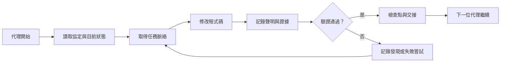

# ArifCE
<p align="center"></p>

[English](../../README.md) · [简体中文](README.zh-CN.md) · [繁體中文](README.zh-TW.md) · [한국어](README.ko.md) · [Deutsch](README.de.md) · [Español](README.es.md) · [Français](README.fr.md) · [Italiano](README.it.md) · [Dansk](README.da.md) · [日本語](README.ja.md) · [Polski](README.pl.md) · [Русский](README.ru.md) · [Bosanski](README.bs.md) · [العربية](README.ar.md) · [Norsk](README.no.md) · [Português (Brasil)](README.pt-BR.md) · [ไทย](README.th.md) · [Türkçe](README.tr.md) · [Українська](README.uk.md) · [বাংলা](README.bn.md) · [Ελληνικά](README.el.md) · [Tiếng Việt](README.vi.md)

**代理會更替，專案不應遺忘。**


[](https://github.com/seekua/ArifCE/actions/workflows/ci.yml) [](https://github.com/seekua/ArifCE/releases/latest) [](../../LICENSE)

ArifCE 是面向 AI 輔助軟體開發的本地優先專案智慧與連續性層。它將脈絡、決策、失敗嘗試、證據、重構狀態與交接資訊保存在儲存庫中，讓 Codex、Claude Code、OpenCode 及未來的代理延續同一段工程歷程。

> 儲存庫擁有上下文，代理只是借用它。


## ArifCE 為何存在

當重要脈絡只存在於聊天記錄、個人記憶或下一位貢獻者無法檢查的工具中，軟體團隊會失去時間與信心。ArifCE 讓工程連續性成為專案本身的一部分。

目標不是讓代理聽起來更確定，而是幫助每位貢獻者了解團隊要完成什麼、為何做出決策、哪些內容確實驗證過，以及哪裡仍存在不確定性。當這段歷程留在儲存庫中，團隊不必放棄可追溯性、責任或信任即可更快前進。

ArifCE 將連續性轉化為共同的工程實務：為下一項任務提供聚焦脈絡，為重要聲明提供明確證據，並在工作未完成時進行誠實交接。

## 適用對象

ArifCE 適用於 AI 輔助工程團隊、使用編碼代理的開發者，以及希望專案脈絡超越個人、聊天或工作階段持續存在的維護者。當多人共用儲存庫並需要清楚記錄決策、驗證與未完成工作時尤其有用。

## ArifCE 如何運作



## 探索專案

執行本機儀表板，以視覺化檢視專案健康狀況、近期記錄與可搜尋脈絡：

```powershell
$env:ARIFCE_PROJECT_ROOT = (Get-Location).Path
dotnet run --project src/ArifCE.Dashboard/ArifCE.Dashboard.csproj
```

接著開啟 <http://127.0.0.1:5180/>。完整產品手冊請參閱 [ArifCE 文件中心](../README.md)。

此流程將專案知識保留在儲存庫中，讓進度可供檢查。實際優點包括：

- 更快上手：下一位代理讀取聚焦的目前狀態，不必重建冗長記錄。
- 更安全的變更：聲明連結至確定性證據，Git 狀態改變後會失效。
- 更佳連續性：決策、失敗嘗試、檢查點與交接可跨代理或工作階段保留。
- 受控重構：不變量、清單、防護與安全點讓未完成工作清晰可見。
- 本機優先運作：規範檔案不需雲端服務或供應商專用執行環境即可使用。

## 不只是記憶

ArifCE 追蹤任務內容、變更及原因、代理聲稱完成的事項、支持該聲明的證據、審查者的發現、未完成事項及下一位代理需要知道的資訊。代理陳述是聲明而非事實；優先採用確定性的建置、測試、Git 與搜尋證據。

技術驗證與產品驗收彼此獨立：驗收記錄會標示誰核准了聲明，以及哪些目前證據支持該決定。

## V0.1 工作流程

```text
arifce init
arifce task create "Fix permission cache race"
arifce checkpoint --summary "Reproduction added"
arifce context "finish the permission cache fix" --budget 16000
arifce claim create "Permission cache race is fixed"
arifce verify CLAIM-0001
arifce handoff
```

規範的 Markdown、YAML、JSON 與 JSONL 位於 `.arifce/`。SQLite 是可丟棄的衍生索引：刪除 `.arifce/index/` 並執行 `arifce rebuild` 必須保留專案智慧。

## 架構

核心將領域規則、規範儲存與索引、Git 觀察、擷取、驗證、重構、安全性與 CLI 分離。供應商指示檔只是小型介面卡，絕不會成為規範記憶儲存庫。請參閱[架構概覽](../architecture/overview.md)、[領域模型](../architecture/domain-model.md)及 [V0.1 規格](../SPECIFICATION-v0.1.md)。

## 安裝與快速開始

V0.2.0 已作為跨平台 .NET 全域工具發布。請參閱[安裝](../getting-started/installation.md)與[快速開始](../getting-started/quick-start.md)。從原始碼執行：

選用的本機 MCP 配接器記載於 [MCP 設定](../getting-started/mcp.md)。

完整的安裝與功能說明請參閱[使用者指南](../USER-GUIDE.md)和[文件政策](../DOCUMENTATION-POLICY.md)。

### 60-second quick start

```bash
dotnet tool install --global ArifCE.Cli --version 0.2.0
mkdir my-project && cd my-project
git init
arifce init
arifce task create "Ship the first change"
arifce checkpoint --summary "Project context initialized"
arifce handoff
```

現在你已有儲存庫本機專案狀態、任務、檢查點，以及可交給下一位貢獻者的語義交接。

如果你已經有 Git 程式庫，請進入該程式庫並使用 `adopt` 記錄其結構：

```bash
cd path/to/existing-repo
arifce adopt
arifce task create "Ship the first change"
arifce handoff
```

```bash
dotnet restore
dotnet build
dotnet test
dotnet run --project src/ArifCE.Cli -- init
```

在新的 Git 儲存庫中執行 `init`，或在現有儲存庫中執行 `adopt`。兩者都是非破壞性且具冪等性。`adopt` 會記錄觀察到的結構，並將未知的歷史原因標記為未知。

## 連續性、驗證與重構

- 新代理讀取 `AGENTS.md`、`.arifce/PROTOCOL.md` 與 `.arifce/CURRENT.md`，再要求任務脈絡而非批次載入歷史。
- 聲明連結至儲存庫範圍的證據；相關狀態變更後證據會失效。
- 重構活動追蹤不變量、清單、防護、進度與檢查點；阻擋性防護會阻止完成。
- 交接會摘要目前工程狀態，而不是傾倒逐字記錄。

## 安全性與限制

原始記錄不受信任，絕不會批次載入或執行。匯入路徑會遮蔽常見祕密；憑證和機器驗證資料不得放入 `.arifce/`。V0.1 不保證正確性、節省 token 或提升審查品質，也不提供雲端服務、UI、向量資料庫、自主群體或正式環境代理間呼叫。

請參閱 [ROADMAP.md](../../ROADMAP.md)、[SECURITY.md](../../SECURITY.md) 和 [CONTRIBUTING.md](../../CONTRIBUTING.md)。已實作命令的確切語法記載於 [CLI 參考](../reference/cli.md)。

## 授權條款

ArifCE 依據 [Apache License 2.0](../../LICENSE) 授權。
### 使用 Ollama 或 LM Studio 繼續任務

ArifCE 將專案的規範記錄保存在程式庫中。提供者會收到提示詞和選取的脈絡；雲端提供者會從遠端接收這些選取內容。`--with-context` 會加入 ArifCE 選取的專案記錄，但不會讀取原始碼檔案。以下範例會將遷移檔案內容明確放入提示詞，因此模型確實能取得待審查的程式碼。請選擇符合所用 shell 的範例。

```bash
arifce llm provider add ollama Ollama llama3 --endpoint http://127.0.0.1:11434
arifce llm provider test ollama
task_id="$(arifce task create "Review and safely update the migration")"
migration_source="$(cat path/to/migration.sql)"
prompt="Review only this SQL migration for data-loss risks. Do not infer unseen source. Suggest the smallest safe change if needed.
Migration source:
$migration_source"
arifce llm run "Review and safely update the migration" "$prompt" --with-context --budget 2000
```

```powershell
arifce llm provider add ollama Ollama llama3 --endpoint http://127.0.0.1:11434
arifce llm provider test ollama
$taskId = arifce task create "Review and safely update the migration"
$migrationSource = Get-Content -Raw -LiteralPath "path/to/migration.sql"
$prompt = @"
Review only this SQL migration for data-loss risks. Do not infer unseen source. Suggest the smallest safe change if needed.
Migration source:
$migrationSource
"@
arifce llm run "Review and safely update the migration" $prompt --with-context --budget 2000
```

請檢視模型的回覆，在你的程式開發環境中套用建議的變更，然後執行遷移回歸測試。測試通過後，只將測試指令能證明的內容記錄為 claim：

```bash
claim_id="$(arifce claim create "Migration regression tests pass" --task "$task_id")"
arifce verify "$claim_id" --command "dotnet test path/to/migration-tests.csproj"
arifce handoff
```

PowerShell 指令：

```powershell
$claimId = arifce claim create "Migration regression tests pass" --task $taskId
arifce verify $claimId --command "dotnet test path/to/migration-tests.csproj"
arifce handoff
```

測試結果支持「遷移回歸測試通過」這項 claim；但單靠測試無法證明模型的審查完整或正確。請將範例路徑和測試指令替換為程式庫中的實際內容。使用 LM Studio 時，請將已載入模型的名稱與 OpenAI 相容端點（通常為 `http://127.0.0.1:1234/v1`）提供給 `arifce llm provider add lmstudio LmStudio your-loaded-model --endpoint http://127.0.0.1:1234/v1`。

接著沿用相同的任務、原始碼輸入、測試證據與 handoff 流程。

執行 reviewer 需要明確核准。備援提供者、token/成本記錄、規範證據、embedding、benchmark 指標、MCP 工具和本機儀表板，請參閱 [LLM 提供者參考](../reference/LLM-PROVIDERS.md)。

在新的 Git 程式庫中執行 `init`，在現有程式庫中執行 `adopt`。兩者皆不會破壞內容且可重複執行；`adopt` 會記錄觀察到的結構，並將未知的歷史原因標記為未知。
### From source

```bash
git clone https://github.com/seekua/ArifCE.git
cd ArifCE
dotnet restore ArifCE.slnx
dotnet build ArifCE.slnx --configuration Release --no-restore
dotnet test ArifCE.slnx --configuration Release --no-build --no-restore
```
